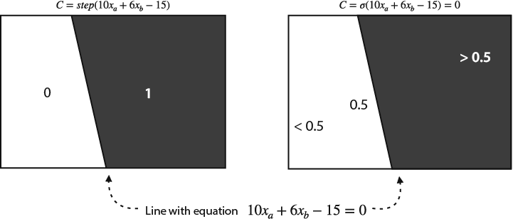
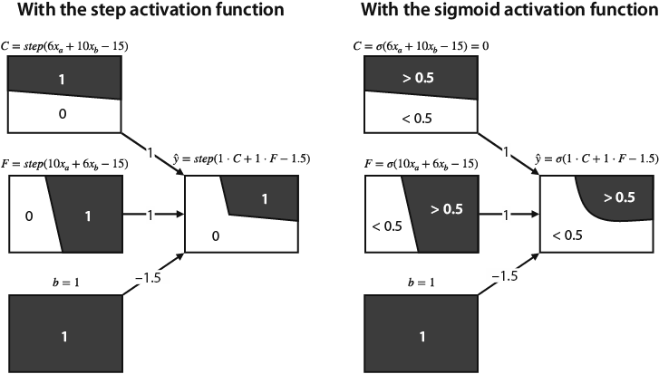
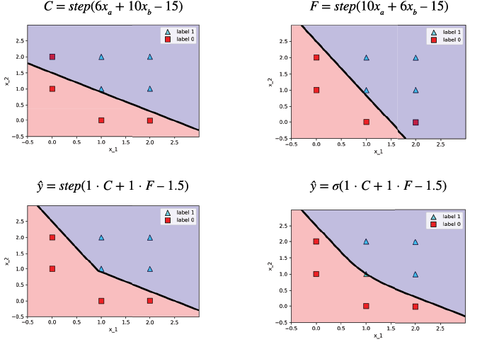
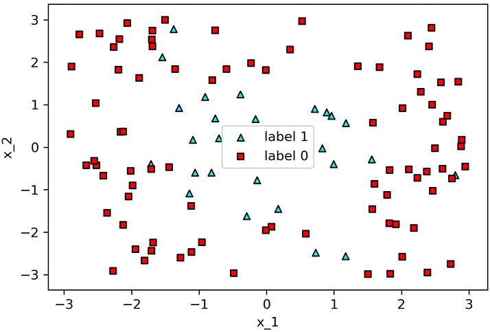
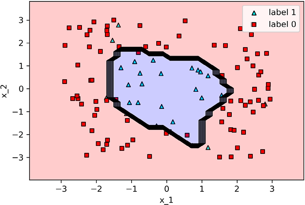
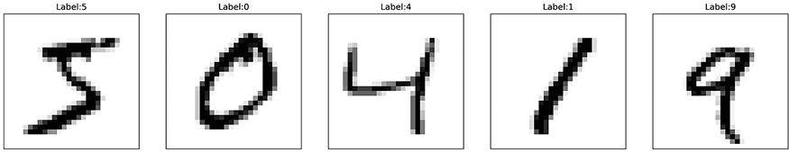
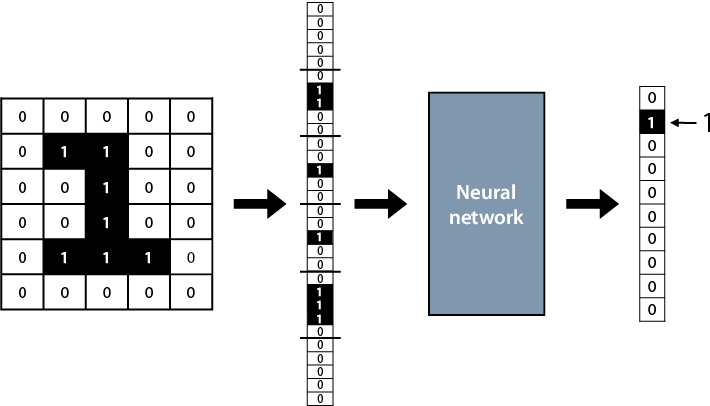
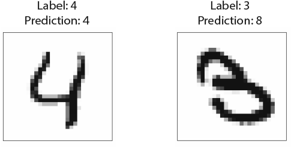
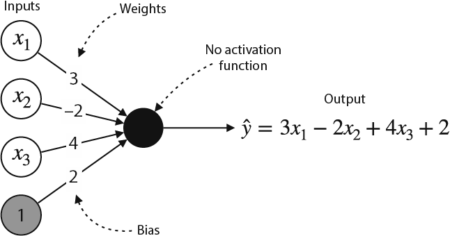
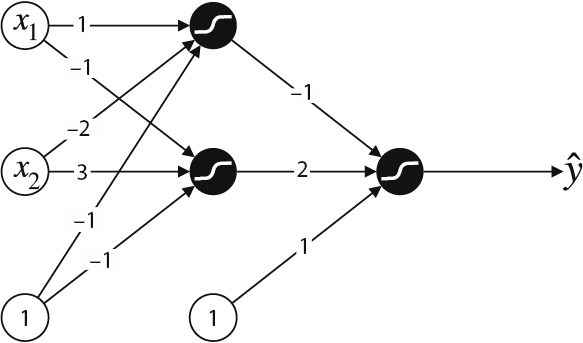

Combining building blocks to gain more power: Neural networks
=============================================================

### In this lab

- what is a neural network
- the architecture of a neural network: nodes, layers, depth, and
    activation functions
- training neural networks using backpropagation
- potential problems in training neural networks, such as the
    vanishing gradient problem and overfitting
- techniques to improve neural network training, such as
    regularization and dropout
- using Keras to train neural networks for sentiment analysis and
    image classification
- using neural networks as regression models


The code for this lab is available in this GitHub repository:
<https://github.com/fenago/machine-learning/tree/master/Lab_10_Neural_Networks>.


#### The boundary of a neural network

In labs 5 and 6, we studied the boundaries of perceptrons, which are
given by lines. In this section, we see what the boundaries of neural
networks look like.


Recall from chapters 5 and 6 that both the discrete perceptron and the continuous perceptron (logistic classifier) have a linear boundary given by the linear equation defining them. The discrete perceptron assigns predictions of 0 and 1 to the points according to what side of the line they are. The continuous perceptron assigns a prediction between 0 and 1 to every point in the plane. The points over the line get a prediction of 0.5, the points on one side of the line get predictions higher than 0.5, and the points on the other side get predictions lower than 0.5. Figure 10.11 illustrates the discrete and continuous perceptrons corresponding to the equation 10xa + 6xb – 15 = 0.





We can also visualize the output of a neural network in a similar way.
Recall that the output of the neural network with the step activation
function is the following:


- If 6xa + 10xb – 15 ≥ 0 and 10xa + 6xb – 15 ≥ 0, then the output is 1.
- Otherwise, the output is 0.


This boundary is illustrated in the left side of figure 10.12 using two
lines. Notice that it's expressed as a combination of the boundaries of
the two input perceptrons and the bias node. The boundary obtained with
the step activation function is made by broken lines, whereas the one
obtained with the sigmoid activation function is a curve.


To study these boundaries more carefully, check the following notebook:
<https://github.com/fenago/machine-learning/blob/master/Lab_10_Neural_Networks/Plotting_Boundaries.ipynb>.
In this notebook, the boundaries of the two lines and the two neural
networks are plotted with the step and sigmoid activation functions, as
illustrated in figure 10.13.







Note that the neural network with the sigmoid activation function
actually doesn't fit the entire dataset well, because it misclassifies
the point (1,1), as shown in the bottom right of figure 10.13. Try
changing the weights in a way that it fits this point well. (See
exercise 10.3 at the end of the lab).


A great tool to play with to understand neural networks is TensorFlow
Playground, which can be found at
[https://playground.tensorflow.org](https://playground.tensorflow.org/).
Several graphical datasets are available there, and it is possible to
train neural networks with different architectures and hyperparameters.

Coding neural networks in Keras
-------------------------------

We'll build two neural networks for two different datasets. The first dataset contains
points with two features and labels of 0 and 1. The dataset is
two-dimensional, so we'll be able to look at the nonlinear boundary
created by the model. The second dataset is a common dataset used in
image recognition called the MNIST (Modified National Institute of
Standards and
Technology)
dataset. The MNIST dataset contains handwritten digits that we
can classify using a neural network.


#### A graphical example in two dimensions


In
this section, we'll train a neural network in Keras on the dataset shown
in figure 10.20. The dataset contains two labels, 0 and 1. The points
with label 0 are drawn as squares, and those with label 1 are drawn as
triangles. Notice that the points with label 1 are located mostly at the
center, whereas the points with label 0 are located on the sides. For
this type of dataset, we need a classifier with a nonlinear boundary,
which makes it a good example for a neural network. The code for this
section follows:


- **Notebook**: Graphical\_example.ipynb
    -   <https://github.com/fenago/machine-learning/blob/master/Lab_10_Neural_Networks/Graphical_example.ipynb>
- **Dataset**: one\_circle.csv





Before we train the model, let's look at some random rows in our data.
The input will be called x, with features x\_1 and x\_2, and the output
will be called y. Table 10.3 has some sample data points. The dataset
has 110 rows.


Before we build and train the neural networks, we must do some data
preprocessing.


#### Categorizing our data: Turning nonbinary features into binary ones


In
this
dataset, the output is a number between 0 and 1, but it represents two
classes. In Keras, it is recommended to categorize this type of output.
This simply means that points with label 0 will now have a label
\[1,0\], and points with label 1 will now have a label \[0,1\]. We do
this using the `to_categorical` function as follows:


```
from tensorflow.keras.utils import to_categorical
categorized_y = np.array(to_categorical(y, 2))
```


The new labels are called `categorized_y`.


#### The architecture of the neural network


In this section, we build the architecture of the neural network for this
dataset. Deciding which architecture to use is not an exact science, but
it is normally recommended to go a little bigger rather than a little
smaller. For this dataset, we'll use the following architecture with two
hidden layers (figure 10.21):


- Input layer
    -   Size: 2
- First hidden layer
    -   Size:128
    -   Activation function: ReLU
- Second hidden layer
    -   Size: 64
    -   Activation function: ReLU
- Output layer
    -   Size: 2
    -   Activation function: softmax


Furthermore, we'll add dropout layers between our hidden layers with a
dropout probability of 0.2, to prevent
overfitting.


#### Building the model in Keras


Building
the neural network takes only a few lines of code in Keras. First we
import the necessary packages and functions as follows:


```
from tensorflow.keras.models import Sequential
from tensorflow.keras.layers import Dense, Dropout, Activation
```


Now, on to define the model with the architecture that we have defined
in the previous subsection. First, we define the model with the
following line:


```
model = Sequential()                                       #1
model.add(Dense(128, activation='relu', input_shape=(2,))) #2
model.add(Dropout(.2))                                     #3
model.add(Dense(64, activation='relu'))                    #4
model.add(Dropout(.2))
model.add(Dense(2, activation='softmax'))                  #5
```


Once the model is defined, we can compile it, as shown here:


```
model.compile(loss = 'categorical_crossentropy', optimizer='adam', metrics=['accuracy'])
```


The parameters in the `compile`
function
follow:


- `loss = 'categorical_crossentropy'`: this is the loss function,
    which we have defined as the log loss. Because our labels have more
    than one column, we need to use the multivariate version for the log
    loss function, called categorical cross-entropy.
- `optimizer = 'adam'`: packages like Keras have many built-in tricks
    that help us train a model in an optimal way. It's always a good
    idea to add an optimizer to our training. Some of the best ones are
    Adam, SGD, RMSProp, and AdaGrad. Try this same training with other
    optimizers, and see how they do.
- `metrics = ['accuracy']`: As the training goes, we get reports on
    how the model is doing at each epoch. This flag allows us to define
    what metrics we want to see during the training, and for this
    example, we've picked the accuracy.


When we run the code, we get a summary of the architecture and number of
parameters, as follows:


```
Model: "sequential"
_________________________________________________________________
Layer (type)         Output Shape                Param #
=================================================================
dense (Dense)        (None, 128)                 384
_________________________________________________________________
dropout (Dropout)    (None, 128)                 0
_________________________________________________________________
dense_1 (Dense)      (None, 64)                  8256
_________________________________________________________________
dropout_1 (Dropout)  (None, 64)                  0
_________________________________________________________________
dense_2 (Dense)      (None, 2)                   130
=================================================================
Total params: 8,770
Trainable params: 8,770
Non-trainable params: 0
_________________________________________________________________
```


Each row in the previous output is a layer (dropout layers are treated
as separate layers for description purposes). The columns correspond to
the type of the layer, the shape (number of nodes), and the number of
parameters, which is precisely the number of weights plus the number of
biases. This model has a total of 8,770 trainable
parameters.


#### Training the model


For
training, one simple line of code suffices, shown next:


```
model.fit(x, categorized_y, epochs=100, batch_size=10)
```


Let's examine each of the inputs to this fit function.


- `x and categorized_y`: the features and labels,
    respectively.
- `epochs`: the number of times we run backpropagation on our whole
    dataset. Here we do it 100 times.
- `batch_size`: the length of the batches that we use to train our
    model. Here we are introducing our data to the model in batches
    of 10. For a small dataset like this one, we don't need to input it
    in batches, but in this example, we are doing it for
    exposure.


As the model trains, it outputs some information at each epoch, namely,
the loss (error function) and the accuracy. For contrast, notice next
how the first epoch has a high loss and a low accuracy, whereas the last
epoch has much better results in both metrics:


```
Epoch 1/100
11/11 [==============================] - 0s 2ms/step - loss: 0.5473 - accuracy: 0.7182
...
Epoch 100/100
11/11 [==============================] - 0s 2ms/step - loss: 0.2110 - accuracy: 0.9000
```


The final accuracy of the model on the training is 0.9. This is good,
although remember that accuracy must be calculated in the testing set
instead. I won't do it here, but try splitting the dataset into a
training and a testing set and retraining this neural network to see
what testing accuracy you obtain. Figure 10.22 shows the plot of the
boundary of the neural network.





Note that the model managed to classify the data pretty well, encircling
the triangles and leaving the squares outside. It made some mistakes,
due to noisy data, but this is OK. The rigged boundary hints to small
levels of overfitting, but in general it seems like
a
good model.


#### Training a neural network for image recognition


In
this
section, we learn how to train a neural network for image recognition.
The dataset we use is MNIST, a popular dataset for image recognition,
which contains 70,000 handwritten digits from 0 to 9. The label of each
image is the corresponding digit. Each grayscale image comes as a
28-by-28 matrix of numbers between 0 and 255, where 0 represents white,
255 represents black, and any number in between represents a shade of
gray. The code for this section follows:


- **Notebook**: Image\_recognition.ipynb
    -   <https://github.com/fenago/machine-learning/blob/master/Lab_10_Neural_Networks/Image_recognition.ipynb>
- **Dataset**: MNIST (comes
    preloaded
    with Keras)


#### Loading the data


This
dataset
comes preloaded in Keras, so it is easy to load it into NumPy arrays. In
fact, it has already been separated into training and testing sets of
sizes 60,000 and 10,000, respectively. The following lines of code will
load them into NumPy arrays:


```
from tensorflow import keras
(x_train, y_train), (x_test, y_test) = keras.datasets.mnist.load_data()
```


In figure 10.23, you can see the first five images in the dataset with
their labels.





#### Preprocessing the data


Neural
networks receive vectors as input instead of matrices, so we must turn
each 28-by-28 image into a long vector of length 28^2^ = 784. We can use
the `reshape` function for this, as shown next:


```
x_train_reshaped = x_train.reshape(-1, 28*28)
x_test_reshaped = x_test.reshape(-1, 28*28)
```


As with the previous example, we must also categorize the labels.
Because the label is a number between 0 and 9, we must turn that into a
vector of length 10, in which the entry corresponding to the label is a
1 and the rest are 0. We can do this with the following lines of code:


```
y_train_cat = to_categorical(y_train, 10)
y_test_cat = to_categorical(y_test, 10)
```


This process is illustrated in figure 10.24.





#### Building and training the model


We
can use the same architecture that we used in the previous model, with a
small change, because the input is now of size 784. In the next lines of
code, we define the model and its architecture:


```
model = Sequential()
model.add(Dense(128, activation='relu', input_shape=(28*28,)))
model.add(Dropout(.2))
model.add(Dense(64, activation='relu'))
model.add(Dropout(.2))
model.add(Dense(10, activation='softmax'))
```


Now we compile and train the model for 10 epochs with a batch size of
10, as shown here. This model has 109,386 trainable parameters, so
training for 10 epochs may take a few minutes on your computer.


```
model.compile(loss = 'categorical_crossentropy', optimizer='adam', metrics=['accuracy'])
model.fit(x_train_reshaped, y_train_cat, epochs=10, batch_size=10)
```


Looking at the output, we can see that the model has a training accuracy
of 0.9164, which is good, but let's evaluate the testing accuracy to
make sure the
model
is not overfitting.


#### Evaluating the model


We
can
evaluate the accuracy in the testing set by making predictions in the
testing dataset and comparing them with the labels. The neural network
outputs vectors of length 10 with the probabilities it assigns to each
of the labels, so we can obtain the predictions by looking at the entry
of maximum value in this vector, as follows:


```
predictions_vector = model.predict(x_test_reshaped)
predictions = [np.argmax(pred) for pred in predictions_vector]
```


When we compare these to the labels, we get a testing accuracy of 0.942,
which is quite good. We can do better than this with more complicated
architectures, such as convolutional neural networks (see more of this
in the next section), but it's good to know that with a small, fully
connected neural network, we can do quite well in an image recognition
problem.


Let's now look at some predictions. In figure 10.25, we can see a
correct one (left) and an incorrect one (right). Notice that the
incorrect one is a poorly written image of a number 3, which also looks
a bit like an 8.





With this exercise, we can see that the process of training such a large
neural network is simple with a few lines of code in Keras! Of course,
there is much more one can do here. Play with the notebook, add more
layers to the neural network, change the hyperparameters, and see how
high you can improve the
testing
accuracy for this model!


Neural networks for regression
---------------------------------------------------------------------------------------------------------------------------


Throughout
this lab, we've seen how to use neural networks as a classification
model, but neural networks are just as useful as regression models.
Luckily, we have only two small tweaks to apply to a classification
neural network to obtain a regression neural network. The first tweak is
to remove the final sigmoid function from the neural network. The role
of this


function is to turn the input into a number between 0 and 1, so if we
remove it, the neural network will be able to return any number. The
second tweak is to change the error function to the absolute error or
the mean square error, because these are the error functions associated
with regression. Everything else will remain the same, including the
training process.


As an example, let's look at the perceptron in figure 10.7 in the
section "A graphical representation of perceptrons." This perceptron
makes the prediction *ŷ* = *σ*(3*x*~1~ -- 2*x*~2~ + 4*x*~3~ + 2). If we
remove the sigmoid activation function, the new perceptron makes the
prediction *ŷ* = 3*x*~1~ -- 2*x*~2~ + 4*x*~3~ + 2. This perceptron is
illustrated in figure 10.26. Notice that this perceptron represents a
linear regression model.





To illustrate this process, we train a neural network in Keras on a
familiar dataset: the dataset of housing prices in Hyderabad. Recall
that in the section "Real-life application: Using Turi Create to predict
housing prices in India," in lab 3, we trained a linear regression
model to fit this dataset. The code for this section follows:


- **Notebook**:
    House\_price\_predictions\_neural\_network.ipynb
    -   <https://github.com/fenago/machine-learning/blob/master/Lab_10_Neural_Networks/House_price_predictions_neural_network.ipynb>
- **Dataset**: Hyderabad.csv


The details for loading the dataset and splitting the dataset into
features and labels can be found in the notebook. The architecture of
the neural network that we'll use follows:


- An input layer of size 38 (the number of columns in the
    dataset)
- A hidden layer of size 128 with a ReLU activation function and a
    dropout parameter of 0.2
- A hidden layer of size 64 with a ReLU activation function and a
    dropout parameter of 0.2
- An output layer of size 1 with no activation function


```
model = Sequential()
model.add(Dense(38, activation='relu', input_shape=(38,)))
model.add(Dropout(.2))
model.add(Dense(128, activation='relu'))
model.add(Dropout(.2))
model.add(Dense(64, activation='relu'))
model.add(Dropout(.2))
model.add(Dense(1))
```


To train the neural network, we use the mean square error function and
the Adam optimizer. We'll train for 10 epochs using a batch size of 10,
as shown here:


```
model.compile(loss = 'mean_squared_error', optimizer='adam')
model.fit(features, labels, epochs=10, batch_size=10)
```


This neural network reports a root mean square error of 5,535,425 in the
training dataset. Study this model further by adding a testing set, and
play with the architecture, and
see
how much you can improve it!


Exercises
---------


#### Exercise 10.1


The following image shows a neural network in which all the activations
are sigmoid functions.





What would this neural network
predict
for the input (1,1)?


#### Exercise 10.2


As we learned in exercise 5.3, it is impossible to build a perceptron
that mimics the XOR gate. In other words, it is impossible to fit the
following dataset with a perceptron and obtain 100% accuracy:


This is because the dataset is not linearly separable. Using a neural
network of depth 2, build a perceptron that mimics the XOR gate shown
previously. As the activation functions, use the step function instead
of the sigmoid function to get discrete outputs.


##### hint


This will be hard to do using a training method; instead, try eyeballing
the weights. Try (or search online how) to build an XOR gate using AND,
OR, and NOT gates, and use the results of exercise 5.3 to help you.


#### Exercise 10.3


At the end of the section "A graphical representation of neural
networks," we saw that the neural network in figure 10.13 with the
activation function doesn't fit the dataset in table 10.1 because the
point (1,1) is misclassified.


1. Verify that this is the case.
2. Change the weights so that the neural network classifies every
    point correctly.
