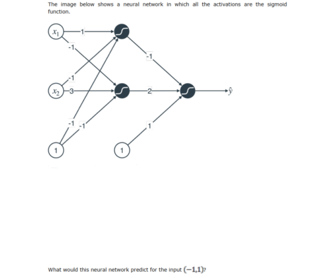
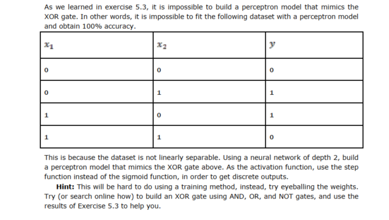

## Neural Networks

This lab covers

- What is a neural network?
- What is a perceptron?
- Using neural networks in a simple application: sentiment analysis.
- Training neural networks using backpropagation.
- Potential problems in training neural networks, and techniques that can be used to avoid
these problems.
- How to code the linear regression algorithm in Keras.
- Applications of neural networks in image recognition, text processing, and more!

In this lab we learn neural networks. Neural networks are one of the most popular (if not
the most popular) machine learning algorithms out there. They are used so much that the
field has its own name: deep learning. Deep learning has numerous applications in the most
cutting edge areas of machine learning, such as image recognition, natural language
processing, medicine, self driving cars, you name it.
Neural networks are meant to, in a broad sense of the word, mimic how the human brain
operates. They can be very complicated, as a matter of fact, the following image shows what
a neural network looks like

### Exercises

#### Exercise 1

#### Exercise 2

