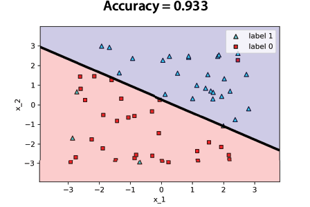
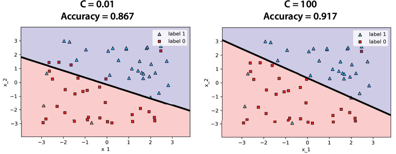
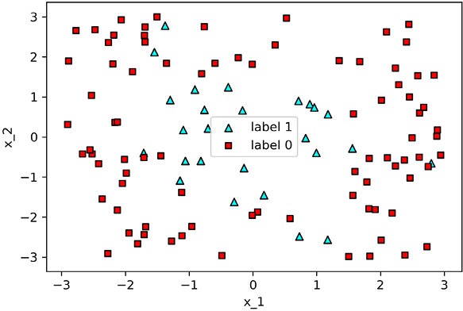
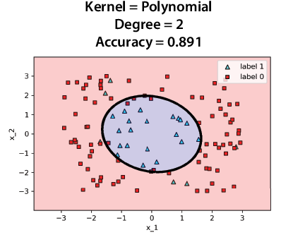
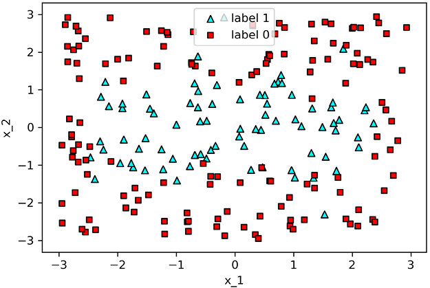
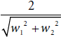
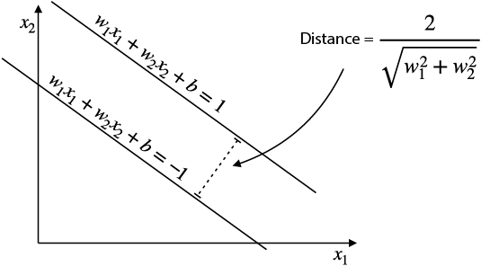

Lab 11: Finding boundaries with style: Support vector machines and the kernel method
====================================================================================

### In this lab

- which of the linear classifiers for a dataset has the best boundary
- using the kernel method to build nonlinear classifiers
- coding support vector machines and the kernel method in Scikit-Learn


Coding support vector machines in Scikit-Learn
-----------------------------------------------


Let's code an SVM and use it
to model some data. In Scikit-Learn, coding an SVM is simple and that's
what we learn in this section. We also learn how to use the C parameter
in our code.


#### Coding a simple SVM


We start by coding a simple SVM in a sample dataset and then we'll add more parameters. The
dataset is called linear.csv, and its plot is shown in figure 11.11. The
code for this section follows:


- **Notebook**: SVM\_graphical\_example.ipynb
    -   <https://github.com/fenago/machine-learning/blob/master/Lab_11_Support_Vector_Machines/SVM_graphical_example.ipynb>
- **Dataset**: linear.csv


We first import from the `svm` package in Scikit-Learn and load our data
as follows:


```
from sklearn.svm import SVC
```


Then, as shown in the next code snippet, we load our data into two
Pandas DataFrames called `features``` and `labels```, and then we define
our model called `svm_linear` and train it. The accuracy we obtain is
0.933, and the plot is shown in figure 11.12.


```
svm_linear = SVC(kernel='linear')
svm_linear.fit(features, labels)
```





#### The C parameter

In Scikit-Learn, we can easily introduce the C parameter into the model. Here we train
and plot two models, one with a very small value of 0.01, and another
one with a large value of 100, which is shown in the following code and
in figure 11.13:


```
svm_c_001 = SVC(kernel='linear', C=0.01)
svm_c_001.fit(features, labels)

svm_c_100 = SVC(kernel='linear', C=100)
svm_c_100.fit(features, labels)
```





We can see that the model with a small value of C doesn't put that much
emphasis on classifying the points correctly, and it makes some
mistakes, as is evident in its low accuracy (0.867). It is hard to tell
in this example, but this classifier puts a lot of emphasis on the line
being as far away from the points as possible. In contrast, the
classifier with the large value of C tries to classify all the points
correctly, which reflects on its higher
accuracy.


Training SVMs with nonlinear boundaries: The kernel method
----------------------------------------------------------

This section does not require code, but the calculations are large, so if you’d like to take a look at them, they are in the following notebook:

<https://github.com/fenago/machine-learning/blob/master/Lab_11_Support_Vector_Machines/Calculating_similarities.ipynb>.


#### Codinng the kernel method


Now that we've learned the kernel method for SVMs, we learn code them in
Scikit-Learn and train a model in a more complex dataset using the
polynomial and RBF kernels. To train an SVM in Scikit-Learn with a
particular kernel, all we do is add the kernel as a parameter when we
define the SVM. The code for this section follows:


- **Notebook**: SVM\_graphical\_example.ipynb
    -   <https://github.com/fenago/machine-learning/blob/master/Lab_11_Support_Vector_Machines/SVM_graphical_example.ipynb>
- Datasets:
    -   one\_circle.csv
    -   two\_circles.csv


#### Coding the polynomial kernel to classify a circular dataset


In this subsection, we see how to code the polynomial kernel in
Scikit-Learn. For this, we use the dataset called one\_circle.csv, shown
in figure below.





Notice that aside from some outliers, this dataset is mostly circular.
We train an SVM classifier where we specify the `kernel`
parameter
to be `poly`, and the `degree` parameter to be 2, as shown in the next
code snippet. The reason we want the degree to be 2 is because the
equation of a circle is a polynomial of degree 2. The result is shown in
figure 11.33.


```
svm_degree_2 = SVC(kernel='poly', degree=2)
svm_degree_2.fit(features, labels)
```





Notice that this SVM with a polynomial kernel of degree 2 manages to
build a mostly circular region to bound the dataset, as desired.


#### Coding the RBF kernel to classify a dataset formed by two intersecting circles and playing with the gamma parameter


We've
drawn
a circle, but let's get more complicated. In this subsection, we learn
how to code several SVMs with the RBF kernel to classify a dataset that
has the shape of two intersecting circles. This dataset, called
two\_circles.csv, is illustrated in figure 11.34.





To use the RBF kernel, we specify `kernel = 'rbf'`. We can also specify
a value for gamma. We'll train four different SVM classifiers, for the
following values of gamma: 0.1, 1, 10, and 100, as shown next:


```
svm_gamma_01 = SVC(kernel='rbf', gamma=0.1)  #1
svm_gamma_01.fit(features, labels)

svm_gamma_1 = SVC(kernel='rbf', gamma=1)     #2
svm_gamma_1.fit(features, labels)

svm_gamma_10 = SVC(kernel='rbf', gamma=10)   #3
svm_gamma_10.fit(features, labels)

svm_gamma_100 = SVC(kernel='rbf', gamma=100) #4
svm_gamma_100.fit(features, labels)
```


The four classifiers appear in figure 11.35. Notice that for gamma =
0.1, the model underfits a little, because it thinks the boundary is one
oval, and it makes some mistakes. Gamma = 1 gives a good model that
captures the data well. By the time we get to gamma = 10, we can see
that the model starts to overfit. Notice how it tries to classify every
point correctly, including the outliers, which it encircles
individually. By the time we get to gamma=100, we can see some serious
overfitting. This classifier only surrounds each triangle with a small
circular region and classifies everything else as a square. Thus, for
this model, gamma = 1 seems to be the best value among the ones we
tried.


Exercises
---------


#### Exercise 11.1


(This exercise completes the calculation needed in the section "Distance
error function.")


Show that the distance between the lines with equations *w*~1~*x*~1~ +
*w*~2~*x*~1~ + *b* = 1 and *w*~1~*x*~1~ + *w*~2~*x*~1~ + *b* = --1 is
precisely .





#### Exercise 11.2


As we learned in exercise 5.3, it is impossible to build a perceptron
model that mimics the XOR gate. In other words, it is impossible to fit
the following dataset (with 100% accuracy) with a perceptron model:


This is because the dataset is not linearly separable. An SVM has the
same problem, because an SVM is also a linear model. However, we can use
a kernel to help us out. What kernel should we use to turn this dataset
into a linearly separable one? What would the resulting SVM look like?
