Combining models to maximize results: Ensemble learning
=======================================================

### In this lab

- what ensemble learning is, and how it is used to combine weak
    classifiers into a stronger one
- using bagging to combine classifiers in a random way
- using boosting to combine classifiers in a cleverer way
- some of the most popular ensemble methods: random forests,
    AdaBoost, gradient boosting, and XGBoost


All the code for this lab is available in this GitHub repository:
<https://github.com/fenago/machine-learning/tree/master/Lab_12_Ensemble_Methods>.


Bagging: Joining some weak learners randomly to build a strong learner
----------------------------------------------------------------------

In this section we see one of the most well-known bagging models: a *random
forest*. In a random forest, the weak learners are small decision trees
trained on random subsets of the dataset. Random forests work well for
classification and regression problems, and the process is similar. We
will see random forests in a classification example. The code for this
section follows:


- **Notebook**: Random\_forests\_and\_AdaBoost.ipynb
    -   <https://github.com/fenago/machine-learning/blob/master/Lab_12_Ensemble_Methods/Random_forests_and_AdaBoost.ipynb>


We use a small dataset of spam and ham emails, similar to the one we
used in lab 8 with the naive Bayes model. The dataset is shown in
table 12.1 and plotted in figure 12.2. The features of the dataset are
the number of times the words "lottery" and "sale" appear in the email,
and the "yes/no" label indicates whether the email is spam (yes) or ham
(no).


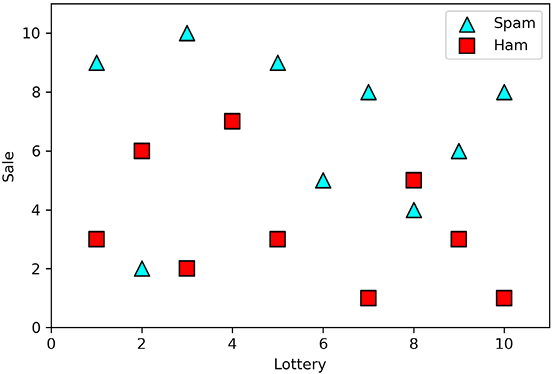


#### First, (over)fitting a decision tree


Before
we
get into random forests, let's fit a decision tree classifier to this
data and see how well it performs. Because we've learned this in lab
9, figure 12.3 shows only the final result, but we can see the code in
the notebook. On the left of figure 12.3, we can see the actual tree
(quite deep!), and on the right, we can see the plot of the boundary.
Notice that it fits the dataset very well, with a 100% training
accuracy, although it clearly overfits. The overfitting can be noticed
on the two outliers that the model tries to classify correctly, without
noticing they are outliers.


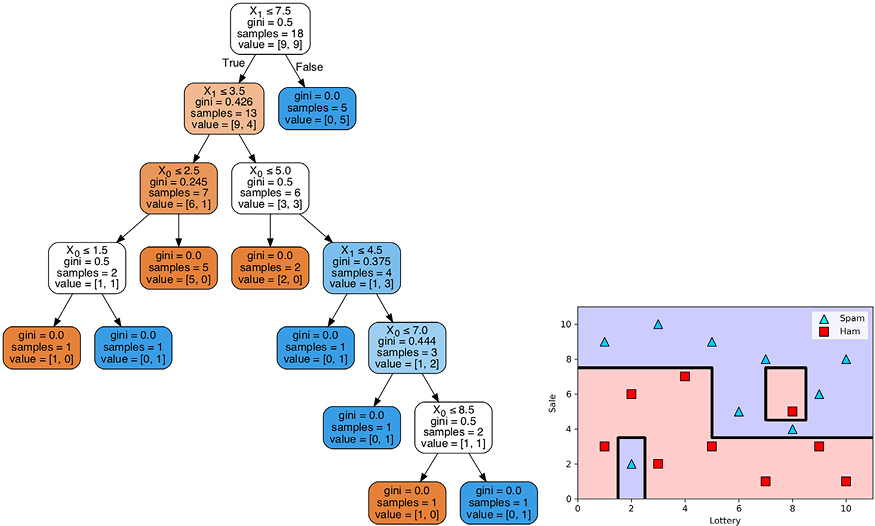


In the next sections, we see how to solve this overfitting problem by
fitting a random forest.


#### Fitting a random forest manually


In
this section, we learn how to fit a random forest manually, although
this is only for educational purposes, because this is not the way to do
it in practice. In a nutshell, we pick random subsets from our dataset
and train a weak learner (decision tree) on each one of them. Some data
points may belong to several subsets, and others may belong to none. The
combination of them is our strong learner. The way the strong learner
makes predictions is by letting the weak learners vote. For this
dataset, we use three weak learners. Because the dataset has 18 points,
let's consider three subsets of 6 data points each, as shown in figure.


Next,
we proceed to build our three weak learners. Fit a decision tree of
depth 1 on each of these subsets. Recall from lab 9 that a decision
tree of depth 1 contains only one node and two leaves. Its boundary
consists of a single horizontal or vertical line that splits the dataset
as best as possible. The weak learners are illustrated in figure 12.5.


We combine these into a strong learner by voting. In other words, for
any input, each of the weak learners predicts a value of 0 or 1. The
prediction the strong learner makes is the most common output of the
three. This combination can be seen in figure 12.6, where the weak
learners are on the top and the strong learner on the bottom.


Note that the random forest is a good classifier, because it classifies
most of the points correctly, but it allows a few mistakes in order to
not overfit the data. However, we don't need to train these random
forests manually, because Scikit-Learn has functions for this, which we
see in the next section.


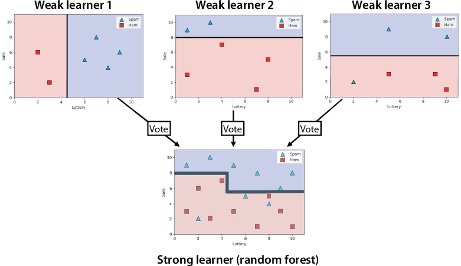


#### Training a random forest in Scikit-Learn


In
this section, we see how to train a random forest using Scikit-Learn. In
the following code, we make use of the `RandomForestClassifier`
package.
To begin, we have our data in two Pandas DataFrames called `features```
and `labels`, as shown next:


```
from sklearn.ensemble import RandomForestClassifier
random_forest_classifier = RandomForestClassifier(random_state=0, n_estimators=5, max_depth=1)
random_forest_classifier.fit(features, labels)
random_forest_classifier.score(features, labels)
```


In the previous code, we specified that we want five weak learners with
the `n_estimators`
hyperparameter.
These weak learners are again decision trees, and we have specified that
their depth is 1 with the `max_depth`
hyperparameter.
The plot of the model is shown in figure 12.7. Note how this model makes
some mistakes but manages to find a good boundary, where the spam emails
are those with a lot of appearances of the words "lottery" and "sale"
(top right of the plot) and the ham emails are those with not many
appearances of these words (bottom left of the figure).


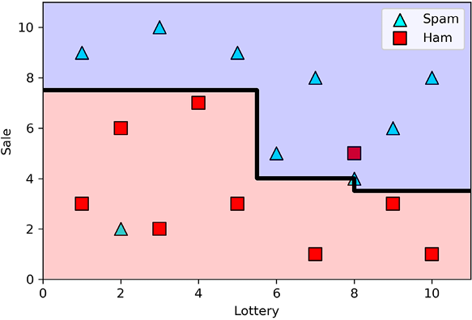


Scikit-Learn
also allows us to visualize and plot the individual weak learners (see
the notebook for the code). The weak learners are shown in figure 12.8.
Notice that not all the weak learners are useful. For instance, the
first one classifies every point as ham.


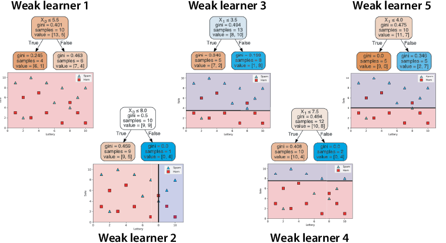


In this section, we used decision trees of depth 1 as weak learners, but
in general, we can use trees of any depth we want. Try retraining this
model using decision trees of higher depth by varying the `max_depth`
hyperparameter, and see what the random forest looks
like!


#### Coding AdaBoost in Scikit-Learn


In
this section, we see how to use Scikit-Learn to train an AdaBoost model.
We train it on the same spam email dataset that we used in the section
"Fitting a random forest manually" and plotted in figure 12.16. We
continue using the following notebook from the previous sections:


- **Notebook**: Random\_forests\_and\_AdaBoost.ipynb
    -   <https://github.com/fenago/machine-learning/blob/master/Lab_12_Ensemble_Methods/Random_forests_and_AdaBoost.ipynb>


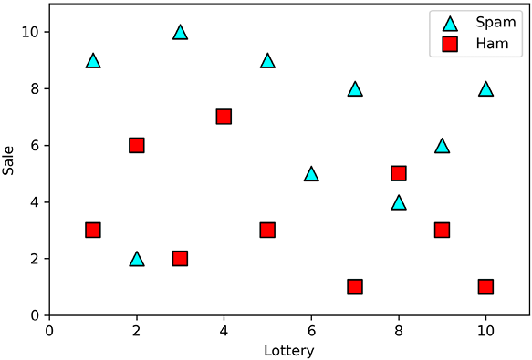


The dataset is in two Pandas DataFrames called `features` and `labels`.
The training is done using the `AdaBoostClassifier`
package
in Scikit-Learn. We specify that this model will use six weak learners
with the `n_estimators` hyperparameter, as shown next:


```
from sklearn.ensemble import AdaBoostClassifier
adaboost_classifier = AdaBoostClassifier(n_estimators=6)
adaboost_classifier.fit(features, labels)
adaboost_classifier.score(features, labels)
```


The boundary of the resulting model is plotted in figure 12.17.


We can go a bit further and explore the six weak learners and their
scores (see notebook for the code). Their boundaries are plotted in
figure 12.18, and as is evident in the notebook, the scores of all the
weak learners are 1.


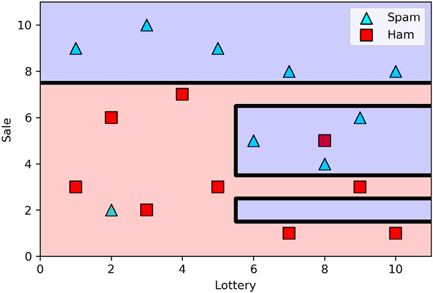


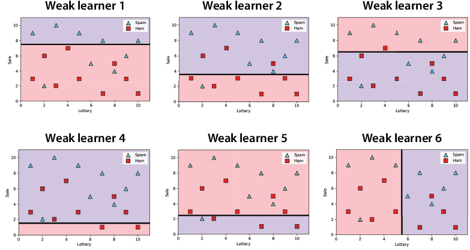


Note that the strong learner in figure 12.17 is obtained by assigning a
score of 1 to each of the weak learners in figure 12.18 and letting them
vote.


Gradient boosting: Using decision trees to build strong learners
----------------------------------------------------------------

In this section, we discuss gradient boosting, one of the most popular and
successful machine learning models currently. Gradient boosting is
similar to AdaBoost, in that the weak learners are decision trees, and
the goal of each weak learner is to learn from the mistakes of the
previous ones. One difference between gradient boosting and AdaBoost is
that in gradient boosting, we allow decision trees of depth more than 1.
Gradient boosting can be used for regression and classification, but for
clarity, we use a regression example. To use it for classification, we
need to make some small tweaks. To find out more about this, check out
links to videos and reading material in appendix C. The code for this
section follows:


- **Notebook**: Gradient\_boosting\_and\_XGBoost.ipynb
    -   <https://github.com/fenago/machine-learning/blob/master/Lab_12_Ensemble_Methods/Gradient_boosting_and_XGBoost.ipynb>


The example we use is the same one as in the section "Decision trees for
regression" in lab 9, in which we studied the level of engagement of
certain users with an app. The feature is the age of the user, and the
label is the number of days that the user engages with the app. The plot of the dataset is shown in figure 12.19.


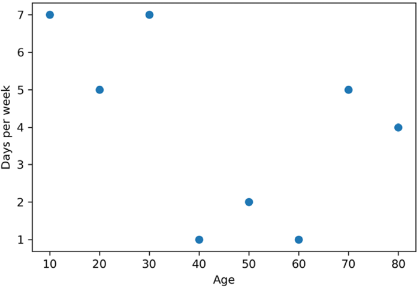


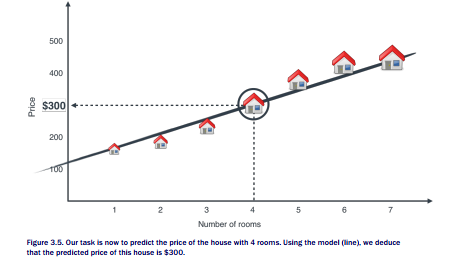


The idea of gradient boosting is that we'll create a sequence of trees
that fit this dataset. The two hyperparameters that we'll use for now
are the number of trees, which we set to five, and the learning rate,
which we set to 0.8. The first weak learner is simple: it is the
decision tree of depth 0 that best fits the dataset. A decision tree of
depth 0 is simply a node that assigns the same label to each point in
the dataset. Because the error function we are minimizing is the mean
square error, then this optimal value for the prediction is the average
value of the labels. The average value of the labels of this dataset is
4, so our first weak learner is a node that assigns a prediction of 4 to
every point.


The next step is to calculate the residual, which is the difference
between the label and the prediction made by this first weak learner,
and fit a new decision tree to these residuals. As you can see, what
this is doing is training a decision tree to fill in the gaps that the
first tree has left. The labels, predictions, and residuals are shown in
table 12.4.


The second weak learner is a tree that fits these residuals. The tree
can be as deep as we'd like, but for this example, we'll make sure all
the weak learners are of depth at most 2. This tree is shown in figure
below (together with its boundary), and its predictions are in the
rightmost column of table 12.4. This tree has been obtained using
Scikit-Learn; see the notebook for the procedure.


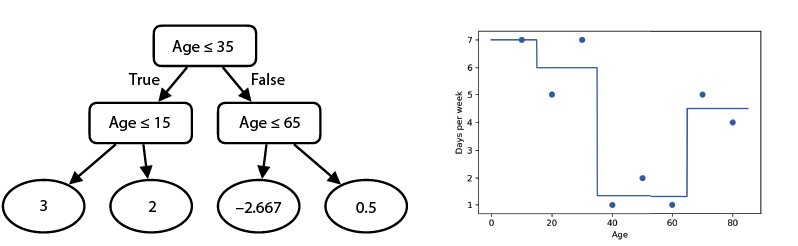


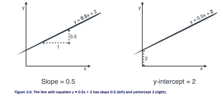


The idea is to continue in this fashion, calculating new residuals and
training a new weak learner to fit these residuals. However, there's a
small caveat---to calculate the prediction from the first two weak
learners, we first multiply the prediction of the second weak learner by
the learning rate. Recall that the learning rate we're using is 0.8.
Thus, the combined prediction of the first two weak learners is the
prediction of the first one (4) plus 0.8 times the prediction of the
second one. We do this because we don't want to overfit by fitting our
training data too well. Our goal is to mimic the gradient descent
algorithm, by slowly walking closer and closer to the solution, and this
is what we achieve by multiplying the prediction by the learning rate.
The new residuals are the original labels minus the combined predictions
of the first two weak learners. These are calculated in table 12.5.

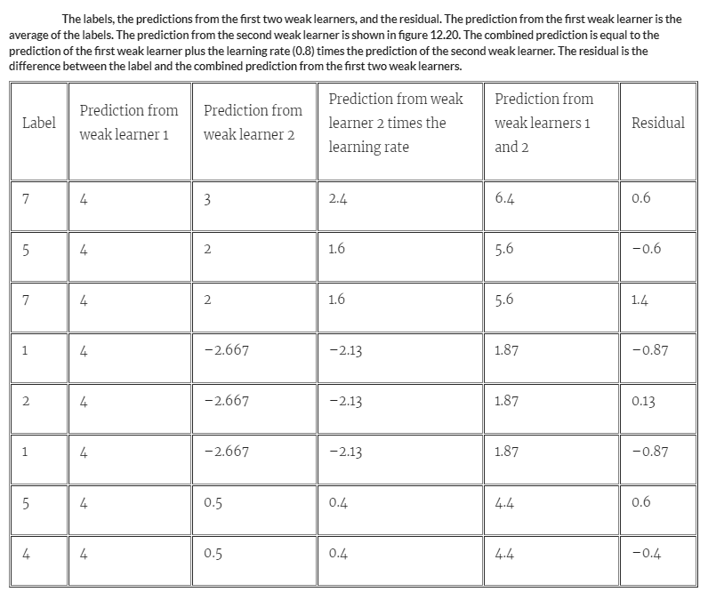


Now we can proceed to fit a new weak learner on the new residuals and
calculate the combined prediction of the first two weak learners. We
obtain this by adding the prediction for the first weak learner and 0.8
(the learning rate) times the sum of the predictions of the second and
the third weak learner. We repeat this process for every weak learner we
want to build. Instead of doing it by hand, we can use the
`GradientBoostingRegressor`
package
in Scikit-Learn (the code is in the notebook). The next few lines of
code show how to fit the model and make predictions. Note that we have
set the depth of the trees to be at most 2, the number of trees to be
five, and the learning rate to be 0.8. The hyperparameters used for this
are `max_depth`, `n_estimators`, and `learning_rate```. Note, too, that
if we want five trees, we must set the `n_estimators` hyperparameter to
four, because the first tree isn't counted.


```
from sklearn.ensemble import GradientBoostingRegressor
gradient_boosting_regressor = GradientBoostingRegressor(max_depth=2, n_estimators=4, learning_rate=0.8)
gradient_boosting_regressor.fit(features, labels)
gradient_boosting_regressor.predict(features)
```


The plot for the resulting strong learner is shown in figure 12.21.
Notice that it does a good job predicting the values.


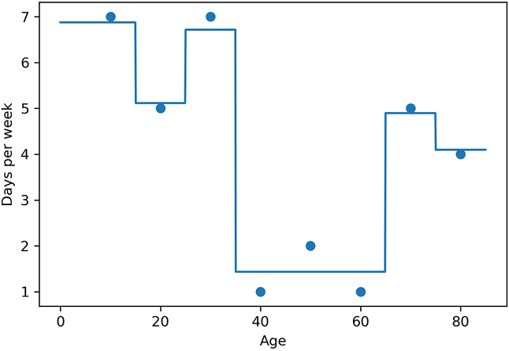


However, we can go a little further and actually plot the five weak
learners we obtain. The details for this are in the notebook, and the
five weak learners are shown in figure 12.22. Notice that the
predictions of the last weak learners are much smaller than those of the
first ones, because each weak learner is predicting the error of the
previous ones, and these errors get smaller and smaller at each step.


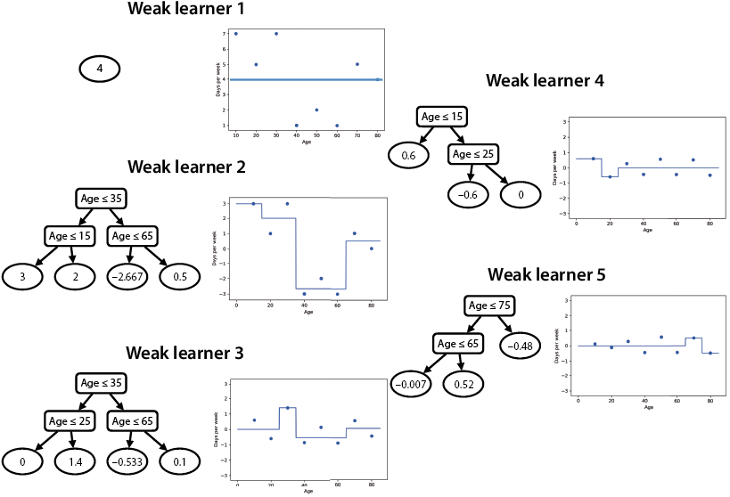


Finally, we can use Scikit-Learn or a manual calculation to see that the
predictions are the following:


- Age = 10, prediction = 6.87
- Age = 20, prediction = 5.11
- Age = 30, prediction = 6.71
- Age = 40, prediction = 1.43
- Age = 50, prediction = 1.43
- Age = 60, prediction = 1.43
- Age = 70, prediction = 4.90
- Age = 80, prediction = 4.10


#### Training an XGBoost model in Python

In this section, we learn how to train the model to fit the current dataset
using the `xgboost` Python package. The code for this section is in the
same notebook as the previous one, shown here:


- **Notebook**: Gradient\_boosting\_and\_XGBoost.ipynb
    -   <https://github.com/fenago/machine-learning/blob/master/Lab_12_Ensemble_Methods/Gradient_boosting_and_XGBoost.ipynb>


With the following lines of code, we import the package, build a model
called `XGBRegressor`, and fit it to our dataset:


```
import xgboost
from xgboost import XGBRegressor
xgboost_regressor = XGBRegressor(random_state=0,
                                 n_estimators=3,
                                 max_depth=2,
                                 reg_lambda=0,
                                 min_split_loss=1,
                                 learning_rate=0.7)
xgboost_regressor.fit(features, labels)
```


The plot of the model is shown in figure 12.26. Notice that it fits the
dataset well.


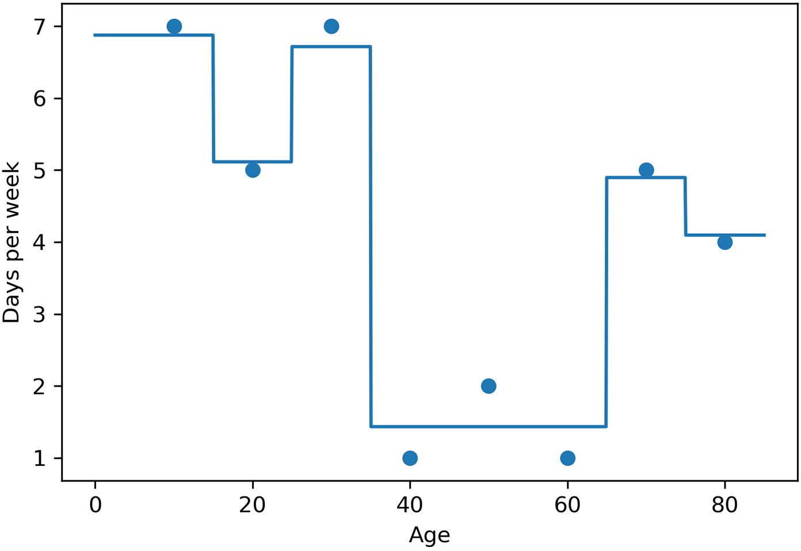


The `xgboost`
package
also allows us to look at the weak learners, and they appear in figure
below. The trees obtained in this fashion already have the labels
multiplied by the learning rate of 0.7, which is clear when compared
with the predictions of the tree obtained manually in figure 12.25 and
the second tree from the left in figure 12.27.


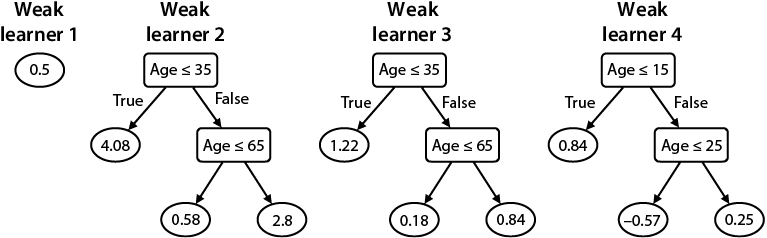


Thus, to obtain the predictions of the strong learner, we need to add
only the prediction of every tree. For example, for a user who is 20
years old, the predictions are the following:


- Weak learner 1: 0.5
- Weak learner 2: 4.08
- Weak learner 3: 1.22
- Weak learner 4: --0.57


Thus, the prediction is 0.5 + 5.83 + 1.22 -- 0.57 = 5.23. The
predictions for the other points
follow:


- Age = 10; prediction = 6.64
- Age = 20; prediction = 5.23
- Age = 30; prediction = 6.05
- Age = 40; prediction = 1.51
- Age = 50; prediction = 1.51
- Age = 60; prediction = 1.51
- Age = 70; prediction = 4.39
- Age = 80; prediction = 4.39


Exercises
---------


#### Exercise 12.1


A boosted strong learner *L* is formed by three weak learners, *L*~1~,
*L*~2~, and *L*~3~. Their weights are 1, 0.4, and 1.2, respectively. For
a particular point, *L*~1~ and *L*~2~ predict that its label is
positive, and *L*~3~ predicts that it's negative. What is the final
prediction the learner *L* makes on this point?


#### Exercise 12.2


We are in the middle of training an AdaBoost model on a dataset of size
100. The current weak learner classifies 68 out of the 100 data points
correctly. What is the weight that we'll assign to this learner in the
final model?
