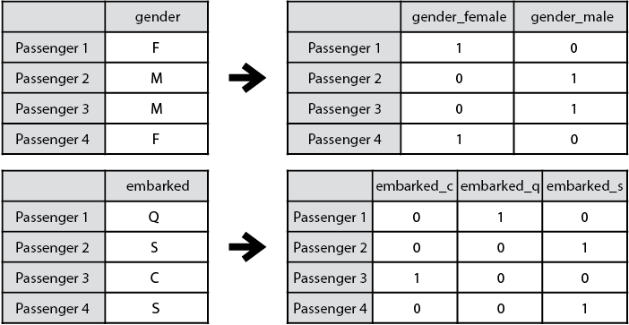
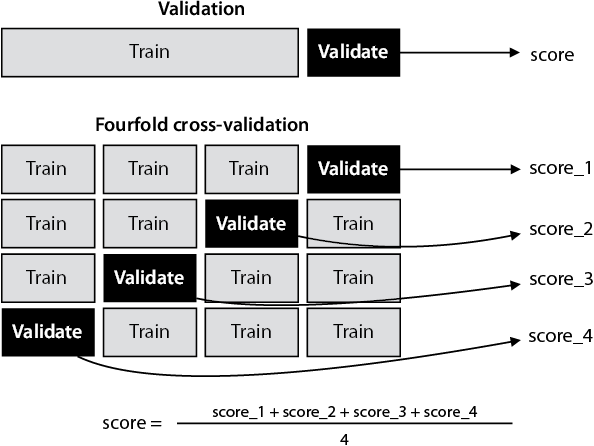

Putting it all in practice: A real-life example of data engineering and machine learning
========================================================================================

### In this lab

- cleaning up and preprocessing data to make it readable by our
    model
- using Scikit-Learn to train and evaluate several models
- using grid search to select good hyperparameters for our model
- using k-fold cross-validation to be able to use our data for
    training and validation simultaneously


Throughout this course, we've learned some of the most important
algorithms in supervised learning, and we've had the chance to code them
and use them to make predictions on several datasets. However, the
process of training a model on real data requires several more steps,
and this is what we discuss in this lab.


The code and the dataset that we'll be working with throughout this
whole lab are the following:


- **Notebook**: End\_to\_end\_example.ipynb
    -   <https://github.com/fenago/machine-learning/blob/master/Lab_13_End_to_end_example/End_to_end_example.ipynb>
- **Dataset**: titanic.csv


The Titanic dataset
-------------------


In this section, we load and study the dataset. Loading and handling data
is a crucial skill for a data scientist, because the success of the
model depends highly on how the data that feeds into it is preprocessed.
We use the Pandas package to do this.


Throughout this lab, we work with an example that is popular for
learning machine learning: the Titanic dataset. At a high level, the
dataset contains information about many of the passengers in the
*Titanic*, including their name, age, marital status, port of
embarkment, and class. Most importantly, it also contains information
about the passenger's survival. This dataset can be found in Kaggle
([www.kaggle.com](https://www.kaggle.com/)), a popular online community
with great datasets and contests, which I highly recommend you check
out.


##### note

The dataset we use is a historic dataset, which, as you may imagine,
contains many societal biases from 1912. Historical datasets do not
present the opportunity for revision or additional sampling to reflect
current societal norms and understanding of the world. Some examples
found here are the lack of inclusion of nonbinary genders, different
treatment for passengers with respect to gender and social class, and
many others. We'll evaluate this dataset as if it were a number table,
because we believe that it is a very rich and commonly used dataset for
building models and making predictions. However, as data scientists, it
is our duty to always be mindful of biases in our data, such as those
concerning race, gender identity, sexual orientation, social status,
ability, nationality, beliefs, and many others, and to do everything in
our power to ensure that the models we build will not perpetuate
historical biases.


#### The features of our dataset


The Titanic dataset we are using contains the names and information of 891
passengers on the *Titanic*, including whether they survived. Here are
the columns of the dataset:


- **PassengerID**: a number that identifies each passenger, from 1 to
    891
- **Name**: the full name of the passenger
- **Sex**: the gender of the passenger (male or female)
- **Age**: the age of the passenger as an integer
- **Pclass**: the class in which the passenger was traveling: first,
    second, or third
- **SibSP**: the number of siblings and spouse of the passenger (0 if
    the passenger is traveling alone)
- **Parch**: the number of parents and children of the passenger (0
    if the passenger is traveling alone)
- **Ticket**: the ticket number
- **Fare**: the fare the passenger paid in British pounds
- **Cabin**: the cabin in which the passenger was traveling
- **Embarked**: the port in which the passenger embarked: "C" for
    Cherbourg, "Q" for Queenstown, and "S" for Southampton
- **Survived**: information whether the passenger survived (1) or
    not (0)


#### Using Pandas to load the dataset


In
this section, we learn how to open a dataset using Pandas and load it
into a DataFrame, which is the object Pandas uses to store tables of
data. I have downloaded the data from
[www.kaggle.com](https://www.kaggle.com/) and stored it as a CSV
(comma-separated
values)
file named titanic.csv. Before we do anything on Pandas, we must import
Pandas with the following command:


```
import pandas
```


Now that we have loaded Pandas, we need to load the dataset. For storing
datasets, Pandas uses two objects: the *DataFrame* and the *Series*.
They are essentially the same thing, except that the Series is used for
datasets of only one column, and the DataFrame is used for datasets of
more than one column.


We can load the dataset as a DataFrame using the following command:


```
raw_data = pandas.read_csv('./titanic.csv', index_col="PassengerId")
```


This command stores the dataset into a Pandas DataFrame called
`raw_data`. We call it raw data because our goal is to clean it and
preprocess it later. Once we load it, we can see that the first rows
look like table 13.1. In general, Pandas adds an extra column numbering
all the elements in the dataset. Because the dataset already comes with
this numbering, we can set this index to be that column by specifying
`index_col="PassengerId"`. For this reason, we may see that in this
dataset, the rows are indexed starting from 1 instead of starting from 0
as is more common in practice.


#### Saving and loading the dataset


Before we embark on studying our dataset, here's a small step that will
help us. At the end of each section, we'll save the dataset in a CSV
file, and we'll load it again at the beginning of the next section. This
is so we can put down the course or quit the Jupyter Notebook and come
back to work on it later at any checkpoint, without having to rerun all
the commands from the beginning. With a small dataset like this one, it
is not a big deal to rerun the commands, but imagine if we were
processing large volumes of data. Serializing and saving data is
important there, because it saves time and processing power.


Here are the names of the datasets saved at the end of each section:


- "The Titanic dataset": raw\_data
- "Cleaning up our dataset": clean\_data
- "Feature engineering": preprocessed\_data


The commands for saving and loading follow:


```
tablename.to_csv('./filename.csv', index=None)
tablename = pandas.read_csv('./filename.csv')
```


When Pandas loads a dataset, it adds an index column that numbers each
of the elements. We can ignore this column, but when we save the
dataset, we must set the parameter `index=None` to avoid saving
unnecessary index columns.


The dataset already has an index column called PassengerId. If we wanted
to instead use this one as the default index column in Pandas, we could
specify `index_col='PassengerId'` when we load the dataset (but we won't
do this).


#### Using Pandas to study our dataset


In
this section, I teach you some useful methods for studying our dataset.
The first one is the length function, or `len```. This function returns
the number of rows in the dataset as follows:


```
len(raw_data)
Output: 891
```


This means our dataset has 891 rows. To output the names of the columns,
we use the `columns` property of a DataFrame, as follows:


```
raw_data.columns
Output: Index(['PassengerId', 'Survived', 'Pclass', 'Name', 'Sex', 'Age', 'SibSp', 'Parch', 'Ticket', 'Fare', 'Cabin', 'Embarked'], dtype='object')
```


Now let's explore one of the columns. With the following command, we can
explore the Survived column:


```
raw_data['Survived']
Output:
0, 1, 1, 1, 0, .., 0, 1, 0, 1, 0
Name: Survived, Length: 891, dtype: int64
```


The first column is the index of the passenger (1 to 891). The second
one is a 0 if the passenger didn't survive, and a 1 if the passenger
survived. However, if we wanted two columns---for example Name and
Age---we can use the `next` command:


```
raw_data[['Name', 'Age']]
```


and this would return a DataFrame with only those two columns.


Now let's say we want to find out how many passengers survived. We can
sum up the values in the Survived column using the `sum`
function,
as follows:


```
sum(raw_data['Survived'])
Output: 342
```


This indicates that out of the 891 passengers in our dataset, only 342
survived.


This is only the tip of the iceberg in terms of all the functionality
that Pandas offers for handling datasets. Visit the documentation page
at [https://pandas.pydata.org](https://pandas.pydata.org/) to learn more
about it.


Cleaning up our dataset: Missing values and how to deal with them
--------------------------------------------------------------------------------------------------------------------------------------------------------------


Now
that we know how to handle DataFrames, we discuss some techniques to
clean up our dataset. Why is this important? In real life, data can be
messy, and feeding messy data into a model normally results in a bad
model. It is important that before training models, the data scientist
explores the dataset well and performs some cleanup to get the data
ready for the models.


The first problem we encounter is datasets with missing values. Due to
human or computer errors, or simply due to problems with data
collection, datasets don't always come with all the values in them.
Trying to fit a model to a dataset with missing values will probably
result in an error. The Titanic dataset is not an exception when it
comes to missing data. For example, let's look at the Cabin column of
our dataset, shown here:


```
raw_data['Cabin']
Output:
0     NaN
1     C85
2     NaN
3     C123
4     NaN
      ...
886   NaN
887   B42
888   NaN
889   C148
890   NaN
Name: Cabin, Length: 891, dtype: object
```


Some cabin names are present, such as C123 or C148, but the majority of
the values are NaN. NaN, or "not a number," means the entry is either
missing, unreadable, or simply another type that can't be converted into
a number. This could have happened because of clerical errors; one could
imagine that the records of the *Titanic* are old and some information
has been lost, or they simply didn't record the cabin number for every
passenger to begin with. Either way, we don't want to have NaN values in
our dataset. We are at a decision point: should we deal with these NaN
values or remove the column completely? First let's check how many NaN
values are in each column of our dataset. Our decision will depend on
the answer to that question.


To find out how many values in each column are NaN, we use the `is_na```
(or `is_null`) function. The `is_na` function returns a 1 if the entry
is NaN, and a 0 otherwise. Therefore, if we sum over these values, we
get the number of entries that are NaN in every column, as shown here:


```
raw_data.isna().sum()
Output:
PassengerId    0
Survived       0
Pclass         0
Name           0
Sex            0
Age          177
SibSp          0
Parch          0
Ticket         0
Fare           0
Cabin        687
Embarked       2
```


This tells us that the only columns with missing data are Age, which is
missing 177 values; Cabin, which is missing 687 values; and Embarked,
which is missing 2 values. We can deal with missing data using a few
methods, and we'll apply different ones to different columns for this
dataset.


#### Dropping columns with missing data


When
a
column is missing too many values, the corresponding feature may not be
useful to our model. In this case, Cabin does not look like a good
feature. Out of 891 rows, 687 don't have a value. This feature should be
removed. We can do it with the `drop`
function
in Pandas as follows. We'll make a new DataFrame called `clean_data` to
store the data we're about to clean up:


```
clean_data = raw_data.drop('Cabin', axis=1)
```


The arguments to the `drop` function follow:


- The name of the column we want to drop


- The `axis` parameter, which is 1 when we want to drop a column and
    0 when we want to drop a row


We then assign the output of this function to the variable `clean_data`,
indicating that we want to replace the old DataFrame called `data``` by
the new one with the deleted column.


#### How to not lose the entire column: Filling in missing data


We
don't
always want to delete columns with missing data, because we might lose
important information. We can also fill in the data with values that
would make sense. For example, let's take a look at the Age column,
shown next:


```
clean_data['Age']
Output:
0      22.0
1      38.0
2      26.0
3      35.0
4      35.0
       ...
886    27.0
887    19.0
888     NaN
889    26.0
890    32.0
Name: Age, Length: 891, dtype: float64
```


As we calculated previously, the Age column is missing only 177 values
out of 891, which is not that many. This column is useful, so let's not
delete it. What can we do with these missing values, then? There are
many things we can do, but the most common are filling them in with the
average or the median of the other values. Let's do the latter. First,
we calculate the median, using the median function, and we obtain 28.
Next, we use the `fillna`
function,
which fills in the missing values with the value we give it, as shown in
the next code snippet:


```
median_age = clean_data["Age"].median()
clean_data["Age"] = clean_data["Age"].fillna(median_age)
```


The third column that is missing values is Embarked, which is missing
two values. What can we do here? There is no average we can use, because
these are letters, not numbers. Luckily, only two rows are missing this
number among 891 of them, so we are not losing too much information
here. My suggestion is to lump all the passengers with no value in the
Embarked column into the same class. We can call this class U, for
"Unknown." The following line of code will do it:


```
clean_data["Embarked"] = clean_data["Embarked"].fillna('U')
```


Finally, we can save this DataFrame in a CSV file called
clean\_titanic\_data to use in the next section:


```
clean_data.to_csv('./clean_titanic_data.csv', index=None)
```


Feature engineering: Transforming the features in our dataset before training the models
-------------------------------------------------------------------------------------------------------------------------------------------------------------------------------------


Now
that we've cleaned our dataset, we are much closer to being able to
train a model. However, we still need to do some important data
manipulations, which we see in this section. The first is transforming
the type of data from numerical to categorical, and vice versa. The
second is feature selection, in which we manually decide which features
to remove to improve the training of our model.


Recall from lab 2 that there are two types of features, numerical
and categorical. A numerical feature is one that is stored as numbers.
In this dataset, features such as the age, fare, and class are numbers.
A categorical feature is one that contains several categories, or
classes. For example, the gender feature contains two classes: female
and male. The embarked feature contains three classes, C for Cherbourg,
Q for Queenstown, and S for Southampton.


As we have seen throughout this course, machine learning models take
numbers as input. If that is the case, how do we input the word
"female," or the letter "Q"? We need to have a way to turn categorical
features into numerical features. Also, believe it or not, sometimes we
may be interested in treating numerical features as categorical to aid
us in our training, such as putting them in buckets, for example, age
1--10, 11--20, and so on. We cover this more in the section "Turning
numerical data into categorical data."


Even more, when we think of a feature such as the passenger class
(called Pclass), is this truly a numerical feature, or is it
categorical? Should we think of class as a number between one and three,
or as three classes: first, second, and third? We answer all those
questions in this section.


In this section, we call the DataFrame `preprocessed_data`. The first
few rows of this dataset are shown in table 13.2


#### Turning categorical data into numerical data: One-hot encoding


As
was mentioned previously, machine learning models perform a lot of
mathematical operations, and to perform mathematical operations in our
data, we must make sure all the data is numerical. If we have any
columns with categorical data, we must turn them into numbers. In this
section, we learn a way to do this effectively using a technique called
*one-hot encoding*.


But before we delve into one-hot encoding, here's a question: why not
simply attach a different number to each one of the classes? For
example, if our feature has 10 classes, why not number them 0, 1,
2,\..., 9? The reason is that this forces an order in the features that
we may not want. For example, if the Embarked column has the three
classes C, Q, and S, corresponding to Cherbourg, Queenstown, and
Southampton, assigning the numbers 0, 1, and 2 to these would implicitly
tell the model that the value of Queenstown is between the values of
Cherbourg and Southampton, which is not necessarily true. A complex
model may be able to deal with this implicit ordering, but simpler
models (such as linear models, for example) will suffer. We'd like to
make these values more independent of each other, and this is where
one-hot encoding comes in.


One-hot encoding works in the following way: First, we look at how many
classes the feature has and build as many new columns. For example, a
column with two categories, female and male, would turn it into two
columns, one for female and one for male. We can call these columns
gender\_male and gender\_female for clarity. Then, we look at each
passenger. If the passenger is female, then the gender\_female column
will have a 1, and the gender\_male column will have a 0. If the
passenger is male, then we do the opposite.


What if we have a column with more classes, such as the embarked column?
Because that column has three classes (C for Cherbourg, Q for
Queenstown, and S for Southampton), we simply make three columns called
embarked\_c, embarked\_q, and embarked\_s. In that way, if a passenger
embarked in, say, Southampton, the third column will have a 1 and the
other two a 0. This process is illustrated in figure 13.1.





The Pandas function `get_dummies``` helps us with one-hot encoding. We
use it to create some new columns, then we attach these columns to the
dataset, and we must not forget to remove the original column, because
that information is redundant. Next is the code to do one-hot encoding
in the gender and the embarked columns:


```
gender_columns = pandas.get_dummies(data['Sex'], prefix='Sex')
embarked_columns = pandas.get_dummies(data["Pclass"], prefix="Pclass")

preprocessed_data = pandas.concat([preprocessed_data, gender_columns], axis=1)
preprocessed_data = pandas.concat([preprocessed_data, embarked_columns], axis=1)

preprocessed_data = preprocessed_data.drop(['Sex', 'Embarked'], axis=1)
```


Sometimes this process can be expensive. Imagine having a column with
500 classes. That will add 500 new columns to our table! Not only that,
but the rows will be very sparse, namely, they will contain mostly
zeroes. Now imagine if we had many columns with hundreds of classes
each---our table would become too big to handle. In this case, as a data
scientist, use your criteria to make a decision. If there is enough
computing power and storage space to handle thousands or perhaps
millions of columns, then one-hot encoding is no problem. If these
resources are limited, perhaps we can broaden our classes to produce
fewer columns. For example, if we had a column with 100 animal types, we
can lump them into six columns formed by mammals, birds, fish,
amphibians, invertebrates, and reptiles.


#### Can we one-hot encode numerical features? If so, why would we want to?


Clearly, if a feature has categories such as male or female, our best
strategy is to one-hot encode it. However, there are some numerical
features for which we still may want to consider one-hot encoding. Let's
look, for example, at the Pclass column. This column has the classes 0,
1, and 2, for first, second, and third class. Should we keep it as a
numerical feature, or should we one-hot encode it as three features,
Pclass1, Pclass2, and Pclass3? This is certainly debatable, and we can
make good arguments on both sides. One may argue that we don't want to
unnecessarily enlarge a dataset if it doesn't give the model a potential
improvement in performance. There is a rule of thumb that we can use to
decide whether to split a column into several columns. We can ask
ourselves: is this feature directly correlated to the outcome? In other
words, does increasing the value of the feature make it more likely (or
less likely) for a passenger to survive? One would imagine that perhaps
the higher the class, the more likely a passenger survived. Let's see if
this is the case by doing some counting (see code in the notebook),
shown next:


- In first class, 62.96% of the passengers survived.
- In second class, 40.38% of the passengers survived.
- In third class, 55% of the passengers survived.


Notice that the lowest possibility of survival is for the passengers in
second class. Therefore, it is not true that increasing (or decreasing)
the class automatically improves the chances of survival. For this
reason, I suggest one-hot encoding this feature as follows:


```
categorized_pclass_columns = pd.get_dummies(preprocessed_data['Pclass'], prefix='Pclass')
preprocessed_data = pd.concat([preprocessed_data, categorized_pclass_columns], axis=1)
preprocessed_data = preprocessed_data.drop(['Pclass'], axis=1)
```


#### Turning numerical data into categorical data (and why would we want to do this?): Binning


In
the previous section, we learned to turn categorical data into numerical
data. In this section, we see how to go in the other direction. Why
would we ever want this? Let's look at an example.


Let's look at the Age column. It's nice and numerical. A machine
learning model answers the following question: "How much does age
determine survival in the *Titanic*?" Imagine that we have a linear
model for survival. Such a model would end up with one of the following
two conclusions:


- The older the passenger is, the more likely they are to
    survive.
- The older the passenger is, the less likely they are to
    survive.


However, is this always the case? What if the relationship between age
and survival is not as straightforward? What if the highest possibility
of survival is when the passenger is between 20 and 30, and it's low for
all other age groups. What if the lowest possibility of survival is
between 20 and 30? We need to give the model all the freedom to
determine which ages determine whether a passenger is more or less
likely to survive. What can we do?


Many nonlinear models can deal with this, but we should still modify the
Age column to something that gives the model more freedom to explore the
data. A useful technique we can do is to bin the ages, namely, split
them into several different buckets. For example, we can turn the age
column into the following:


- From 0 to 10 years old
- From 11 to 20 years old
- From 21 to 30 years old
- From 31 to 40 years old
- From 41 to 50 years old
- From 51 to 60 years old
- From 61 to 70 years old
- From 71 to 80 years old
- 81 years old or older


This is similar to one-hot encoding, in the sense that it will turn the
Age column into nine new columns. The code to do this follows:


```
bins = [0, 10, 20, 30, 40, 50, 60, 70, 80]
categorized_age = pandas.cut(preprocessed_data['Age'], bins)
preprocessed_data['Categorized_age'] = categorized_age
preprocessed_data = preprocessed_data.drop(["Age"], axis=1)
```


#### Feature selection: Getting rid of unnecessary features


In
the subsection "Dropping columns with missing data," we dropped some
columns in our table, because they had too many missing values. However,
we should also drop some other columns, because they are not necessary
for our model, or even worse, they may completely ruin our model! In
this section, we discuss which features should be dropped. But before
that, take a look at the features and think of which of them would be
bad for our model. Here they are again:


- **PassengerID**: a unique number corresponding to every
    passenger
- **Name**: the full name of the passenger
- **Sex (two categories)**: the gender of the passenger as male or
    female
- **Age (several categories)**: the age of the passenger as an
    integer


- **Pclass (several categories)**: the class in which the passenger
    was traveling: first, second, or third
- **SibSP**: the number of siblings and spouse of the passenger (0 if
    the passenger is traveling alone)
- **Parch**: the number of parents and children of the passenger (0
    if the passenger is traveling alone)
- **Ticket**: the ticket number
- **Fare**: the fare the passenger paid in British pounds
- **Cabin**: the cabin in which the passenger was traveling
- **Embarked**: the port in which the passenger embarked: C for
    Cherbourg, Q for Queenstown, and S for Southampton
- **Survived**: information whether the passenger survived (1) or
    not (0)


First, let's look at the name feature. Should we consider it in our
model? Absolutely not, and here is the reason: every passenger has a
different name (perhaps with some very few exceptions, which are not
significant). Therefore, the model would be trained to simply learn the
names of the passengers who survived, and it wouldn't be able to tell us
anything about new passengers whose names it hasn't seen. This model is
memorizing the data---it is not learning anything meaningful about its
features. This means it heavily overfits, and, therefore, we should
completely get rid of the Name column.


The ticket and the PassengerID features have the same problem as the
name feature, because there is a unique one for each passenger. We'll
remove those two columns as well. The `drop` function will help us do
this, as shown next:


```
preprocessed_data = preprocessed_data.drop(['Name', 'Ticket', 'PassengerId'], axis=1)
```


What about the Survived feature---shouldn't we get rid of that one, too?
Definitely! Keeping the Survived column in our dataset while training
will overfit, because the model will simply use this feature to
determine whether the passenger survived. This is like cheating on a
test by looking at the solution. We won't remove it yet from the
dataset, because we will remove it when we split the dataset into
features and labels later for training.


As usual, we can save this dataset in the csv file
preprocessed\_titanic\_data.csv for use in the next section.


Training our models
----------------------------------------------------------------------------------------------------------------


Now
that our data has been preprocessed, we can start training different
models on the data. What models should we choose from the ones we've
learned in this course: decision trees, support vector machines, logistic
classifiers? The answer to this lies in evaluating our models. In this
section, we see how to train several different models, evaluate them on
a validation dataset, and pick the best model that fits our dataset.


As usual, we load our data from the file where we saved it in the
previous section, as shown next. We'll call it `data`.


```
data = pandas.read_csv('preprocessed_titanic_data.csv')
```


Table 13.3 contains the first few rows of the preprocessed data. Notice
that not all the columns are displayed because there are 27 of them.


The first five rows of our preprocessed data, ready to be fed into the model. Note that it has 21 columns, many more than before. These extra columns were created when we one-hot encoded and binned several of the existing features. 


##### aside


If you run the code from the notebook, you may get different numbers.


#### Splitting the data into features and labels, and training and validation


Our
dataset
is a table with the features and labels together. We need to perform two
splits. First, we need to separate the features from the labels to feed
this to the model. Next, we need to form a training and a testing set.
This is what we cover in this subsection.


To split the dataset into two tables called `features``` and `labels```,
we use the `drop` function as follows:


```
features = data.drop(["Survived"], axis=1)
labels = data["Survived"]
```


Next, we split the data into training and validation sets. We'll use 60%
of our data for training, 20% for validation, and 20% for testing. For
splitting the data, we use the Scikit-Learn function
`train_test_split```. In this function, we specify the percentage of
data we want for validation with the `test_size` parameter. The output
is the four tables called
`features_train, features_test, labels_train, labels_test`.


If we wanted to split our data into 80% training and 20% testing, we
would use the following code:


```
from sklearn.model_selection import train_test_split
features_train, features_test, labels_train, labels_test = 
    train_test_split(features, labels, test_size=0.2)
```


However, because we want 60% training, 20% validation, and 20% testing,
we need to use the `train_test_split` function twice: once for
separating the training data, and once for splitting the validation and
testing sets, as shown here:


```
features_train, features_validation_test, labels_train, labels_validation_test = 
    train_test_split(features, labels, test_size=0.4)
features_validation, features_test, labels_validation, labels_test = 
    train_test_split(features_validation_test, labels_validation_test, test_size=0.5)
```


##### aside


You may see that in the notebook we have specified a fixed
`random_state``` in this function. The reason is that `train_test_split`
shuffles the data when it splits it. We fix the random state to make
sure we always get the same split.


We can check the lengths of these DataFrames, and notice that the length
of the training set is 534, of the validation set is 178, and of the
testing set is 179. Now, recall from lab 4 that the Golden Rule is
to never use our testing data for training or for making decisions on
our models. Therefore, we'll save the test set for the very end, when
we've decided what model to use. We'll use the training set for training
the models and the validation set for taking any decisions on what model
to choose.


#### Training several models on our dataset


We're finally
getting to the fun part: training the models! In this section, we see
how to train several different models in Scikit-Learn in just a few
lines of code.


First, we start by training a logistic regression model. We can do this
by creating an instance of `LogisticRegression``` and using the `fit`
method,
as follows:


```
from sklearn.linear_model import LogisticRegression
lr_model = LogisticRegression()
lr_model.fit(features_train, labels_train)
```


Let's also train a decision tree, a naive Bayes model, a support vector
machine, a random forest, a gradient boosted tree, and an AdaBoost
model, as shown in the next code:


```
from sklearn.tree import DecisionTreeClassifier, GaussianNB, SVC, 
    RandomForestClassifier, GradientBoostingClassifier, AdaBoostClassifier

dt_model = DecisionTreeClassifier()
dt_model.fit(features_train, labels_train)

nb_model = GaussianNB()
nb_model.fit(features_train, labels_train)

svm_model = SVC()
svm_model.fit(features_train, labels_train)

rf_model = RandomForestClassifier()
rf_model.fit(features_train, labels_train)

gb_model = GradientBoostingClassifier()
gb_model.fit(features_train, labels_train)

ab_model = AdaBoostClassifier()
ab_model.fit(features_train, labels_train)
```


#### Testing each model's accuracy

Let's start  by evaluating the accuracy of these models. The `score`
function
in Scikit-Learn will do this, as shown next:


```
lr_model.score(features_validation, labels_validation)
Output:
0.7932960893854749
```


We calculate it for all the other models and get the following results,
which I've rounded to two figures (see the notebook for the whole
procedure):


Accuracy


- **Logistic regression**: 0.77
- **Decision tree**: 0.78
- **Naive Bayes**: 0.72
- **SVM**: 0.68
- **Random forest**: 0.7875
- **Gradient boosting**: 0.81
- **AdaBoost**: 0.76


This hints that the best model in this dataset is a gradient boosted
tree, because it gives us the highest accuracy on the validation set
(81%, which is good for the Titanic dataset). This is not surprising,
because this algorithm normally performs very well.


You can follow a similar procedure to calculate the recall, precision,
and *F*~1~ score. I will let you do it for recall and precision, and we
will do it together for *F*~1~ score.


#### Testing each model's F~1~-score


Here
is how we check the *F*~1~ score. First, we have to output the
predictions of the model, using the `predict`
function,
and then we use the `f1_score`
function,
as follows:


```
lr_predicted_labels = lr_model.predict(features_validation)
f1_score(labels_validation, lr_predicted_labels)
Output:
0.6870229007633588
```


As before, we can do this for all the models, and get the following:


**F**~1~**-Score**


- **Logistic regression**: 0.69
- **Decision tree**: 0.71
- **Naive Bayes**: 0.63
- **Support vector machine**: 0.42
- **Random forest**: 0.68
- **Gradient boosting**: 0.74
- **AdaBoost**: 0.69


Again, the gradient boosted tree won with an *F*~1~-score of 0.74. Given
the fact that its numbers were much higher than the other models, we can
safely conclude that among these eight models, gradient boosted trees is
the best one. Notice that the tree-based models did well in general,
which is not surprising, given the high nonlinearity of the dataset. It
would be interesting to train a neural network and an XGBoost model on
this dataset, too, and I encourage you to
do
so!


#### Testing the model


After
comparing
the models using the validation set, we have finally made up our minds,
and we have chosen the gradient boosted tree as the best model for this
dataset. Don't be surprised; gradient boosted trees (and their close
cousin, XGBoost) win most competitions. But to see if we really did well
or if we accidentally overfit, we need to give this model its final
test: we need to test the model in the test set that we haven't touched
yet.


First, let's evaluate the accuracy, as follows:


```
gb_model.score(features_test, labels_test)
Output:
0.8324022346368715
```


And now let's look at the *F*~1~-score, shown next:


```
gb_predicted_test_labels = gb_model.predict(features_test)
f1_score(labels_test, gb_predicted_test_labels)
Output:
0.8026315789473685
```


These scores are quite good for the Titanic dataset. Thus, we can
comfortably say that our model is good.


However, we trained these models without touching their hyperparameters,
which means that Scikit-Learn picked some standard hyperparameters for
them. Is there a way we can find the best hyperparameters for a model?
In the next section, we learn that there is.


Tuning the hyperparameters to find the best model: Grid search
--------------------------------------------------------------


In the previous section, we trained several models and found that the
gradient boosting tree performed best among them. However, we didn't
explore many different combinations of hyperparameters, so we have room
to improve in our training. In this section, we see a useful technique
to search among many combinations of hyperparameters to find a good
model for our data.


The performance of the gradient boosted tree was about as high as one
can obtain for the Titanic dataset, so let's leave that one alone. The
poor SVM, however, performed last, with an accuracy of 69% and an
*F*~1~-score of 0.42. We believe in SVMs, however, because they are a
powerful machine learning model. Perhaps the bad performance of this SVM
is due to the hyperparameters it is using. There may be a better
combination of them that works.


To improve the performance of our SVM, we use a method called *grid
search*, which consists of training our model several times over
different combinations of the hyperparameters and selecting the one that
performs best on our validation set.


Let's begin by picking a kernel. In practice, I have found that the RBF
(radial basis
functions)
kernel tends to perform well, so let's select that one. Recall from
lab 9 that the hyperparameter that goes with the RBF kernel is
gamma, which is a real number. Let's try to train an SVM with two values
for gamma, namely, 1 and 10. Why 1 and 10? Normally when we search for
hyperparameters, we tend to do an exponential search, so we would try
values such as 0.1, 1, 10, 100, 1000, and so on, as opposed to 1, 2, 3,
4, 5. This exponential search covers a larger space and gives us better
chances of finding good hyperparameters, and doing this type of search
is standard practice among data scientists.


Recall again from lab 9 that another hyperparameter associated to
SVMs is the C parameter. Let's also try to train models with C = 1 and C
= 10. This gives us the following four possible models to train:


**Model 1**: kernel = RBF, gamma = 1, C = 1


**Model 2**: kernel = RBF, gamma = 1, C = 10


**Model 3**: kernel = RBF, gamma = 10, C = 1


**Model 4**: kernel = RBF, gamma = 10, C = 10


We can easily train all of those in our training set with the following
eight lines of code:


```
svm_1_1 = SVC(kernel='rbf', C=1, gamma=1)
svm_1_1.fit(features_train, labels_train)

svm_1_10 = SVC(kernel='rbf', C=1, gamma=10)
svm_1_10.fit(features_train, labels_train)

svm_10_1 = SVC(kernel='rbf', C=10, gamma=1)
svm_10_1.fit(features_train, labels_train)

svm_10_10 = SVC(kernel='rbf', C=10, gamma=10)
svm_10_10.fit(features_train, labels_train)
```


Now we evaluate them, using accuracy (another arbitrary choice---we
could also use *F*~1~-score, precision, or recall). The scores are
recorded in table 13.4.


Notice from table 13.4 that the best accuracy is 0.72, given by the
model with gamma = 0.1 and C = 1. This is an improvement from the 0.68
we obtained previously when we didn't specify any hyperparameters.


If we had many more parameters, we simply make a grid with them and
train all the possible models. Notice that as we explore more choices,
the number of models rapidly increases. For example, if we wanted to
explore five values for gamma and four values for C, we would have to
train 20 models (five times four). We can also add more
hyperparameters---for example, if there was a third hyperparameter that
we wanted to try, and there were seven values for this one, we would
have to train a total of 140 models (five times four times seven). As
the number of models grows so quickly, it is important to pick the
choices in such a way that it explores the hyperparameter space well,
without training a huge number of models.


Scikit-Learn offers a simple way to do this: using the `GridSearchCV`
object. First, we define the hyperparameters as a dictionary, where the
key of the dictionary is the name of the parameter and the value
corresponding to this key is the list of values we want to try for our
hyperparameter. In this case, let's explore the following combinations
of hyperparameters:


**Kernel**: RBF


**C**: 0.01, 0.1, 1, 10, 100


**gamma**: 0.01, 0.1, 1, 10, 100


The following code will do it:


```
svm_parameters = {'kernel': ['rbf'],
                  'C': [0.01, 0.1, 1 , 10, 100],
                  'gamma': [0.01, 0.1, 1, 10, 100]
                 }

svm = SVC()

svm_gs = GridSearchCV(estimator = svm,
param_grid = svm_parameters)

svm_gs.fit(features_train, labels_train)
```


This trains 25 models with all the combinations of hyperparameters given
in the hyperparameter dictionary. Now, we pick the best of these models
and call it `svm_winner`. Let's calculate the accuracy of this model on
the validation set as follows:


```
svm_winner = svm_gs.best_estimator_
svm_winner.score(features_validation, labels_validation)
Output:
0.7303370786516854
```


Our winning model achieved an accuracy of 0.73, which is better than the
original 0.68. We could still improve this model by running a larger
hyperparameter search, and I encourage you to try it yourself. For now,
let's explore which hyperparameters were used by the last winning SVM
model, as shown here:


```
svm_winner
Output:
SVC(C=10, break_ties=False, cache_size=200, class_weight=None, coef0=0.0,
    decision_function_shape='ovr', degree=3, gamma=0.01, kernel='rbf',
    max_iter=-1, probability=False, random_state=None, shrinking=True,
    tol=0.001, verbose=False)
```


The winning model used an RBF kernel with gamma = 0.01 and C = 10.


##### challenge


I encourage you to try using grid search on other models, and see how
much you can improve the accuracy and *F*~1~-score of the winning model!
If you have a good score, run it on the Kaggle dataset and submit your
predictions using this link: <https://www.kaggle.com/c/titanic/submit>.


One more thing: what is that *CV* at the end of `GridSearchCV```? It
stands for *cross-validation*, which we learn in the next section.


Using K-fold cross-validation to reuse our data as training and validation
--------------------------------------------------------------------------


In this section, we learn an alternative to the traditional
training-validation-testing method we've been using in this lab. It
is called *k-fold cross validation,* and it is useful in many
situations, especially when our dataset is small.


Throughout this example, we used 60% of our data for training, 20% for
validation, and a final 20% for testing. That works in practice, but it
seems that we are losing some data, right? We end up training the model
with only 60% of our data, which may hurt our model, especially when the
dataset is small. *K*-fold cross-validation is a way to use all the data
for training and testing, by recycling it several times. It works as
follows:


1. Split the data into *k* equal (or almost equal) portions.
2. Train the model *k* times, using the union of *k* -- 1 of the
    portions as the training set and the remaining one as a validation
    set.
3. The final score of that model is the average of the validation
    scores from the *k* steps.


Below figure shows a picture of fourfold cross-validation.





This method is what is used in `GridSearchCV`, and the results of this
process can be examined by typing `svm_gs.cv_results_`. We won't show
the results here, because they are very long, but you can take a look at
them in the notebook.

Exercises
---------


#### Exercise 13.1


The repository contains a file called test.csv. This is a file with more
passengers on the *Titanic*, except it doesn't have the Survived column.


1. Preprocess the data in this file as we did in this lab.
2. Use any of the models to predict labels in this dataset. According
    to your model, how many passengers survived?
3. Comparing the performance of all the models in this lab, how
    many passengers from the test set would you think actually
    survived?

