<h4>Types of machine learning</h4>

## This chapter covers:

- Three main different types of machine learning.

- The difference between labelled and unlabelled data.

- What supervised learning is and what it’s useful for.

- The difference between regression and classification, and what are they useful for.

- What unsupervised learning is and what it’s useful for.

- What reinforcement learning is and what it’s useful for.

As we learned in Chapter 1, machine learning is common sense, but for a computer. It mimics
the process in which humans make decisions based on experience, by making decisions based
on previous data. Of course, this is challenging for computers, as all they do is store numbers
and do operations on them, so programming them to mimic human level of thought is difficult.
Machine learning is divided into several branches, and they all mimic different types of ways in
which humans make decisions. In this chapter, we overview some of the most important of
these branches.
ML has applications in many many fields. Can you think of some fields in which you can
apply machine learning? Here is a list of some of my favorites:
- Predicting housing prices based on their size, number of rooms, location, etc.

- Predicting the stock market based on other factors of the market, and yesterday’s
price.

- Detecting spam or non-spam e-mails based on the words of the e-mail, the sender, etc.

- Recognizing images as faces, animals, etc., based on the pixels in the image.

- Processing long text documents and outputting a summary.

- Recommending videos or movies to a user (for example YouTube, Netflix, etc.).

- Chatbots that interact with humans and answer questions.

- Self driving cars that are able to navigate a city.

- Diagnosing patients as sick or healthy.

- Segmenting the market into similar groups based on location, acquisitive power,
interests, etc.

- Playing games like chess or Go.

Try to imagine how we could use machine learning in each of these fields. Some applications
look similar. For example, we can imagine that predicting housing prices and predicting stock
prices must use similar techniques. Likewise, predicting if email is spam and predicting if
credit card transactions are legitimate or fraudulent may also use similar techniques. What
about grouping users of an app based on similarity? That sounds very different than predicting
housing prices, but could it be that it is done in a similar way as we group newspaper articles
by topic? And what about playing chess? That sounds very different than predicting if an email
is spam. But it sounds similar to playing Go.
Machine learning models are grouped into different types, according to the way they
operate. The main three families of machine learning models are
- supervised learning,

- unsupervised learning, and

- reinforcement learning.

In this chapter, we overview them all. However, in this book, we only cover supervised
learning, as it is the most natural one to start learning, and arguably the most commonly
used. We encourage you to look up the other types in the literature and learn about them too,
as they are all very interesting and useful!
(Sidebar) Recommended sources: (not sure how to write this)
1. Grokking Deep Reinforcement Learning, by Miguel Morales (Manning)
2. UCL course on reinforcement learning, by David Silver
(http://www0.cs.ucl.ac.uk/staff/d.silver/web/Teaching.html)
3. Deep Reinforcement Learning Nanodegree Program, by Udacity
(https://www.udacity.com/course/deep-reinforcement-learning-nanodegree--nd893)

## 2.1 What is the difference between labelled and unlabelled data?

**Actually, what is data?**

Let’s first establish a clear definition of what we mean by data. Data is simply information. Any
time we have a table with information, we have data. Normally, each row is a data point. Let’s
say, for example, that we have a dataset of pets. In this case, each row represents a different
pet. Each pet is described then, by certain features.

**Ok. And what are features?**

Features are simply the columns of the table. In our pet example, the features may be size,
name, type, weight, etc. This is what describes our data. Some features are special, though,
and we call them labels.

## Tabels?

This one is a bit less obvious, and it depends on the context of the problem we are trying to
solve. Normally, if we are trying to predict a feature based on the others, that feature is the
label. If we are trying to predict the type of pet we have (for example cat or dog), based on
information on that pet, then that is the label. If we are trying to predict if the pet is sick or
healthy based on symptoms and other information, then that is the label. If we are trying to
predict the age age of the pet, then the age is the label.
So now we can define two very important things, labeled and unlabeled data.

**Labeled data:** Data that comes with a label.
**Unlabeled data:** Data that comes without a label.

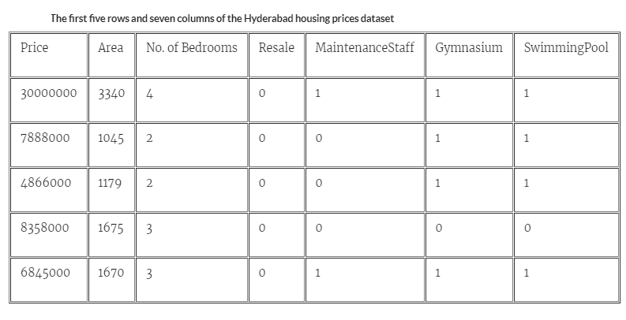

## So what is then, supervised and unsupervised learning?

Clearly, it is better to have labeled data than unlabeled data. With a labeled dataset, we can
do much more. But there are still many things that we can do with an unlabeled dataset.
The set of algorithms in which we use a labeled dataset is called supervised learning. The
set of algorithms in which we use an unlabeled dataset, is called unsupervised learning. This is
what we learn next.

## 2.2 What is supervised learning?

Supervised learning is the type of machine learning you find in the most common applications
nowadays, including image recognition, various forms of text processing, recommendation
systems, and many more. As we stated in the previous section, it is a type of predictive
machine learning in which the data comes with labels, where the label is the target we are
interested in predicting.
In the example on Figure 2.1, where the dataset is formed by images of dogs and cats,
and the labels in the image are ‘dog’ and ‘cat’, the machine learning model would simply use
previous data in order to predict the label of new data points. This means, if we bring in a new
image without a label, the model would guess if the image is of a dog or a cat, thus predicting
the label of the data point.

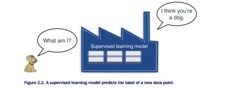

If you recall Chapter 1, the framework we learned for making a decision was RememberFormulate-Predict. This is precisely how supervised learning works. The model first
**remembers** the dataset of dogs and cats, then **formulates** a model, or a rule for what is a
dog and what is a cat, and when a new image comes in, the model makes a **prediction** about
what the label of the image is, namely, is it a dog or a cat.

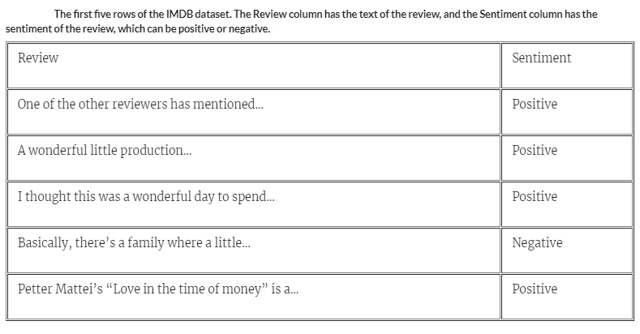

Now, notice that in Figure 2.1, we have two types of datasets, one in which the labels are
numbers (the weight of the animal), and one in which the labels are states, or classes (the
type of animal, namely cat or dog). This gives rise to two types of supervised learning models.

**Regression models:** These are the types of models that predict a **number**, such as the
weight of the animal.

**Classification models:** These are the types of models that predict a **state**, such as the
type of animal (cat or dog).

We call the output of a regression model continuous, since the prediction can be any real
value, picked from a continuous interval. We call the output of a classification model discrete,
since the prediction can be a value from a finite list. An interesting fact is that the output can
be more than two states. If we had more states, say, a model that predicts if a picture is of a
dog, a cat, or a bird, we can still use a discrete model. These models are called multivariate
discrete models. There are classifiers with many states, but it must always be a finite number.
Let’s look at two examples of supervised learning models, one regression and one
classification:

Example 1 (regression), housing prices model: In this model, each data point is a house.
The label of each house is its price. Our goal is, when a new house (data point) comes in the
market, we would like to predict its label, namely, its price.
Example 2 (classification), email spam detection model: In this model, each data point is
an email. The label of each email is either spam or ham. Our goal is, when a new email (data
point) comes into our inbox, we would like to predict its label, namely, if it is spam or ham.
You can see the difference between models 1 and 2.
- Example 1, the housing prices model, is a model that can return many numbers, such
as $100, $250,000, or $3,125,672. Thus it is a regression model.

- Example 2, the spam detection model, on the other hand, can only return two things:
spam or ham. Thus it is a classification model.

Let’s elaborate some more on regression and classification.

## 2.2.1 Regression models predict numbers
As we mentioned previously, regression models are those that predict a number. This number
is predicted from the features. In the housing example, the features can be the size of the
house, the number of rooms, the distance to the closest school, the crime rate in the
neighborhood, etc.
Other places where one can use regression models are the following:
- Stock market: Predicting the price of a certain stock based on other stock prices, and
other market signals.

- Medicine: Predicting the expected lifespan of a patient, or the expected recovery time,
based on symptoms and the medical history of the patient.

- Sales: Predicting the expected amount of money a customer will spend, based on the
client’s demographics and past purchase behavior.

- Video recommendations: Predicting the expected amount of time a user will watch a
video, based on the user’s demographics and past interaction with the site.

The most common method used for regression is linear regression, which is when we use
linear functions (basically lines) to make our predictions based on the features. We study
linear regression in Chapter 3.

## 2.2.2 Classification models predict a state

Classification models are those that predict a state, from a finite set of states. The most
common ones predict a ‘yes’ or a ‘no’, but there are many models which use a larger set of
states. The example we saw in Figure 2.3 is of classification, as it predicts the type of the pet,
namely, ‘cat’ or ‘dog’.
In the email spam recognition example, the state of the email (namely, is it spam or not)
is predicted from the features. In this case, the features of the email are the words on it, the
number of spelling mistakes, the sender, and many others.

Another very common example of classification is image recognition. The most popular
image recognition models take as an input the pixels in the image, and output a prediction of
what the image most likely depicts. Two of the most famous datasets for image recognition
are MNIST and CIFAR-10. MNIST is formed by around 70,000 images of handwritten digits,
which are classified as the digits 0-9. These images come from a combination of sources,
including the American Census Bureau, and handwritten digits taken from American high
school students. It can be found in the following link: http://yann.lecun.com/exdb/mnist/.
CIFAR-10 is made of 60,000 32 by 32 colored images of different things. These are classified
as 10 different classes (thus the 10 in the name), namely airplanes, cars, birds, cats, deer,
dogs, frogs, horses, ships, and trucks. This database is maintained by the Canadian Institute
For Advanced Research (CIFAR), and can be found in the following link:
https://www.cs.toronto.edu/~kriz/cifar.html.

Other places where one can use classification models are the following:
- Sentiment analysis: Predicting if a movie review is positive or negative, based on the

- Website traffic: Predicting if a user will click on a link or not, based on the user’s

words in the review.
demographics and past interaction with the site.
- Social media: Predicting if a user will befriend or interact with another user or not,
based on their demographics, history, and friends in common.

The bulk of this book talks about classification models. In chapters 3-x, we talk about
classification models in the context of logistic regression, decision trees, naive Bayes, support
vector machines, and the most popular classification models nowadays: neural networks.

## 2.3 What is unsupervised learning?

Unsupervised learning is also a very common type of machine learning. It differs from
supervised learning in that the data has no labels. What is a dataset with no labels, you ask?
Well, it is a dataset with only features, and no target to predict. For example, if our housing
dataset had no prices, then it would be an unlabeled dataset. If our emails dataset had no
labels, then it would simply be a dataset of emails, where ‘spam’ and ‘no spam’ is not
specified.
So what could you do with such a dataset? Well, a little less than with a labelled dataset,
unfortunately, since the main thing we are aiming to predict is not there. However, we can still
extract a lot of information from an unlabelled dataset. Here is an example, let us go back to
the cats and dogs example in Figure 2.1. If our dataset has no labels, then we simply have a
bunch of pictures of dogs and cats, and we do not know what type of pet each one represents.
Our model can still tell us if two pictures of dogs are similar to each other, and different to a
picture of a cat. Maybe it can group them in some way by similarity, even without knowing
what each group represents.

And the branch of machine learning that deals with unlabelled datasets is called unsupervised
machine learning. As a matter of fact, even if the labels are there, we can still use
unsupervised learning techniques on our data, in order to preprocess it and apply supervised
learning methods much more effectively.

The two main branches of unsupervised learning are clustering and dimensionality
reduction. They are defined as follows.

**Clustering:** This is the task of grouping our data into clusters based on similarity. (This is
what we saw in Figure 2.4.)

**Dimensionality reduction:** This is the task of simplifying our data and describing it with
fewerfeatures, without losing much generality.
Let’s study them in more detail.

## 2.3.1 Clustering algorithms split a dataset into similar groups

As we stated previously, clustering algorithms are those that look at a dataset, and split it into
similar groups
So let’s go back to our two examples. In the first one, we have a dataset with information
about houses, but no prices. What could we do? Here is an idea: we could somehow group
them into similar houses. We could group them by location, by price, by size, or by a
combination of these factors. This is called clustering. Clustering is a branch of unsupervised
machine learning which consists of grouping the elements in our dataset into clusters that are
similar. Could we do that with other datasets?
Let’s look at our second example, the dataset of emails. Because the dataset is unlabeled,
we don’t know if each email is spam or not. However, we can still apply some clustering to our
dataset. A clustering algorithm will return our emails split into, say, 4 or 5 different categories,
based on different features such as words in the message, sender, attachments, types of links

on them, and more. It is then up to a human (or a supervised learning algorithm) to label
categories such as ‘Personal’, ‘Social’, ‘Promotions’, and others.
For example, let’s say that we have 9 emails, and we want to cluster them into different
types. We have, say, the size of the email, and the number of recipients. And the data looks
like this, ordered by number of recipients:

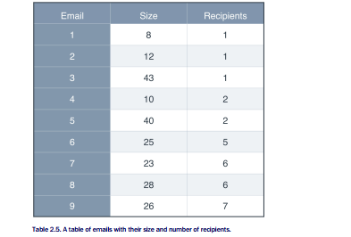

To the naked eye, it looks like we could group them by size, where the emails in one group
would have 1 or 2 recipients, and the emails in the other group would have 5 or more
recipients. We could also try to group them into three groups by size. But you can imagine
that as the data gets larger and larger, eyeballing the groups gets harder and harder. What if
we plot the data? Let’s plot the emails in a graph, where the horizontal axis records the size,
and the vertical axis records the number of recipients. We get the following plot.

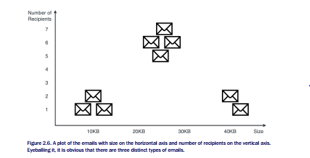

In Figure 2.6 we can see three groups, very well defined. We can make each a different category in our inbox. They are the ones we see in Figure 2.7.

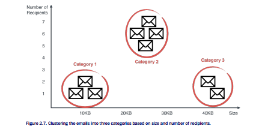

This last step is what clustering is all about. Of course, for us humans, it was very easy to
eyeball the three groups once we have the plot. But for a computer, this is not easy. And
furthermore, imagine if our data was formed by millions of points, with hundreds or thousands
of columns. All of a sudden, we cannot eyeball the data, and clustering becomes hard. Luckily,
computers can do these type of clustering for huge datasets with lots of columns.
Other applications of clustering are the following:
- Market segmentation: Dividing customers into groups based on demographic and
purchasing (or engagement) behavior, in order to create different marketing strategies
for the groups.

- Genetics: Clustering species into groups based on similarity.

- Medical imaging: Splitting an image into different parts in order to study different types
of tissue.

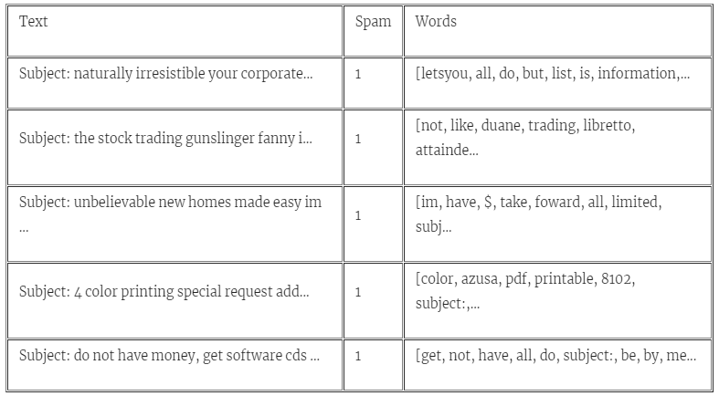

## 2.3.2 Dimensionality reduction simplifies data without losing much information

Dimensionality reduction is a very useful preprocessing step which we can apply to vastly
simplify our data, before applying other techniques. Let’s look at the housing example. Let’s
say that we want to predict the price, and the features are the following:
1. Size.
2. Number of bedrooms.
3. Number of bathrooms.
4. Crime rate in the neighborhood.
5. Distance to the nearest school.

That is five columns of data. What if we wanted a simpler dataset, with fewer columns, but
that can portray the information in as faithful a way as possible. Let’s do it using common
sense. Take a closer look at the five features. Can you see any way to simplify them, maybe
to group them into some smaller and more general categories?

After a careful look, maybe you thought the same as I did, which is: The first three
features seem similar, and the fourth and fifth also seem similar. The first three are all related
to the size of the house, whereas the fourth and fifth are related to the quality of the
neighborhood. We could condense them into a big ‘size’ feature, and a big ‘area quality’
feature. How do we condense the size features? There are many ways, we could only consider
the size, we could add the number of bedrooms and bathrooms, or maybe some linear
combination of the three features. How do we condense the neighborhood quality features?
Again in many ways, if they are both given by coefficients, we can add them, subtract them,
etc. The dimensionality reduction algorithms will find ways that group them, losing as little
information as possible, and keeping our data as intact as possible, while managing to simplify
it for easier process and storage.

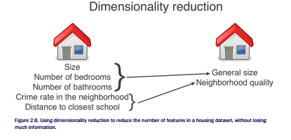

Now, why is it called dimensionality reduction, if all we’re doing is reducing the number of
columns in our data? Well, the fancy word for number of columns in data is dimension. Think
about this, if our data has one column, then each data point is one number. This is the same
as if our data set was formed by points in a line, and a line has one dimension. If our data has
two columns, then each data point is formed by two numbers. This is like coordinates in a city,
where the first number is the street number, and the second number is the avenue. And cities
are two dimensional, since they are in a plane (if we imagine that every house has only one
floor. Now, what happens when our data has 3 columns? In this case, then each data point is
formed by 3 numbers. We can imagine that if every address in our city is a building, then the
first and second numbers are the street and avenue, and the third one is the floor in which we
live in. This looks like a three-dimensional city. We can keep going. What about four numbers?
Well, now we can’t really visualize it, but if we could, this would be addresses in a four©Manning Publications Co. To comment go to liveBook

dimensional city, and so on. The best way I can imagine a four dimensional city, is by
imagining a table of four columns. And a 100-dimensional city? Simple, a table with 100
columns, in which each person has an address that consists of 100 numbers. The mental
picture I have when thinking of higher dimensions is in Figure 2.9.
Therefore, when we went from five dimensions down to two, we reduced our 5-dimensional
city into a 2-dimensional city, thus applying dimensionality reduction.

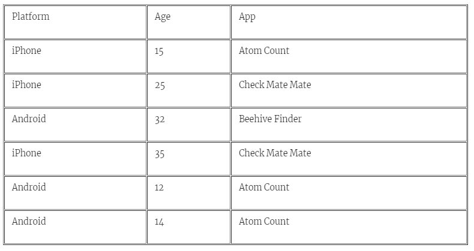

1 dimension is like a street, in which each house only has one number.

2 dimensions is like a flat city, in which each address has two numbers, a street and an avenue.

3 dimensions is like a city with buildings, in which each address has three numbers, a street, an avenue, and a floor.

4 dimensions is like some imaginary place, in which each address has four numbers.

And so on…

## 2.3.3 Matrix factorization and other types of unsupervised learning

It seems that clustering and dimensionality reduction look very different, but in reality they
are not so different. If we have a table full of data, each row is a data point, and each column
is a feature. Therefore, we can see clustering as a way to group the rows, and dimensionality
reduction as a way to group the columns, as figures 2.10 and 2.11 ilustrate.

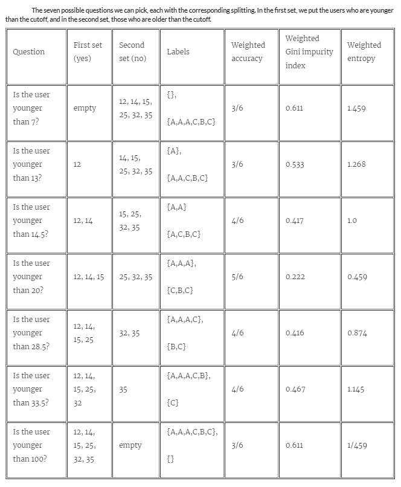

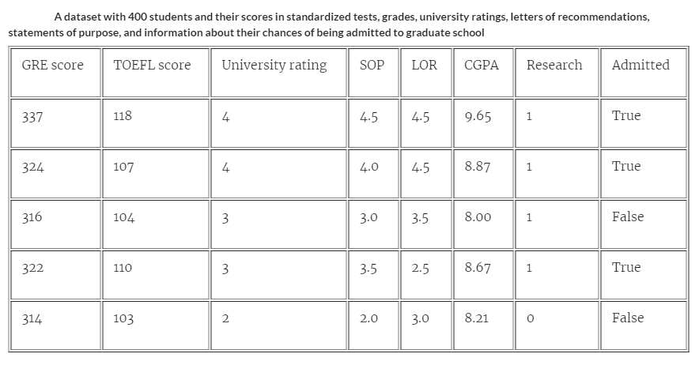

You may be wondering, is there a way that we can reduce both the rows and the columns at
the same time? And the answer is yes! One of the ways to do this is called matrix
factorization. Matrix factorization is a way to condense both our rows and our columns. If you
are familiar with linear algebra, what we are doing is expressing our big matrix of data into a
product of two smaller matrices.
Places like Netflix use matrix factorization extensively to make recommendations. Imagine
a large table where each row is a user, each column is a movie, and each entry in the matrix
is the rating that the user gave the movie. With matrix factorization, one can extract certain
features such as type of movie, actors appearing in the movie, and others, and be able to
predict the rating that a user gives a movie, based on these features.

## 2.4 What is reinforcement learning?

Reinforcement learning is a different type of machine learning, in which no data is given, and
we must solve a problem. Instead of data, an environment is given, and an agent who is
supposed to navigate in this environment. The agent has a goal, or a set of goals. The
environment has rewards and punishments, which guide the agent to take the right decisions
in order to reach its goal. That all sounded a bit abstract, but let’s look at some examples.

## Example 1: Grid world

In Figure 2.10 we see a grid world with a robot on the bottom left corner. That is our
agent. The goal is to get to the treasure chest in the top right of the grid. In the grid, we can
also see a mountain, which means we cannot go through that square, since the robot cannot
climb mountains. We also see a dragon, which will attack the robot, should the robot dare to
land in the square of the dragon, so part of our goal is to not land over there. This is the
game. And in order to give the robot information about how to proceed, we have a score. The
score starts at zero. If we get to the treasure chest, then we gain 100 points. If we reach the
dragon, we lose 50 points. And to make things fast, let’s say that for every step the robot
makes, we lose 1 point, since the robot loses energy.

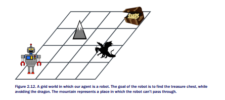

The way to train this algorithm, in very rough terms, is as follows. The robot starts walking
around, recording its score, and remembering what steps took it to each decision. After some
point, it may meet the dragon, losing many points. Therefore, it learns that the dragon
square, and squares close to it, are associated to low scores. At some point it may also hit the
treasure chest, and it starts associating that square, and squares close to it, to high scores.
Eventually, the robot will have a good idea of how good each square is, and can take the path
following the squares all the way to the chest. Figure 2.11 shows a possible path, although
this one is not ideal, since it passes close to the dragon. Can you think of a better one?

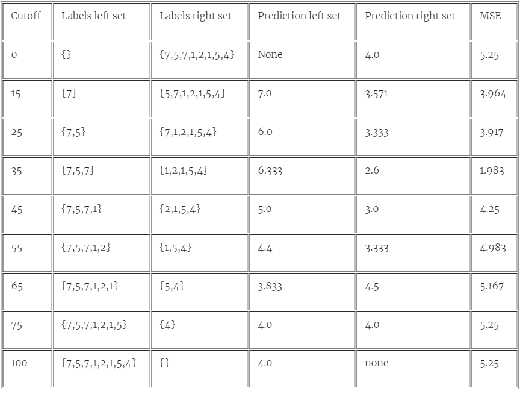

Now, of course this was a very brief explanation, and there is a lot more to this. There are
many books written only about reinforcement learning. For example, we highly recommend
you Miguel Morales’s book, called “Grokking Deep Reinforcement Learning”. But for the most
part, anytime you have an agent navigating an environment, picking up information and
learning how to get rewards and avoid punishment, you have reinforcement learning.
Reinforcement learning has numerous cutting edge applications, and here are some of
them.
- Games: The recent advances teaching computers how to win at games such as Go or
chess, use reinforcement learning. Also, agents have been taught to win at Atari games
such as Breakout or Super Mario.

- Robotics: Reinforcement learning is used extensively to help robots do tasks such as
picking up boxes, cleaning a room, or any similar actions.

- Self driving cars: For anything from path planning to controlling the car, reinforcement
learning techniques are used.

## 2.5 Summary

• There are several types of machine learning, including supervised learning and
unsupervised learning.
• Supervised learning is used on labelled data, and it is good for making predictions.
• Unsupervised learning is used on unlabelled data, and it is normally used as a
preprocessing step.
• Two very common types of supervised learning algorithms are called regression and
classification.

o Regression models are those in which the answer is any number.
o Classification models are those in which the answer is of a type yes/no. The answer
is normally given as a number between 0 and 1, denoting a probability.

• Two very common types of unsupervised learning algorithms are clustering and
dimensionality reduction.

o Clustering is used to group our data into similar clusters, in order to extract
information, or make it easier to handle.
o Dimensionality reduction is a way to simplify our data, by joining certain similar
features and losing as little information as possible.

• Reinforcement learning is a type of machine learning used where an agent has to
navigate an environment and reach a goal. It is extensively used in many cutting edge
applications
