## Drawing a line close to our points:
## Linear regression

## This lab covers
- What is linear regression?

- How to predict the price of a house based on known prices of other houses

- How to fit a line through a set of data points.

- How to code the linear regression algorithm in Python.

- Examples of linear regression in the real world, such as medical applications and
recommender systems.


#### Pre-reqs:
- Google Chrome (Recommended)

#### Lab Environment
Notebooks are ready to run. All packages have been installed. There is no requirement for any setup.

**Note:** Elev8ed Notebooks (powered by Jupyter) will be accessible at the port given to you by your instructor. Password for jupyterLab : `1234`

All Notebooks are present in `work/machine-learning` folder.

You can access jupyter lab at `<host-ip>:<port>/lab/workspaces/lab3_regression`


In this lab we learn linear regression. Linear regression is a very powerful and common
method to estimate values, such as the price of a house, the value of a certain stock, the life
expectancy of an individual, the amount of time a user will watch a video or spend in a
website, etc. In most books you will find linear regression as a plethora of complicated
formulas, matrices, derivatives, determinants, etc. Here, this will not happen, I promise. All
you need to have is the ability to visualize points and lines in a plane, and visualize the lines
moving around to get closer to the points.
The mental picture of linear regression is simple. Let us say we have some points, that
roughly look like they are forming a line, like in figure3.1.


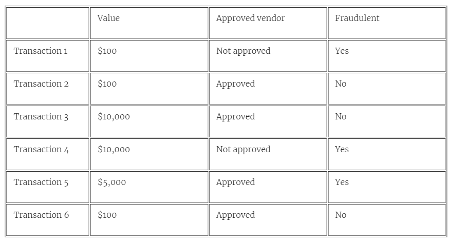

The goal of linear regression is to draw the line that passes as close as possible to these
points. What line would you draw, that goes close to those points? The one I drew is in
figure3.2.


The way I like to think of it is as if the points are houses in a town, and we should pass a road
through the town. The houses would like to be as close as possible to the road, so we need to
find the road that passes closest to the houses.
Another way I like to imagine it is if all the points are magnets bolted to the floor (so they
can’t move), and we throw a straight metal rod on top of them. The rod will move around, but
eventually it would end up in a position of equilibrium as close as possible to all the
magnets/points.

Of course, this can lead to a lot of ambiguity. Do we want a road that goes somewhat close
to all the houses, or maybe really close to a few of them and a bit far from others? You may
be asking yourself this and many other questions. Here are some that I can think of:
- What do we mean by “points that roughly look like they are forming a line”?


- What do we mean by “a line that passes really close to the points”?

- How do we (or the computer) find such a line?

- Why is this useful in the real world?

- Why is this machine learning?

In this lab, we answer all of these questions. But first, let’s start with a very simple
example.

## 3.1 The problem: We need to predict the price of a house
Let’s say we are a real estate agent, and we are in charge of selling a
 new house. We don’t
know the price, and we want to infer it by comparing it with other houses. We look at features
of the house which could influence the house, such as size, number of rooms, location, crime
rate, school quality, distance to commerce, etc. At the end of the day, what we want is a
formula on all these features which gives us the price of the house, or at least an estimate for
it.

## 3.2 The solution: Building a regression model for housing prices

Let’s go with as simple an example as possible. We’ll only look at one of the features, which is
the number of rooms. Our house has 4 rooms, and there are 6 houses nearby, with 1, 2, 3, 5,
6, and 7 rooms, respectively. Their prices are in table 3.1.

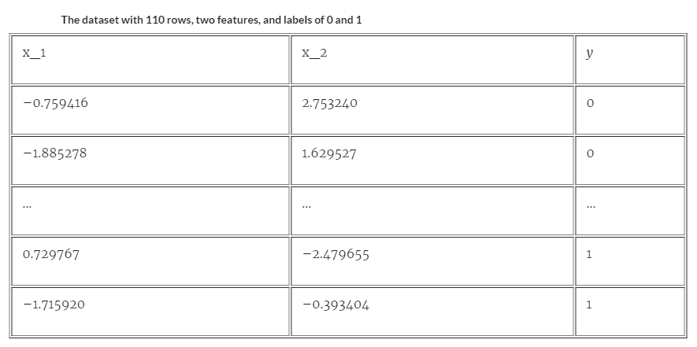

Take a look at this table. What price would you give to house 4, just from this table? If you
said $300, that is also my guess. You probably saw a pattern, and used it to infer the price of
the house. Congratulations! What you did in your head was linear regression. Let’s study this
pattern more. You probably noticed that each time you add a room, $50 is added to the price
of the house. More specifically, we can think of the price of a house as a combination of two
things: A base price of $100, and an extra charge of $50 for each of the rooms. This can be
summarized in this simple formula:

Price = 100 + 50 * (Number of rooms)

What we did here, is come up with a model, which is a formula that gives us a prediction of
the price of the house, based on the feature, which is the number of rooms. These are some
very important concepts in machine learning.

**FEATURES** The features of a data point are those properties that we use to make our prediction. In this
case, the features would be number of rooms in the house, the crime rate, the size, etc. For our particular case,
we’ve decided on one feature: the number of rooms in the house.

**LABELS** This is the target, or what we try to predict from the features. In this case, the label is the price of
the house.

**MODEL** A machine learning model is simply a rule, or a formula, which predicts a label from the features. In
this case, the model is the equation we found for the price.

**PREDICTION** The prediction is simply the output of the model. If the classifier says “I think the house with
4 rooms is going to cost $300”, then the prediction is 300. It may or may not be close to the actual price of the
house, but from what we know, it is very likely that it will be close.

Ok, now the question is, how did we come up with this formula? Or more specifically, how do
we get the computer to come up with this formula? In order to illustrate this, let’s look at a
slightly more complicated example. And since this is a machine learning problem, we will
approach it using the remember-formulate-predict framework that we learned in Lab 2.

## 3.2.1 The remember step: looking at the prices of existing houses

Let’s look at a slightly more complicated dataset, like the one in Table 3.2.

Table 3.2. A slightly more complicated dataset of houses with their number of rooms and their
price.

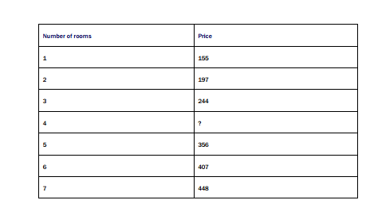

This one is very similar to the previous one, except now the prices don’t follow a nice pattern,
where each price is $50 more than the previous one. However, it’s not that far from following
one. Can you see the pattern, and more than that, can you find some good predictions for the
price of the house with four rooms?
For now, let’s start by doing what I do when I am trying to figure things out: I start
plotting things. If we plot the points in a coordinate system, in which the horizontal axis
represents the number of rooms and the vertical axis represents the price of the house, the
graph looks like figure 3.3.

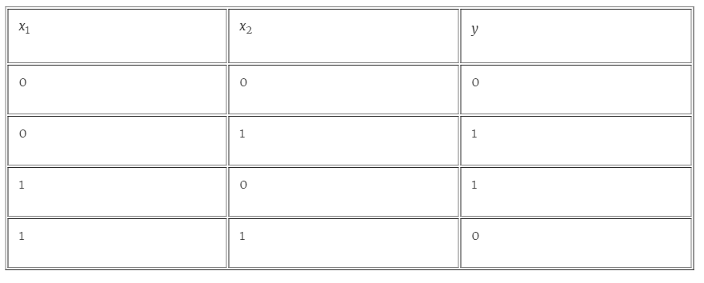

## 3.2.2 The formulate step: formulating a rule that estimates the price of the house

The dataset in Table 3 is close enough to the one in Table 2, so we should feel safe to use the
same formula for the price. The only difference is that now the prices are not exactly what the
formula says, and we have a small error. We can the formula as follows:

Price = 100 + 50*(Number of rooms) + (Small error)

But the point is that if we were to predict prices, we can use this formula, and even though we
are not sure we’ll get the actual value, we know it’s very likely that we are close to it.
Now the question is, how did we find this equation? And most importantly, how does a
computer find this equation?
Let’s go back to the plot, and see what the equation means there. What happens if we look
at all the points in which the vertical (y) coordinate is 100 plus 50 times the horizontal (x)
coordinate? This set of points forms a line. If the words slope and y-intercept ring a bell, this
line is precisely the line with slope 50, and y-intercept 100. The y-intercept being 100 means
that our estimate for the price of a (hypothetical) house with zero rooms, would be the base
price of $100. The slope being 50 means that each time we add one room to the house, we
estimate that the price of the house will go up by $50. This line is drawn in figure 3.4.


**SLOPE** The slope of a line is a measure of how steep the line is. It is calculated by dividing the rise over the
run (i.e., how many units it goes up, divided by how many units it goes to the right). This is constant over the
whole line. In a machine learning model, it tells us how much we expect the value of the label to go up, when
we increase the value of the feature by one unit.

**Y-INTERCEPT** The y-intercept of a line is the height at which the line crosses the vertical (y) axis. In a
machine learning model, it tells us what the label would be in a datapoint where the feature is precisely zero.

**LINEAR EQUATION** This is the equation of a line. It is given by two parameters, the slope, and the yintercept. If the slope is m and the y-intercept is b, then the equation of the line is y=mx+b, and the line is
formed by all the points (x,y) where the y satisfies the equation of the line. In a machine learning model, we
insert the feature into the variable x, and the prediction for the label is what comes out of the y. The m and the
b are the parameters of the mode


Now, of all the possible lines (each one with its own equation), why did we pick this one in
particular? The reason is, because that one passes by the points pretty closely. There may be
a better one, but at least we know this one is very good, as opposed to one that goes nowhere
near the points. Now we are back into the original problem, where we have a set of houses,
and we want to pass a road as closely as possible for them!


How do we find this line? We’ll look at this later in the lab. But for now, let’s say that
we have a magic ball that given a bunch of points, finds the line that passes the closest to
them.

## 3.2.3 The predict step: what do we do when a new house comes in the market?
Now, on to using our model to predict the price of the house with 4 rooms. This is very simple,
all we do is plug the number 4 into our formula, to get the following:

Price = 100 + 50*4 = 300.

Therefore, our model predicted that the house costs $300. This can also be seen graphically
by using the line, as illustrated in figure 3.5.


## 3.2.4 Some questions that arise and some quick answers

Ok, your head may be ringing with lots of questions, let’s address some (hopefully all) of
them!
1. What happens if the model makes a mistake?
2. How on earth did you come up with the scoring system? And what would we do if
instead of 6 houses, we have thousands of them?


3. Why did you only use the number of rooms to predict the price of the house? I can
think of other features like size, number of floors, number of parking spots, crime rate
in the area, school quality, distance to a highway, etc.
4. What if we’ve built this prediction mode, and then new houses start appearing in the
market, is there a way to update the model with new information?

This lab answers all of these questions, but let me give you some quick answers:

**1. What happens if the model makes a mistake?**

Since the model is estimating the price of a house, we expect it to make a small
mistake pretty much all the time, since it is very hard to actually hit the exact price.
However, we want to build our model so that we expect it to make small errors for
most of the houses, so that we can use it effectively.

**2. How on earth did you come up with the scoring system? And what would we do if instead of 6 houses, we have thousands of them?** 

Yes, this is the main question we address on this lab! When we have 6 houses, the
problem of drawing a line that goes close to them is simple, but if we have thousands
of houses, this gets hard. What we do in this lab is to device an algorithm, or a
procedure, for the computer to find a good line.

**3. Why did you only use the number of rooms to predict the price of the house? I can think of other features like size, number of floors, number of parking spots, crime rate in the area, school quality, distance to a highway, etc.**

Absolutely. The price of a house doesn’t just depend on the number of houses, the
location matters, the size matters, etc. All of these, and many more, are valid features.
In this lab we use only one feature so that we can plot the prices and draw a line
through them. But in real life, we would be predicting the price using lots of features,
and the formulas we get will be very similar, except with a lot more variables.

**4. What if we’ve built this prediction mode, and then new houses start appearing in the market, is there a way to update the model with new information?**

Absolutely! We will build the model in a way that it can be easily updated if new data
comes into the model. This is always something to look for in machine learning. If
we’ve built our model in such a way that we need to recalculate the entire model every
time new data comes in, it won’t be very useful.

## 3.3 How to get the computer to draw this line: the linear regression algorithm
Now we get to the main question on this lab. How do we get a computer to draw this line.
Before we get into the math, let’s think. How would we find the perfect model? Actually, there
is a simple question we can ask. The question is, imagine if we already had a model. How do
we make our existing model a little bit better? Even if it is just a little bit. If we have, say, a

model that says that the price is $50 + $40*(Number of rooms), and a house with 2 rooms
which costs $150, then what’s wrong with our model? Well, the model predicts that the house
will cost $50 + $40*2 = 130. But the house is $150. That’s not bad, but we can do better. We
can imagine that if the model thought the house would be cheaper than it is, then a new
model that assigns a slightly higher weight to the base price and a slightly higher weight to
the price per room, will do a bit better for this house, correct? So let’s tweak the model a little
bit. Let’s make a model that says that the price is $51 + $41*(Number of rooms). This model
assigns the house a price of $51 + $41*2 = $133, which is closer to $150. It’s not perfect, but
it is a little better. What if instead we had a house with two rooms that costs $80? Then we’ll
decrease the base price and the price per room a little bit.

You can imagine that this process is not exact, and we may increase and decrease the
weights unnecessarily. But Imagine doing this many many times, picking a random house, and
using it to make the model a little better. Since computers can run a loop many times at great
speed, it is imaginable that this technique works. And it turns out to work very well.
Therefore, here is our algorithm to build a price model for our data set of houses:

1. Start with random values for the base price and the price per room.
2. Repeat many times:

a) Pick a random house, and use it to increase or decrease the base price and price
per room by a small amount, so the model will predict its price better.

3. Enjoy your model!

Of course, this requires a lot more details, and some math needs to be worked out. For now,
let’s start looking at what this means geometrically. We will start by drawing a random line,
and that is our first model. This line is probably not a great fit. That’s ok, we’ll make it better
gradually in the simplest possible way, repeating the following two simple steps many times.

1. Picking a random point.
2. Moving the line towards this point, by a very small amount.

You may think, what if I have a point that is really far away, and it messes up my procedure?
That is ok, if we only move the line by small amounts, this point can’t harm us very much.
Now the question is, how do we move a line closer to a point? In the next few sections, we
will learn some very simple tricks to do this. But first, a very quick recap on slope and yintercept.

## 3.3.1 Crash course on slope and y-intercept
When we think of a line, we can think of it graphically, or as an equation. If we think of it as
an equation, then it has two components:

- The slope.
- The y-intercept.


The slope simply tells us how steep the line is, and the y-intercept tells us where the line is
located. The slope is defined as raise divided by run, and the y-intercept tells us where the
line crosses the y-axis (the vertical one). In the figure 3.6 we can see both of them in an
example. This line has the following equation:

y = 0.5 x + 2.


What does this equation mean? It means that the slope is 0.5, and the y-intercept is 2.


## 3.3.2 A simple trick to move a line closer to a set of points, one point at a time.
Now we get to our problem, which is: we have a point, and a line, and we need to move the
line closer to the point.


Well, the way to do this is to change the slope and the y-intercept by a small amount. We
have to be careful here, since we have to figure out if we want to add or subtract a small
amount. Notice that from the way we defined the slope, the higher the slope, the higher the
amount the line rises. Therefore, steeper lines have larger slopes. The y-intercept tells us
where the line is located, so a line with high y-intercept will meet the y-axis at a higher
position than one with a low y-intercept. In figure 3.8 we can see this in some examples of
slopes and y-intercepts.

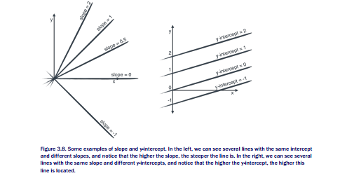


From these, we can conclude the following, which is summarized in figure 3.9:

**Changing the slope:**

- If we increase the slope of a line, the line will rotate counterclockwise.

- If we decrease the slope of a line, the line will rotate clockwise.

These rotations are on the pivot shown in figure 3.9, namely, the point of intersection of the
line and the y-axis.

**Changing the y-intercept:**

- If we increase the y-intercept of a line, the line will translate upwards.

- If we decrease the y-intercept of a line, the line will translate downwards.

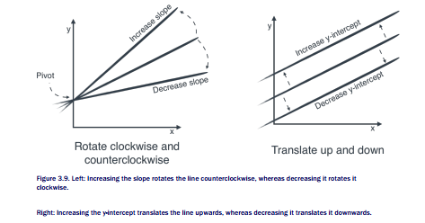

So now we are ready to start moving our lines around!
The trick to move the line correctly towards a point is to identify where the point is with
respect to the line. If the point is above the line, we need to translate the line up, and if it is
below, we need to translate it down. Rotation is a bit harder, but since the pivot is the point of
intersection of the line and the y-axis, then we can see that if the point is above the line and
to the right of the y-axis, or below the line and to the left of the y-axis, we need to rotate the
line counterclockwise. In the other two scenarios, we need to rotate the line clockwise. These
are summarized in the following four cases, which are illustrated in figure 3.10.


**Case 1:** If the point is above the line and to the right of the y-axis, we rotate the line
counterclockwise and translate it upwards.

**Case 2:** If the point is above the line and to the left of the y-axis, we rotate the line clockwise
and translate it upwards.

**Case 3:** If the point is below the line and to the right of the y-axis, we rotate the line
counterclockwise and translate it downwards.

**Case 4:** If the point is below the line and to the left of the y-axis, we rotate the line clockwise
and translate it downwards.

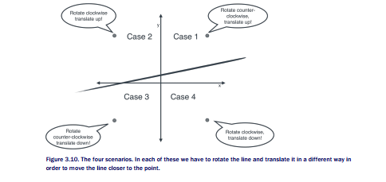

Ok, we are finally ready for our algorithm! All we need to do is a quick check of where the
point is, and then we move the line. We simply do the following, we look at where the point is,
and add or subtract small amounts to the slope and the y-intercept depending on if we need
to increase them or decrease them. The following four cases summarize our procedure:

**Case 1:** If the point is above the line and to the right of the y-axis:

- Add a small amount to the slope.

- Add a small amount to the y-intercept.

**Case 2:** If the point is above the line and to the left of the y-axis

- Subtract a small amount to the slope.

- Add a small amount to the y-intercept.

**Case 3:** If the point is below the line and to the right of the y-axis

- Add a small amount to the slope.

- Subtract a small amount to the y-intercept.

**Case 4:** If the point is below the line and to the left of the y-axis

- Subtract a small amount to the slope.

- Subtract a small amount to the y-intercept.

What each of these cases do, is they make sure that the line rotates and translates a small
amount, in order to get closer to the point.

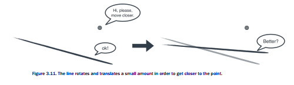

The question is what is this small amount? Well, in machine learning we always want to make
very small steps. So let’s pick a very small number for this step size, say, 0.01. This number is
very important in machine learning, it is called the learning rate.

**LEARNING RATE** A very small number that we pick before training our model, and that will help us make
sure our models change in very small amounts while training. The learning rate works in different ways for
different models. In the linear regression case, it is a number that we add or subtract to the slope and the yintercept in order to move the line towards a point very slowly.


## PSEUDOCODE FOR THE SIMPLE TRICK

**Case 1:** If the price of the house is higher than the price the model predicted, and the number
of rooms is positive:
- Add 1 cent to the price per room

- Add 1 cent to the base price.

**Case 2:** If the price of the house is higher than the price the model predicted, and the number
of rooms is negative:
- Subtract 1 cent to the price per room

- Add 1 cent to the base price.

**Case 3:** If the price of the house is lower than the price the model predicted, and the number
of rooms is positive:
- Add 1 cent to the price per room

- Subtract 1 cent to the base price.

**Case 4:** If the price of the house is lower than the price the model predicted, and the number
of rooms is negative:
- Subtract 1 cent to the price per room

- Subtract 1 cent to the base price.


We are ready to code this algorithm in Python! All this code appears in our public
repository at https://www.github.com/luisguiserrano/manning.

```
def simple_trick(base_price, price_per_room, num_rooms, price, learning_rate): #A
predicted_price = base_price + price_per_room*num_rooms #B
if price > predicted_price and x > 0: #C
price_per_room += learning_rate #D
base_price += learning_rate #E
if price > predicted_price and x < 0:
price_per_room -= learning_rate
base_price += learning_rate
if price > predicted_price and x > 0:
price_per_room += learning_rate
base_price -= learning_rate
if price > predicted_price and x < 0:
price_per_room -= learning_rate
base_price -= learning_rate
return price_per_room, base_price
#A Recall that base_price is the y-intercept, and price_per_room is the slope.
#B Calculating the prediction.
#C Checking where the point is with respect to the line.
#D Translating the line.
#E Rotating the line.
```

## 3.3.3 The square trick: A much more clever way of moving our line closer to one of the points

The simple trick works ok, but we can do better. What if we try to bring the four if statements
in the simple trick down to 1? Let’s simplify the problem, what if we added a slightly different
amount, but that still manages to be positive or negative, depending if we want to add it or
subtract it in the simple trick? Well, here is an idea, first let’s keep in mind the following
observation.

**OBSERVATION 1** In the simple trick, when the point is above the line, we add a small amount to the yintercept, and when the point is below the line, we subtract a small amount to the y-intercept.

Wouldn’t it be nice if we had some quantity that took care of this adding or subtracting?
Luckily we do. Let’s take a look at this particular quantity: The actual price of the house minus
the price that the model predicted. This is the same as the label minus the predicted label.
Notice the following.

**OBSERVATION 2** 

If a point is to the above the line, the difference of price minus predicted price is positive. If it is below the line, then this difference is negative.

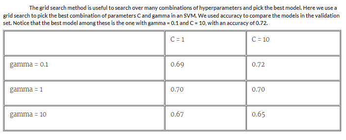

So why don’t we change the simple trick, and instead of adding or subtracting a small amount
(the learning rate), we now simply add the learning rate times this difference? This will
completely take care of it, since the difference is positive when the point is above the line, and
negative when it is below the line! We are adding a different amount, but that is ok, we are
still taking a step in the correct direction, and the learning rate makes sure that the step we
take is very small.

Now, wouldn’t it be nice if we can do the same thing for the slope? Luckily, we can again!
First, let’s remember what the rule is for updating the slope:

**OBSERVATION** 3 In the simple trick, when the point is either above the line and to the right of the y-axis,
or below the line and to the left of the y-axis, we add a small amount to the slope. Otherwise, we subtract a
small amount to the slope.

This case is a bit more complicated, because we need to look at two quantities. The first one is
the same one as before. The second one is the number of rooms in the house. Now of course,
this number is always positive, since it is counting the rooms in a house. But if we are
considering different datasets of different things, we could envision a quantity that is negative.
How would this look in the plots? It would simply be a point that’s to the left of the y-axis
instead of to the right. That will be our second quantity.

**OBSERVATION 4** If the point is to the right of the y-axis, then the number of rooms is positive. If the point
is to the left of the y-axis, then this quantity is negative.

Figure 3.13 illustrates the second quantity. When the x-coordinate, in this case the number of
rooms, is positive, then the point is to the right of the y-axis. If it is negative, then the point is
to the left of the y-axis.

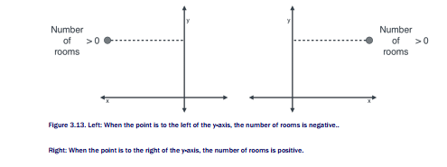


Now, this quantity is not enough to help us out, but if we take the product of it times the
previous quantity, we get what we want. In other words, we will consider the following
product:

```
(Price - Predicted price) * (Number of rooms)
```

That product has the correct sign, so that if we add it to the slope, we will always move it in
the correct direction. Let’s double check this.

**Case 1:** If the price of the house is higher than the price the model predicted, and the number
of rooms is positive:

- (Price - Predicted price) * (Number of rooms) is positive.

**Case 2:** If the price of the house is higher than the price the model predicted, and the number
of rooms is negative:

- (Price - Predicted price) * (Number of rooms) is negative.

**Case 3:** If the price of the house is lower than the price the model predicted, and the number
of rooms is positive:

- (Price - Predicted price) * (Number of rooms) is negative.

**Case 4:** If the price of the house is lower than the price the model predicted, and the number
of rooms is negative:

- (Price - Predicted price) * (Number of rooms) is positive.

Therefore, the pseudocode for our square trick is the following:

## PSEUDOCODE FOR THE SQUARE TRICK

**All cases:**

- Add the learning rate * (Price - Predicted price) * (Number of rooms) to the price per
room.

- Add the learning rate * (Price - Predicted price) to the base price.

And here is the code:

```
def square_trick(price_per_room, base_price, num_rooms, price, learning_rate):
predicted_price = base_price + price_per_room*num_rooms #A
base_price += learning_rate*(price-predicted_price) #B
price_per_room += learning_rate*num_rooms*(price-predicted_price) #C
return price_per_room, base_price
```

#A Calculating the prediction.
#B Translating the line.
#C Rotating the line.


## 3.3.4 The linear regression algorithm: Repeating the square trick many times

Now we are ready for our linear regression algorithm! This algorithm takes as input a bunch of
points, and it returns a line that fits them well. We’ve already done all the hard work, all we
need is to start with random values for our slope and our y-intercept, and then repeat the
procedure of updating them many many times. Here is the pseudocode:

**PSEUDOCODE FOR FITTING A LINE THROUGH A SET OF POINTS (LINEAR REGRESSION)** 

- Start with random values for the slope and y-intercept
- Repeat many times:

    * Pick a random point
    * Update the slope and the y-intercept using the square (or the simple) trick

The simple trick was used mostly for illustration, in real life, we use the square trick, which
works a lot better. Therefore, we’ll use this one. Here is the actual code. Note that we have
used the random package to generate random numbers for our initial values (slope and yintercept), and for selecting our points inside the loop.

```
import random #A
def linear_regression(features, labels, learning_rate=0.01, epochs = 1000):
price_per_room = random.random()
base_price = random.random() #B
for i in range(epochs): #C
i = random.randint(0, len(features)-1) #D
num_rooms = features[i]
price = labels[i]
price_per_room, base_price = square_trick(base_price,
#E
price_per_room,
num_rooms,
price,
learning_rate=learning_rate)
return price_per_room, base_price
```

#A Importing the random package to generate (pseudo) random numbers.
#B Generating random values for the slope and the y-intercept.
#C Repeating the update step many times.
#D Picking a random point on our dataset.
#E Applying the square trick to move the line closer to our point.

Let’s quickly write some plotting functions, and then we are ready to test this algorithm on our
dataset!

## 3.3.5 Plotting dots and lines

Throughout this lab, we make plots of our data and models using Matplotlib and Numpy,
two very useful Python packages. In this course we show you the plots, but not the code for the
plots, as it is out of scope. However, you are more than invited to look at it in detail at our
public Github repository at https://www.github.com/luisguiserrano/manning.

The first plot we’ll show is figure 3.14, which is the plot of the points in our small housing
dataset from Table 3. Notice that the points do appear close to forming a line.

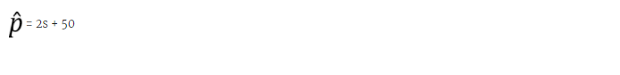

## 3.3.6 Using the linear regression algorithm in our dataset

Now, let’s apply the algorithm to our dataset! The following line of code runs the algorithm
(using the square error) with the features, the labels, the learning rate equal to 0.01, and the
number of epochs equal to 10000. The result is the plot in figure 3.15.

```
linear_regression(features, labels, learning_rate = 0.01, epochs = 10000)
```

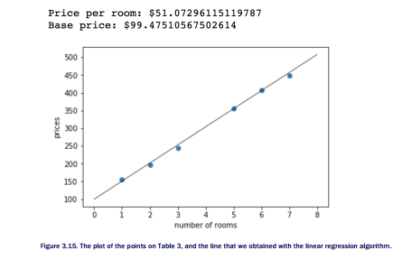

Figure  shows the line where the price per room is $51.07, and the base price is $99.48.
This is not far from the $50 and $100 we eyeballed earlier in the lab.


The first graphic shows the starting point.

The second graphic shows the first 10  of the linear regression algorithm. Notice how the line is moving
closer to fitting the points.

The third graphic shows the first 50 epochs.

The fourth graphic shows epochs 51 to 10000 (the last epoch).

## 3.5 Summary

- Regression is a very important part of machine learning. It consists of training an
algorithm with labelled data, and using it to make predictions on future (unlabelled)
data.

- Labelled data is data that comes with labels, which in the regression case, are
numbers. For example, the numbers could be prices of houses.

- In a dataset, the features are the properties that we use to predict the label. For
example, if we want to predict housing prices, the features are anything that describes
the house and which could determine the price, such as size, number of rooms, school
quality, crime rate, distance to the highway, etc.

- The linear regression method for predicting consists in assigning a weight to each of
the features, and adding the corresponding weights multiplied by the features, plus a
bias.

- Graphically, we can see the linear regression algorithm as trying to pass a line as close

- The way the linear regression algorithm works is by starting with a random line, and as possible to a set of points.
then slowly moving it closer to each of the points that is misclassified, in order to attempt to classify them correctly.

- Linear regression has numerous applications, including recommendation systems, ecommerce, and healthcare.


#### Exercises

#### Exercise 3.1
A website has trained a linear regression model to predict the amount of minutes that a user
will spend on the site. The formula they have obtained is

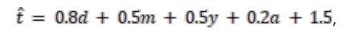

Where t^ is the predicted time in minutes, and w, m, y, and a are indicator variables (namely,
they only take the values 0 or 1) defined as follows:

- d is a variable that indicates if the user is on desktop,
- m is a variable that indicates if the user is on mobile,
- y is a variable that indicates if the user is young (under 21 years old), and
- a is a variable that indicates if the user is an adult (21 years old or older).


If a 45 year old user looks at the website from their phone, what is the expected time
they will spend on the site?

#### Exercise 3.2

Imagine that we trained a linear regression model in a medical dataset. The model predicts
the expected lifetime of a patient. To each of the features in our dataset, the model would
assign a weight.

    a) For the following quantities, state if you believe the weight attached to this
    quantity would be a positive number, a negative number, or 0. Note: If you
    believe that the weight is a very small number, whether positive or negative, you
    can say 0.

1. Number of hours of exercise the patient gets per week.
2. Number of cigarettes the patient smokes per week.
3. Number of family members with heart problems.
4. Number of siblings of the patient.
5. If the patient has been hospitalized or not.

b) The model also has a bias. Do you think the bias is positive, negative, or 0?


#### Exercise 3.3
The following is a dataset of houses with price (in sq/ft) and price (in $).


a) Calculate the predictions that this model makes on the dataset.
b) Calculate the mean absolute error of this model.
c) Calculate the mean square error of this model.

#### Exercise 3.4

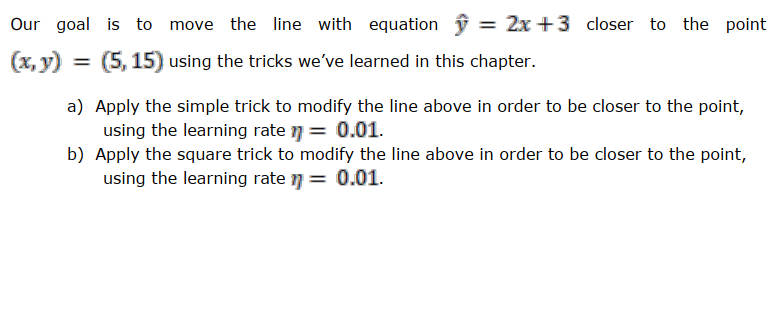