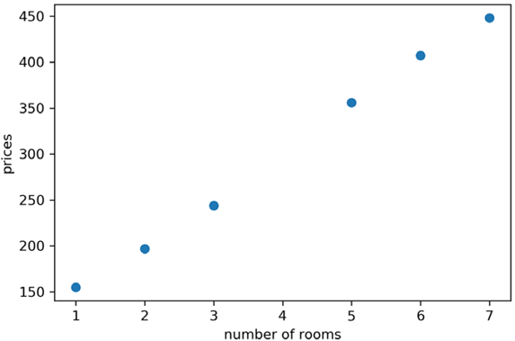
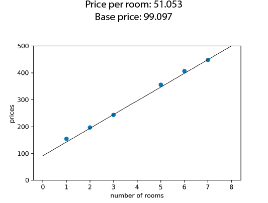
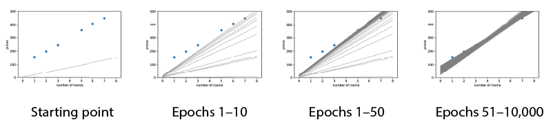
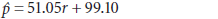
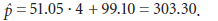
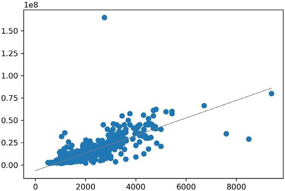
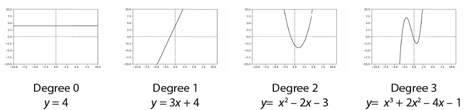

Lab 3: Drawing a line close to our points: Linear regression
=============================================================

### In this lab

- coding the linear regression algorithm in Python
- using Turi Create to build a linear regression model to predict housing prices in a real dataset
- fitting a more complex curve to nonlinear data

In this lab, we will learn about linear regression. Let's code this in Python! The code for this
section follows:


- **Notebook**: Coding\_linear\_regression.ipynb
    -   <https://github.com/fenago/machine-learning/blob/master/Lab_3_Linear_Regression/Coding_linear_regression.ipynb>


And here is code for the square trick:


```
def square_trick(base_price, price_per_room, num_rooms, price, learning_rate):
    predicted_price = base_price + price_per_room*num_rooms           #1
    base_price += learning_rate*(price-predicted_price)               #2
    price_per_room += learning_rate*num_rooms*(price-predicted_price) #3
    return price_per_room, base_price
```


#### The absolute trick: Another useful trick to move the line closer to the points


The
square trick is effective, but another
useful
trick, which we call the *absolute trick*, is an intermediate between
the simple and the square tricks. In the square trick, we used the two
quantities,  (price --
predicted price) and *r* (number of rooms), to help us bring the four
cases down to one. In the absolute trick, we use only *r* to help us
bring the four cases down to two. In other words, here is the absolute
trick:


#### Pseudocode for the absolute trick


Inputs:


- A line with slope *m*, *y*-intercept *b*, and equation
     = *mr* +
    *b*
- A point with coordinates (*r*, *p*)
- A small
    positive
    value *η* (the learning rate)


Output:


- A line with equation  = *m\'r* + *b\'* that is closer to the point


Procedure:


**Case 1**: If the point is above the line (i.e., if *p* \>
):


- Add *ηr* to the slope *m*. Obtain *m\'* = *m* + *ηr* (this rotates
    the line counterclockwise if the point is to the right of the
    *y*-axis, and clockwise if it is to the left of the
    *y*-axis).
- Add *η* to the *y*-intercept *b*. Obtain *b\'* = *b* + *η* (this
    translates the line up).


**Case 2**: If the point is below the line (i.e., if *p* \<
):


- Subtract *ηr* from the slope *m*. Obtain *m\'* = *m* -- *ηr* (this
    rotates the line clockwise if the point is to the right of the
    *y*-axis, and counterclockwise if it is to the left of the
    *y*-axis).
- Subtract *η* from the *y*-intercept *b*. Obtain *b\'* = *b* -- *η*
    (this translates the line down).


**Return**: The line with equation
 = *m\'r* + *b\'*


Here is the code for the absolute trick:


```
def absolute_trick(base_price, price_per_room, num_rooms, price, learning_rate):
    predicted_price = base_price + price_per_room*num_rooms
    if price > predicted_price:
        price_per_room += learning_rate*num_rooms
        base_price += learning_rate
    else:
        price_per_room -= learning_rate*num_rooms
        base_price -= learning_rate
    return price_per_room, base_price
```


I encourage you to verify that the amount added to each of the weights
indeed has the correct sign, as we did with the square trick.


#### The linear regression algorithm: Repeating the absolute or square trick many times to move the line closer to the points


Now
that we've done all the hard work, we are
ready
to develop the linear regression algorithm! This algorithm takes as
input a bunch of points and returns a line that fits them well. This
algorithm consists of starting with random values for our slope and our
*y*-intercept and then repeating the procedure of updating them many
times using the absolute or the square trick. Here is the pseudocode:


#### Pseudocode for the linear regression algorithm


Inputs:


- A dataset of houses with number of rooms and prices


Outputs:


- Model weights: price per room and base price


Procedure:


- Start
    with random values for the slope and *y*-intercept.
- Repeat many times:
    -   Pick a random data point.
    -   Update the slope and the *y*-intercept using the absolute or the
        square trick.


Each iteration of the loop is called an *epoch*, and we set this number
at the beginning of our algorithm. The simple trick was mostly used for
illustration, but as was mentioned before, it doesn't work very well. In
real life, we use the absolute or square trick, which works a lot
better. In fact, although both are commonly used, the square trick is
more popular. Therefore, we'll use that one for our algorithm, but feel
free to use the absolute trick if you prefer.


Here is the code for the linear regression algorithm. Note that we have
used the Python random
package
to generate random numbers for our initial values (slope and
*y*-intercept) and for selecting our points inside the loop:


```
import random
def linear_regression(features, labels, learning_rate=0.01, epochs = 1000):
    price_per_room = random.random()
    base_price = random.random()
    for epoch in range(epochs):
        i = random.randint(0, len(features)-1)
        num_rooms = features[i]
        price = labels[i]
        price_per_room, base_price = square_trick(base_price,
                                                  price_per_room,
                                                  num_rooms,
                                                  price,
                                                  learning_rate=learning_rate)
    return price_per_room, base_price
```

The next step is to run this algorithm to build a model that fits our
dataset.


#### Loading our data and plotting it


Throughout
this
lab, we load and make plots of our data and models using Matplotlib
and NumPy, two very useful Python
packages.
We use NumPy for storing arrays and carrying out mathematical
operations, whereas we use Matplotlib for the plots.


The first thing we do is encode the features and labels of the dataset
in table 3.2 as NumPy arrays as follows:


```
import numpy as np
features = np.array([1,2,3,5,6,7])
labels = np.array([155, 197, 244, 356, 407, 448])
```


Next we plot the dataset. In the repository, we have some functions for
plotting the code in the file [utils.py](http://utils.py/), which you
are invited to take a look at. The plot of the dataset is shown in
figure 3.14. Notice that the points do appear close to forming a line.





#### Using the linear regression algorithm in our dataset


Now,
let's apply the algorithm to fit a line to these points. The following
line of code runs the
algorithm
with the features, the labels, the learning rate equal to 0.01, and the
number of epochs equal to 10,000. The result is the plot shown in figure
3.15.


```
linear_regression(features, labels, learning_rate = 0.01, epochs = 10000)
```





Figure 3.15 shows the line where the (rounded) price per room is
\$51.05, and the base price is \$99.10. This is not far from the \$50
and \$100 we eyeballed earlier in the lab.


To visualize the process, let's look at the progression a bit more. In
figure 3.16, you can see a few of the intermediate lines. Notice that
the line starts far away from the points. As the algorithm progresses,
it moves slowly to fit better and better every time. Notice that at
first (in the first 10 epochs), the line moves quickly toward a good
solution. After epoch 50, the line is good, but it still doesn't fit the
points perfectly. If we let it run for the whole 10,000 epochs, we get a
great fit.





#### Using the model to make predictions


Now
that
we have a shiny linear regression model, we can use it to make
predictions! Recall from the beginning of the
lab
that our goal was to predict the price of a house with four rooms. In
the previous section, we ran the algorithm and obtained a slope (price
per room) of 51.05 and a *y*-intercept (base price of the house) of
99.10. Thus, the equation follows:





The prediction the model makes for a house with *r* = 4 rooms is





Note that \$303.30 is not far from the \$300 we eyeballed at the
beginning of the lab!


Real-life application: Using Turi Create to predict housing prices
------------------------------------------------------------------


In
this section, I show you a real-life application. We'll use linear
regression to predict housing prices in Hyderabad, India. The dataset we
use comes from Kaggle, a popular site for machine learning competitions.
The code for this section follows:


- **Notebook**: House\_price\_predictions.ipynb
    -   <https://github.com/fenago/machine-learning/blob/master/Lab_3_Linear_Regression/House_price_predictions.ipynb>
- **Dataset**: Hyderabad.csv


This dataset has 6,207 rows (one per house) and 39 columns (features).
As you can imagine, we won't code the algorithm by hand. Instead, we use
Turi Create, a popular and useful package in which many machine learning
algorithms are implemented. The main object to store data in Turi Create
is the SFrame. We start by downloading the data into an SFrame, using
the following command:


```
data = tc.SFrame('Hyderabad.csv')
```


The table is too big, but you can see the first few rows and columns in
table 3.3.


Training a linear regression model in Turi Create takes only one line of
code. We use the function
create
from the package
linear\_regression.
In this function, we only need to specify the target (label), which is
Price, as follows:


```
model = tc.linear_regression.create(data, target='Price')
```


It may take a few moments to train, but after it trains, it outputs some
information. One of the fields it outputs is the root mean square error.
For this model, the RMSE is in the order of 3,000,000. This is a large
RMSE, but it doesn't mean the model makes bad predictions. It may mean
that the dataset has many outliers. As you can imagine, the price of a
house may depend on many other features that are not in the dataset.


We can use the model to predict the price of a house with an area of
1,000, and three bedrooms as follows:


```
house = tc.SFrame({'Area': [1000], 'No. of Bedrooms':[3]})
model.predict(house)
Output: 2594841
```


The model outputs that the price for a house of size 1,000 and three
bedrooms is 2,594,841.


We can also train a model using fewer features. The create function
allows us to input the features we want to use as an array. The
following line of code trains a model called simple\_model that uses the
area to predict the price:


```
simple_model = tc.linear_regression.create(data, features=['Area'], target='Price')
```


We can explore the weights of this model with the following line of
code:


```
simple_model.coefficients
```


The output gives us the following weights:


- Slope: 9664.97
- *y*-intercept: --6,105,981.01


The intercept is the bias, and the coefficient for area is the slope of
the line, when we plot area and price. The plot of the points with the
corresponding model is shown in figure 3.24.





We could do a lot more in this dataset, and I invite you to continue
exploring. For example, try to explore what features are more important
than others by looking at the weights of the model.


What if the data is not in a line? Polynomial regression
---------------------------------------------------------


In
the
previous sections, we learned how to find the best line fit for our
data, assuming our data closely resembles a line. But what happens if
our data doesn't resemble a line? In this section, we learn a powerful
extension to linear regression called *polynomial regression*, which
helps us deal with cases in which the data is more
complex.


#### A special kind of curved functions: Polynomials


To
learn polynomial regression, first we need to learn what polynomials
are. *Polynomials* are a class of functions that are helpful when
modeling nonlinear data.


We've already seen polynomials, because every line is a polynomial of
degree 1. Parabolas are examples of polynomials of degree 2. Formally, a
polynomial is a function in one variable that can be expressed as a sum
of multiples of powers of this variable. The powers of a variable *x*
are 1, *x*, *x*^2^, *x*^3^, .... Note that the two first are *x*^0^ = 1
and *x*^1^ = *x*. Therefore, the following are examples of polynomials:


- *y* = 4
- *y* = 3*x* + 2
- *y* = *x*^2^ -- 2*x* + 5
- *y* = 2*x*^3^ + 8*x*^2^ -- 40


We define the *degree* of the polynomial as the exponent of the highest
power in the expression of the polynomial. For example, the polynomial
*y* = 2*x*^3^ + 8*x*^2^ -- 40 has degree 3, because 3 is the highest
exponent that the variable *x* is raised to. Notice that in the example,
the polynomials have degree 0, 1, 2, and 3. A polynomial of degree 0 is
always a constant, and a polynomial of degree 1 is a linear equation
like the ones we've seen previously in this lab.


The
graph of a polynomial looks a lot like a curve that oscillates several
times. The number of times it oscillates is related to the degree of the
polynomial. If a polynomial has degree *d*, then the graph of that
polynomial is a curve that oscillates at most *d* -- 1 times (for *d* \>
1). In figure 3.25 we can see the plots of some examples of polynomials.




From the plot, notice that polynomials of degree 0 are flat lines.
Polynomials of degree 1 are lines with slopes different from 0.
Polynomials of degree 2 are quadratics (parabolas). Polynomials of
degree 3 look like a curve that oscillates twice (although they could
potentially oscillate fewer times).

Summary
-------

- In a dataset, the features are the properties that we use to
    predict the label. For example, if we want to predict housing
    prices, the features are anything that describes the house and which
    could determine the price, such as size, number of rooms, school
    quality, crime rate, age of the house, and distance to the
    highway.
- The linear regression method for predicting consists in assigning a
    weight to each of the features and adding the corresponding weights
    multiplied by the features, plus a bias.
- Graphically, we can see the linear regression algorithm as trying
    to pass a line as close as possible to a set of points.
- The way the linear regression algorithm works is by starting with a
    random line and then slowly moving it closer to each of the points
    that is misclassified, to attempt to classify them correctly.
- Polynomial regression is a generalization of linear regression, in
    which we use curves instead of lines to model our data. This is
    particularly useful when our dataset is nonlinear.


Exercises
---------

#### Exercise 3.1

A website has trained a linear regression model to predict the amount of
minutes that a user will spend on the site. The formula they have
obtained is


*t̂* = 0.8*d* + 0.5*m* + 0.5*y* + 0.2*a* + 1.5


where *t̂* is the predicted time in minutes, and *d*, *m*, *y*, and *a*
are indicator variables (namely, they take only the values 0 or 1)
defined as follows:


- *d* is a variable that indicates if the user is on desktop.
- *m* is a variable that indicates if the user is on mobile
    device.
- *y* is a variable that indicates if the user is young (under 21
    years old).
- *a* is a variable that indicates if the user is an adult (21 years
    old or older).


Example: If a user is 30 years old and on a desktop, then *d* = 1, *m* =
0, *y* = 0, and *a* = 1.


If a 45-year-old user looks at the website from their phone, what is the
expected time they will spend on the site?


#### Exercise 3.2


Imagine that we trained a linear regression model in a medical dataset.
The model predicts the expected life span of a patient. To each of the
features in our dataset, the model would assign a weight.


a\) For the following quantities, state if you believe the weight
attached to this quantity is a positive number, a negative number, or
zero. Note: if you believe that the weight is a very small number,
whether positive or negative, you can say zero.


1. Number of hours of exercise the patient gets per week
2. Number of cigarettes the patient smokes per week
3. Number of family members with heart problems
4. Number of siblings of the patient
5. Whether or not the patient has been hospitalized


b\) The model also has a bias. Do you think the bias is positive,
negative, or zero?


#### Exercise 3.3


The following is a dataset of houses with sizes (in square feet) and
prices (in dollars).


Suppose we have trained the model where the prediction for the price of
the house based on size is the following:


 = 2*s* + 50


1. Calculate the predictions that this model makes on the
    dataset.
2. Calculate the mean absolute error of this model.
3. Calculate the root mean square error of this model.


#### Exercise 3.4


Our goal is to move the line with equation *ŷ* = 2*x* + 3 closer to the
point (*x*, *y*) = (5, 15) using the tricks we've learned in this
lab. For the following two problems, use the learning rate *η* =
0.01.


1. Apply the absolute trick to modify the line above to be closer to
    the point.
2. Apply the square trick to modify the line above to be closer to the
    point.
