## Using lines to split our points:
## The perceptron algorithm

## This lab covers

- What is classification?

- Sentiment analysis: How to tell if a sentence is happy or sad using machine learning.

- What are perceptrons, or discrete logistic classifiers.

- What is the perceptron algorithm?

- How to draw a line that separates points of two different colors.

- How to measure the error of a line that separates points of two different colors.

- How to code the perceptron algorithm in Python.


#### Pre-reqs:
- Google Chrome (Recommended)

#### Lab Environment
Notebooks are ready to run. All packages have been installed. There is no requirement for any setup.

**Note:** Elev8ed Notebooks (powered by Jupyter) will be accessible at the port given to you by your instructor. Password for jupyterLab : `1234`

All Notebooks are present in `work/machine-learning` folder.

You can access jupyter lab at `<host-ip>:<port>/lab/workspaces/`

Here is the problem we’ll tackle in this lab. How do we teach a computer to determine if a
sentence is happy or sad? The way we tackle this is by introducing a branch of machine
learning called classification. Much like regression, classification consists of predicting labels
according to the features of our data. However, in regression we predicted numbers, such as
the price of a house, and in classification, we predict categories, such as sad/happy, yes/no,
or dog/cat/bird.
There are many classification models and many algorithms which will help us find them,
and we’ll see some of the most important ones in the next few chapters. In this lab we
cover the perceptron. The perceptron is a type of model, or classifier, which takes as input the
features, and returns a 1 or a 0, which can be interpreted as the answer to a yes/no question.
A way to build a good perceptron that fits our data, is via the perceptron algorithm. The
perceptron algorithm is a beautiful procedure which, in a similar way to the linear regression
algorithm, will iterate many times until it finds a good classifier. These two algorithms (and
many more that we learn in this course) are very useful for working out patterns in data.

The use case that we use in this lab is sentiment analysis. Sentiment analysis is the
branch of machine learning dedicated to predicting the sentiment of a certain piece of text. For
example, being able to tell that the sentence “I feel wonderful today!” is a happy sentence, or
that the sentence “I am so sad, this is terrible.” is a sad sentence.
Sentiment analysis is used in many practical applications. Here are some examples:
- Companies analyzing the conversations between customers and technical support, to
see if the service is good.

- Companies analyzing their online reviews and tweets, to see if their products or
marketing strategies are well received.

- Twitter analyzing the overall mood of the population after a certain event.

- Stock brokers analyzing the overall sentiment of users towards a company, to decide if
they buy or sell their stock.

Let’s stop and think for a moment, how would we build a classifier for sentiment analysis? I
invite you to put the course down for a couple of minutes, and think of how you would go about
building this type of model.
Here’s an idea, let’s look at the words in the sentence. For simplicity, let’s forget the
structure of the sentence, and only think of the words in it. We’d imagine that if a sentence
has words such as ‘wonderful’ and ‘great’, it may be a happy sentence. In contrast, if it has
words like ‘sad’ or ‘despair’, it may be a sad sentence. How do we inject this logic into a
computer? One way to do it is to attach a score to every word, in a way that the happy words
have positive scores, and the sad words have negative scores. Furthermore, let’s make it so
that the happier (or sadder) the word, the higher (or lower) its score is, so that the word
‘exhilarating’ has a higher score than good, and ‘awful’ has a lower score than ‘bad’. Here are
some words and scores off the top of my head:

- Wonderful: 4 points

- Delighted: 3 points

- Happy: 2 points

- Sad: -2 points

- Awful: -4 points

- Every other word: 0 points.

Now we calculate score every sentence by adding the scores of all its words. If the score is
positive, then we predict that the sentence is happy, and if the score is negative, we predict
that it is sad. For example, let’s calculate it the sentences “I feel awful today” and “Everything
is wonderful, I am delighted!. We can see that according to our model, the first sentence is
sad, and the second one is happy.

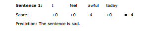

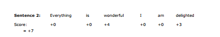

Prediction: The sentence is happy

That seems to work. All we have to do now is score all the words in the English language, and
we are done. But that is a lot of work. And how do we know we did a good job? These and
many other questions may arise in your head, such as the following:

1. How do we know the score of every single word?
2. The scores we came up with are based on our perception. How do we know these are
the good scores?
3. What if we have to build a sentiment analysis in a language that we don’t speak?
4. The sentences “I am not sad, I am happy.”, and “I am not happy, I am sad.” have
completely different sentiments, yet they have the exact same words, so they would
score the same, no matter the classifier. How do we account for this?
5. What happens with punctuation? What about sarcastic comments? What about the tone
of voice, time of the day, or the overall situation? Too many things to take into account,
aaahhh!

The answer to questions 1, 2, and 3, is the topic of this lab. We’ll introduce the
perceptron algorithm and use it to train a classifier over a set of data, which will give us scores
for each word. The scores of the words are those that best fit the given data, so we have
some confidence in their validity. Furthermore, since we are running an algorithm in a dataset,
we don’t need to speak the language. All we need is to know what words tend to appear more
in happy or sad sentences. Therefore, we can build sentiment analysis classifiers in every
language, as long as our data consists in a set of sentences with the sentiment specified. What
I mean by this is that our dataset has many sentences, and each sentence has a label
attached which says ‘happy’ or ‘sad’.
The answer to questions 4 and 5 is more complicated, and we won’t deal with it in this
lab. Our classifier will not take into account the order of words, punctuation, or any other
external features, and thus, it will make some mistakes. This is ok, the goal is to have a
classifier that is correct most of the time, and it is nearly impossible to have a classifier that is
always correct. And believe it or not, simple classifiers like this tend to do a good job in
general.

There are classifiers that take into account the order of the words, and they have great
performance. Of course, they require lots of data and more computational power. Although
they are out of the scope of this course, I recommend you to look at recurrent neural networks,
long short-term memory networks (LSTM), and hidden Markov models.
But before we delve into looking at data and building our classifiers, let me give you an
idea of how the perceptron algorithm works. The idea is to iterate many times and improve
our weights. Let’s start by assigning random scores to each word. And let’s say that our

classifier is terrible. For example, it gives the word ‘awful’ a score of +10. Then we bump into
the sentence “Awful!”, which is classified as sad. Our model classifies it as happy, since it
assigns it a score of +10. This sentence hints to us that the word ‘awful’ has been assigned a
score that is much higher than what it should. Therefore, we proceed to reduce the score of
the word ‘awful’ to, say, 9.9. It is a small step, but imagining picking a random sentence and
adjusting the scores of the words in it millions of times. You’d imagine that the word ‘awful’
appears in lots of sad sentences, and eventually its score will decrease to something negative.
It may increase a couple of times, since ‘awful’ may also appear on some happy sentences,
but for the most part, it will decrease. If we do this with all the words at the same time, it is
imaginable that one day we’ll have a good classifier.
Ok, time for us to get our hands dirty and build a classifier properly. First let’s start with a
simple dataset.


## 4.1 The problem: We are in an alien planet, and we don’t know their language!

Imagine the following scenario. We are astronauts and we have just landed on a distant
planet, where a race of unknown aliens lives. We would like to interact a bit with the aliens,
but for this, we feel like we need a system that will help us determine if any alien we
encounter is happy or sad. In other words, we need to build a sentiment analysis classifier. We
befriend four aliens, and we start observing their mood and listening to what they say. We
observe that two of them are happy, and two of them are sad. They also keep repeating the
same sentence over and over. They seem to only have two words in their language: “aack”,
and “beep”. This forms our dataset:

**Dataset:**

- Alien 1
    * Mood: Happy
    * Sentence: “Aack, aack, aack!”

- Alien 2:
    * Mood: Sad
    * Sentence: “Beep beep!”

- Alien 3:
    * Mood: Happy
    * Sentence: “Aack beep aackl!”

- Alien 4:
    * Mood: Sad
    * Sentence: “Aack beep beep beep!”

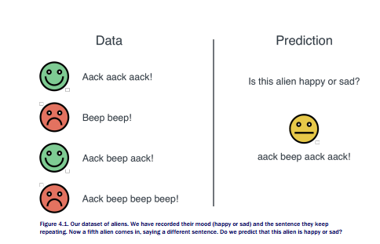

Now, a fifth alien comes in, and it says “Aack beep aack aack!”. But we have no idea of their
mood. What do we predict, that this alien is happy or sad?
If you said happy, then we are on the same page; I also think the alien is happy. The
reason is that, although I don’t know the language, it seems that the word ‘aack’ appears
more in happy sentences, while the word ‘beep’ appears more in sad sentences. In some way,
even if we don’t know the language, we can figure out that ‘aack’ probably means something
positive, like ‘joy’, ‘happy’, or ‘wonderful’, and ‘beep’ probably means something negative, like
‘sadness’, ‘despair’, or ‘awful’.

So our first classifier basically checks which word appears most, and decides the mood
from that. Let’s put that in formal terms.

**Simple sentiment analysis classifier** 

Count the number of appearances of ‘aack’ and ‘beep’. If there are more ‘aack’s, then the
alien is happy. If there are more ‘beep’s, then the alien is sad.
Notice that we didn’t specify what happens when the number of ‘aack’s is equal to the
number of ‘beep’s. This is ok, we can just say that the classifier is undecided. In the practice,
with lots of variables and words, it is very unlikely that a classifier is undecided, so we don’t
need to worry much about this. For the rest of this lab, by default, we’ll say that in this
case the classifier predicts that the alien is happy.


We can do something a bit more mathematical. Let’s assign a score to each word, as
follows.

**Mathematical sentiment analysis classifier**

The classifier is defined by some scores, and a rule, as follows:

**Scores:**

- Aack: 1 point

- Beep: -1 points

**Rule:**

Add the scores of all the words.

- If the score is positive or zero, predict that the alien is happy.

- If the score is negative, predict that the alien is sad.

In most situations, it is useful to plot our data, since sometimes nice patterns become visible.
In Table 4.1 we have our four aliens, as well as the number of times each said the words
‘aack’ and ‘beep’ and their mood.

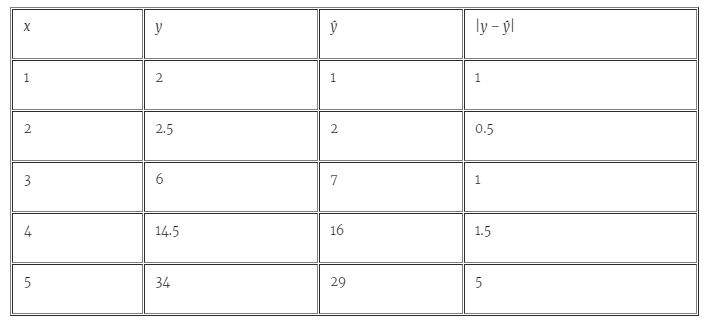

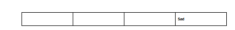

The plot will consist of two axes, the horizontal (x) axis and the vertical (y) axis. In the
horizontal axis we record the number of appearances of ‘aack’, and in the vertical axis the
appearances of ‘beep’. This plot can be seen in Figure 4.2.

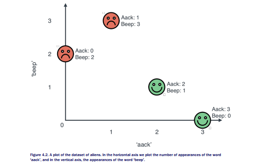

Note that in the plot in Figure 4.2, the happy aliens seem to be located on the bottom right,
while the sad aliens are in the top left. This is because the bottom right is the area where the
sentences have more aack’s than beep’s, and the top right area is the opposite. In fact, there
is a line dividing these two regions. It is precisely the line formed by all the sentences with the
same number of aack’s than beep’s, namely, the diagonal drawn in Figure 4.3. This diagonal
has the equation

Or equivalently, the equation

#aack - #beep = 0.

If you like equations with variables, this is simply the equation y=x, or equivalently, the
equation y-x=0. We also have two areas, as follows:

- The positive (happy) area, where the sentences have more aack’s than beep’s, with
equation #aack - #beep > 0.
- The negative (sad) area, where the sentences have more beep’s than aack’s, with
equation #aack - #beep < 0

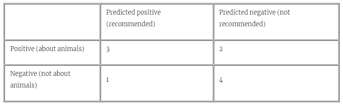

Thus, we can write our classifier as follows.

## Geometric sentiment analysis classifier

The classifier is defined by a line of equation #aack - #beep = 0, and a rule.

**Rule:**

- If the point is in the positive region of this line, with equation #aack - #beep > 0, or
over the line, then the alien is classified as happy.

- If the point is in the positive region of this line, with equation #aack - #beep < 0, then
the alien is classified as sad.

It is easy to tell that the three sentiment analysis classifiers are the exact same thing. It is
more a matter of preference if you prefer to count words, to add scores for words, or to plot
points and see which side of a line they are.

These three classifiers, which at heart are the same one, are examples of a perceptron.

**PERCEPTRON** A perceptron is a classification model which consists of a set of weights, or scores, one for
every feature, and a threshold. The perceptron multiplies each weight by its corresponding score, and adds
them, obtaining a score. If this score is greater than or equal to the threshold, then the perceptron returns a
‘yes’, or a ‘true’, or the value 1. If it is smaller, then it returns a ‘no’, or a ‘false’, or the value 0. In our case, the features are the words ‘aack’ and ‘beep’, the weights are the scores for each word (+1 and -1), and the
threshold is 0.

Now let’s look a slightly more complex example.

## 4.1.1 A slightly more complicated planet
Let’s say we’re done with the first planet, and we move to another one. In here, the aliens
speak a slightly more complicated language. This one still has two words: ‘crack’ and ‘doink’.
The dataset is the following (Table 4.2):

**Dataset:**

- Alien 1
    * Mood: Sad
    * Sentence: “Crack!”

- Alien 2:
    * Mood: Sad
    * Sentence: “Dunk.”

- Alien 3:
    * Mood: Sad
    * Sentence: “Crack dunk!”

- Alien 4:
    * Mood: Happy
    * Sentence: “Crack crack dunk dunk.

- Alien 5:
    * Mood: Happy
    * Sentence: “Crack dunk dunk crack crack!”

- Alien 6:
    * Mood: Happy
    * Sentence: “Dunk dunk crack dunk crack!”

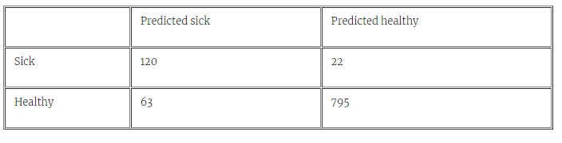

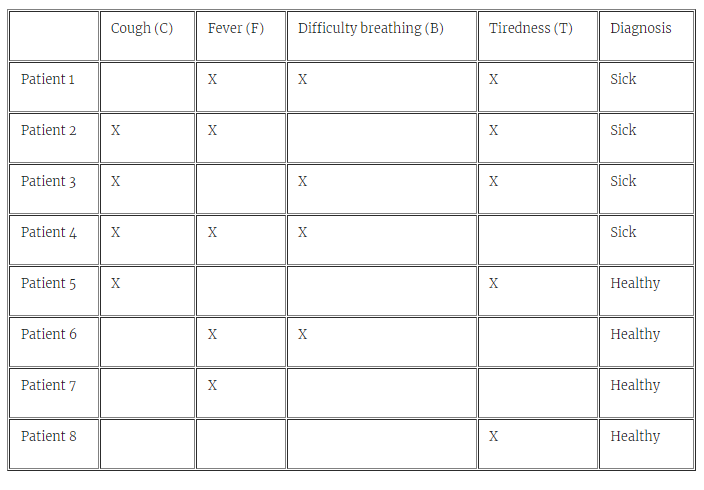

This one seems to be less obvious. First of all, would the words ‘crack’ and ‘dunk’ have
positive or negative scores? Namely, are they happy or sad words? From the first sentences,
they sound like sad words, since the aliens who only say ‘crack’ or ‘dunk’ are sad. However, if
they say words many times, they’re happy. It almost seems that the aliens who don’t talk
much are sad, and those who talk a lot are happy. Could this be the classifier? Let’s say that
that’s our first attempt at a classifier. Let’s count the words. The sad aliens said sentences
with 1, 1, and 2 words. The happy ones said sentences with 3, 4, and 5 words. There’s a rule!
If the alien said 4 words or more, then it is happy. If it said 3 words or less, then it is sad.
Let’s formalize this.

## Simple sentiment analysis classifier

If the number of words spoken by the alien is 4 or more, then the alien is happy. If it is less
than 3, the alien is sad.
But let’s put that into the same language as the previous classifier. In this case, we can
simply attach a score of 1 to each of the words. In our previous classifier, we needed the score
to be positive or zero for the alien to be happy, and negative for the alien to be sad. Now, it’s
a bit more complicated. Now, we can set a threshold of 3.5, and say: If the score of the
sentence is 3.5 or more, then the alien is happy. If it’s less than 3.5, then the alien is sad.
There’s nothing special about that 3.5, it could have been 3.8, or 3.1, but we picked the one
that is more in the middle. Now we have a more formal classifier.

## Mathematical sentiment analysis classifier

The classifier is defined by the scores, and a rule, as follows:

**Scores:**

- Aack: 1 point

- Beep: 1 points

**Rule:**

Add the scores of all the words.
- If the score is larger than or equal to 3.5, predict that the alien is happy.

- If the score is smaller than 3.5, predict that the alien is sad.

Notice that in the previous classifier, the threshold was 0, and in this one, it is 3.5. In some
places, you’ll see classifiers defined by scores and a threshold. However, it’s more common for
the threshold to be equal to zero. In this case, what we do is subtract the threshold from the
score. To be more formal, we introduce a score called the bias, which corresponds to no word,
it simply gets added to every sentence, and it is equal to the negative of the threshold. In this
case, our classifier becomes the following.

##Modified mathematical sentiment analysis classifier

The classifier is defined by the scores, a bias, and a rule, as follows:

**Scores:**

- Aack: 1 point

- Beep: 1 points

- Bias: -3.5 points

**Rule:**

Add the scores of all the words plus the bias.
- If the score is positive or 0, predict that the alien is happy.

- If the score is negative, predict that the alien is sad.

Thus, we can slightly modify our perceptron definition to the following:

**PERCEPTRON** A perceptron is a classification model which consists of a set of weights, or scores, and a
bias. The perceptron calculates a score by adding the products of the weights and scores, plus the bias. If this
score is greater than or equal to zero, the perceptron returns a ‘true’ or a value of 1. If the score is negative, the perceptron returns a ‘false’ or a value of 0.

In the previous example we interpreted our perceptron as a set of scores, and also as a line
that split some point sin the plane. Let’s do this again by plotting the happy and sad aliens
just like we did with the first example. We get the plot in Figure 4.4.

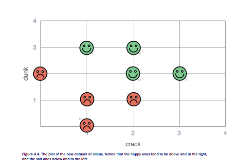

Again, our classifier will consist of a line that splits the happy and the sad faces. Many lines
work, and you may think of some that are equally good or better than mine, but I’ll use the
one I’ve drawn in Figure 4.5. This line consists of all the points where the sum of the
horizontal coordinate (number of ‘crack’s) and the vertical coordinate (number of ‘dunk’s) is
equal to 3.5. In other words, the equation of this line is:

```
#crack + #dunk = 3.5.
```

For convenience, we’ll write the equation as follows:

```
#crack + #dunk - 3.5 = 0.
```

In that way, we have our geometric interpretation of the perceptron.

## Geometric sentiment analysis classifier

The classifier is defined by a line of equation #crack + #dunk - 3.5 = 0, and a rule.

**Rule:**

- If the point is in the positive region of this line, with equation #crack - #dunk - 3.5 >
0, then the alien is classified as happy.

- If the point is in the positive region of this line, with equation #crack - #dunk - 3.5 <
0, then the alien is classified as sad.

Again, one can tell that the three sentiment analysis classifiers are the exact same thing.


Notice something interesting in Figure 4.5. The y-intercept, or the point in which the boundary
line meets the horizontal (y) axis is precisely 3.5. This is the threshold, or the negative of the
bias. This observation also has a mathematical and a logical meaning, as we’ll see in the next
section.

## 4.1.2 The bias, the y-intercept, and the inherent mood of a quiet alien
Well are we getting philosophical here? Why not! Let’s tackle a question that may have come
to your head now. What is the bias? Why would we add a number to the score of every
sentence, instead of simply adding the scores of the words? Well, in the second example, we
saw that only scoring the words is not enough, and a threshold was needed, which then
turned into the bias. But that doesn’t really answer the question.


A related question is, what happens when an alien says absolutely nothing. Is that alien
happy or sad? In the latest model, if an alien says nothing, then the score of the sentence is 0
(since there are no words) plus the bias, which is -3.5. This is a negative number, so the alien
is predicted to be sad. Therefore, we can see the bias as the inherent mood of the alien. This
mood plus the scores of the words, form the happiness score of the alien.

What if a model had a positive bias? Then an alien who says nothing would score
positively, and thus, the alien would be predicted as happy.
Can you help me think of two scenarios in sentiment analysis, one where the threshold is
positive, and one where it’s negative? Here’s what I can think, based on my experience, but
maybe you can find better examples!

- **Positive threshold (or negative bias):** This is a sentiment analysis model where
saying nothing is a sad sentence. I think that if we look at conversations between
humans when they bump into each other in the street, this model would work. Imagine
bumping into a friend of yours in the street, and they say nothing. I would imagine that
they’re pretty upset! This would mean that in this model, the threshold is positive,
since we need to say a few words and make sure the sentence gets a high score in
order to convey happiness.

- **Negative threshold (or positive bias):** This is a sentiment analysis model where
saying nothing is a happy sentence. I think of online reviews of products restaurants.
Normally when I’m happy with a product or a service, I give the place 5 stars, and I
don’t find the need to elaborate on a comment. But when I’m very upset, I give it 1
star and I write a long review of why I’m upset. Maybe this is just me, but I feel (and
looked at data), and noticed that many people are like that. In this case, if we were to
train a model on these type of customer comments, I imagine the threshold in this
model would be negative.

As we saw at the end of the previous section, the bias is the negative of the y-intercept. What
does this mean? Well, let’s think graphically. If the boundary line is above the origin (the point
with coordinates (0,0)), then the origin is in the sad region. If it is above, the point is in the
happy region. The point with coordinates (0,0) is precisely the point corresponding to the
sentence with no words. This is illustrated in Figure 4.6.

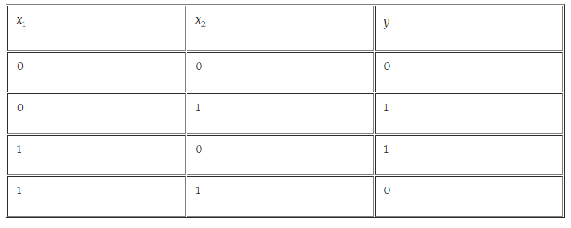

## 4.1.3 More general cases

We’ve figured out classifiers look in a language with two words, they basically look like one of
the following two:

1. **Mathematical classifier:** A score attached to each of the words, plus a bias score that
we add to every sentence. If the sentence scores positive (or 0), it is classified as
happy, and if it scores negative, it is classified as sad.

2. **Geometric classifier:** A line that splits two kinds of points in the plane. A sentence
corresponding to a point above (or over) the line is classified as happy, and one below
the line is classified as negative.

A general case will look more complicated than what we’ve seen so far. We could have positive
and negative coordinates, coordinates that are not integers, etc. Even more, it’s not very likely
that one line will be able to split all the points. We could have an arrangement of points such
as Figure 4.7.

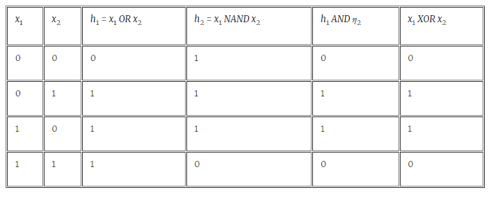

For this dataset, we need to find the line that best splits it, even if it makes some mistakes.
Figure 4.8 shows a possible solution. This solution only makes three mistakes, since it
mistakenly classifies two sad aliens as happy, and one happy alien as sad.

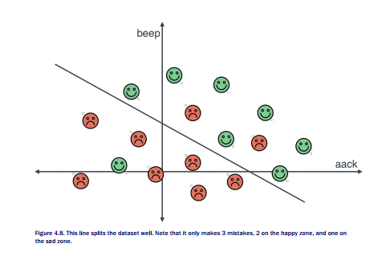

This line could have any equation. Since the coordinates are the number of appearances of
‘aack’ and ‘beep’, the equation could be, for example:

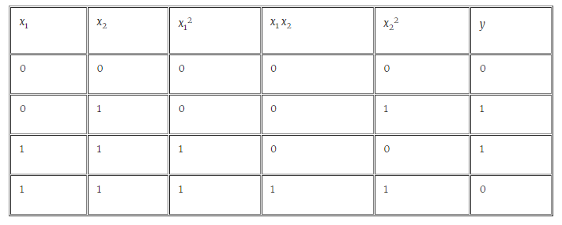

This means our classifier assigns 1.9 points to the first word (‘aack’), 3.1 points to the second
word (‘beep’), and the threshold is 2.2.
Also, as you can imagine, alphabets can have many more than two words. Let’s look at
what happens then.

## ALPHABETS WITH 3 WORDS

Let’s say that we have a classifier with three words, ‘aack’, ‘beep’, and ‘crack’. Now we can’t
draw it in 2 dimensions, but we can switch to 3. We have 3 axes, one for each word, and the
points will be floating in space. For example, a sentence with the word ‘aack’ appearing 5
times, the word ‘beep’ appearing once, and the word ‘crack’ appearing 8 times, will be at the
point with coordinates (5, 1, 8). This is illustrated in Figure 4.9.

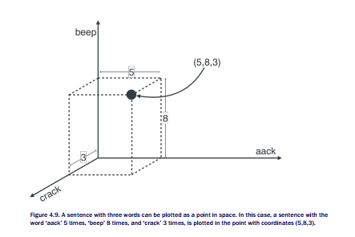

In this case, a dataset could look like Figure 4.10.

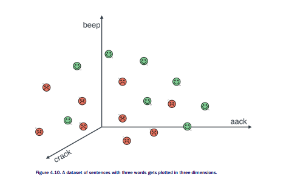

How would a classifier look on this dataset? It wouldn’t be a line any more, because the points
are in space. It would be a plane that cuts the space in two, trying its best to leave all the
happy points on one side, and the sad points on the other side. A good separating plane looks
like the one in Figure 4.11.

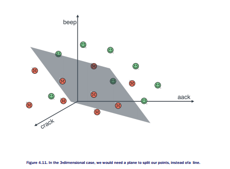

Now, how does the equation of a plane look? If the equation of a line looked like a linear
combination of the two words plus a bias

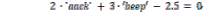

then the equation of a plane looks exactly the same, except with 3 words instead of 2.


This classifier above assigns the following scores to the words:

- ‘Aack’: 2 points

- ‘Beep’: -3 points

- ‘Crack’: 1 point.

- Threshold: 2.5 points.

What does this mean? Well, for once, we can see that ‘aack’ is a pretty happy word, ‘crack’ is
a happy word since its weight is 2, (although not as happy as ‘aack’, with weight 1) and ‘beep’
is a very sad word with weight -3. Furthermore, the threshold is 2.5, so an alien that is quiet
is inherently sad.

## ALPHABETS WITH MANY WORDS

What if our alphabet has more than 3 words. What if it has thousands of words? Now we can’t
visualize it, because unfortunately humans can only see in 3 dimensions (although if you want
to imagine happy and sad faces living in a 1000-dimensional universe, that’s how it would
look!). However, we can still look at the classifier as a set of scores. For example, if we were
to run a classifier on the English language, with thousands of words, we could end up with
something as follows:

**Scores:**

- A: 0.1 points

- Aardvark: 1.2 points

- Aargh: -4 points

- …

- Zygote: 0.4 points.

**Threshold:**

- 2.3 points.

Ok, now a question is, how do we come up with these scores and this threshold? And even for
the simpler classifiers, how do we come up with the scores of ‘aack’ and ‘beep’? In other
words, how do we draw a line, or a plane, that splits happy and sad points in the best possible
way? This is what I’ll explain in the remainder of the lab. I will show you two very similar
ways of doing this called the perceptron algorithm and logistic regression.

## 4.2 How do we determine if a classifier is good or bad? The error function

The 1 million dollar question here is: How do we find these classifiers? We need to find an
algorithm, or a sequence of steps, which receives as input a dataset of sentences with ‘happy’
and ‘sad’ labels attached to them, and returns a set of scores for each of the words, plus a
threshold. This will be done in a similar way as we did for regression in lab three, namely:

1. Start with a set of random scores, and a random threshold.
2. Take a step to improve these scores just a little bit.
3. Repeat step 2 many times.
4. Enjoy your classifier!

But before this, we’ll come up with a way to quantify how good our classifier is. This way is
called an error function. If we have a two classifiers, a good one and a bad one, the error
function will assign the first (good) classifier a small number, and the second (bad) classifier a
high number.

First, let’s start with the error function.


## 4.2.1 How to compare classifiers? The error function

Let me give you two classifiers, one good one and one bad one, and you can help me assign
each one an error score. We’ll represent them as a line that tries to separate happy and sad
points in the plane as best as possible. Since classifiers specifically predict a point as happy or
sad, we’ll actually specify which side of the line corresponds to either happy or sad points. The
two classifiers are in Figure 4.12.

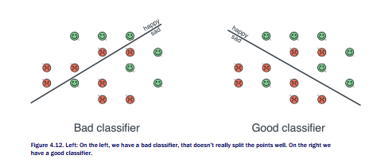

## ERROR FUNCTION 1: NUMBER OF ERRORS

Here’s an idea, the error of a classifier is the number of points it classifies incorrectly. In summary, the way we calculate this error is as follows:

- Points that are correctly misclassified produce an error of 0.

- Points that are misclassified produce an error equal to the distance from that point to
the line.

In this case, the bad classifier has an error of 8, since it erroneously predicts 4 happy points
as sad, and 4 sad points as happy. The good classifier has an error of 3, since it erroneously
predicts 1 happy point as sad, and 2 sad points as happy. This is illustrated in Figure 4.13.

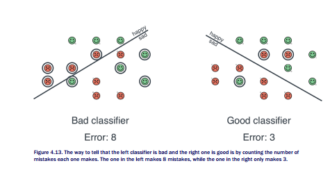

This is a good error function. But it’s not a perfect error function. We want one that tells us a
lot about the classifier, and counting the number of errors is not descriptive enough. In
particular, it treats all errors equally, when normally this is not the case. A misclassified point
can be close to being correctly classified, or horribly misclassified, and this error function will
treat them equally. Think about this, if a classifier has a threshold of, say, 4, and a sad
sentence scores 4.1, then the classifier predicts it as happy, since its score is higher than the
threshold. The model made a mistake, but not as bad a mistake as it given the sentence a
score of 100. These two mistakes should be treated differently. Graphically, a point that is
misclassified, though not very badly, is a point which is on the wrong side of the line, but close
to the line. In contrast, a point that is badly misclassified is also on the wrong side of the line,
but it is very far from it. Figure 4.14 shows two sad points that are incorrectly classified as
happy. The one on the left is not very badly misclassified, while the one on the right is badly
misclassified. However, our error function counts both of them as one error.

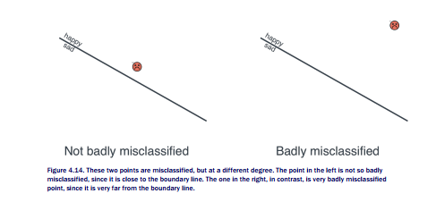

We would like to assign a small error to the point in the left, and large error to the point in
the right, in Figure 4.14. Any ideas?

## ERROR FUNCTION 2: DISTANCE

In Figure 4.15, what tells the two points apart is that the one in the left is close to the line,
while the one in the right is far from the line. Therefore, if we simply consider the distance
from the point to the line, we have a very good error function.

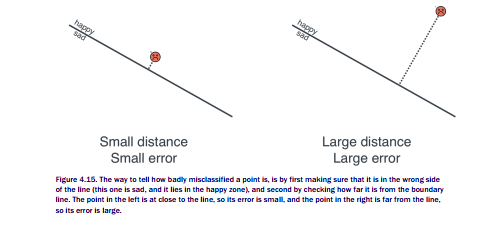


This is a much better error function. In summary, what this error function does is the
following:

- Points that are correctly misclassified produce an error of 0.

- Points that are misclassified produce an error equal to the distance from that point to
the line.

Let’s go back to the good and the bad classifier. The way we calculate the errors is by adding
the error corresponding to every point. This means that we only look at the misclassified
points, and we add the perpendicular distances from these points to the line. Notice that the
bad classifier has a large error, while the good classifier has a small error.

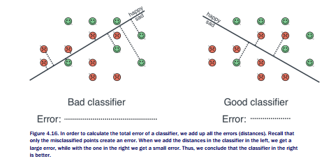

So this is a good error function. Is it the one we’ll use? Unfortunately no, it misses one thing:
it is too complex. Let’s think mathematically, how does one calculate a distance? One uses the
Pythagorean theorem. The Pythagorean theorem has a square root. Square roots have an ugly
derivative. It turns out that in our calculations, having an ugly derivative will complicate things
unnecessarily. However, there is a nice fix to this. We’ll come up with a similar, yet slightly
different error function, which will capture the essence of the distance, but which fits our
calculations very well.


## ERROR FUNCTION 3: SCORE

Recall that classifiers can be thought of both geometrically and mathematically. In order to
construct this error function, we’ll use the mathematical definition. Let’s say that our classifier
has the following scores and threshold:

## Scores:

- ‘Aack’: 1 pt.

- ‘Beep’: 2 pts.

- **Bias:** -4 pts.

The classifier looks like Figure 4.17., where the score of each sentence is #aack + 2#beep.
The boundary line is where this score is 0, the happy zone is where this score is positive, and
the sad zone is where this score is negative.

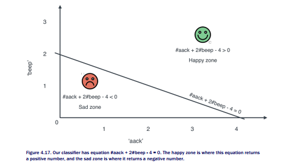

Now, let’s say that we have two points misclassified by this classifier. They will be the
following two sad sentences:

- Sentence 1: “Aack aack aack beep.”

- Sentence 2: “Aack aack aack aack beep beep beep.”


Since the horizontal coordinate is the number of appearances of the word ‘aack’, and the
vertical coordinate is the number of appearances of the word ‘beep’, then Sentence 1 is in
position (3,1), and Sentence 2 in position (4,3).

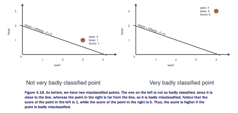

Furthermore, the scores are the following:

- Sentence 1, coordinates (3,1):

    * Score =#aack + 2#beep - 4 = 1.

- Sentence 2, coordinates (4,3):

    * Score = #aack + 2#beep - 4 = 6

Notice that Sentence 1 is badly misclassified, although only by a little bit. However, Sentence
2 is very badly misclassified. Therefore, the score is a good measure of the error for a
misclassified point. We’ll take that as our error function.

What if we have happy points misclassified, would the story be the same? Almost. Let’s
say we have the following two sentences, that are happy:

- Sentence 3: “”

- Sentence 4: “Aack aack beep.”

Sentence 1 is the empty sentence, it corresponds to an alien who said nothing. Let’s evaluate
the scores of these sentences.

- Sentence 3, coordinates (0,0):

    * Score =#aack + 2#beep - 4 = -4.

- Sentence 4, coordinates (1,1):

    * Score = #aack + 2#beep - 4 = -1

In this case, as you can see in Figure 4.19, Sentence 3 is very badly misclassified, while
Sentence 4 is misclassified, but not as badly, since it is much closer to the boundary line.


Here, the badly classified point has a score of -4, and the not very badly misclassified point
has a score of -1. Therefore, a sensible error for these points are 4 and 1, respectively. This
means, if the point is labelled ‘happy’ and it is misclassified, we should take its error to be the
negative of the score.
In other words, the error is defined as follows:

- If the point is correctly classified:
    * Error = 0

- Else, if the point is incorrectly classified:

    * If the point has a positive label, and the prediction is negative:
        * Error = -Score

    * Else, if the point has a negative label, and the prediction is positive:
        *  Error = Score.

But this can be made even simpler. Notice that if a point has a positive label, but it’s predicted
negative, then its score must be negative. Likewise, if a point has a negative label, but it’s
predicted positive, then its score must be positive. In both cases, we end up with the error


being the absolute value of the score, since an error should always be positive or zero.
Therefore, the definition of error is the following:

**Perceptron error**

- If the point is correctly classified:

    * Error = 0

` Else, if the point is incorrectly classified:

    * Error = |Score|


## Example

Let’s do an example of two classifiers with different errors. Our dataset is the following four
sentences:

- **Sentence 1** (sad): “Aack.”

- **Sentence 2** (happy): “Beep.”

- **Sentence 3** (happy): “Aack beep beep beep.”

- **Sentence 4** (sad): “Aack beep beep aack aack.”

And we’ll compare the following two classifiers:

**Classifier 1:** #aack + 2#beep - 4

**Classifier 2:** -#aack + #beep = 0

The points and the classifiers can be seen in Figure 4.20.

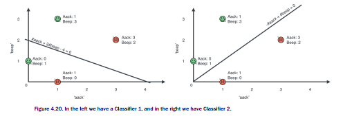

## Calculation of error for Classifier 1:

Notice that Classifier 1 classifies them as follows:

- Sentence 1:

    * Coordinates = (1,0)
    * Score = #aack + 2#beep - 4 = -3
    * Prediction: Sad

- Sentence 2:

    * Coordinates = (0,2)
    * Score = #aack + 2#beep - 4 = -2
    * Prediction: Sad

- Sentence 3:

    * Coordinates = (1,3)
    * Score = #aack + 2#beep - 4 = 3
    * Prediction: Happy

- Sentence 4:

    * Coordinates = (3,2)
    * Score = #aack + 2#beep - 4 = 3
    * Prediction: Happy

Now on to calculate the errors. Since sentences 1 and 3 are correctly classified, they produce
0 error. Sentences 2 and 4 are incorrectly classified, so they produce an error. Sentence 2 has
a score of -2, so its error is 2. Sentence 4 has a score of 3, so its error is 3. In summary:

- Sentence 1:

    * Correctly classified
    * Score = -3
    * Error = 0

- Sentence 2:

    * Incorrectly classified
    * Score = -2
    * Error = 2

- Sentence 3:

    * Correctly classified
    * Score = 3
    * Error = 0

- Sentence 4:

    * Incorrectly classified
    * Score = 3
    * Error = 3

The total error for Classifier 1 is the sum of errors, which is 0+2+0+3 = 5.

## Calculation of error for Classifier 1:

This one is much easier. Notice that Classifier 2 classifies every point correctly. To verify this,
notice that:

- Sentence 1 (sad):
    * Coordinates = (1,0)
    * Score = -#aack + #beep = -1
    * Prediction: Sad

- Sentence 2 (happy):

    * Coordinates = (0,2)
    * Score = -#aack + #beep = 2
    * Prediction: Happy

- Sentence 3 (happy):

    * Coordinates = (1,3)
    * Score = -#aack + #beep = 2
    * Prediction: Happy

- Sentence 4 (sad):

    * Coordinates = (3,2)
    * Score = -#aack + #beep = -1
    * Prediction: Sad

Therefore, all points, being correctly classified, produce an error of zero. Thus, the total error
is zero.
We then conclude that Classifier 2 is better than Classifier 1. The summary of these
calculations is in Figure 4.21.

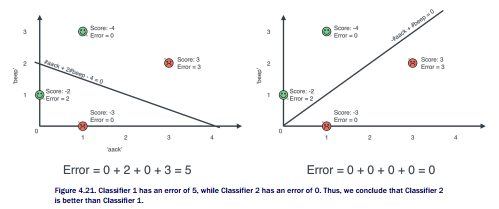

Now that we know how to compare classifiers, let’s move on to finding the best one of them,
or at least, a pretty good one.

## 4.3 How to find a good classifier? The perceptron algorithm

In order to build a good classifier, we’ll follow a very similar approach as we followed with
linear regression on Lab 3. We start with a random classifier, and slowly improve it until
we have a good one. We’ll also use the error to tell us when it’s okay to stop improving it.
Here is some pseudocode of how the algorithm looks. You’ll find it very similar to the linear
regression algorithm in Lab 3.

**Pseudocode for the perceptron algorithm:**

- Begin with a random classifier

- Loop many times:

    * Improve the algorithm a small amount

Output a good classifier.

By now, your head may be full of questions, such as the following:

1. What do we mean by making the classifier a little better?
2. How do we know this algorithm gives us a good classifier?
3. How many times do we run the loop?
The answers to all these questions are in the next few sections. Let’s begin with question 1:
What do we mean by making the classifier a little better? This is what we call the perceptron
trick.

## 4.3.1 The perceptron trick

The perceptron trick is a tiny step that helps us go from a classifier, to a slightly better
classifier. We’ll actually take a less ambitious step. Like in Lab 3, we’ll only focus on one
point, and ask the question: “How can I make this classifier a little bit better for this one
point?

We’ll take a slightly arbitrary approach (if you don’t like it and have ideas to improve it,
you’ll really enjoy the later parts of this lab!). The arbitrary step is the following:

- If the point is correctly classified, we won’t touch the classifier. It’s good as it is.

- If the point is misclassified, we will move the line a slight amount towards the point.
Why? Because if the point is in the wrong side of the line, then we’d actually like the
line to move over the point, putting it in the correct side. Since we only want to make
small steps, moving the line slightly towards the point is a good start.

Figure 4.22 summarizes our arbitrary step. We’ll call this the perceptron trick.

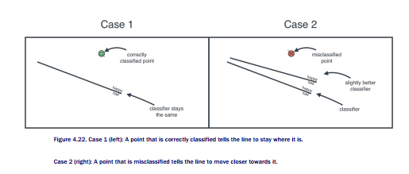

Now the question is, how much do we move the line? Like all we do in machine learning we’ll
move it a very tiny amount. Since we repeat this algorithm many times, the line will
eventually make significant moves. The way we control the size of the step is, like in Lab
3, with a learning rate. We pick a very small number for our learning rate. For the duration of
this lab, let’s pick 0.01.

Let’s focus on the case when a point is misclassified, and see how much we need to change
the weights in order to move the line. We look at an example. Our classifier is the same as
before, in which the scores of the words ‘aack’ and ‘beep’ are both 1, and the bias is -4 (which
means the threshold is 4). Therefore, the equation for the score of a sentence is
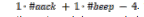

When the score is positive or zero, the classifier predicts that
the sentence is happy, and when it’s negative it predicts that the sentence is sad.

In other words, our classifier, called the ‘OK Classifier’ is defined by the following scores:

**OK Classifier**

- ‘Aack’: 1 point

- ‘Beep’: 1 point

- Bias: -4 points.

Now, let’s pick a misclassified point. Let’s pick the following sentence:

- **Sentence 1 (sad)**: ‘Aack beep beep beep aack beep beep!’.

Why is this a misclassified point? To start, the sentence comes with a sad label. But it contains
the word ‘aack’ 2 times and ‘beep’ 5 times, so its score is 2+5-4, which is 3. Since 3 is
positive, the sentence gets classified as happy. Since it is labelled sad, then the OK Classifier
misclassifies it. Furthermore, the error, as we’ve defined it above, is equal to the score, which
is 3.

Let’s try to build a classifier called “Better Classifier”, which may still misclassify the point,
but with a smaller error. We’ll do the following (again slightly arbitrary) step. We want to
decrease the error, which is equal to the score of the sentence. Therefore, we need to reduce
the score of the sentence by a small amount. The score is the sum of the scores of the words
plus the bias, so we simply reduce all these a small amount. We’ll do the following,
remembering that the learning rate we’re using in this lab is 0.01:

- Since the word ‘aack’ appears twice, we’ll reduce its score by two times the learning
rate, or 0.02.

- Since the word ‘beep’ appears five times, we’ll reduce its score by five times the
learning rate, or 0.05.

- Since the bias only adds to the score once, we reduce the bias by the learning rate, or
0.01.

We obtain the following classifier.

**Better Classifier 1**

- ‘Aack’: 0.98 points

- ‘Beep’: 0.95 points

- Bias: -4.01 points.

Now, what is the score that the Better Classifier gives this sentence? It is


We did it! The Better Classifier has a smaller score on this sentence than the OK Classifier. It
hasn’t improved by much, but imagine doing this step many times, always picking some point
in our set. Some steps may mislead us, but the majority will take us closer to at least some
misclassified point, thus improving our classifier on average.
But why the logic of decreasing the score of ‘aack’ only by 0.02 and the score of ‘beep’ by
0.05? Well, since beep appears much more than ‘aack’ in the sentence, we can assume that
the score of ‘beep’ is more crucial to our score, and needs to be decreased more. In reality,
these numbers come out of calculating a derivative in a step called gradient descent. If you’re
curious and want to look at the calculus, it is all in the Appendix at the end of the course.
Now, that was for a sad sentence that got classified as happy. What about the opposite?
Let’s say we again have the Ok Classifier, and the following sentence:

- **Sentence 2 (happy):** ‘Aack.’

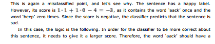

higher score, and the bias should also be higher. The word ‘beep’ is irrelevant here. Since the
word ‘aack’ appears once, we’ll increase it by one times the learning rate. We’ll also increase
the bias by the learning rate. We get the following classifier:

**Better Classifier 2**

- ‘Aack’: 1.01 points

- ‘Beep’: 1 point

- Bias: -3.99 points.

Let’s summarize these two cases and obtain the pseudocode for the perceptron trick.

**Perceptron trick (pseudocode):**

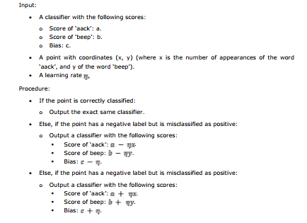

## 4.4 Repeating the perceptron trick many times: The perceptron algorithm

The perceptron trick takes one point, one line, and modifies the line a little bit (or not at all),
in order for that line to be a better fit for the point. Now we need to use this trick to find the


best line that will separate two classes of points. How do we do this? Simple, by repeating the
perceptron trick many times. Allow me to elaborate.
Let’s begin with a random line, that may not be the best fit for our points. If each point
had its own way, it would tell the line what to do to be equally or better classified. Points that
are correctly classified tell the line to stay where it is, and points that are misclassified tell the
line to move a little closer. This is illustrated in Figure 4.23.

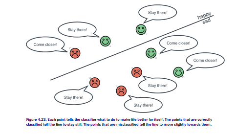

Now, the line will simply pick one of them at random, and do what the point says. If it picks a
correctly classified point, then nothing changes, but if it picks an incorrectly classified one,
then the line moves in order to provide a better for that point (Figure 4.24). It may become a
worse fit for other points, but that doesn’t matter.

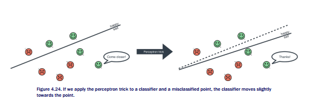

It is imaginable that if we were to repeat this process many times, eventually we will get to a
good solution. If you are a bit reluctant to believe this, you are right to do so, this procedure
doesn’t always get us to the best solution. But in a majority of the situations, it gets us to a
very good solution, and this has been verified in practice. Since we can run algorithms many
times and compare solutions, then an algorithm that works pretty well most of the time, will
actually do the job. We call this the perceptron algorithm.

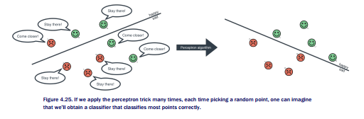

The number of times we run the algorithm is the number of epochs. Therefore, this algorithm
has two hyperparameters: The number of epochs, and the learning rate. The following is the
pseudocode of the perceptron algorithm.

**Perceptron algorithm (pseudocode):**

Input:

- A dataset of points, where every point has a positive or negative label.

- A number of epochs, n.

- A learning rate

**Procedure:**

- Start with a random line. In other words, start with random values for the score of each
word, and the bias.

- Repeat the following procedure n times:

    * Pick a random point.

    * Apply the perceptron trick to the point and the line. In other words, if the point is
well classified, do nothing, and if it is misclassified, move the line a little bit closer
to the point 

` Enjoy your well fitted line!

Since the correctly classified points want the line to stay where it is, and the incorrectly
classified points want it to move closer to them, we can imagine the points yelling at the line
as in the left part of Figure 4.25. The line will simply pick one of them at random, and do what
this point says. This process gets repeated many times until we have a good line that
separates the points well.
Now the question, how many times should we run this procedure of picking a random point
and adjusting the line to fit this point better? There are several different criteria to figure out
how many times to run it, such as the following:

- Run the algorithm a fixed number of times, which could be based on our computing
power, or the amount of time we have.

- Run the algorithm until the error is lower than a certain threshold we set beforehand.

- Run the algorithm until the error doesn’t change significantly for a certain amount of
time.

Normally, if we have the computing power, it’s ok to run it many more times than needed,
since once we have a well-fitted line, it won’t move very much. In the following section we’ll
code the perceptron algorithm, and analyze it by measuring the error in each step, so we’ll get
a better idea of when to stop running it.

## 4.5 Coding the perceptron algorithm
Ok, ready to get our hands dirty and code the perceptron algorithm? Here we go. We’ll test it on the following dataset.

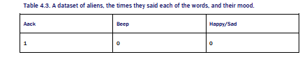


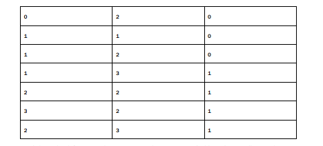


Let’s begin by defining our dataset as a Pandas DataFrame (Table 4.3). We call X our dataset
of sentences, where each sentence is encoded by the number of appearances of ‘aack’ and
‘beep’. The set of labels is called y, where we denote the happy sentences by 1 and the sad
ones by 0.

```
import pandas as pd
X = pd.DataFrame([[1,0],[0,2],[1,1],[1,2],[1,3],[2,2],[3,2],[2,3]])
y = pd.Series([0,0,0,0,1,1,1,1])
```

This gives us the plot on Figure 3.x. In this figure, the happy sentences are triangles and the
sad ones are squares

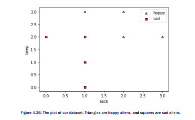


## 4.5.1 Coding the perceptron trick

In order to code the perceptron trick, let’s define some notation that can be used in general,
with languages of as many words as we want. Say we have a language of n words. The
features are the number of times each word appears, and they are denoted as follows.

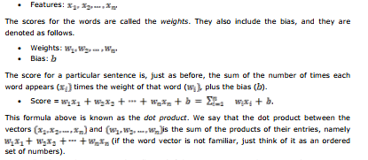


Finally, the prediction is simply 1 (happy) if the score is greater than or equal to zero, or 0
(sad) if the score is less than zero

Let’s begin by coding the score function and the prediction. Both receive as input, the
weights of the model and the bias, and the features of one data point. The score function

returns the score that the model gives to that data point, and the prediction function returns a
1 if the score is greater than or equal to zero, and a 0 if the score is less than zero.

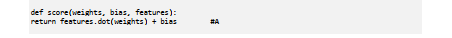

#A This function calculates the dot product between the weights and the features, and adds the bias.

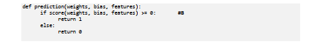

#B This function looks at the score, and if it is positive or zero, it returns 1. If it is negative, it returns 0.

It’s also useful to code the error function for one point. Recall that the error is zero if the point
is correctly classified, and the absolute value of the score if the point is misclassified. This
function takes as input the weights and bias of the model, and the features and label of one
data point.
 
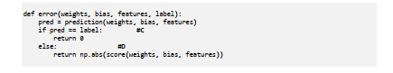

#C If the prediction is equal to the label, then the point is well classified, which means the error is zero.

#D If the prediction is different than the label, then the point is misclassified, which means the error is equal to the
absolute value of the score.

We now write a function that adds the errors of all the points in our dataset.

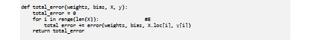

#E We loop through our data, and for each point, we add the error at that point. We then return this error.

Now that we have the error function, we can go ahead and code the perceptron trick. Recall
that the perceptron trick checks if the point is correctly classified. If it is, then it does nothing.
If it is misclassified, then it adds


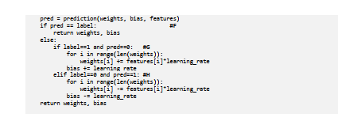

#F If the prediction ie equal to the label, the point is correctly classified and we don’t need to update the model.
#G If the prediction is negative and the label is positive, then we increase the weights and label in the model.
#H If the prediction is positive and the label is negative, then we decrease the weights and label in the model.

There is a small shortcut we can use here. Notice that the difference between the label and
the prediction (namely label-pred) is 0 when they’re equal, +1 when the label is positive and
the prediction is negative, and -1 when the label is negative and the prediction is positive. This
helps simplify our code in the perceptron trick by using this quantity to remove the if
statement as follows.

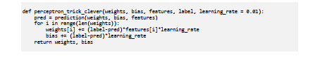

The functions perceptron_trick and perceptron_trick_clever do the exact same job, so it doesn’t matter which one we use. However, later in this lab when we study logistic regression, the function perceptron_trick_clever will be much more useful.
Now, recall that for the perceptron algorithm all we need to do is repeat the perceptron trick many times (as many as the number of epochs). For convenience, we’ll also keep track of
the errors at each epoch. As inputs, we not only have the data (features and labels), we also
have the learning rate which we default to 0.01, and the number of epochs which we default
to 200. Here is the code for the perceptron algorithm.

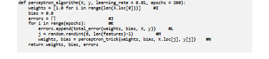


#I Initialize the weights to 1 and the bias to 0. Feel free to initialize them to small random numbers if you prefer.
#J An array to store the errors.
#K Repeat the process as many times as the number of epochs.
#L Calculate the error and store it.
#M Pick a random point in our dataset.
#N Apply the perceptron algorithm to update the weights and the bias of our model based on that point.

Now, let’s run the algorithm on our dataset! Below I show you the plots of the data. I have
removed the plotting lines from here, but you can find them in the repo.

```
perceptron_algorithm(X, y)
```

The answer I got for the weights and bias was the following:

- Weight of ‘aack’: 0.52

- Weight of ‘beep’: 0.05

- Bias: -0.66

If you got a different answer than me, this is ok, since there was randomness in our choice of
points inside the algorithm. In the repo I have set the random seed to zero, so feel free to
look at that if you’d like to obtain the same answer as I did.
Figure 4.27 has two plots. At the left is the line fit, and at the right is the error function.
Notice that the line fits the data pretty well, and the error decreases (mostly) as we increase
the number of epochs.

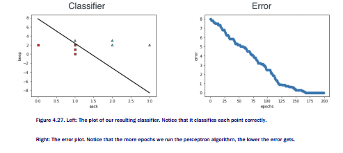

Let’s see how the classifier improved in each epoch. Figure 4.28 has a plot of each of the 200
classifiers obtained, one per epoch. Notice how we start with a bad line fit, but each iteration
gets us closer and closer to separating the points well, until we get to a good classifier.

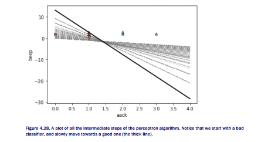

That’s it, that’s the perceptron classifier! In the next section we learn a slight variation of it
called logistic regression, in which the predictions are not as drastic as happy/sad.


#### Exercises


##### Exercise 4.1

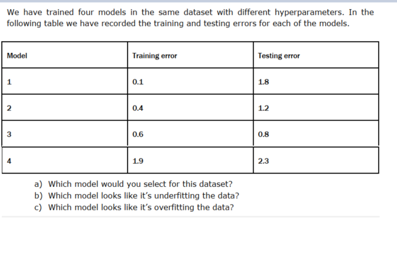


##### Exercise 4.2

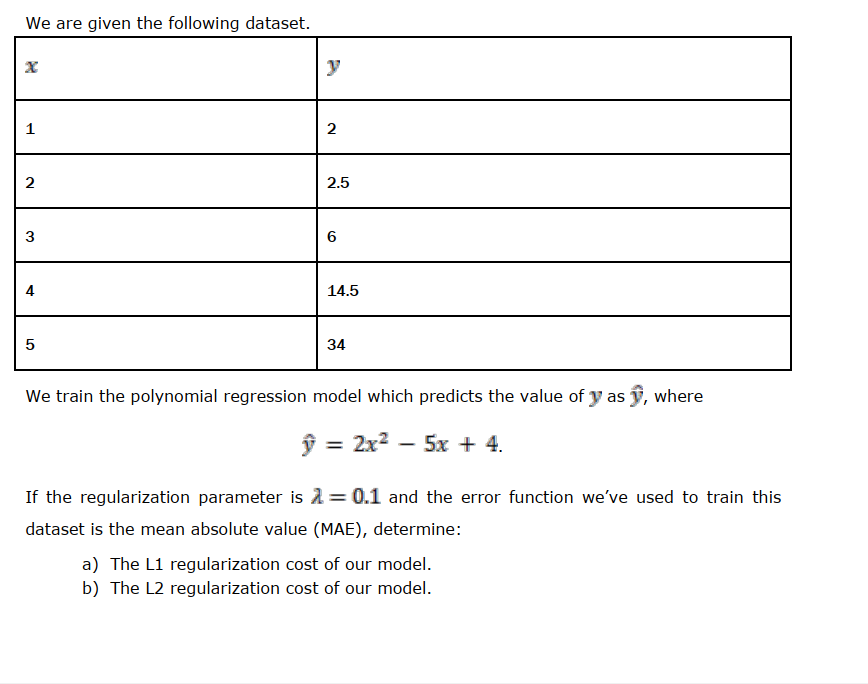

