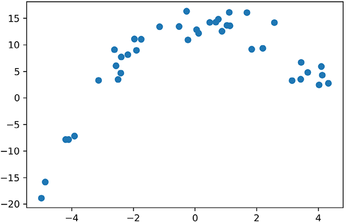
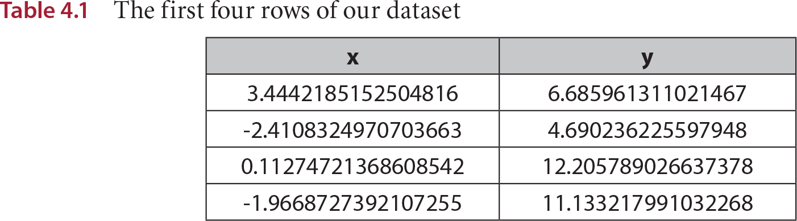
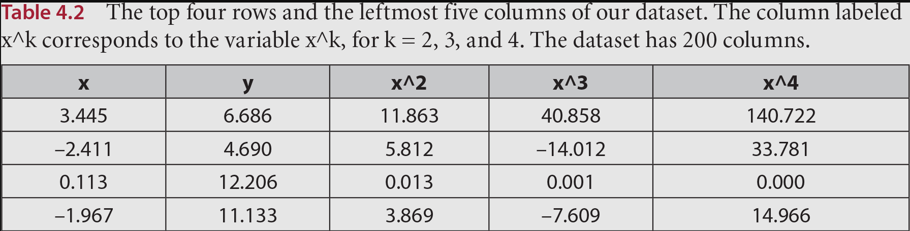
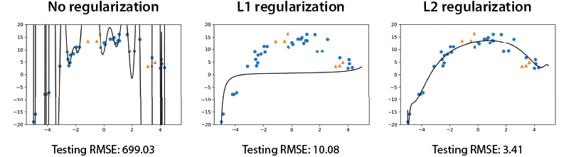
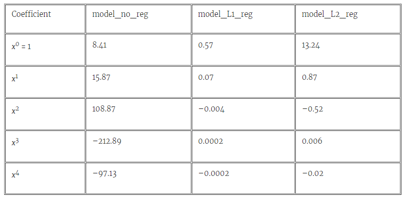
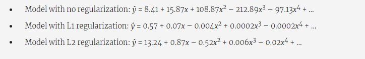
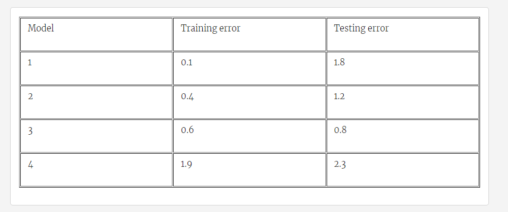
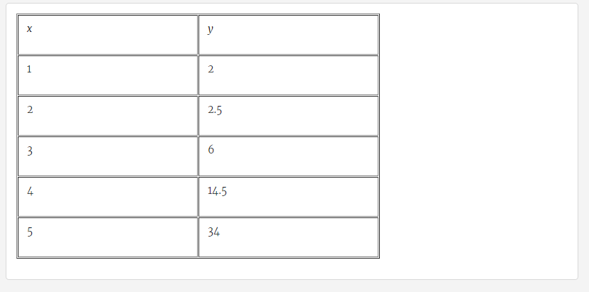
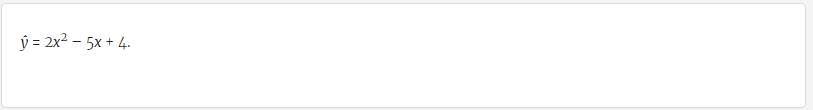

Lab 4: Optimizing the training process: Underfitting, overfitting, testing, and regularization
==============================================================================================

### In this lab

- what is underfitting and overfitting
- some solutions for avoiding overfitting: testing, the model
    complexity graph, and regularization
- calculating the complexity of the model using the L1 and L2 norms
- picking the best model in terms of performance and complexity


Polynomial regression, testing, and regularization with Turi Create
--------------------------------------------------------------------


In this section, we see an example of polynomial regression with
regularization in Turi Create. Here is the code for this section:


- **Notebook**:
    -   <https://github.com/fenago/machine-learning/blob/master/Lab_4_Testing_Overfitting_Underfitting/Polynomial_regression_regularization.ipynb>


We start with our dataset, which is illustrated in figure 4.8. We can
see the curve that best fits this data is a parabola that opens downward
(a sad face). Therefore, it is not a problem we can solve with linear
regression --- we must use polynomial regression. The dataset is stored in
an SFrame called `data`, and the first few rows are shown in table 4.1.







The way to do polynomial regression in Turi Create is to add many columns to our dataset, corresponding to the powers of the main feature, and to apply linear regression to this expanded dataset. If the main feature is, say, x, then we add columns with the values of x2, x3, x4, and so on. Thus, our model is finding linear combinations of the powers of x, which are precisely polynomials in x. If the SFrame containing our data is called data, we use the following code to add columns for powers up to x199. The first few rows and columns of the resulting dataset appear in table below.


```
for i in range(2,200):
    string = 'x^'+str(i)
    data[string] = data['x'].apply(lambda x:x**i)
```




Now,
we apply linear regression to this large dataset with 200 columns.
Notice that a linear regression model in this dataset looks like a
linear combination of the variables in the columns. But because each
column corresponds to a monomial, then the model obtained looks like a
polynomial on the variable *x*.


Before we train any models, we need to split the data into training and
testing datasets, using the following line of code:


```
train, test = data.random_split(.8)
```


Now our dataset is split into two datasets, the training set called
*train* and the testing set called *test*. In the repository, a random
seed is specified, so we always get the same results, although this is
not necessary in practice.


The way to use regularization in Turi Create is simple: all we need to
do is specify the parameters `l1_penalty``` and `l2_penalty``` in the
`create`
method
when we train the model. This penalty is precisely the regularization
parameter we introduced in the section "Regulating the amount of
performance and complexity in our model." A penalty of 0 means we are
not using regularization. Thus, we will train three different models
with the following parameters:


- No regularization model:
    -   `l1_penalty=0`
    -   `l2_penalty=0`
- L1 regularization model:
    -   `l1_penalty=0.1`
    -   `l2_penalty=0`
- L2 regularization model:
    -   `l1_penalty=0`
    -   `l2_penalty=0.1`


We train the models with the following three lines of code:


```
model_no_reg = tc.linear_regression.create(train, target='y', l1_penalty=0.0, l2_penalty=0.0)
model_L1_reg = tc.linear_regression.create(train, target='y', l1_penalty=0.1, l2_penalty=0.0)
model_L2_reg = tc.linear_regression.create(train, target='y', l1_penalty=0.0, l2_penalty=0.1)
```


The first model uses no regularization, the second one uses L1
regularization with a parameter of 0.1, and the third uses L2
regularization with a parameter of 0.1. The plots of the resulting
functions are shown in figure 4.9. Notice that in this figure, the
points in the training set are circles, and those in the testing set are
triangles.





Notice that the model with no regularization fits the training points
really well, but it's chaotic and doesn't fit the testing points well.
The model with L1 regularization does OK with both the training and the
testing sets. But the model with L2 regularization does a wonderful job
with both the training and the testing sets and also seems to be the one
that really captures the shape of the data.


Also note that for the three models, the boundary curve goes a bit crazy
on the end points. This is completely understandable, because the
endpoints have less data, and it is natural for the model to not know
what to do when there's no data. We should always evaluate models by how
well they perform inside the boundaries of our dataset, and we should
never expect a model to do well outside of those boundaries. Even we
humans may not be able to make good predictions outside of the
boundaries of the model. For instance, how do you think this curve would
look outside of the dataset? Would it continue as parabola that opens
downward? Would it oscillate forever like a sine function? If we don't
know this, we shouldn't expect the model to know it. Thus, try to ignore
the strange behavior at the end points in figure 4.9, and focus on the
behavior of the model inside the interval where the data is located.


To find the testing error, we use the following line of code, with the
corresponding name of the model. This line of code returns the maximum
error and the root mean square error
(RMSE).


```
model.predict(test)
```


The testing RMSE for the models follow:


- Model with no regularization: 699.03
- Model with L1 regularization: 10.08
- Model with L2 regularization: 3.41


The model with no regularization had a really large RMSE! Among the
other two models, the one with L2 regularization performed much better.
Here are two questions to think about:


1. Why did the model with L2 regularization perform better than the
    one with L1 regularization?
2. Why does the model with L1 regularization look flat, whereas the
    model with L2 regularization managed to capture the shape of the
    data?


The two questions have a similar answer, and to find it, we can look at
the coefficients of the polynomials. These can be obtained with the
following line of code:


```
model.coefficients
```


Each polynomial has 200 coefficients, so we won't display all of them
here, but in table 4.3 you can see the first five coefficients for the
three models. What do you notice?




To interpret table 4.3, we see the predictions for the three models are
polynomials of degree 200. The first terms look as follows:




From these polynomials, we see the following:

- For the model with no regularization, all the coefficients are
    large. This means the polynomial is chaotic and not good for making
    predictions.
- For the model with L1 regularization, all the coefficients, except
    for the constant one (the first one), are tiny---almost 0. This
    means that for the values close to zero, the polynomial looks a lot
    like the horizontal line with equation *ŷ* = 0.57. This is better
    than the previous model but still not great for making
    predictions.
- For the model with L2 regularization, the coefficients get smaller
    as the degree grows but are still not so small. This gives us a
    decent polynomial for making predictions.


Exercises
----------


#### Exercise 4.1


We have trained four models in the same dataset with different
hyperparameters. In the following table we have recorded the training
and testing errors for each of the models.





1. Which model would you select for this dataset?
2. Which model looks like it's underfitting the data?
3. Which model looks like it's overfitting the data?


#### Exercise 4.2


We are given the following dataset:





We train the polynomial regression model that predicts the value of *y*
as *ŷ*, where





If the regularization parameter is λ = 0.1 and the error function we've
used to train this dataset is the mean absolute value (MAE), determine
the
following:


1. The lasso regression error of our model (using the L1 norm)
2. The ridge regression error of our model (using the L2 norm)
