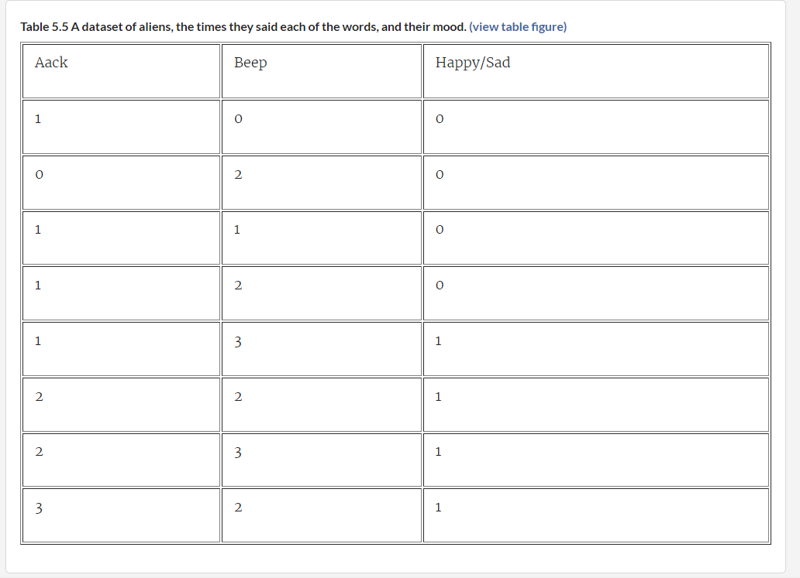
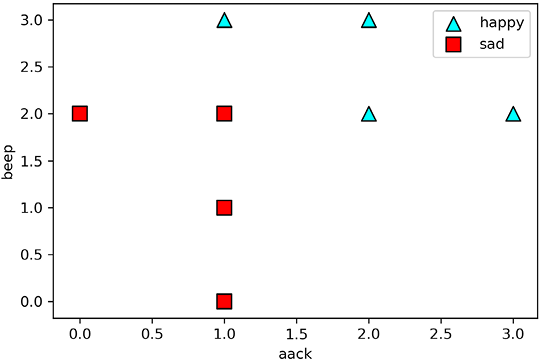
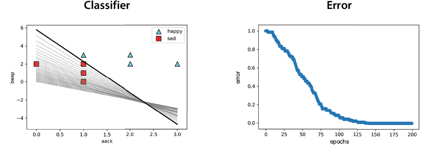
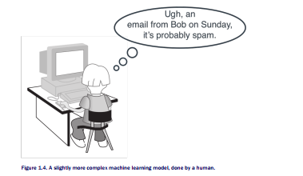
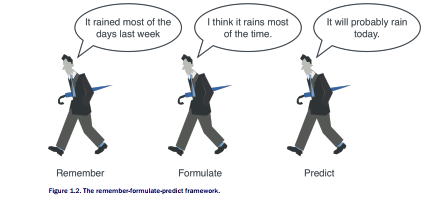
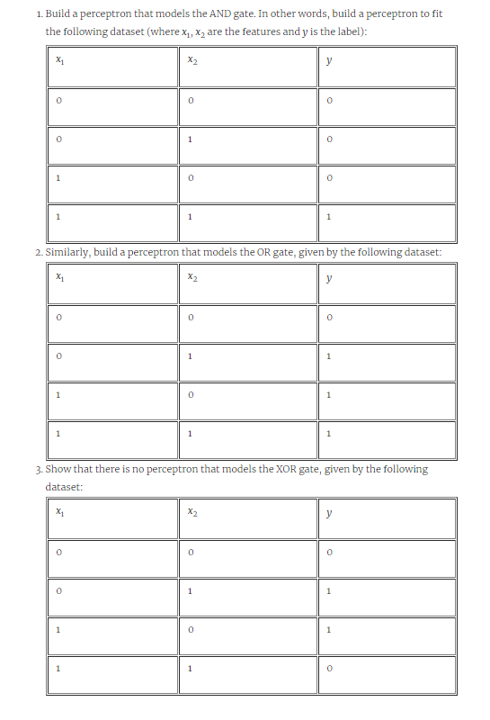

Lab 5: Using lines to split our points: The perceptron algorithm
===============================================================

### In this lab

- what is classification
- sentiment analysis: how to tell if a sentence is happy or sad using
    machine learning
- how to draw a line that separates points of two colors
- what is a perceptron, and how do we train it
- coding the perceptron algorithm in Python and Turi Create


You can find all the code for this lab in the following GitHub
repository:
<https://github.com/fenago/machine-learning/tree/master/Lab_5_Perceptron_Algorithm>.


Coding the perceptron algorithm
-------------------------------


Now that we have developed the perceptron algorithm for our sentiment
analysis application, in this section we write the code for it. First
we'll write the code from scratch to fit our original dataset, and then
we'll use Turi Create. In real life, we always use a package and have
little need to code our own algorithms. However, it's good to code some
of the algorithms at least once---think of it as doing long division.
Although we usually don't do long division without using a calculator,
it's good we had to in high school, because now when we do it using a
calculator, we know what's happening in the background. The code for
this section follows, and the dataset we use is shown in table below:


- **Notebook**: Coding\_perceptron\_algorithm.ipynb
    -   <https://github.com/fenago/machine-learning/blob/master/Lab_5_Perceptron_Algorithm/Coding_perceptron_algorithm.ipynb>




Let's begin by defining our dataset as a NumPy array. The features
correspond to two numbers corresponding to the appearances of *aack* and
*beep*. The labels are 1 for the happy sentences and 0 for the sad ones.


```
import numpy as np
features = np.array([[1,0],[0,2],[1,1],[1,2],[1,3],[2,2],[2,3],[3,2]])
labels = np.array([0,0,0,0,1,1,1,1])
```


This gives us the plot in figure 5.25. In this figure, the happy
sentences are triangles, and the sad ones are squares.





#### Coding the perceptron trick


In
this
section, we code the perceptron trick. We'll code it using stochastic
gradient descent (one point at a time), but we could also code it using
either mini-batch or batch gradient descent. We start by coding the
score function and the prediction. Both functions receive the same
input, which is the weights of the model, the bias, and the features of
one data point. The score function returns the score that the model
gives to that data point, and the prediction function returns a 1 if the
score is greater than or equal to zero and a 0 if the score is less than
zero. For this function we use the dot product defined in the section
"Plotting the error function and knowing when to stop running the
algorithm" in lab 3.


```
def score(weights, bias, features):
    return np.dot(features, weights) + bias #1
```


To write the prediction function, we first write the step function. The
prediction is the step function of the score.


```
def step(x):
    if x >= 0:
        return 1
    else:
        return 0

def prediction(weights, bias, features):
    return step(score(weights, bias, features)) #1
```


Next, we code the error function for one point. Recall that the error is
zero if the point is correctly classified and the absolute value of the
score if the point is misclassified. This function takes as input the
weights and bias of the model and the features and label of the data
point.


```
def error(weights, bias, features, label):
    pred = prediction(weights, bias, features)
    if pred == label: #1
        return 0
    else: #2
        return np.abs(score(weights, bias, features))
```


We now write a function for the mean perceptron error. This function
calculates the average of the errors of all the points in our dataset.


```
def mean_perceptron_error(weights, bias, features, labels):
    total_error = 0
    for i in range(len(features)): #1
        total_error += error(weights, bias, features[i], labels[i])
    return total_error/len(features) #2
```


Now that we have the error function, we can go ahead and code the
perceptron trick. We'll code the condensed version of the algorithm
found at the end of the section "The perceptron trick." However, in the
notebook, you can find it coded in both ways, the first one using an
`if`
statement
that checks whether the point is well classified.


```
def perceptron_trick(weights, bias, features, label, learning_rate = 0.01):
    pred = prediction(weights, bias, features)
    for i in range(len(weights)):
        weights[i] += (label-pred)*features[i]*learning_rate #1
    bias += (label-pred)*learning_rate
    return weights, bias
```


#### 


Now
that we have the perceptron trick, we can code the perceptron algorithm.
Recall that the perceptron algorithm consists of starting with a random
perceptron classifier and repeating the perceptron trick many times (as
many as the number of epochs). To track the performance of the
algorithm, we'll also keep track of the mean perceptron error at each
epoch. As inputs, we have the data (features and labels), the learning
rate, which we default to 0.01, and the number of epochs, which we
default to 200. The code for the perceptron algorithm follows:


```
def perceptron_algorithm(features, labels, learning_rate = 0.01, epochs = 200):
    weights = [1.0 for i in range(len(features[0]))] #1
    bias = 0.0
    errors = [] #2
    for epoch in range(epochs): #3
        error = mean_perceptron_error(weights, bias, features, labels) #4
        errors.append(error)
        i = random.randint(0, len(features)-1) #5
        weights, bias = perceptron_trick(weights, bias, features[i], labels[i])#6
    return weights, bias, errors
```


Now let's run the algorithm on our dataset!


```
perceptron_algorithm(features, labels)
Output: ([0.6299999999999997, 0.17999999999999938], -1.0400000000000007)
```


The output shows that the weights and bias we obtained are the
following:


- Weight of *aack*: 0.63
- Weight of *beep*: 0.18
- Bias: --1.04


We could have a different answer, because of the randomness in our
choice of points inside the algorithm. For the code in the repository to
always return the same answer, the random seed is set to zero.


Figure 5.26 shows two plots: on the left is the line fit, and on the
right is the error function. The line corresponding to the resulting
perceptron is the thick line, which classifies every point correctly.
The thinner lines are the lines corresponding to the perceptrons
obtained after each of the 200 epochs. Notice how at each epoch, the
line becomes a better fit for the points. The error decreases (mostly)
as we increase the number of epochs, until it reaches zero at around
epoch 140, meaning that every point is correctly classified.





That is the code for the perceptron algorithm! As I mentioned before, in
practice, we don't normally code algorithms by hand, but we use a
package, such as Turi Create or Scikit-Learn. This is what we cover in
the next
section.


#### Coding the perceptron algorithm using Turi Create


In
this
section, we learn to code the perceptron algorithm in Turi Create. The
code is in the same notebook as the previous exercise. Our first task is
to import Turi Create and create an SFrame with our data from a
dictionary as follows:


```
import turicreate as tc

datadict = {'aack': features[:,0], 'beep':features[:,1], 'prediction': labels}
data = tc.SFrame(datadict)
```


Next, we create and train our perceptron classifier, using the
`logistic_classifier`
object
and the `create`
method,
as shown in the next code. The inputs are the dataset and the name of
the column containing the labels (target).


```
perceptron = tc.logistic_classifier.create(data, target='prediction')
```


Output:


```
+-----------+----------+--------------+-------------------+
| Iteration | Passes   | Elapsed Time | Training Accuracy |
+-----------+----------+--------------+-------------------+
| 1         | 2        | 1.003120     | 1.000000          |
| 2         | 3        | 1.004235     | 1.000000          |
| 3         | 4        | 1.004840     | 1.000000          |
| 4         | 5        | 1.005574     | 1.000000          |
+-----------+----------+--------------+-------------------+
SUCCESS: Optimal solution found.
```


Notice that the perceptron algorithm ran for four epochs, and in the
last one (in fact, in all of them), it had a training accuracy of 1.
This means every point in the dataset was correctly classified.


Finally, we can look at the weights and bias of the model, using the
following command:


```
perceptron.coefficients
```


The output of this function shows the following weights and bias for the
resulting perceptron:


- Weight of *aack*: 2.70
- Weight of *beep*: 2.46
- Bias: --8.96


These are different results from what we obtained by hand, but both
perceptrons work well in
the dataset.


Exercises
---------

#### Exercise 5.1

The following is a dataset of patients who have tested positive or
negative for COVID-19. Their symptoms are cough (C), fever (F),
difficulty breathing (B), and tiredness (T).



Build a perceptron model that classifies this dataset.


**Hint**

You can use the perceptron algorithm, but you may be able to eyeball a
good perceptron model that works.


#### Exercise 5.2



#### Exercise 5.3

Perceptrons are particularly useful for building logical gates such as AND and OR.


