## A continuous approach to splitting points: Logistic regression

**This lab covers**

- The difference between hard assignments and soft assignments.

- Activation functions such as the step function vs the sigmoid function.

- Discrete perceptrons vs continuous perceptrons.

- The logistic regression algorithm for classifying data.

- Coding the logistic regression algorithm in Python.

- Using the softmax function to build classifiers for more than two classes.


#### Pre-reqs:
- Google Chrome (Recommended)

#### Lab Environment
Notebooks are ready to run. All packages have been installed. There is no requirement for any setup.

**Note:** Elev8ed Notebooks (powered by Jupyter) will be accessible at the port given to you by your instructor. Password for jupyterLab : `1234`

All Notebooks are present in `work/machine-learning` folder.

You can access jupyter lab at `<host-ip>:<port>/lab/workspaces/lab5_logistic`

In the previous lab, we built a classifier that determined if a sentence was happy or sad.
But as you can imagine, there are sentences that are happier than others. For example, the
sentence “I’m good.” and the sentence “Today was the most wonderful day in my life!” are
both happy, yet the second one is much happier than the first one. Wouldn’t it be nice to have
a classifier that not only predicts if sentences are happy or sad, but that actually gives us a
rating for how happy sentences are? Say, a classifier that tells us that the first sentence is
60% happy and the second one is 95% happy? In this section we will define the logistic
regression classifier, which does precisely that. This classifier assigns a score from 0 to 1 to
each sentence, in a way that the happier a sentence is, the higher the score it is assigned.
In a nutshell, logistic regression is a type of model which works just like a perceptron,
except instead of returning a yes/no answer, it returns a number between 0 and 1. In this
case, the goal is to assign scores close to 0 to the saddest sentences, scores close to 1 to the
happiest sentences, and scores close to 0.5 to neutral sentences.
This lab relies on lab 4, as the algorithms we develop here are very similar,
except for some technical differences. I recommend you make sure you understand lab 4

well before you read this lab. In lab four we described the perceptron algorithm by
the means of an error function which tells us how good a perceptron classifier is, and an
iterative step which moves us from a classifier to a slightly better classifier. In this lab we
learn the logistic regression algorithm which works in a similar way. The only difference is that
the new error function changes (it is now based on a probability), and the new iterative step
also changes slightly to fit this new error function.

## 5.1 Logistic Regression (or continuous perceptrons)

In lab 4, we covered the perceptron, which is a type of classifier that uses the features of
our data to make a prediction. The prediction can be 1 or 0. This is called a discrete
perceptron, since it returns an answer from a discrete set. In this lab we learn continuous
perceptrons, which are called this because they return an answer that can be any number in
the interval between 0 and 1. This answer can be interpreted as a probability in the sense that
sentences with a higher score are more likely to be happy sentences, and viceversa. The way I
visualize continuous perceptrons is similar to how I visualize discrete perceptrons: with a line
(or high-dimensional plane) that separates two classes of data. The only difference is that the
discrete perceptron predicts that everything to one side of the line has label 1, and to the
other side has label 0, while the continuous perceptron assigns a value from 0 to 1 to all the
points based on their position. Every point on the line gets a value of 0.5. This value means
the model can’t decide if the sentence is happy or sad. For example, the sentence “Today is
Tuesday” is neither happy or sad, so the model would assign it a score close to 0.5. Points in
the positive region get scores larger than 0.5, where the points even further away from the
0.5 line in the positive direction get values closer to 1. Points in the negative region get scores
smaller than 0.5, where again the farther points from the line get values closer to 0. No point
gets a value of 1 or 0 (unless we consider points at infinity).

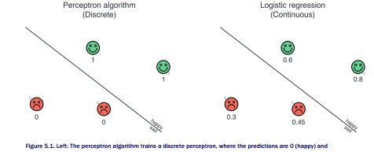

1(sad). Right: The logistic regression algorithm trains a continuous perceptron, where the predictions are
numbers between 0 and 1 which indicate the predicted level of happiness.

## 5.1.1 A probability approach to classification - The sigmoid function

The question now is, how do we slightly modify the perceptron models from the previous
section in order to get a score for each sentence, as opposed to a simple ‘happy’ or ‘sad’? Let’s
recall how we made the predictions in the perceptron models. We scored each sentence by
separately scoring each word and adding the scores, plus the bias. If the score was positive,
we predicted that the sentence was happy, and if it was negative, we predicted that the
sentence was sad. In other words, what we did was apply a function on the score. The
function returns a 1 if the score was positive, and a 0 if it was negative. This function is called
the step function.
Now we’ll do something similar. We’ll take a function that receives the score as the input,
and outputs a number between 0 and 1. The number is close to 1 if the score is positive and
close to zero if the score is negative. If the score is zero, then the output is 0.5. Imagine if
you could take the entire number line and crunch it into the interval between 0 and 1. It would
look like the function in Figure 5.2.


Many functions can help us here, and in this case, we’ll use one called the sigmoid, denoted
with the greek letter σ The formula for the sigmoid is the following:


Don’t worry much about this formula. What really matters is what the function does, which is
crunch all the real number line into the interval (0,1). In Figure 5.3 we can see a comparison
of the graphs of the step and the sigmoid functions.

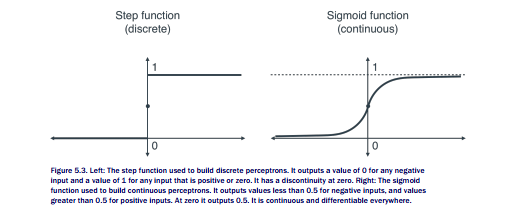

The sigmoid function is in general better than the step function for several reasons. One
reason is that having continuous predictions gives us more information than discrete
predictions. Another is that when we do calculus, the sigmoid function has a much nicer
derivative than the step function, whose derivative is always zero except for the origin, where
it is undefined.

The code for the sigmoid function in Python is very simple; we make use of the numpy
function exp, which takes any real number as an input, and returns e to the power of that
number.

```
import numpy as np
def sigmoid(x):
return 1/(1+np.exp(-x))
```

In Table 5.1 we use the previous code to calculate some values of the sigmoid function, to
make sure the function does what we want it to.

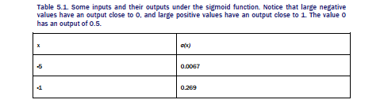


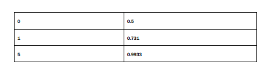

Now we are ready to define a prediction. The prediction is obtained by applying the sigmoid
function to the score, and it returns a number between 0 and 1 which, as I mentioned before,
can be interpreted in our example as the probability that the sentence is happy. Here’s the
code for the prediction function (where the score formula is the same as the one in Lab
4).

```
def lr_prediction(weights, bias, features):
    return sigmoid(score(weights, bias, features))
```

In the previous lab we defined an error function for a prediction, and we used it to build a
slightly better classifier. In this lab we follow the same procedure. The error of a
continuous perceptron is slightly different from the one of a discrete predictor, but they still
have great similarities.

## 5.1.2 The error functions - Absolute, square, and log loss

In this section we cook up some error functions for a continuous perceptron classifier. But first
let’s stop and think, what properties would we like a good error function to have? Here are
some I can think of:

- If a point is correctly classified, the error is a small number.

- If a point is incorrectly classified, the error is a large number.

- The error of a classifier at a set of points is the sum of errors at each point.

Many functions satisfy these properties, and I will show you three of them; the absolute loss,
the square loss, and the log loss. Let’s look at the scenario in Table 5.2 and Figure 5.4. This
dataset consists of two happy points and two sad points. For convenience, we’ll assign a label
of 1 to the happy points, and of 0 to the sad points. The point of the classifier is to assign
predictions for these points that are as close as possible to the labels. We also have a
continuous perceptron classifier represented by the line. The classifier then makes a prediction
between 0 and 1 for each point in the plane, as follows:
- The points on the line are given a prediction of 0.5.

- Points that are up and to the right of the line are given predictions higher than 0.5, and
the farther a point is from the line in that direction, the closer its prediction is to 1.

- Points that are down and to the left of the line are given predictions lower than 0.5,
and the farther a point is from the line in that direction, the closer its prediction is to 0.

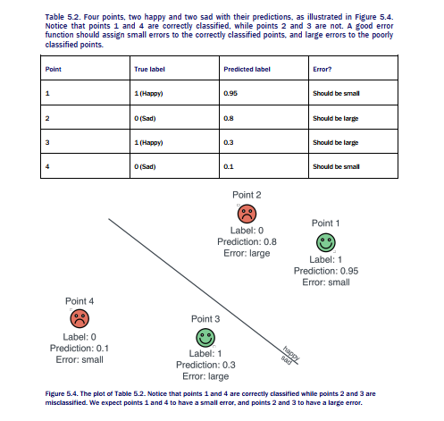

Notice that in Table 5.2, points 1 and 4 get a prediction that is close to the label, so they
should have small errors. In contrast, points 2 and 3 get a prediction that is far from the label,
so they should have large errors. Here are the three error functions.


**ERROR FUNCTION 1: ABSOLUTE ERROR**

The absolute error is very similar to the absolute error we defined for linear regression in
Lab 3. It is the absolute value of the difference of the prediction and the label. As we can
see, it is large when the prediction is far from the label, and small when they are close.

**ERROR FUNCTION 2: SQUARE ERROR**

Again, just like in linear regression, we also have the square error. This is the square of the
difference between the prediction and the label, and it works for the same reason that the
absolute error works.
Before we proceed, let’s calculate the absolute and square error for the points in Table 5.3.
Notice that points 1 and 4 (correctly classified) have small errors, while points 2 and 3
(incorrectly classified) have larger errors.

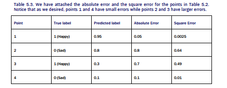

The absolute and the square loss may remind you of the error functions used in regression.
However, in classification they are not so widely used. The most popular is the next one I’ll
show you. Why is it more popular? One reason is that the math (derivatives) work much nicer
with the next function. Another one is that if you notice, these errors are all pretty small. In
fact, they are all smaller than 1, no matter how poorly classified the point is. I’ll elaborate
more in the next section but for now I present to you (drumroll...) the log loss.

**ERROR FUNCTION 3: LOG LOSS**

Notice that with the absolute and square error functions, points that are vastly misclassified
have large errors, but never too large. Let’s look at an example: a point with label 1 but that
the classifier has assigned a prediction of 0.01. This point is vastly misclassified, since we
would hope that the classifier assigns it a prediction close to 1. The absolute error for this
point is the difference between 1 and 0.01, or 0.99. The square error is this difference


squared, or 0.9801. But this is a small error for a point that is so vastly misclassified. We’d
like an error function that gives us a higher error for this point.
For this purpose, let’s look at probabilities. The classifier assigns a probability to every data
point, and that is the probability that the point is happy. Let’s instead consider the probability
that the point is its label. Thus, for the points with label 1 (happy points), we look at the
probability that the point is happy (the label), and for the points with label 0, we look at the
probability that the point is sad (the opposite label label). The prediction that a point is sad is
simply 1 minus the prediction that the point is happy. Now, note that a point that is well
classified is assigned a high probability of being its label (whether happy or sad), and a point
that is poorly classified is assigned a low probability of being its label. If that sounds a bit
confusing, let’s look at our four points.

- Point 1:

    * Label = 1 (happy)
    * Prediction = 0.95
    * Probability of being happy: 0.95

- Point 2:

    * Label = 1 (sad)
    * Prediction = 0.8
    * Probability of being sad: 1 - 0.8 = 0.2

- Point 3:

    * Label = 1 (happy)
    * Prediction = 0.3
    * Probability of being happy: 0.3

- Point 4:

    * Label = 1 (sad)
    * Prediction = 0.1
    * Probability of being happy: 1 - 0.1 = 0.9

As we can see from these points, a point being correctly classified is equivalent to a point that
has a been assigned a high probability of being its own label. All we need to do now is to turn
this probability into an error. Ideally, we’d like a function that gives us very high values for
points that are close to 0, and very low values for points that are close to 1. We’d like a
function where the graph looks like Figure 5.5.

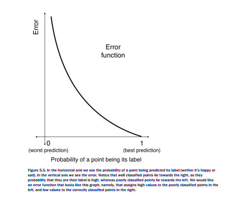

All we need to do is find a formula for that function. Can you help me think of a function that
may work? Here is an idea, let’s look at the graph of the natural logarithm function, in the
interval between 0 and 1 in Figure 5.6.

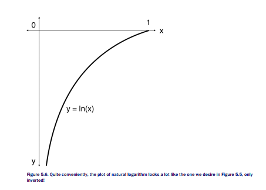

They look familiar, don’t they? All we need to do is flip the function by multiplying it by -1.
Thus, we obtain our log loss error function. It is precisely the negative natural logarithm of the
probability of the point being its label.

```
log loss = -ln(Probability of a point being its label).
```

Now let’s calculate it for our four data points.

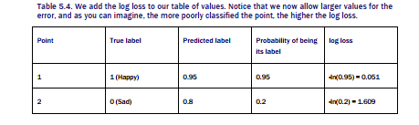

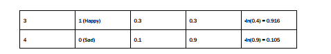

We can write the log loss as following:

- If the label is 0:

    * log loss = -ln(1 - prediction)

- If the label is 1:

    * log loss = -ln(prediction)

As a matter of fact, we can make the formula even nicer. Check this out:

```
log loss = −label ×ln (prediction) – (1 – label) ×ln (1 – prediction)
```

Notice that this works, since if the label is 0, only the second summand survives, and if the
label is 1, only the first summand survives, thus giving us exactly what we want.

## COMPARING THE ERROR FUNCTIONS

In table 5.5 we continue our work and add the log loss column using the natural logarithm
formula from the previous section. Now we have our three desired error functions.

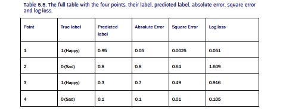

If I haven’t convinced you of the power of the log loss error function, let’s look at an extreme
point. Let’s say we have a point with label 1 (happy), for which the classifier makes a
prediction of 0.00001. This point is very poorly classified. The absolute error will be 0.99999,
and the square error will be 0.9999800001. However, the log loss will be the negative of the

natural logarithm of (1-0.99999), which is 11.51. This value is much larger than the absolute
or square errors, which means the log loss error is a better alarm for poorly classified points.

## 5.1.3 More on the log loss error function

In section 5.1.1, I made a case for why I prefer the log loss error function over the absolute
and square error functions. In this section I give you another reason, a reason that has to do
with independent probabilities. We’ve calculated the log loss for one point. The total log loss
for a classifier is defined as the sum of the log loss for every point in the dataset. But now we
have a sum of logarithms; does this ring a bell? Whenever I see a sum of logarithms, the first
thing I think of is the logarithm of a product. And whenever I see a product, I check if that
product may have come from multiplying probabilities. Why do we multiply probabilities?
Because when events are independent (or when we assume they are, for the sake of
simplicity) their probabilities get multiplied. In Lab 6 we delve much deeper into
independent events and their probabilities, but for now, we can use the fact that if the
occurrences of two events don’t depend on each other, the probability of both of them
happening is the product of the probabilities of both events happening.
What are the events we are talking about here? Let’s say we have the dataset in Figure
5.7, with two classifiers. The classifier on the left is bad, as it misclassifies two of the four
points, and the one on the right is good, as it classifies every point correctly.

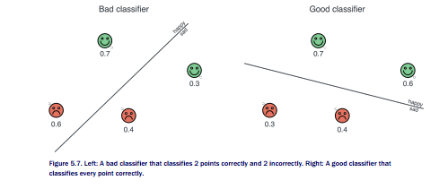

Now, before we calculate the log loss, let’s think of probabilities. In Figure 5.7, we have
specified the probability assigned to each of the points. Recall that this is the probability that
the point is happy. However, as in the previous section, we care about the probability that our
classifier assigns to the actual label. Namely, if the point is happy, we care about the


probability that the point is happy (the prediction), and if it is sad, we care about the
probability that the point is sad (one minus the prediction). Next, we consider all the points at
the same time, and we are interested in the probability that all the points are their label at the
same time. We don’t really know what this probability is, since the points may influence each
other, but if we assume that they don’t, if we assume that the points are independent from
each other, then the probability that all the points are their label is precisely the product of all
these probabilities. We would imagine that this probability is high for a good classifier and low
for a bad classifier. In Figure 5.8, we can see the calculations of this probability. Notice that
the bad model assigns the labels of this dataset a total probability of 0.0504, while the good
model assigns it a probability of 0.1764, which is higher.

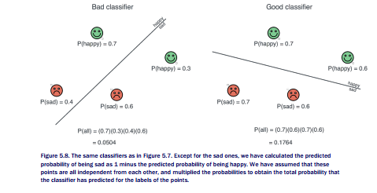

Here is a problem. Products are hard. Let me explain why. Imagine if we had a dataset of 1
million points. Each one is assigned a probability between 0 and 1. The product of 1 million
numbers between 0 and 1 would be tiny. Furthermore, it is volatile, as changing one of the
factors could really change this product. In general, big products are something we don’t want
to handle. What do we like? We like sums, they are much easier to handle. And how do we
turn products into sums? We have a very useful function called the logarithm, since the
logarithm of a product is precisely the sum of the logarithms of the factors.

To summarize, these are the steps for calculating the log loss:

- For each point, we calculate the probability that the classifier predicts for its label
(happy or sad).


- We multiply all these probabilities to obtain the total probability that the classifier has
given to these labels.

- We apply the natural logarithm to that total probability.

- Since the logarithm of a product is the sum of the logarithms of the factors, we obtain
a sum of logarithms, one for each point.

- We notice that all the terms are negative, since the logarithm of a number less than 1
is a negative number. Thus, we multiply everything by minus 1 to get a sum of positive
numbers.

- This sum is our log loss.

Notice that the classifier in the left, which is bad, has a log loss of 2.988. The classifier in the
right, which is good, has a smaller log loss of 1.735. Thus, the log loss does its job, which is to
assign a large error value to bad classifiers and a smaller one to good classifiers.

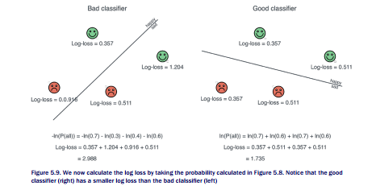

## 5.2 Reducing the log loss error: The logistic regression trick

In Chapters 4 we defined an error function for our classifier, and then an algorithm which
builds a classifier by minimizing that error function. The algorithm worked in an iterative way,
namely, it started with a random classifier and slowly changed the weights step by step until
the error was small. The classifier we obtained was a discrete perceptron. With continuous
perceptrons, we will do the exact same thing. In this section I show you the logistic regression
algorithm, which does precisely that: It builds a continuous perceptron by reducing the log
loss of a classifier.

Recall from Lab 4 that the perceptron algorithm consisted in starting with a random
classifier and successively picking a random point and applying the perceptron trick. The
perceptron trick had the following steps:

1. If the point was correctly classified, it would not move the line.
2. If the point was incorrectly classified, it would move the line slightly towards the point.

The logistic regression algorithm is very similar to the perceptron algorithm. The only thing
that changes is that we use the logistic regression trick instead of the perceptron trick. The
logistic regression trick has the following steps:

1. If the point is correctly classified, it moves the line slightly away from the point.
2. If the point is incorrectly classified, it moves the line slightly towards the point.


Does this make sense? Think about this: if a point is well classified, it means it is on the
correct side of the line. How would this point be better classified? Well, if the line were to
move farther away from the point, this would put the point deeper inside the correct side of
the line. Let’s illustrate this with an example.

## 5.2.1 An example with a discrete perceptron and a continuous perceptron

In order to really understand the difference between a discrete and a continuous perceptron,
we use the same example as in section 4.3.1. Recall that in this section we started with a

classifier which predicts whether a sentence is happy or sad by assigning scores to the words.
Then we used the perceptron algorithm to slightly improve this classifier.

The features, or words, were ‘aack’ and ‘beep’. The classifier and sentence are the
following:

- Classifier (scores):

    * ‘Aack’: 1 pt.
    * ‘Beep’: 1 pts.
    * Bias: -4 pts.

- Sentence 1:

    * Words: ‘Aack beep beep beep aack beep beep!”
    * Label: Sad

The scores can define a discrete perceptron classifier or a continuous perceptron classifier,
depending on if we use the step function or the sigmoid as the activation function. What we do
next is we will improve the discrete perceptron classifier with the perceptron algorithm to get
a slightly better classifier. Then I will show you a new technique, the logistic regression
algorithm, which will improve the continuous perceptron classifier, in a very similar way.

**Using the perceptron algorithm to improve our discrete perceptron classifier**

First let’s look at what the step that the perceptron algorithm would take in order to improve
this classifier. This algorithm would calculate the score of the sentence, which is the sum of
the scores of the words times the number of times each word appears in the sentence, plus
the bias:

```
Score = (score of aack)*#aack + (score of beep)*#beep - 4
= 1*2 + 1*4 - 4
=2
``` 

Since the score is positive, then the discrete perceptron classifier classifies the sentence as
happy (which means it misclassifies it). In this example, we decided that we would update the
scores by subtracting from them the error rate times the number of times each word appears
in the sentence. If the error rate was 0.01, we did the following:

- Update the score of ‘aack’ by subtracting 2*0.01, thus obtaining 0.98.

- Update the score of ‘beep’ by subtracting 4*0.01, thus obtaining 0.96.

- Update the bias by subtracting 0.01, thus obtaining -4.01.

Why did we subtract from the scores? Recall that in the perceptron algorithm, if the label was
0 and the prediction 1, we would subtract from the scores, and if the label was 1 and the
prediction 0, we would add to the scores. We won’t have to make this decision in the logistic
regression algorithm; you’ll soon see why.


The new classifier would assign a score of 0.98*2 + 0.96*4 - 4.01 = 1.79. This is better
than the previous score of 2, because the sentence is sad, so in order to classify it properly,
the classifier would need to give it a negative score.

**Using the logistic regression algorithm to improve our discrete perceptron classifier**

What would happen with a continuous perceptron classifier? This one would apply the sigmoid
function to the score, and use that as a prediction. The sigmoid function gives us

```
Prediction = σ(2) = 0.881.
```

Now please bear with me, I’ll show you the example of the logistic regression algorithm
without showing you the algorithm yet. This one will appear in Section 5.3.3 (feel free to skip
the pages and read it if you need the definition before the example).
The difference between the label and the prediction is 0-0.881 = -0.881. We’ll update the
scores just as before, except we will scale everything by this number, -0.881 and we will
always add to the scores.

- Update the score of ‘aack’ by adding 2*0.01*(-0.881), thus obtaining 0.982.

- Update the score of ‘beep’ by adding 4*0.01*(-0.881), thus obtaining 0.965.

- Update the bias by adding 0.01*(-0.881), thus obtaining -4.009.

The new classifier will give the point the following score and prediction.

```
Score = 0.982*2 + 0.965*4 - 4.009 = 1.815
Prediction = σ(1.815) = 0.86
```

Notice that this prediction is smaller than the previous one, so the classifier improved again.


## 5.2.2 A second example with a discrete perceptron and a continuous perceptron

One of the main benefits of the logistic regression algorithm over the perceptron algorithm is
that if a point is correctly classified, the perceptron algorithm leaves it alone and doesn’t
improve, while the logistic regression algorithm still uses the information of that point to
improve the model. In order to see this, let’s look at a slightly different example. The scores
are the same as the previous example, but now, our original point is correctly classified, so it’s
classified as sad. Notice that the perceptron algorithm would do absolutely nothing, since the
point is correctly classified. However, if we use the logistic regression algorithm and follow the
same approach of updating the weights as with the previous example, we see that the
difference between the label and the prediction is now 1 - 0.881 = 0.119 (since the label is 1).
Let’s update the scores in the exact same way as before.

- Update the score of ‘aack’ by adding 2*0.01*(0.119), thus obtaining 1.002.

- Update the score of ‘beep’ by adding 4*0.01*(0.119), thus obtaining 1.005.

- Update the bias by adding 0.01*(0.119), thus obtaining -3.999.


Notice that since the difference between the label and the prediction is negative, we
subtracted negative quantities, which is the same as adding positive quantities. The score and
prediction that this new classifier gives to our point is:

```
Score = 1.002*2 + 1.005*4 - 3.999 = 2.025
Prediction = σ(2.025) = 0.883
```

Notice that the prediction went up from 0.881 to 0.883! This is better, even if only by a small
amount, because it is closer to the label, which is 1.

## 5.2.3 Moving the line to fit the points - The logistic regression algorithm

Notice that in the previous two examples, we always added a small amount to the score. The
amount we added could be positive or negative based on the difference between the label and
the prediction, but this didn’t matter. We are ready to formally define the logistic regression
algorithm for our example.

**Logistic regression trick (pseudocode):**

Input:

- A classifier with the following scores:

    * Score of ‘aack’: a.
    * Score of ‘beep’: b.
    * Bias: c.

- A point with coordinates (x1, x2) (where x1 is the number of appearances of the word
‘aack’, and x2 of the word ‘beep’).

- A learning rate η.

Procedure :

- Calculate the prediction that the classifier gives to the datapoint as:

    * ŷ = σ(ax1 + bx2 + c)

- Output a classifier with the following scores:

    * Score of ‘aack’: a + η (y − ŷ)x1
    * Score of beep: b + η(y − ŷ)x2
    * Bias: c + η

And now that we have the logistic regression trick, we can easily write the pseudocode for the
logistic regression algorithm.

**Logistic regression algorithm (pseudocode):** 

Input:

- A dataset of points, where every point has a positive or negative label.


- A number of epochs, n.

- A learning rate

Procedure:
- Start with a random line. In other words, start with random values for the score of each
word, and the bias.

- Repeat the following procedure n times:

    * Pick a random point.

    * Apply the logistic regression trick to the point and the line. In other words, if the
point is well classified, move the line a little farther from the point, and if it is
misclassified, move the line a little closer to the point.

` Enjoy your well fitted line

Notice something very special. If we were to use the logistic regression trick on a classifier
that only outputs the predictions 0 and 1, we would get the perceptron trick in Lab 4. I
encourage you to verify this as an exercise, by running the logistic regression trick but only
with the values ŷ = 0 and ŷ = 1.

## 5.2.4 Coding the logistic regression algorithm

We use the same notation as in Lab 4. The label of each sentence is the sentiment (happy
or sad). We have a language with n words. The features are the number of times each word
appears, and the weights are the scores corresponding to the words. These weights include
the bias, which corresponds to no word, it simply gets added to the score of every sentence.

```
- Features: x1, x2, … , xn

- Label: y

- Weights: w1, w2, … , wn

- Bias: b
```

The score for a particular sentence is the sigmoid of the sum of the weight of each word (wi)
times the number of times that appears (xi), plus the bias (b) (which we called the dot
product).


To  follow  along  with  the  code,  take  a  look  at  this  book’s  repo  at http://www.github.com/luisguiserrano/manning. We start by coding the sigmoid function, the
score, and the prediction.

```
def sigmoid(x):
    return np.exp(x)/(1+np.exp(x))
    
def lr_prediction(weights, bias, features):
    return sigmoid(score(weights, bias, features))
```

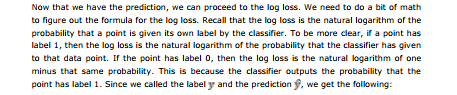

- If the label is y = 1, then log loss = ln (ŷ)

- If the label is y = 0, then log loss = ln (1 − ŷ)

Note that we can encode these two easily into one formula:

```
log loss = y ln (ŷ) + (1 – y) ln (1 − ŷ)
```

Let’s code that formula.

```
def log_loss(weights, bias, features, label):
    pred = prediction(weights, bias, features)
    return label*np.log(prediction) + (1-label)*np.log(1-prediction)
```

We need the log loss over the whole dataset, so we can add over all the data points.

```
def total_log_loss(weights, bias, X, y):
    total_error = 0
    for i in range(len(X)):
        total_error += log_loss(weights, bias, X.loc[i], y[i])
    return total_error
```

Now we are ready to code the logistic regression trick, and the logistic regression algorithm.

```
def lr_trick(weights, bias, features, label, learning_rate = 0.01):
    pred = lr_prediction(weights, bias, features)
    for i in range(len(weights)):
        weights[i] += (label-pred)*features[i]*learning_rate
        bias += (label-pred)*learning_rate
    return weights, bias

def lr_algorithm(features, labels, learning_rate = 0.01, epochs = 200):
    weights = [1.0 for i in range(len(features.loc[0]))]
    bias = 0.0
    errors = []
    for i in range(epochs):
        draw_line(weights[0], weights[1], bias, color='grey', linewidth=1.0, linestyle='dotted')
        errors.append(total_error(weights, bias, features, labels))
        j = random.randint(0, len(features)-1)
        weights, bias = perceptron_trick(weights, bias, features.loc[j], labels[j])
    draw_line(weights[0], weights[1], bias)

plot_points(features, labels)
plt.show()
plt.scatter(range(epochs), errors)
plt.xlabel('epochs')
plt.ylabel('error')
return weights, bias
```

We’ll test our code in the same dataset that we used in Lab 4. The code for loading our
small dataset is below, and the plot of the dataset is in Figure 5.11.

```
import pandas as pd
X = pd.DataFrame([[1,0],[0,2],[1,1],[1,2],[1,3],[2,2],[3,2],[2,3]])
y = pd.Series([0,0,0,0,1,1,1,1])
```

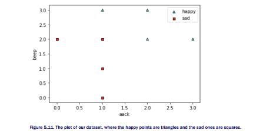

We run the algorithm to get the classifier.

```
lr_algorithm(features, labels)
([0.46999999999999953, 0.09999999999999937], -0.6800000000000004)
```

The classifier we obtain has the following weights and biases.
- w1 = 4.7

- w2 = 0.1

- b = −0.6

The plot of the classifier (together with a plot of the previous classifiers at each of the epochs)
is in Figure 5.12.

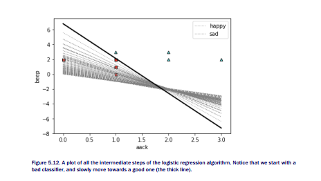

And finally, the plot of the log loss can be seen in Figure 5.13. Notice that as we run the
algorithm for more epochs, the log loss decreases drastically, which is exactly what we want.

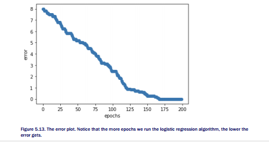

## 5.2.5 The logistic regression algorithm in Turi Create

In this section, I show you how to build a continuous perceptron classifier in Turi Create. The
process is much easier, since the package will take care of most of the heavy lifting for us.
First we have to load all the data into an SFrame.

```
import turicreate as tc
data = tc.SFrame({'X1': X[0], 'X2': X[1], 'y': y})
```

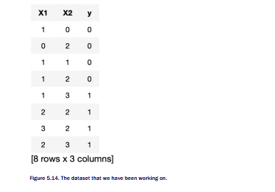

Now, we train the classifier.

```
classifier = tc.logistic_classifier.create(data,
features = ['X1', 'X2'],
target = 'y',
validation_set=None)
```

First, let’s evaluate the coefficients of this model, with the following command.

```
classifier.coefficients
```

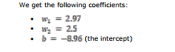

They look different than the ones we obtained when we code it by hand, but that doesn’t
matter. The boundary lines are still similar, as we can see when we plot it in Figure 5.15.

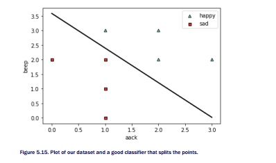


#### Exercises


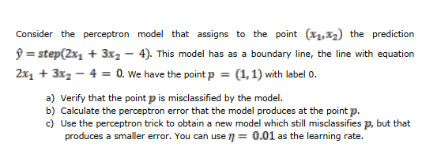


