## Using probability to its maximum:
## The naive Bayes algorithm

**This lab covers**

- What is Bayes theorem?

- When are events dependent of independent?

- The prior and the posterior probabilities.

- Calculating conditional probabilities based on events.

- What is the naive Bayes algorithm?

- Using the naive Bayes algorithm to predict if an email is spam or ham, based on the words
in the email.

- Coding the naive Bayes algorithm in Python.


#### Pre-reqs:
- Google Chrome (Recommended)

#### Lab Environment
Notebooks are ready to run. All packages have been installed. There is no requirement for any setup.

**Note:** Elev8ed Notebooks (powered by Jupyter) will be accessible at the port given to you by your instructor. Password for jupyterLab : `1234`

All Notebooks are present in `work/machine-learning` folder.

You can access jupyter lab at `<host-ip>:<port>/lab/workspaces/lab6_naive_bayes`

Naive Bayes is a very important machine learning algorithm used for prediction. As opposed to
the previous algorithms you’ve learned in this course, such as the perceptron algorithm, in
which the prediction is discrete (0 or 1), the naive Bayes algorithm is purely probabilistic. This
means, the prediction is a number between 0 and 1, indicating the probability that a label is
positive. The main component of naive Bayes is Bayes Theorem.
Bayes Theorem is a fundamental theorem in probability and statistics, and it helps us
calculate probabilities. The more we know about a certain situation, the more accurate the
probability is. For example, let’s say we want to find the probability that it will snow today. If
we have no information of where we are and what time of the year it is, we can only come up
with a vague estimate.
However, if we are given information, we can make a better estimation of the probability.
If I tell you, for example, that we are in Canada, then the probability that it will snow today

increases. If I were to tell you that we are in Jamaica, this probability decreases drastically.
Bayes theorem helps us calculate these new probabilities, once we know more about the
situation.
However, when we have a lot of information, the math becomes complicated. If I were to
ask you the probability that it will snow today given the following: we are in Canada, it is
February, the temperature is -10 degrees Celsius, and the humidity is 30%, then you would
assume that the probability of snow is quite high, but exactly how high? Bayes theorem has a
hard time dealing with so much information. But there is a very simple trick we can use, which
makes the calculation much easier. The trick relies on making an assumption that is not
necessarily true, but that works pretty well in practice and simplifies our life quite a lot. This
assumption is the heart of the naive Bayes algorithm.
In this lab, I will show you Bayes theorem with some real life examples. We’ll start by
studying an interesting and slightly surprising medical example. Then we’ll dive deep into the
naive Bayes algorithm by applying it to a very common problem in machine learning: spam
classification. We’ll finalize by coding the algorithm in Python, and using it to make predictions
in a real spam email dataset.

## 6.1 Sick or healthy? A story with Bayes Theorem

Consider the following scenario. Your (slightly hypochondriac) friend calls you, and the
following conversation unfolds:

**You:** Hello!

**Friend:** Hi, I have some terrible news!

**You:** Oh no, what is it?

**Friend:** I heard about this terrible and rare disease, and I went to the doctor to be tested for
it. The doctor said she would administer a very accurate test. Then today she called me and
told me that I tested positive! I must have the disease!

Oh oh! What do we say to our friend? First of all, let’s calm them down, and try to figure out if
it is likely that our friend has the disease.

**You:** First let’s calm down, mistakes happen in medicine. Let’s try to see how likely it is that
you actually have the disease. How accurate did the doctor say the test was?

**Friend:** She said it was 99% accurate. That means I’m 99% likely to have the disease!

**You:** Wait, let’s look at all the numbers. How likely is it to have the disease, regardless of the
test? How many people have the disease?


**Friend:** I was reading online, and it says that on average, 1 out of every 10,000 people have
the disease.

**You:** Ok, let me get a piece of paper (*puts friend on hold*).

Let’s stop for a quiz. How likely do you think it is that your friend has the disease?

**Quiz** In what range do you think is the probability that your friend has the disease?

a) 0-20%

b) 20-40%

c) 40-60%

d) 60-80%

e) 80-100%

Let’s calculate it. To summarize, we have the following two pieces of information:

- The test is correct 99% of the time. To be more exact (we checked with the doctor to
confirm this), on average, out of every 100 healthy people, the test correctly diagnoses
99 of them, and out of every 100 sick people, the test correctly diagnoses 99 of them.
Therefore, both on healthy and sick people, the test has an accuracy of 99%.

- On average, 1 out of every 10,000 people has the disease.

Let’s do some rough calculations to see what the probability would be. Let’s pick a random
group of 10,000 people. Since on average, one out of every 10,000 people are sick, then we
expect one of these people to have the disease. Now, let’s run the test on the remaining 9,999
healthy ones. Since the test makes mistakes 1% of the time, we expect 1% of these 9,999
healthy people to be misdiagnosed as sick. This means, 99.9 people on average will be
diagnosed as sick. Let’s round it up to 100. This means, out of 10,000, 100 of them would be
healthy people misdiagnosed as sick, and one person will be a sick person correctly diagnosed
as sick. Thus, the probability of being the one sick person among those diagnosed as sick, is
simply 1%. Quite less than what we thought! So we can get back to our friend.

**You:** Don’t worry, based on the numbers you gave me, the probability that you have the
disease given that you tested positive is actually only around 1%!

**Friend:** Oh my God, really? That’s such a relief, thank you!

**You:** Don’t thank me, thank math (winks eye).


And you hang up. But you, being a math person, are still not content with the calculation you
made. There was a bit of rounding up there. Let’s get more rigorous with the math, and
calculate the actual probability. The facts that we have so far are the following:

1. Out of every 10,000 people, 1 has the disease.
2. Out of every 100 sick people who take the test, 99 test positive, and one tests
negative.
3. Out of every 100 healthy people who take the test, 99 test negative, and one tests
positive.

Ok, let’s take a large group of people, say, 1 million people. Out of 1 million people, how many
of them have the disease? Since 1 out of every 10 thousand has the disease, then a quick
calculation shows that among 1 million people, 100 of them are sick. So we have our first
piece of information.

Out of 1 million people:
- 999,900 of them are healthy, and

- 100 of them are sick.

Now, let’s say we test all of them. Since the test is correct 99% of the time, both among the
healthy and among the sick, then we have a second piece of information.
Out of 99,900 healthy people:
- 99% of them, or 989,901, are diagnosed as healthy, and

- 1% of them, or 9,999, are diagnosed as sick.

Out of 100 sick people:
- 99% of them, or 99, are diagnosed as sick, and

- 1& of them, or 1, is diagnosed as healthy.

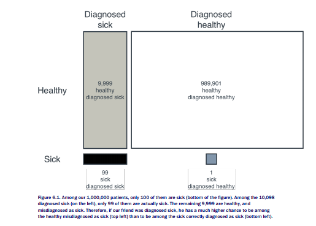

Now the question, if your friend tested positive, which means he was diagnosed as sick, then
that means he could belong to two groups. He could be one of the 9999 healthy people who
were (incorrectly) diagnosed as sick, or he could be one of the 99 sick people who were
(correctly) diagnosed as sick. What is the probability that he belongs to the 99, and not the
999? A simple calculation will do. In total, we have 99+9999 = 10,098 people who were
diagnosed as sick. If your friend were to be among the 99 sick ones, the probability is
99/10,098 = 0.009. That is 0.09%, less than 1%.

This is a bit surprising, if the test is correct 99% of the time, why on earth was it so
wrong? Well, the test is not bad, if it’s only wrong 1% of the time. But since one person out of
every 10,000 is sick with the disease, that means a person is sick 0.01% of the time. What is
more likely, to be among the 1% of the population that got misdiagnosed, or to be among the
0.01% of the population that is sick? The 1%, although a small group, is massively larger than


the 0.01%. So the test has an error rate so much larger than the rate of being sick, that it
ends up not being as effective as we think.
A way to look at this is using tree-like diagrams. In our diagram, we start with a root at
the left, which branches out into two possibilities: that your friend is sick or healthy. Each of
these two branches out into two possibilities: that your friend gets diagnosed healthy or
diagnosed sick. The tree looks like Figure 6.2.

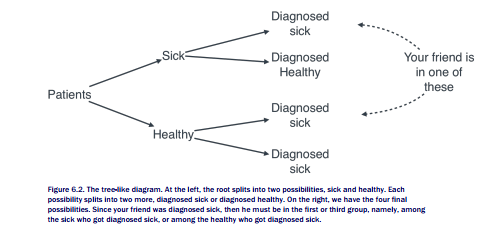

Notice that in the tree in Figure 6.2, the patients get divided into four groups:

1. Sick patients who were diagnosed sick.
2. Sick patients who were diagnosed healthy.
3. Healthy patients who were diagnosed sick.
4. Healthy patients who were diagnosed healthy.
Now let’s count how many people are in each of the groups, starting with 1,000,000 patients,
as we did above. The results are in Figure 6.3.

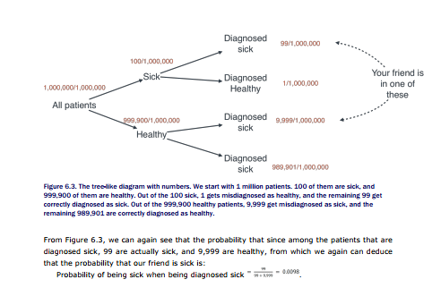


## 6.1.1 Prelude to Bayes Theorem: The prior, the event, and the posterior

We now have all the tools to state Bayes theorem. The main goal of Bayes theorem is
calculating a probability. At the beginning, with no information in our hands, we can only
calculate an initial probability, which we call the prior. Then, an event happens, which gives us
information. After this information, we have a much better estimate of the probability we want
to calculate. We call this better estimate the posterior.

**PRIOR** The initial probability that we calculate.

**EVENT** What gives us information to calculate better probabilities.

**POSTERIOR** The final (and more accurate) probability that we calculate using the prior probability and the event.

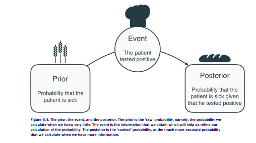

In our case, we needed to calculate the probability that a patient is sick.

1. Initially, this probability is 1/10,000, since we don’t have any other information, other
than the fact that one out of every 10,000 patients is sick. So this 1/10,000, or 0.0001
is the prior.
2. But all of a sudden, new information comes to light. In this case, the patient took a
test, and tested positive.
3. After coming out positive, we recalculate the probability that the patient is sick, and
that comes out to 0.0098. This is the posterior.

Bayes Theorem is one of the most important building blocks of probability and of machine
learning. It is so important that and several fields are named after it, Bayesian learning,
Bayesian statistics, Bayesian analysis, and so on. In this lab, we’ll learn Bayes theorem
and a very important algorithm that will help us put in practice when analyzing data: the naive
Bayes algorithm. In a nutshell, the naive Bayes algorithm does what most classification
algorithms do, which is predict a label out of a set of features. Naive Bayes will simply perform
several probability calculations using the features, and output a final probability for what it
thinks the label is.


## 6.2 Use-case: Spam detection model

Now consider the following situation, you are reading your email, and you are sick and tired of
receiving spam (garbage) email. You would like to build a tool that helps you separate spam
from non-spam emails (as you may recall from section 1.4.1, non-spam emails are called
ham).
More specifically, given a new email, we’d like to find the probability that this email is
spam or ham. In that way, we can send the emails with the highest probability of being spam
directly to the spam folder, and keep the rest in our inbox. This probability should depend on
information about the new email (words on the email, sender, size, and so on). For example,
an email with the word ‘sale’ on it is more likely to be spam

## 6.2.1 Finding the prior: The probability that any email is spam

What is the probability that an email is spam? That is a hard question, but let’s try to make an
estimate. We look at our current inbox and count how many emails are spam and ham. Say
there are 100 emails, of which 20 are spam, and 80 ham. Thus, 20% of the emails are spam.
So if we want to make a decent estimate, we can say that to the best of our knowledge, the
probability that a new email is spam is 20%. This is the prior probability. The calculation can
be seen in Figure 6.5, where the spam emails are colored dark grey, and the ham emails
white.

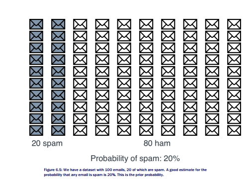

## 6.2.2 Finding the posterior: The probability that an email is spam knowing that it contains a particular word

Of course, not all emails are created equally. We’d like to come up with a more educated
guess for the probability, using properties of the email. We can use many properties, such as
sender, size, words in the email, etc. For this particular application, we’ll only use the words in
the email, but I encourage you to go through the example thinking how this could be used
with other properties.

Let’s say we find that particular word, say, the word ‘lottery’, tends to appear in spam emails more than in ham emails. As a matter of fact, among the spam emails, it appears in 15
of them, while among the ham emails, it only appears in 5 of them. Therefore, among the 20
emails containing the word ‘lottery’, 15 of them are spam, and 5 of them are ham. Thus, the
probability that an email containing the word ‘lottery’ is spam, is precisely 15/20, or 75%.
That is the posterior probability.

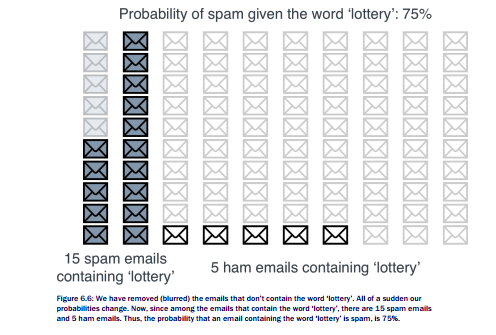

There we have it, that is Bayes Theorem. To summarize:

- The prior is 20%, the probability that an email is spam, knowing nothing about the
email.

- The event is that the email contains the word ‘lottery’. This helped us make a better
estimate of the probability.

- The posterior probability is 80%. This is the probability that the email is spam, given
that it contains the word ‘lottery’.

## 6.2.3 What the math just happened? Turning ratios into probabilities

One way to visualize the previous example is with a tree of all the four possibilities, namely:
that the email is spam or ham, and that it contains the word ‘lottery’ or not. We draw it in the
following way, we start by the root, which splits into two branches. The top branch
corresponds to spam, and the bottom branch corresponds to ham. Each of the branches splits
into two more branches, namely, when the email contains the word ‘lottery’ or not. The tree

looks like Figure 6.6. Notice that in this tree, we’ve also attached how many emails out of the
total 100 belong to each particular group.

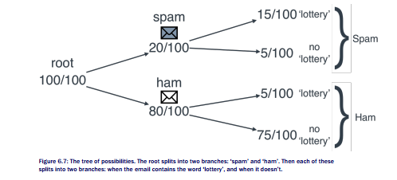

Once we have this tree, and we want to calculate the probability of an email being spam given
that it contains the word ‘lottery’, we simply remove all the branches where the emails that
don’t contain the word ‘lottery’, thus obtaining Figure 6.7.


Now, we simply have 20 emails, 15 of them are spam and 5 of them are ham. Thus, the
probability of an email being spam given that it contains the word ‘lottery’ is 15/20, also called
¾, or 75%.

But we’ve already done that, so what is the benefit of the diagram? Aside from making
things simpler, the benefit is that normally, the information we have is based on probabilities,
and not in number of emails. Many times, we don’t know how many emails are spam or ham,
all we know is the following:

- The probability that an email is spam is ⅕.
- The probability that a spam email contains the word ‘lottery’ is ¾.
- The probability that a ham email contains the word ‘lottery’ is 1/40.
- **Question:** What is the probability that an email that contains the word ‘lottery’ is
spam

First of all, let’s check if this is enough information. Do we know the probability that an email
is ham? Well, we know that the probability that it is spam is ⅕, or 20%. Since the only other
possibility is that an email is ham, then it must be the complement, or ⅘, namely, 80%. This
is a very important rule, the rule of complementary probabilities.


The next thing we do is find the probabilities of two events happening at the same time. More
specifically, we want the following four probabilities:

- The probability that an email is spam and contains the word ‘lottery’.

- The probability that an email is spam and does not contain the word ‘lottery’.

- The probability that an email is ham and contains the word ‘lottery’.

- The probability that an email is ham and does not contain the word ‘lottery’.

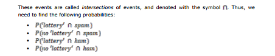

Let’s look at some numbers. We know that ⅕, or 20 out of 100 emails are spam. Out of those
20, ¾ of them contain the word ‘lottery’. At the end, we multiply these two numbers, ⅕ times
¾, to obtain 3/20. 3/20 is the same as 15/100, which is precisely the number of emails that
are spam and contain the word ‘lottery’. What we did was the following: We multiplied the
probability that an email is spam times the probability that a spam email contains the word
‘lottery’, to obtain the probability that an email is spam and contains the word lottery. The
probability that a spam email contains the word ‘lottery’ is precisely the conditional
probability, or the probability that an email contains the word ‘lottery’ given that it is a spam
email. This gives rise to the multiplication rule for probabilities.

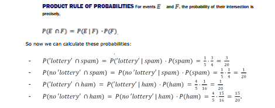

These probabilities are summarized in Figure 6.9. Notice that the product of the probabilities
on the edges are the probabilities at the right.

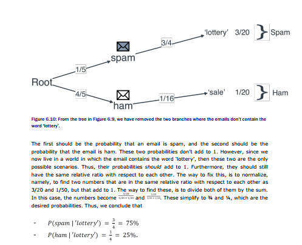


This is exactly what we figured out when we counted the emails. To really wrap up this
information, we need a formula. Let’s figure out this formula. We had two probabilities, the
probability that an email is spam and contains the word ‘lottery’, and the probability that an
email is spam and does not contain the word lottery. In order to get them to add to 1, we
normalized the probabilities. This is the same thing as dividing each one of them by their sum.
In math terms, we did the following:

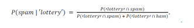

If we remember what these two probabilities were, using the multiplication rule, we get the
following:

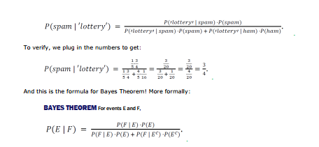

## 6.2.4 What about two words? The naive Bayes algorithm

Okay, this can’t be the end of it, right? There are a lot more words in the dictionary. Let’s say
we notice that another word, the word ‘sale’ also tends to appear a lot in spam email. We can
do a similar calculation. Let’s count how many spam and ham emails contain the word ‘sale’.
We go over all our emails, and realize that the word ‘sale’ appears in 6 of the spam emails,
and 4 of the ham emails. Thus, out of these 10 emails that contain the word ‘sale’, 60% (or 6
of them) are spam and 40% (or 4 of them) are ham. We conclude that based on our data, the
probability that an email is spam containing the word ‘sale’ is 60%.

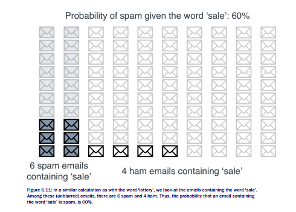

We can do this for all the words. But the question is, how do we combine these probabilities?
It’s not very useful to know that an email containing the words ‘lottery’, ‘sale’, and
‘hamburger’ has a 75% probability of being spam thanks to the word ‘lottery’, a 60%
probability of being spam thanks to the word ‘sale’, and a 30% probability of being spam
thanks to the word ‘hamburger’. We’d like to combine these into one probability. This is where the naive Bayes algorithm comes in.

For now, let’s simplify things by only using the two words ‘lottery’ and ‘sale’. So here’s an
idea (a bad idea), let’s look at all the emails that have both words, ‘lottery’ and ‘sale’. Count
how many of them are spam, how many of them are ham, and find the probability based on
those two numbers using Bayes theorem. Tada!
Does that work? Well, not so much. Can you see a potential problem there? What if no
emails in our dataset have the words ‘lottery’ and ‘sale’? We only have 100 emails, if only 20
of them have the word ‘lottery’ and 10 have the word sale, it could be that maybe only 1 or 2

have both words, or maybe none! Moreover, what if we also add the word ‘hamburger’. Out of
100 emails, how many may have all words, ‘lottery’, ‘sale’, and ‘hamburger’? Probably none.
So what’s the solution here, should we gather more data? That is always a good idea, but
many times we can’t, so we have to deal with the data we have. In some way, we can’t rely
on the emails that contain both words ‘lottery’ and ‘sale’. We need to make an estimate of this
number of emails. We may have to make an assumption to do this. A naive assumption,
perhaps? Yes a naive assumption is exactly what we’re going to make.

**NAIVE ASSUMPTION** Say we have 100 emails. 20 of them have the word ‘lottery’, and 10 have the word
‘sale’. This means that the probability that an email contains the word ‘lottery’ is 20%, and that it contains the word ‘sale’ is 10%. Let’s assume then, that among the 20% of emails that contain the word ‘lottery’, exactly 10% of them contain the word ‘sale’, that is, 2% of the total emails. Our naive assumption, then, is that 2% of the emails contain the words ‘lottery’ and ‘sale’.

What our naive assumption really means is that the event of containing the words ‘lottery’ and
‘sale’ are independent. This is, the appearance of one of the words in no way affects the
appearance of the other one. This means, if 10% of the emails contain the word ‘sale’, then
we can assume that if we restrict to the emails that contain the word ‘lottery’, 10% of those
emails also contain the word ‘sale’. What we did here was multiply the probabilities, namely,
multiplying 20% by 10% to obtain 2% (or in other words, 2/10 * 1/10 = 2/100). Most likely,
this is not true. The appearance of one word can sometimes heavily influence the appearance
of another. For example, if an email contains the word ‘peanut’, then the word ‘butter’ is more
likely to appear in this email, since many times they go together. This is why our assumption
is naive. However, it turns out in practice that this assumption works very well, and it
simplifies our math a lot. This is called the product rule for probabilities.

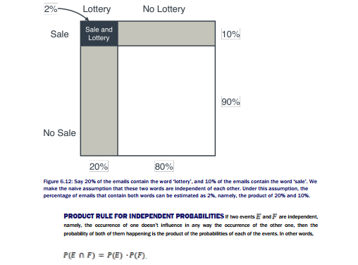

So now, making this assumption, we can estimate how many spam and ham emails would
contain the words ‘lottery’ and ‘sale’. Let’s remember the following numbers from before:

**Spam emails:**

- Among the 20 spam emails, 15 of them contained the word ‘lottery’. Therefore, the
probability of the word ‘lottery appearing in a spam email is 15/20, or 0.75.

- Among the 20 spam emails, 6 of them contained the word ‘sale’. Therefore, the

- Therefore, the probability of both words appearing in a spam email is 0.75*0.3 =

probability of the word sale appearing in a spam email is 6/20, or 03.
0.225. This means, among our 20 spam emails, we expect to see 0.225*20 = 4.5 of
them containing both words.


This is a fractional number of emails! Why would we have a fractional number of emails? Well,
since we are referring to probabilities, what we are saying when we say that among 20 spam
emails, we expect to see 4.5 containing both words, is the same as saying that among 200
spam emails, we expect to see 45 containing both words. It’s a matter of probabilities, not
about counting actual emails. In probability terms, our assumption boils down to the following:

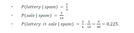

**Ham emails:**

- Among the 80 ham emails, 5 of them contained the word ‘lottery’. Therefore, the
probability of the word ‘lottery appearing in a ham email is 5/80, or 0.0625.

- Among the 80 ham emails, 4 of them contained the word ‘sale’. Therefore, the
probability of the word sale appearing in a ham email is 4/80, or 0.05.

- Therefore, the probability of both words appearing in a ham email is 0.0625*0.05 =
0.003125 (quite unlikely!). This means, among our 80 ham emails, we expect to see
20*0.003125 = 0.0625 of them containing both words.

In probability terms, our assumption is the following:

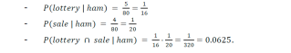

What does this mean? Well, it means that if we only restrict to emails that contain both words
‘lottery’ and ‘sale, we have 4.5 of them that are spam, and 0.0625 that are ham. Thus, if we
were to pick one at random among these, what is the probability that we pick a spam one?
This may look harder with non-integers that with integers, but if we look at Figure 6.13, this
may be more clear. We have 4.5 spam emails and 0.0625 ham emails (this is exactly one 16th
of an email). We throw a dart and it falls in one of the emails, what’s the probability that it
landed on a spam email? Well, the total number of emails (or the total area, if you’d like to
imagine it that way) is 4.5+0.0625 = 4.5625. Since 4.5 are spam, then the probability that
the dart landed on spam is 4.4/4.5625 = 0.9863. This means, an email with the words ‘lottery’
and ‘sale’ has a 98.63% probability of being spam. That is quite high!

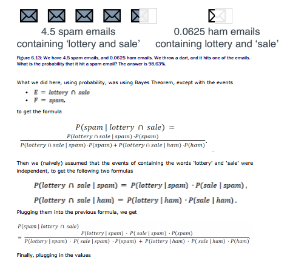


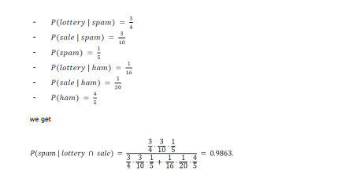


## 6.2.5 What about more than two words?

Ok, we have discovered that if an email contains the words ‘lottery’ and ‘sale’, then its
probability of being spam is 98.63%. What if we add a third word into our model? Say, the
word ‘mom’. We look at the data and discover that this word is not so much associated with
spam, it actually appears more in ham emails. In fact, out of the 20 spam emails, only one of
them contain the word ‘mom’, and out of the 80 ham emails, 40 of them contain it. We can do
the same trick again, let’s look at some probabilities:

**Among the spam emails:**

- The probability of an email containing ‘lottery’ is 15/20.

- The probability of an email containing ‘sale’ is 6/20.

- The probability of an email containing ‘mom’ is 1/20.

Therefore, the probability of an email containing the three words is the product of these three
probabilities, namely, 90/8000 = 0.01125.

**Among the ham emails:**

- The probability of an email containing ‘lottery’ is 5/80.

- The probability of an email containing ‘sale’ is 4/80.

- The probability of an email containing ‘mom’ is 40/80.

Therefore, the probability of an email containing the three words is the product of these three
probabilities, namely, 800/512000 = 0.0015625.

Thus, among 100 emails, we’d expect to find 0.01125 spam emails containing the three
words, and 0.0015625 ham emails containing them. If we were to pick at random from these
two, the probability that the email is spam is 0.01125/(0.01125+0.0015625) = 0.878, or

87.8%. This makes sense, since even though the words ‘lottery’ and ‘sale’ make it very likely
that the email is spam, the word ‘mom’ makes it less likely that it is.

## 6.3 Building a spam detection model with real data

Ok, now that we have developed the algorithm, let’s roll up our sleeves and work with a real
email dataset. Kaggle has a very good spam/ham email dataset which can be found at
https://www.kaggle.com/karthickveerakumar/spamfilter/downloads/emails.csv/1.

In the repo, we have processed the dataset as a Pandas DataFrame with the following
command:

```
import pandas
emails = pandas.read_csv('emails.csv')
```

If we look at the first 10 rows of this dataset, this is how it looks (Table 6.1):

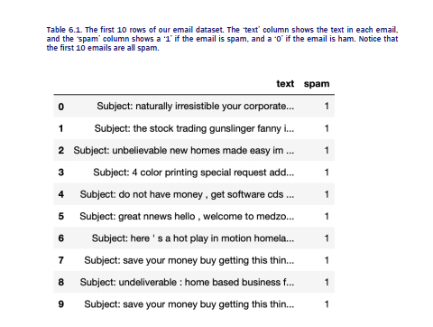

This dataset has two columns. The first column is the text of the email (together with its
subject line), in string format. The second column tells us if the email is spam (1) or ham (0).
First we need to do some data preprocessing.

## 6.3.1 Data preprocessing

Let’s start by turning the text string into a list of words. This is done in the following function,
which uses the split() function. Since we only check if each word appears in the email or not,
regardless of how many times it appears, we turn it into a set, and then into a list again.

```
def process_email(text):
return list(set(text.split()))
```

Now we use the apply() function to apply this change to the entire column. We call the new
column emails[‘words’].

```
emails['words'] = emails['text'].apply(process_email)
```

Our email dataset now looks as follows (Table 6.2):

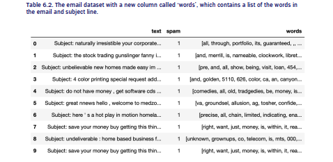

## 6.3.2 Finding the priors

Let’s first find out the probability that an email is spam (the prior). For this, we calculate the
number of emails that are spam, and divide it by the total number of emails. Notice that the
number of emails that are spam is simply the sum of entries in the ‘spam’ column. The
following line will do the job.

```
sum(emails['spam'])/len(emails)
0.2388268156424581
```

The probability that the email is spam, then, is around 24%. Thus, the probability that an
email is ham is around 76%.

## 6.3.3 Finding the posteriors with Bayes theorem

Now, we need to find the probabilities that spam (and ham) emails contain a certain word.
We’ll do this for all words at the same time. The following function creates a dictionary called
‘model’, which records each word, together with the number of appearances of the word in
spam emails, and in ham emails.

```
model = {}
for email in emails:
for word in email['words']:
if word not in model:
model[word] = {'spam': 1, 'ham': 1}
if word in model:
if email['spam']:
model[word]['spam'] += 1
else:
model[word]['ham'] += 1
```

Let’s examine some rows of the dictionary:

```
model
{'woods': {'ham': 4, 'spam': 2},
'spiders': {'ham': 1, 'spam': 3},
'hanging': {'ham': 9, 'spam': 2}}
```

This means that for example the word ‘woods’ appears 4 times in spam emails, and 2 times in
ham emails. Let’s find out the appearances of our words ‘lottery’ and ‘sale’.

```
model[‘lottery’]
{'ham': 1, 'spam': 9}
model[‘sale’]
{'ham': 42, 'spam': 39}
```

This means that if an email contains the word ‘lottery’, the probability of it being spam is
9/(9+1) = 0.1, and if it contains the word ‘sale’, the probability of it being spam is
39/(39+42) = 0.48. This is Bayes theorem.

## 6.3.4 Implementing the naive Bayes algorithm

But we are interested in using more than one word, so let’s code the naive Bayes algorithm.
Our algorithm takes as input, an email. It goes through all the words in the email, and for
each word, it calculates the probabilities that a spam email contains it, and that a ham email
contains it. These probabilities are easily calculated by looking up the number of spam and
ham emails that contain it (from the ‘model’ dictionary), and dividing. Then it multiplies these
probabilities (the naive assumption), and applies Bayes theorem in order to find the
probability that the email is spam, given that it contains the words. The code to train the
model is the following:

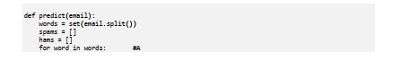


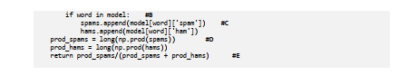


#A For each word in the email, extract the probability that an email is spam (and ham), given that it contains that word.
These probabilities are all saved in the dictionary called ‘model’.
#B Multiply all the probabilities of the email being spam. Call this variable prod_spams.
#C Multiply all the probabilities of the email being ham. Call this variable prod_hams.
#D Normalize these two probabilities, to get them to add to one (using Bayes’ theorem).
#E Return the probability that an email is spam, given that it contains the words.

And that’s it! Let’s test the algorithm on some emails:

```
predict_naive_bayes('hi mom how are you')
0.0013894756610580057
predict_naive_bayes('meet me at the lobby of the hotel at nine am')
0.02490194297492509
predict_naive_bayes('enter the lottery to win three million dollars')
0.38569290647197135
predict_naive_bayes('buy cheap lottery easy money now')
0.9913514898646872
```

Seems to work well. Emails like ‘hi mom how are you’ get a very low probability (about 1%) of
being spam, while emails like ‘buy cheap lottery easy money now’ get a very high probability
(over 99%) of being spam.

## 6.3.5 Further work

This was a quick implementation of the naive Bayes algorithm. But for larger datasets, and
larger emails, I recommend that you use a package. Packages like sklearn offer great
implementations of the naive Bayes algorithm, with many parameters that you can play with.
I encourage you to explore this and other packages, and use the naive Bayes algorithm on all
types of datasets!

## 6.4 Summary

- Bayes theorem is a technique widely used in probability, statistics, and machine
learning.

- Bayes theorem consists in calculating a posterior probability, based on a prior
probability and an event.

- The prior probability is a basic calculation of a probability, given very little information.

- Bayes theorem uses the event to make a much better estimate of the probability in

question.
- The naive Bayes algorithm is used when one wants to combine a prior probability
together with several events.

- The word ‘naive’ comes from the fact that we are making a naive assumption, namely,
that the events in question are all independent.


### Exercises


#### Exercise 1

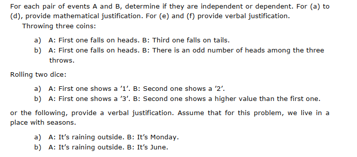

#### Exercise 2


#### Exercise 3

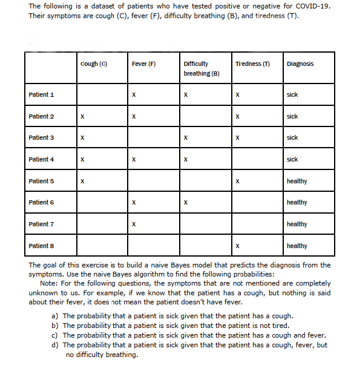


