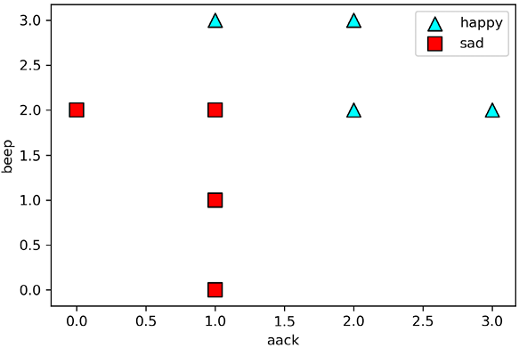
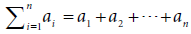
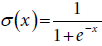
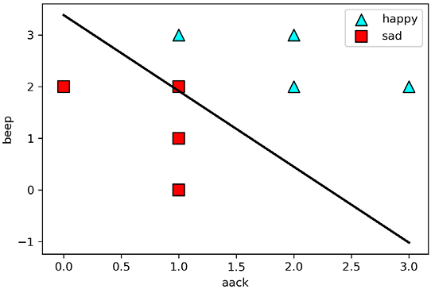
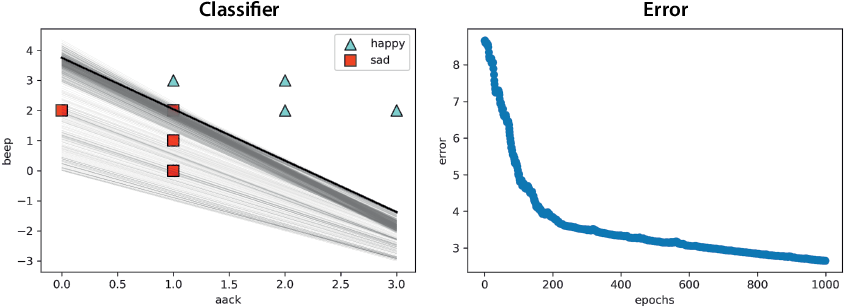
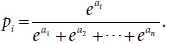

Lab 6: A continuous approach to splitting points: Logistic classifiers
======================================================================

### In this lab

- the sigmoid function, a continuous activation function
- discrete perceptrons vs. continuous perceptrons, also called logistic classifiers
- the logistic regression algorithm for classifying data
- coding the logistic regression algorithm in Python
- using the logistic classifier in Turi Create to analyze the sentiment of movie reviews
- using the softmax function to build classifiers for more than two classes


At the end of the lab, we apply our knowledge to a real-life dataset
of movie reviews on the popular site IMDB
([www.imdb.com](https://www.imdb.com/)). We use a logistic classifier to
predict whether movie reviews are positive or negative.


Coding the logistic regression algorithm
----------------------------------------


In this section, we see how to code the logistic regression algorithm by hand.
The code for this section follows:


- **Notebook**: Coding\_logistic\_regression.ipynb
    -   <https://github.com/fenago/machine-learning/blob/master/Lab_6_Logistic_Regression/Coding_logistic_regression.ipynb>


We'll test our code in the same dataset that we used in lab 5. The
dataset is shown in table 6.9.


The code for loading our small dataset follows, and the plot of the
dataset is shown in figure 6.8:


```
import numpy as np
features = np.array([[1,0],[0,2],[1,1],[1,2],[1,3],[2,2],[2,3],[3,2]])
labels = np.array([0,0,0,0,1,1,1,1])
```





#### Coding the logistic regression algorithm by hand


In this section, we see how to code the logistic trick and the logistic
regression algorithm by hand. More generally, we'll code the logistic
regression algorithm for a dataset with *n* weights. The notation we use
follows:


- Features: *x*~1~, *x*~2~, ... , *x*~n~
- Label: *y*
- Weights: *w*~1~, *w*~2~, ... , *w*~n~
- Bias: *b*


The score for a particular sentence is the sigmoid of the sum of the
weight of each word (*w*~i~) times the number of times that appears
(*x*~i~), plus the bias (*b*). Notice that we use the summation notation
for


.


- Prediction: *ŷ* = *σ*(*w*~1~*x*~1~ + *w*~2~*x*~2~ + ... +
    *w*~n~*x*~n~ + *b*) = *σ*(Σ~i~^n^~=1~*w*~i~ *x*~i~ + *b*).


For our current problem, we'll refer to *x*~aack~ and *x*~beep~ as
*x*~1~ and *x*~2~, respectively. Their corresponding weights are *w*~1~
and *w*~1~, and the bias is *b.*


We start by coding the sigmoid function, the score, and the prediction.
Recall that the formula for the sigmoid function is





```
def sigmoid(x):
    return np.exp(x)/(1+np.exp(x))
```


For the score function, we use the dot product between the features and
the weights. Recall that the dot product between vectors (*x*~1~,
*x*~2~, ... , *x*~n~) and (*w*~1~, *w*~2~, ... , *w*~n~) is *w*~1~
*x*~1~ + *w*~2~ *x*~2~ + ... + *w*~n~ *x*~n~.


```
def score(weights, bias, features):
    return np.dot(weights, features) + bias
```


Finally, recall that the prediction is the sigmoid activation function
applied to the score.


```
def prediction(weights, bias, features):
    return sigmoid(score(weights, bias, features))
```


Now that we have the prediction, we can proceed to the log loss. Recall
that the formula for the log loss is


*log loss* = --*y ln*(*ŷ*) -- (1 -- *y*) *ln*(1 -- *y*).


Let's code that formula as follows:


```
def log_loss(weights, bias, features, label):
    pred = prediction(weights, bias, features)
    return -label*np.log(pred) - (1-label)*np.log(1-pred)
```


We need the log loss over the whole dataset, so we can add over all the
data points as shown here:


```
def total_log_loss(weights, bias, features, labels):
    total_error = 0
    for i in range(len(features)):
        total_error += log_loss(weights, bias, features[i], labels[i])
    return total_error
```


Now we are ready to code the logistic regression trick, and the logistic
regression algorithm. In more than two variables, recall that the
logistic regression step for the *i*-th weight is the following formula,
where *η* is the learning rate:


- *w*~i~ → *w*~i~ + *η*(*y* -- *ŷ*)*x*~i~ for *i* = 1, 2, ... ,
    *n*
- *b* → *b* + *η*(*y* -- *ŷ*) for *i* = 1, 2, ... , *n*.


```
def logistic_trick(weights, bias, features, label, learning_rate = 0.01):
    pred = prediction(weights, bias, features)
    for i in range(len(weights)):
        weights[i] += (label-pred)*features[i]*learning_rate
        bias += (label-pred)*learning_rate
    return weights, bias

def logistic_regression_algorithm(features, labels, learning_rate = 0.01, epochs = 1000):
    utils.plot_points(features, labels)
    weights = [1.0 for i in range(len(features[0]))]
    bias = 0.0
    errors = []
    for i in range(epochs):
        errors.append(total_log_loss(weights, bias, features, labels))
        j = random.randint(0, len(features)-1)
        weights, bias = logistic_trick(weights, bias, features[j], labels[j])
    return weights, bias
```


Now we can run the logistic regression algorithm to build a logistic
classifier that fits our dataset as follows:


```
logistic_regression_algorithm(features, labels)
([0.46999999999999953, 0.09999999999999937], -0.6800000000000004)
```


The classifier we obtain has the following weights and biases:


- *w*~1~ = 0.47
- *w*~2~ = 0.10
- *b* = --0.68


The plot of the classifier (together with a plot of the previous
classifiers at each of the epochs) is depicted in figure 6.9.





In figure 6.10, we can see the plot of the classifiers corresponding to
all the epochs (left) and the plot of the log loss (right). On the plot
of the intermediate classifiers, the final one corresponds to the dark
line. Notice from the log loss plot that, as we run the algorithm for
more epochs, the log loss decreases drastically, which is exactly what
we want. Furthermore, the log loss is never zero, even though all the
points are correctly classified. This is because for any point, no
matter how well classified, the log loss is never zero. Contrast this to
figure 5.26 in lab 5, where the perceptron loss indeed reaches a
value of zero when every point is correctly classified.





Real-life application: Classifying IMDB reviews with Turi Create
----------------------------------------------------------------


In this section, we see a real-life application of the logistic classifier in
sentiment analysis. We use Turi Create to build a model that analyzes
movie reviews on the popular IMDB site. The code for this section
follows:


- **Notebook**: Sentiment\_analysis\_IMDB.ipynb
    -   <https://github.com/fenago/machine-learning/blob/master/Lab_6_Logistic_Regression/Sentiment_analysis_IMDB.ipynb>
- **Dataset**: IMDB\_Dataset.csv


First, we import Turi Create, download the dataset, and convert it into
an SFrame, which we call `movies`, as follows:


```
import turicreate as tc
movies = tc.SFrame('IMDB Dataset.csv')
```


The first five rows of the dataset appear in table 6.10.


The dataset has two columns, one with the review, as a string, and one
with the sentiment, as positive or negative. First, we need to process
the string, because each of the words needs to be a different feature.
The Turi Create built-in function `count_words` in the `text_analytics`
package
is useful for this task, because it turns a sentence into a dictionary
with the word counts. For example, the sentence "to be or not to be" is
turned into the dictionary {'to':2, 'be':2, 'or':1, 'not':1}. We add a
new column called `words` containing this dictionary as follows:


```
movies['words'] = tc.text_analytics.count_words(movies['review'])
```


The first few rows of our dataset with the new column are shown in table
6.11.


We are ready to train our model! For this, we use the function
`create``` in the `logistic_classifier`
package,
in which we specify the target (label) to be the `sentiment`
column
and the features to be the `words` column. Note that the target is
expressed as a string with the name of the column containing the label,
but the features are expressed as an array of strings with the names of
the columns containing each of the features (in case we need to specify
several columns), as shown here:


```
model = tc.logistic_classifier.create(movies, features=['words'], target='sentiment')
```


Now that we've trained our model, we can look at the weights of the
words, with the `coefficients` command. The table we obtain has several
columns, but the ones we care about are `index``` and `value`, which
show the words and their weights. The top five follow:


- (intercept): 0.065
- if: --0.018
- viewing: 0.089
- comfortable: 0.517
- become: 0.106


The first one, called intercept, is the bias. Because the bias of the
model is positive, the empty review is positive, as we learned in
lab 5, in the section "The bias, the *y*-intercept, and the inherent
mood of a quiet alien." This makes sense, because users who rate movies
negatively tend to leave a review, whereas many users who rate movies
positively don't leave any review. The other words are neutral, so their
weights don't mean very much, but let's explore the weights of some
words, such as *wonderful*, *horrible*, and *the*, as shown next:


- wonderful: 1.043
- horrible: --1.075
- the: 0.0005


As we see, the weight of the word *wonderful* is positive, the weight of
the word *horrible* is negative, and the weight of the word *the* is
small. This makes sense: *wonderful* is a positive word, *horrible* is a
negative word, and *the* is a neutral word.


As a last step, let's find the most positive and negative reviews. For
this, we use the model to make predictions for all the movies. These
predictions will be stored in a new column called `predictions```, using
the following command:


```
movies['prediction'] = model.predict(movies, output_type='probability')
```


Let's find the most positive and most negative movies, according to the
model. We do this by sorting the array, as follows:


Most positive review:


```
movies.sort('predictions')[-1]
```


**Output**: "It seems to me that a lot of people don't know that *Blade*
is actually a superhero movie on par with *X-Men*..."


Most negative review:


```
movies.sort('predictions')[0]
```


**Output**: "Even duller, if possible, than the original..."


We could do a lot more to improve this model. For example, some text
manipulation techniques, such as removing punctuation and
capitalization, or removing stop words (such as *the*, *and*, *of*,
*it*), tend to give us better results. But it's great to see that with a
few lines of code, we can build our own sentiment analysis classifier!


Classifying into multiple classes: The softmax function 
---------------------------------------------------------------------------------------------------------------------------------------------------


So
far
we have seen continuous perceptrons classify two classes, happy and sad.
But what if we have more classes? At the end of lab 5, we discussed
that classifying between more than two classes is hard for a discrete
perceptron. However, this is easy to do with a logistic classifier.


Imagine an image dataset with three labels: "dog", "cat", and "bird".
The way to build a classifier that predicts one of these three labels
for every image is to build three classifiers, one for each one of the
labels. When a new image comes in, we evaluate it with each of the three
classifiers. The classifier corresponding to each animal returns a
probability that the image is the corresponding animal. We then classify
the image as the animal from the classifier that returned the highest
probability.


This, however, is not the ideal way to do it, because this classifier
returns a discrete answer, such as "dog," "cat," or "bird." What if we
wanted a classifier that returns probabilities for the three animals?
Say, an answer could be of the form "10% dog, 85% cat, and 5% bird." The
way we do this is using the softmax function.


The softmax function works as follows: recall that a logistic classifier
makes a prediction using a two-step process---first it calculates a
score, and then it applies the sigmoid function to this score. Let's
forget about the sigmoid function and output the score instead. Now
imagine that the three classifiers returned the following scores:


- Dog classifier: 3
- Cat classifier: 2
- Bird classifier: --1


How do we turn these scores into probabilities? Well, here's an idea: we
can normalize. This means dividing all these numbers by their sum, which
is five, to get them to add to one. When we do this, we get the
probabilities 3/5 for dog, 2/5 for cat, and --1/5 for bird. This works,
but it's not ideal, because the probability of the image being a bird is
a negative number. Probabilities must always be positive, so we need to
try something different.


What we need is a function that is always positive and that is also
increasing. Exponential functions work great for this. Any exponential
function, such as 2^x^, 3^x^, or 10^x^, would do the job. By default, we
use the function *e*^x^, which has wonderful mathematical properties
(e.g., the derivative of *e*^x^ is also *e*^x^ ). We apply this function
to the scores, to get the following values:


- Dog classifier: *e*^3^ = 20.085
- Cat classifier: *e*^2^ = 7.389
- Bird classifier: *e*^--1^ = 0.368


Now, we do what we did before---we normalize, or divide by the sum of
these numbers for them to add to one. The sum is 20.085 + 7.389 + 0.368
= 27.842, so we get the following:


- Probability of dog: 20.085/27.842 = 0.721
- Probability of cat: 7.389/27.842 = 0.265
- Probability of bird: 0.368/27.842 = 0.013


These are the three probabilities given by our three classifiers. The
function we used was the softmax, and the general version follows: if we
have *n* classifiers that output the *n* scores *a*~1~, *a*~2~, ... ,
*a*~n~, the probabilities obtained are *p*~1~, *p*~2~, ... , *p*~n~,
where





This formula is known as the softmax function.


What would happen if we use the softmax function for only two classes?
We obtain the sigmoid function. Why not convince yourself of this as an
exercise?


Summary
-------


- Continuous perceptrons, or logistic classifiers, are similar to
    perceptron classifiers, except instead of making a discrete
    prediction such as 0 or 1, they predict any number between 0
    and 1.
- Logistic classifiers are more useful than discrete perceptrons,
    because they give us more information. Aside from telling us which
    class the classifier predicts, they also give us a probability. A
    good logistic classifier would assign low probabilities to points
    with label 0 and high probabilities to points with label 1.
- The log loss is an error function for logistic classifiers. It is
    calculated separately for every point as the negative of the natural
    logarithm of the probability that the classifier assigns to its
    label.
- The total log loss of a classifier on a dataset is the sum of the
    log loss at every point.
- The logistic trick takes a labeled data point and a boundary line.
    If the point is incorrectly classified, the line is moved closer to
    the point, and if it is correctly classified, the line is moved
    farther from the point. This is more useful than the perceptron
    trick, because the perceptron trick doesn't move the line if the
    point is correctly classified.
- The logistic regression algorithm is used to fit a logistic
    classifier to a labeled dataset. It consists of starting with a
    logistic classifier with random weights and continuously picking a
    random point and applying the logistic trick to obtain a slightly
    better classifier.
- When we have several classes to predict, we can build several
    linear classifiers and combine them using the softmax
    function.


Exercises
---------


#### Exercise 6.1


A dentist has trained a logistic classifier on a dataset of patients to
predict if they have a decayed tooth. The model has determined that the
probability that a patient has a decayed tooth is


where


- *d* is a variable that indicates whether the patient has had
    another decayed tooth in the past, and
- *c* is a variable that indicates whether the patient eats
    candy.


For example, if a patient eats candy, then *c* = 1, and if they don't,
then *c* = 0. What is the probability that a patient that eats candy and
was treated for a decayed tooth last year has a decayed tooth today?


#### Exercise 6.2


Consider the logistic classifier that assigns to the point (*x*~1~,
*x*~2~) the prediction *ŷ* = *σ*(2*x*~1~ + 3*x*~2~ -- 4), and the point
*p* = (1, 1) with label 0.


1. Calculate the prediction *ŷ* that the model gives to the point
    *p*.
2. Calculate the log loss that the model produces at the point
    *p*.
3. Use the logistic trick to obtain a new model that produces a
    smaller log loss. You can use *η* = 0.1 as the learning rate.
4. Find the prediction given by the new model at the point *p*, and
    verify that the log loss obtained is smaller than the
    original.


#### Exercise 6.3


Using the model in the statement of exercise 6.2, find a point for which
the prediction is 0.8.


##### hint


First find the score that will give a prediction of 0.8, and recall that
the prediction is *ŷ* = *σ*(score).
