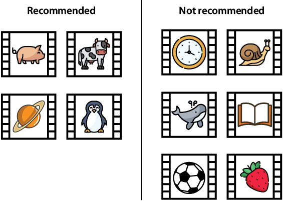

Lab 7: How do you measure classification models? Accuracy and its friends
=========================================================================

Exercises
---------

#### Exercise 7.1

A video site has established that a particular user likes animal videos
and absolutely nothing else. In the next figure, we can see the
recommendations that this user got when logging in to the site.

If this is all the data we have on the model, answer the following
questions:

1. What is the accuracy of the model?
2. What is the recall of the model?
3. What is the precision of the model?
4. What is the *F*~1~-score of the model?
5. Would you say that this is a good recommendation model?

#### Exercise 7.2

Find the sensitivity and specificity of the medical model with the
following confusion matrix:

#### Exercise 7.3

For the following models, determine which error is worse, a false
positive or a false negative. Based on that, determine which of the two
metrics, precision or recall, we should emphasize on when evaluating
each of the models.

1. A movie-recommendation system that predicts whether a user will
    watch a movie
2. An image-detection model used in self-driving cars that detects
    whether an image contains a pedestrian
3. A voice assistant at home that predicts whether the user gave it an
    order

#### Exercise 7.4

We are given the following models:

1. A self-driving car model for detecting a pedestrian based on the
    image from the car's camera
2. A medical model for diagnosing a deadly illness based on the
    patient's symptoms
3. A recommendation system for movies based on the user's previous
    movies watched
4. A voice assistant that determines whether the user needs assistance
    given the voice command
5. A spam-detection model that determines whether an email is spam
    based on the words in the email

We are given the task of evaluating these models using *F*~β~-scores.
However, we haven't been given the values of *β* to use. What value of
*β* would you use to evaluate each of the models?
