## Splitting data by asking questions: Decision trees

**This chapter covers**

- What is a decision tree?

- Recommending apps using the demographic information of the users.

- Asking a series of successive questions to build a good classifier.

- Accuracy, Gini index, and Entropy, and their role in building decision trees.

- Examples of decision trees in fields such as biology and genetics.

- Coding the decision tree algorithm in Python.

- Separating points of different colors using a line.


#### Pre-reqs:
- Google Chrome (Recommended)

#### Lab Environment
Notebooks are ready to run. All packages have been installed. There is no requirement for any setup.

**Note:** Elev8ed Notebooks (powered by Jupyter) will be accessible at the port given to you by your instructor. Password for jupyterLab : `1234`

All Notebooks are present in `work/machine-learning` folder.

You can access jupyter lab at `<host-ip>:<port>/lab/workspaces/lab7_decision_trees`

In this chapter, I cover decision trees. Decision trees are very powerful models which help us
classify data and make predictions. Not only that, they also give us a great deal of information
about the data. Like the models in the previous chapters, decision trees are trained with
labelled data, where the labels (or targets) that we want to predict are given by a set of
classes. The classes can be yes/no, spam/ham, dog/cat/bird, or anything that we wish to
predict based on the features. Decision trees are a very intuitive way to build classifiers, and
one that really resembles human reasoning.
In this chapter you will learn how to build decision trees that fit your data. The algorithm
that we use to build decision trees is quite intuitive, and in a nutshell, it works the following
way:

1. Picks the most determining feature, and divides the data according to that feature. In
other words, among all the features in the data, picks the one that best divides the
labels.

2. Either makes the prediction based on the answer to that question, or picks another
feature (the next most determining), and iterates.

This may sound complicated, but it is not, I promise. Consider the following scenario. You
want to decide if you should wear a jacket today. What does the decision process look like?
You may look outside and check if it’s raining. If it’s raining, then you definitely wear a jacket.
If it’s not, then it could be that it’s hot outside, or cold. So then you check the temperature,
and if it is hot, then you don’t wear a jacket, but if it is cold, then you wear a jacket. In Figure
7.1 we can see a graph of your decision process.

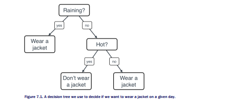

As you can see, our decision process looks like a tree, except upside down. On the very top
you can see the tree stump (which we call the root), from which two branches emanate. We
call this a binary tree. Each branch leads to a new tree stump (which we call a node), from
which it again splits in two. At every node there is a yes/no question. The two branches
coming out of the node correspond to the two possible answers (yes or no) to this question.
As you can see, the tree doesn’t go on forever, and there are nodes where the tree simply
stops branching out. We call these leaves. This arrangement of nodes, leaves, and edges is
what we call a decision tree. Trees are very natural objects in computer science, since
computers can be broken down to a huge number of on and off switches, which is why
everything in a computer is binary.

**DECISION TREE** A classification model based on yes/no questions and represented by a binary tree. The
tree has a root, nodes, and leaves.

**ROOT** The topmost node of the tree. It contains the first yes/no question.

**NODE** Each yes/no question in our model is represented by a node, or decision stump, with two branches
emanating from it (one for the ‘yes’ answer, and one from the ‘no’ answer).

**LEAF** When we reach a point where we don’t ask a question and instead we make a decision, we have reached a leaf of the tree.

Figure 7.2 shows how a decision tree looks like in general.

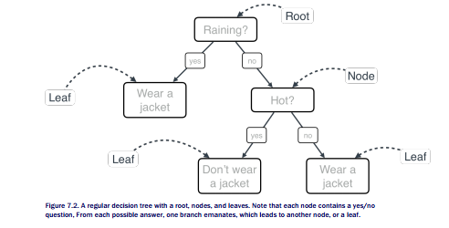

But how did we get to build that tree? Why were those the questions we asked? We could
have also checked if it was monday, if we saw a red car outside, or if we were hungry, and
built the following decision tree:

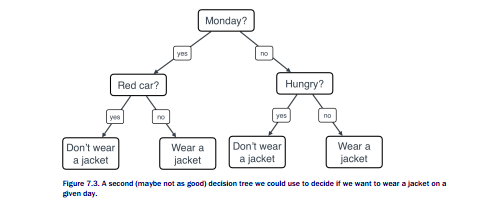

Which tree do we think is better, tree 1 (the one in Figure 7.1), or tree 2 (the one in Figure
7.3)? Well, as humans, we have enough experience to figure out that tree 1 is much better
than tree 2. Now the question is, how would a computer know? Computers don’t have
experience per se, but they have something very similar, which is data. So if we wanted to
think like a computer, we could just go over all possible trees, try each one of them for some
time, say, one year, and compare how well they did by counting how many times we made
the right decision using each tree. We’d imagine that if we use tree 1, we were correct most
days, while if we used tree 2, we may have ended up freezing on a cold day without a jacket,
or wearing a jacket in extreme heat. So all a computer has to do is go over all trees, collect
data, and find which one is the best one, right?

Almost! Unfortunately even for a computer, searching over all the possible trees to find the
most effective one would take a really long time. But luckily, we have algorithms that make
this search much faster, and thus, we can use decision trees for many wonderful applications,
including spam detection, sentiment analysis, medical diagnosis, and much more. In this
chapter, we’ll go over an algorithm for constructing good decision trees quickly. In a nutshell,
the process goes as follows.

## PICKING A GOOD FIRST QUESTION

We need to pick a good first question for the root of our tree. What would this first question
be? Initially, it can be anything. Let’s say we come up with five candidates for our first
question:
1. Is it raining?
2. Is it hot outside?
3. Am I hungry?

4. Is there a red car outside?
5. Is it Monday?

Let’s think, out of these five questions, which one seems like the best one to ask if our goal is
to determine when we should wear a jacket or not. I’ll say that the last three questions are
pretty irrelevant when it comes to wearing a jacket or not. We should decide between the first
two. In this chapter, we learn how to pick the right question based on data, so we’ll get into
details later. But for now, imagine that for an entire year, we decide if we wear a jacket or not
based on if it’s raining or not, and for another entire year, we decide if we wear a jacket or not
based on if it was hot outside or not. We check how many times we were correct, namely, how
many times we wore a jacket when we should have, and not wore one when we shouldn’t
have, and we see that in the first year, we were correct 250 times, and in the second year we
were correct only 220 times. Therefore, the first question is better, based on our data. We’ll
go for that one. Therefore, we have a very simple decision tree, consisting of only one
question. The tree is illustrated in Figure 7.4.

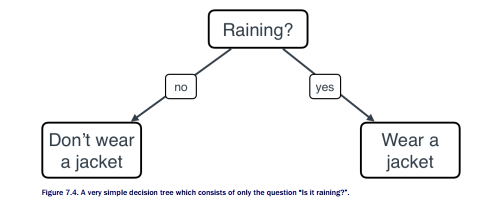

Now, can we do better? Let’s say we noticed that the right part of the tree is very accurate,
namely, that whenever it’s raining, and we wear a jacket, we made the correct decision. But
the left part of the tree is not so correct, since there were many times when it wasn’t raining,
and we decided to not wear a jacket, but we were wrong. Maybe it was very cold, or maybe it
was snowing! So what can we do? Well, now question 2 can come to our rescue. After we
check that it is not raining, then we check the temperature, and if it is cold, we decide to wear
a jacket. This turns the left leaf of the tree into a node, with two leaves emanating from it, as
in Figure 7.5.

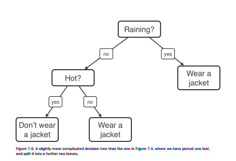

Now we have our decision tree. Can we do better? Maybe we can, if we add more questions
and more nodes and leaves to our tree. But for now, this one works very well. In this
example, we made our decisions using some data, but also some human intuition. In this
chapter, we’ll learn an algorithm that builds these trees solely based on data.
Many questions may arise in your head, for example:

1. How exactly do you decide which is the best possible question to ask?
2. Does this process actually gets us to build the very best decision tree? What if I start in
a different way, by not picking the best question every time, and I get to a better tree?
3. How is this process any faster than going through all possible decision trees?
4. How do we code this algorithm?
5. Where in real life can we find decision trees?

This chapter answers all of these questions, but let me give you some quick answers:

6. **How exactly do you decide which is the best possible question to ask?**
There are several ways to do this. The simplest one is using accuracy, which means,
which question helps me be correct more often. However, others such as Gini index or
entropy will be used in this book as well.


7. **Does this process actually gets us to build the very best decision tree? What if I start in a different way, by not picking the best question every time, and I get to a better tree?**

Actually, this process does not guarantee that we get the best possible tree. This is
what we call a greedy algorithm. Greedy algorithms work as follows: at every point, the
algorithm makes the best possible move at that moment. They tend to work well, but
it’s not always the case that making the best possible move gets you to the best
outcome. There may be times in which asking a weaker question groups our data in a
way that we end up with a better tree at the end of the day. However, the algorithms
for building decision trees tend to work very well and very quickly, so we’ll live with
this. I challenge you to look at the algorithms that we see in this chapter, and try to
figure out ways to improve them by removing the greedy property!

8. **How is this process any faster than going through all possible decision trees?**

The number of possible decision trees is very large, specially if our dataset has many
features. Going through all of them would be very slow. In here, finding each node only
requires a search across the features, and not across all the possible trees, so it is
much faster.

9. **How do we code this algorithm?**

Yep! By the end of this chapter we’ll code most elements of this algorithm. However,
you’ll see that since the algorithm is recursive, the coding can get a bit tedious. Thus,
we’ll use a very useful package called scikit learn to build decision trees with real data.

10. **Where in real life can we find decision trees?**

In many places! They are used extensively in machine learning, not only because they
work very well, but also because they give us a lot of information on our data. Some
places in which decision trees are used is in recommendation systems (to recommend
videos, movies, apps, products to buy, etc.), in spam classification (to decide if an
email is spam or not), in sentiment analysis (to decide if a sentence is happy or sad),
and in biology (to decide if a patient is sick or not, or to help identify certain hierarchies
in species or in types of genomes).

All these will be answered in this chapter, and more! Let’s begin by introducing a very popular
application in machine learning: recommendation systems.

## 7.1 The problem: We need to recommend apps to users according to what they are likely to download

Recommendation systems are one of the most common and exciting applications in machine
learning. Have you wondered how Netflix recommends you movies, YouTube guesses which
videos you may watch, or Amazon recommends you products you might be interested in
buying? These are all uses of recommendation systems. One very simple and interesting way


to see recommendation problems is to see them as classification problems. Let’s start with an
easy example, we’ll develop our very own app recommendation system using decision trees.

Let’s say we are the App Store, or Google Play, and we want to recommend to our users
the app that they are most likely to download. We have three apps in our store:

- Atom Count: An app that counts the number of atoms in your body.

- Beehive Finder: An app that maps your location and finds the closest beehives.

- Check Mate Mate: An app for finding Australian chess players.

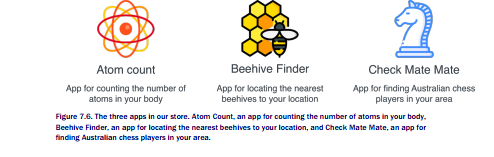

We look at a table of previous data, where we have recorded the gender and age of our users,
and the app that they have downloaded. For simplicity, we will use a table of 6 people (Table
7.1)

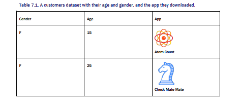

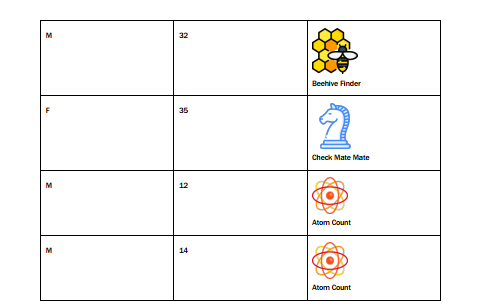

Now, the following customers start to log into the store, so let’s recommend some apps to
them. What would you recommend to each of the following customers?

Customer 1: A girl aged 13. To this customer, I would recommend Atom Count, and the
reason is because it seems (looking at the three customers on their teens) that young people
tend to download Atom Count.

Customer 2: A woman aged 27. To this customer, I would recommend Check Mate Mate, since
looking at the two adult women in the dataset (aged 25 and 35), they both downloaded Check
Mate Mate.

Customer 3: A man aged 34. To this customer, I would recommend Beehive Finder, since
there is one man in the dataset who is 32 years old, and he downloaded Beehive Finder.

You may have had the same or different recommendations than me, and that is ok, as long as
you have a justification for the recommendation. However, going customer by customer
seems like a tedious job. Next, we’ll build a decision tree to take care of all customers at once.


## 7.2 The solution: Building an app recommendation system

In this section I show you how to build an app recommendation system using decision trees.
In a nutshell, what we’ll do is decide which of the two features (gender or age) is more
successful at determining which app will the users download, and we’ll pick this one as our
root of the decision tree. Then, we’ll iterate over the branches, always picking the most
determining feature for the data in that branch, thus building our decision tree.

## 7.2.1 The remember-formulate-predict framework

As we do for most algorithms in this book, we’ll build the remember-formulate-predict
framework which we learned in Chapter 1. This one works as follows:

1. **Remember:** Look at previous data (previous customers, their age, gender, and what
apps they have downloaded).
2. **Formulate:** Formulate a rule that tells us if which app a new customer is most likely to
download.
3. **Predict:** When a new customer comes in, we use the rule to guess what app they are
most likely to download, and we recommend them that app.
In this case, the model will be a decision tree. Let’s build it step by step.

## 7.2.2 First step to build the model: Asking the best question
We are now focused on step 2, formulate a model. First, let’s simplify our data a little bit, let’s
call everyone under 20 years old ‘young’, and everyone 20 or older ‘adult’. Our table now
looks like Table 7.2:

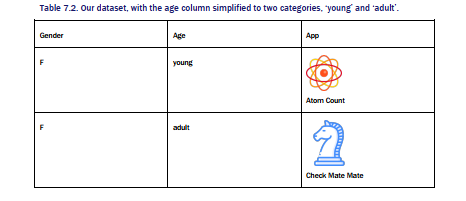

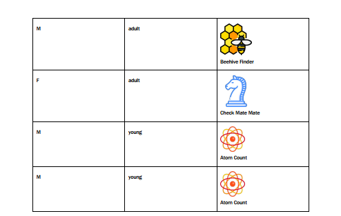

The building blocks of decision trees are questions of the form “Is the user female?” or “Is the
user young?”. We need one of these to use as our root of the tree. Which one should we pick?
We should pick the one that determines the app they downloaded best. In order to decide
which question is better at this, let’s compare them.

**First question: Is the user female or male?**

This question splits the users into two groups, the females and the males. Each group has 3
users in it. But we need to keep track of what each user downloaded. A quick look at Table 7.2
helps us notice that:

- Out of the females, one downloaded Atom Count and two downloaded Check Mate
Mate.

- Out of the males, two downloaded Atom Count and one downloaded Beehive Finder.

The resulting node is drawn in Figure 7.7.

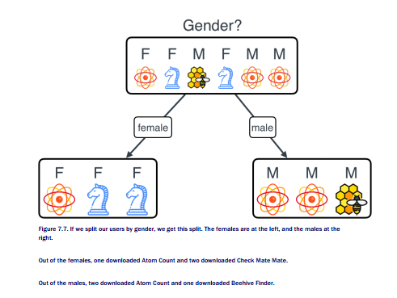

Now let’s see what happens if we split them by age.

**Second question: Is the user young or adult?**

This question splits the users into two groups, the young and the adult. Again, each group has
3 users in it. A quick look at Table 7.2 helps us notice what each user downloaded:

- Out of the young users, all downloaded Atom Count.

- Out of the adult users, two downloaded Atom Count and one downloaded Beehive
Finder.

The resulting node is drawn in Figure 7.8.

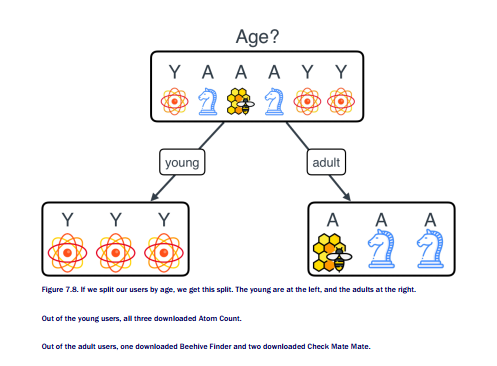

From looking at figures 5.8 and 5.9, which one looks like a better split? To me it seems that
age is better, since it has picked up on the fact that all three young people downloaded Atom
Count. But we need the computer to figure out that age is a better feature, so we need to give
it some numbers to compare. Later in this chapter we learn three ways to attach a number to
each of the features, in order to compare them. These are called accuracy, Gini impurity, and
information gain. Let’s start with the first one: accuracy.

## Accuracy

Suppose that we are only allowed one question, and with that one question we must
determine what app to recommend to our users. So we have two classifiers:

- **Classifier 1:** Asks the question ‘what is your gender?’, and from there, determines
what app to recommend.

- **Classifier 2:** Asks the question ‘what is your age?’, and from there, determines what
app to recommend.

Let’s look more carefully at the classifiers.

**Classifier 1:** If the answer to the question is ‘female’, then we notice that out of the females,
the majority downloaded

From the previous reasoning, we have the hunch Classifier 1 is better than Classifier 2, but
let’s compare the two of them, based on accuracy. In other words, let’s

The reason is that once we split by gender, we still have both apps on each of the sides, but if
we split by age, we can see that every young person downloaded Atom Count. Therefore, if all
we can do is ask one question, we’re better off asking “What is your age?”, than “What is your
gender?”. This last argument may sound a bit vague, but let me give you a convincing
statement. If we were to only use one question for our classifier, and then use that to
recommend products, what would we recommend? It makes sense to recommend the most
popular app in a particular group, right? If, for example, two out of the three adults
downloaded Check Mate Mate, it makes sense to recommend Check Mate Mate to every adult,
and be correct 2 out of 3 times, as opposed to recommending Instagram and being correct 1
out of 3 times. If we do that with both trees, we can see the comparison of how many times
we are correct in Figure 7.10.

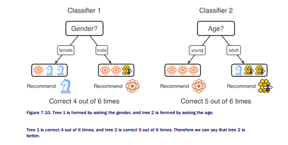

There are actually many ways to see that tree 2 is better than tree 1. Later in section 5.3, we
will revisit accuracy, and introduce two new ways to compare the trees.


## 7.2.3 Next and final step: Iterate by asking the best question every time

Let’s continue building our tree. We have decided that if a person is young, we’ll recommend
them Atom Count. This means at that point we stop. As we saw before, this is called a leaf.
If they are adults, however, we can recommend them Check Mate Mate, but we can do
better. Let’s look at the original table, reduced to only the adults (Table 7.3).

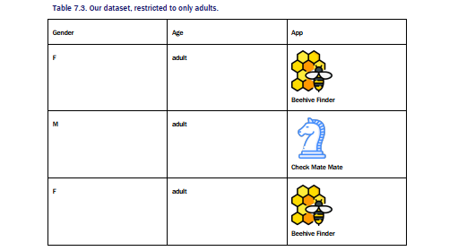

What do we see here? Well, notice that if we now divide the users by gender, we get that the
males (only one male) downloaded Instagram, while the females downloaded Check Mate
Mate. Therefore, we can just add this branch to our tree, to obtain the one in Figure 7.11.

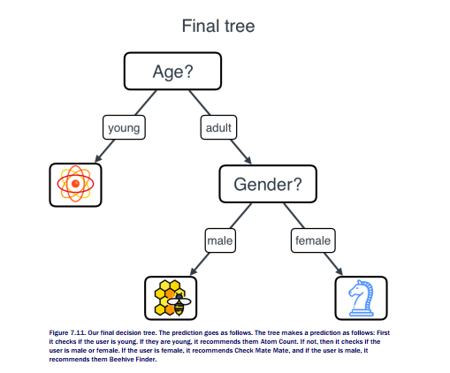

And we’re done! This is our decision tree. Here is the pseudocode for the predictions that this
model makes.

```
predict(user):
if user is young:
recommend Atom Count
else:
if user is female:
recommend Check Mate Mate
else:
recommend Beehive Finder
```

## 7.2.4 Using the model by making predictions

Now that we have a tree, let’s put it in practice by making predictions. This is the simplest
part. Let’s go back to our three users from the beginning:

Customer 1: A girl aged 13. Based on the age question, since she is young, we recommend
her Atom Count.

Customer 2: A woman aged 27. First we ask the age question, and since she is an adult, then
we ask the gender question. Since she is a female, we recommend her Check Mate Mate.

Customer 3: A man aged 34. Again we ask the age question, and since he is an adult, we ask
the gender question. Since he is a male, we recommend him Instagram.

Notice that this matches our intuition from the beginning of the chapter. That means our
decision tree worked!
Now, there was one little step here that we didn’t elaborate much on. It’s the step where
we decided that age was a better split than gender. Let’s study this one in more detail with a
slightly different example.

## 7.3 Building the tree: How to pick the right feature to split

In the previous section, we picked the ‘age’ split against the ‘gender’ split, because age
correctly classified five out the the six users, while gender correctly classified four. But there
are actually many ways to select between the two splits. Let’s modify our dataset a little bit.
Our new dataset has now three features, gender, age, and location. The location is where each
user lives, and it can only be one of two cities: city A and city B. Furthermore, there are only
two apps to download, instead of three, and their names are App 1 and App 2. The table looks
as follows (Table 7.4):

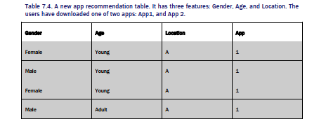

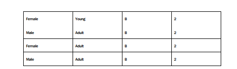

Note that we have three possible splits, gender, age, and location. We’ll study each one
separately.

- If we split on gender, we have four females and four males. Among the four females,

- If we split on age, we have four young users and four adult users. Among the four
young ones, three downloaded App 1, and one downloaded App 2. Among the adults,
one downloaded App 1, and three downloaded App 2.

- If we split on location, we have four users who live on City A, and four on City B. The
four that live on City A downloaded App 1, and the four that live on City B downloaded
App 2.

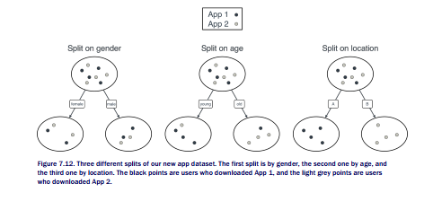

This three splits are shown graphically in Figure 7.12. From looking at the graphs, it looks
clear that the best split is on location, since it completely determines who downloaded App 1
and App 2. Here is a question, which split is better between the split by gender and age? From
first glance, it seems that age is better, since it manages to put most of the users who

downloaded App 1 on one side, and most of the users who downloaded App 2 on the other
side. The split by gender leaves us with two groups where two users downloaded App 1 and
two users downloaded App 2, which gives us very little information. So for us, it seems that
the order is: Location is best, age is next, and gender is the worst. However, computers need
numbers, so we need a way to quantify how good these three splits are. We’ll learn three
ways to quantify how good these are: Accuracy (which we briefly used before), Gini impurity,
and information gain. Let’s study them one by one.

## 7.3.1 How to pick the best feature to split our data: Accuracy

The first way to split the points is based on accuracy. We briefed this in the previous section,
but let’s study it in more detail. The question we’d like to as here is, “if my classifier only
consisted on asking one question, what would be the best question to ask? Each question
gives rise to a particular classifier, as follows.

**Classifier 1:** What is your gender?

The idea is to have a classifier that says “If you are a female, you downloaded App X, and if
you are a mail, you downloaded App Y”. Since among the four females, two downloaded App
1, and two downloaded App 2, it doesn’t make any difference to pick App 1 or 2. With the
males we have the exact same situation. Therefore, we can decide that our classifier predicts
App 1 for the females, and App 2 for the males.
Now the question is, what is the accuracy of this classifier? Among our data, the classifier
was correct four times, and wrong four times. Therefore, the accuracy of this classifier is ½, or
50%.

**Classifier 2: What is your age?**

Now, we’d like to build a classifier that says “If you are young, you downloaded App X, and if
you are an adult, you downloaded App Y”. Let’s see what is the best classifier that we can
build using this question. Notice that among the four young users, three downloaded App 1,
and one downloaded App 2. Therefore, the best prediction we can make here, is that every
young user downloaded App 1. Among the adults, the opposite happens, since one of them
downloaded App 1, but three downloaded App 2. Therefore, the best prediction we can make
is that every adult user downloaded App 2.

And again, the question is, what is the accuracy of this classifier? Among our data, the
classifier was correct six times, and wrong two times. Therefore, the accuracy of this classifier
is ¾, or 75%.

**Classifier 3:** What is your location?

Finally, we’d like to build a classifier that says “If you live in City A, you downloaded App X,
and if you live in City B, you downloaded App Y”. Notice that all the people in City A
downloaded App 1, and all the people in City B downloaded App 2. Therefore, the best


prediction we can make here, is that every person in City A downloaded App 1, and every
person in City B downloaded App 2.
What is the accuracy of this classifier? Well, among our data, it is correct eight times out of
eight. Therefore its accuracy is 100%.
The three classifiers, together with their accuracies, are shown in Figure 7.13.

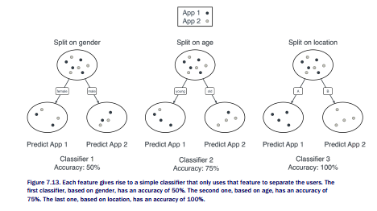

From these three classifiers, we can see that Classifier 3 is the best, as its accuracy is 100%.
Therefore, we conclude that the best feature to split is location.

## 7.3.2 How to pick the best feature to split our data: Gini impurity

The idea behind the concept of impurity is to come up with a number that is low if a set is very
homogeneous, and high if a set is very hetereogeneous. In other words, if we have a set in
which all the elements look the same, then the impurity index is very low, and if all the
elements look different, then the impurity index is very high. In the previous section, we split
our dataset into sets of four users. If we only consider what apps they downloaded, we got the
following sets:

- **Set 1:** App 1, App 1, App 1, App 1.

- **Set 2:** App 1, App 1, App 1, App 2.

- **Set 3:** App 1, App 1, App 2, App 2.

- **Set 4:** App 1, App 2, App 2, App 2.

- **Set 5:** App 2, App 2, App 2, App 2.

Notice that sets 1 and 5 are completely homogeneous, since all users downloaded the same
app. These two would have a very low impurity index. Set 3 is the most diverse, since it has
two users downloading App 1, and two users downloading App 2. This set would have a high
impurity index. Sets 1 and 4 are in between, so they would have a medium impurity index.
Now the question is, how do we come up with a good formula for the impurity index? There
are many ways to quantify the impurity in a set, and in this section I will show you one called
the Gini impurity index.
In a nutshell, the Gini impurity index measures the diversity in a set. Let’s say, for
example, that we have a bag full of balls of several colors. A bag where all the balls have the
same color, has a very low Gini impurity index (in fact, it is zero). A bag where all the balls
have different colors has a very high Gini impurity index.

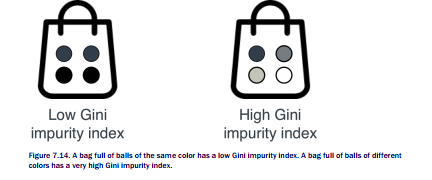

Like everything in math, we need to attach a number to the Gini impurity index, and for this,
we turn to our good old friend, probability. In a bag full of balls of different colors, we play the
following game. We pick a ball out of this set, randomly, and we look at its color. Then we put
the ball back. We proceed to randomly pick another ball from the bag (it could happen that it
is the same ball, or a different one, we don’t know). We look at its color. We record the two
colors we obtained, and we check if they are equal, or different. Here is the main observation
of Gini index:

• If the set has low Gini impurity index, then most balls are of the same color. Therefore
the probability that the two balls are of different color is very low.

• If the set has high Gini impurity index, then the balls tend to be of different colors.
Therefore the probability that the two balls are of different color is very high


That probability is the Gini impurity index. In this section, we’ll find a nice closed formula that
calculates it.

Let’s go back to the example with App 1 and App 2. For convenience, we’ll think of App 1
as a black ball, and App 2, as a white ball. Our sets are then the following:

**Set 1:** {black, black, black, black}

**Set 2:** {black, black, black, white}

**Set 3:** {black, black, white, white}

**Set 4:** {black, white, white, white}

**Set 5:** {white, white, white, white}

Notice that in sets that are very pure, like Set 1 or Set 5, the probability of picking two balls of
different colors are very low (0, in fact). In sets that are very impure, like Set 3, this
probability is high. Let’s actually calculate this probability for all the sets.

**Set 1:**

Since there are no white balls, the probability of picking a pair of different balls is exactly zero.
To remove any shadow of doubt, Figure 7.15 shows all the 16 possible scenarios of picking the
first and second balls, and none of them contain a pair in which the balls have different colors.

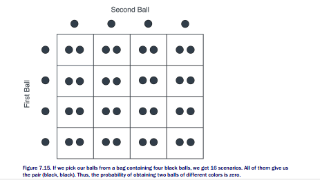

Therefore, we define the Gini impurity of Set 1 to be 0.

**Set 2:**

Now things start getting interesting. We need to pick either the pair (black, white), or the pair
(white, black). What is the probability of picking the pair (black, white)? Since we have 4 ways
of picking the first ball, and 4 ways of picking the second ball, then there are 16 possible
scenarios. Figure 18 contains the all the scenarios for black and white balls, and you can see
that only 6 of them produce the desired result of two balls of different colors. We’ve
highlighted these 6 scenarios.

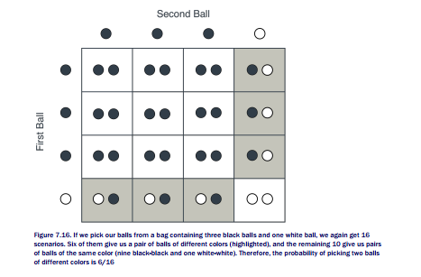

Therefore, the probability of picking two balls of different colors is 6/16. We then define the
Gini impurity of Set 2 to be 6/16 (or 0.375).

**Set 3:**

Again, we have 16 possible scenarios. Figure 7.17 shows them, and you can notice that 8 of
them (exactly half) give us a pair of balls of different colors.

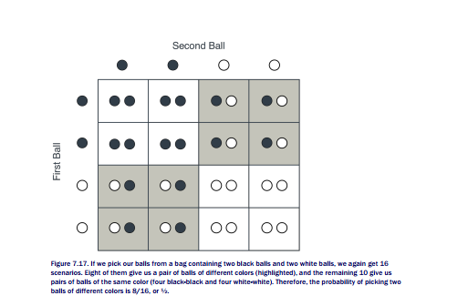

Therefore, the probability of picking two balls of different colors is 8/16. We then define the
Gini impurity of Set 2 to be 8/16 (or 0.5).

**Sets 4 and 5:**

Notice that Set 4 is just the mirror image of Set 1, and Set 5 is the mirror image of Set 2.
Therefore, their Gini impurity index should be the same as the original one. In other words,
the Gini impurity index of Set 4 is 0.375, and that of Set 5 is 0.
Going back to App 1 and App 2 and summarizing, this is what we have calculated for the
Gini impurity indices of our sets.

- **Set 1:** (App 1, App 1, App 1, App 1}. Gini impurity index: 0.

- **Set 2:** (App 1, App 1, App 1, App 2}. Gini impurity index: 0.375.

- **Set 3:** (App 1, App 1, App 2, App 2}. Gini impurity index: 05.

- **Set 4:** (App 1, App 2, App 2, App 2}. Gini impurity index: 0375.

- **Set 5:** (App 2, App 2, App 2, App 2}. Gini impurity index: 0.


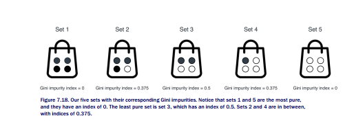

Seems like exactly what we wanted. Set 3 has a high Gini impurity index (0.5), Sets 1 and 5
have a low one (0), and Sets 2 and 4 have a medium one (0.375).

**Formula for Gini index**

Like everything in machine learning, Gini index has a formula. And the formula is rather
simple. Let’s calculate it, for example, for the bag with three black balls and one white ball.
What is the probability that we pick a ball out of this bag, we look at it and put it back, then
we pick another ball, and both balls are of different color? This is called picking a ball with
repetition, since we put the first ball back after we pick it. Let’s consider the complementary
event, namely, that both balls are of the same color. Clearly, whatever we obtain for this last
probability, should be one minus the original one, since two probabilities of complementary
events must add to one (as we learned in Chapter 5). Now, what is the probability that both
balls are the same color? Well, the balls could both be black, or white. The probability that a
ball is black is ¾, so the probability that both balls are white i ¾ * ¾ = 9/16. Similarly, the
probability that both balls are white is ¼ * ¼ = 1/16. We add these two to obtain the
probability that the balls are of the same color, and we get 10/16. The complementary
probability, then, is 1 - 10/16, which is 6/16. This is the probability that the balls are of a
different color.

Now, let’s do this in general. Let’s say we have N balls, that could be of k colors, 1, 2,…, k.
Say that there are ai balls of color i (therefore, a1 + a2 + … + ak = N). The probability of
picking a ball of color i is . Therefore, the probability of picking two balls of color i is pi2.
Thus, the probability of picking two balls of the same color is p12 + p22 + …+ pk2, since the two
balls could be of colors 1, 2,..., k. The complement of this event is the event that we picked
two balls of different color. Therefore, the probability that we picked two balls of different color
(or the Gini impurity index) is

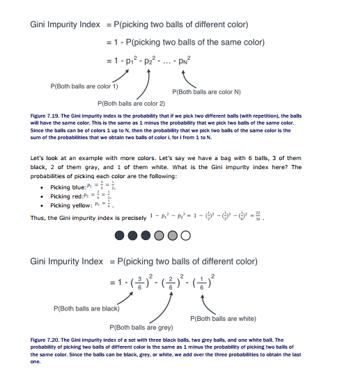


## HOW TO PICK THE BEST FEATURE? GINI GAIN

Now that we know how to calculate the Gini impurity index, we’ll use this for our decision tree.
All we have to do is simply calculate the Gini impurity index of the root, and of the two leaves,
and see where we had the most gain. Let me be more specific.
Procedure to measure a split:

- Calculate the Gini impurity index of the root.

- Calculate the average of the the Gini impurity indices of the two leaves.

- Subtract them, to obtain the gain on Gini impurity index.

Now, among all the splits, we simply pick the one with the highest gain on Gini impurity index.
Figure .23 shows this calculation for our app example.

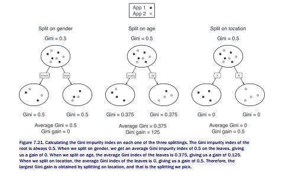

Now we simply select the split that gives us the smallest possible Gini impurity, which is the
third one.


## WEIGHTED GINI IMPURITY

You may be asking a question, which is, “Why did we average out the Gini impurity?”. In
reality what we want to consider is a weighted average. This is because when we split our data
based on a feature, we want the two sets to be as pure as possible, but we also want them to
be balanced in terms of size. For example, if we split a set of 100 data points into one of size
99, and one of size 1, then this is not a very good splitting, even if the set of 1 is pure (which
it is). Thus, we want to add the Gini impurity of the first set, times 99/100, and the Gini
impurity of the second set, times 1/100. In Figure 7.22 we can see an example of a splitting of
8 data points into sets of size 6 and 2, where the Gini impurity is calculated as a weighted
sum.

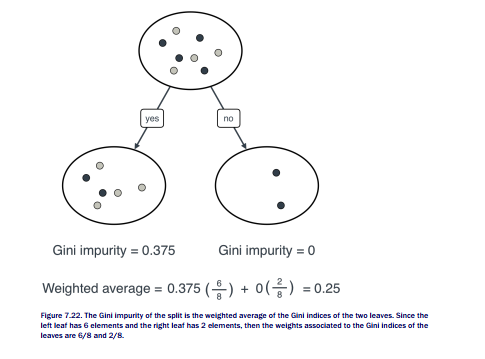


## 7.4 Back to recommending apps: Building our decision tree using Gini index

In section 5.2 we built a decision tree for our app recommendation dataset, based on
accuracy. In this section we’ll build it using Gini impurity. Will we get the same decision tree?
Let’s see!

In Table 7.5 we can see the dataset again.

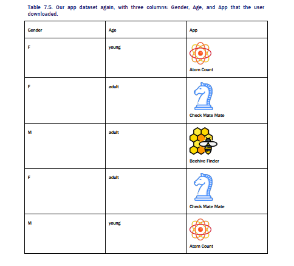

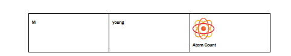

In order to build this tree, we’ll first calculate the Gini impurity index of the root (the labels).
Let’s abbreviate our apps as follows:

- A: Atom Count

- B: Beehive Finder

- C: Check Mate Mate

Our goal is to find the Gini impurity index of the set {A, C, B, C, A, A}. Note that the
probabilities that we pick a letter out of this set of three letters are the following:

- Letter A: ½ (since there are 3 A’s out of 6 letters).

- Letter B: ⅙ (since there is 1 B out of 6 letters).

- Letter C: ⅓ (since there are 2 C’s out of 6 letters).

Using the formula that we learned in the previous section, the Gini impurity index for this set
is:

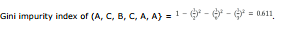

Now, let’s look at the two possible ways to split this dataset: by Gender or by Age.

**SPLITTING BY GENDER**

As we’ve seen before, splitting by gender gives us the two following sets:

- Females: {A, C, C}

- Males: {B, A, A}

The Gini impurity indices of these two are the following:

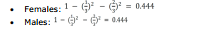

Therefore, the average Gini impurity index of this splitting is 0.611. Since the Gini impurity of
the root was 0.444, we conclude that the Gini gain is:

```
Gini gain = 0.611 - 0.444 = 0.167.
```

**SPLITTING BY AGE**

As we’ve seen before, splitting by gender gives us the two following sets:
- Young: {A, A, A}

- Adults: {C, B, C}

The Gini impurity indices of these two are the following:

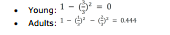

Therefore, the average Gini impurity index of this splitting is 0.222 (the average of 0 and
0.444). Since the Gini impurity of the root was 0.611, we conclude that the Gini gain is:

```
Gini gain = 0.611-0.222 = 0.389.
```

**COMPARING GINI INDICES**

If we compare the two Gini gains, we see that 0.389 is larger than 0.167. This implies that the
age feature is better than the gender feature for splitting the data. This comparison can be
seen in Figure 7.23.

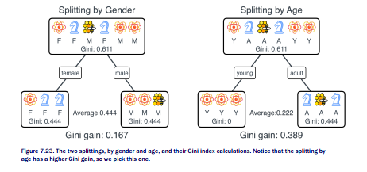

So we have decided to go for the age split. We get two nodes:

- The left node, where everyone downloaded Atom Count. This node has Gini impurity
index 0.

- The right node, where one person downloaded Beehive Finder and two downloaded
Check Mate Mate. This node has Gini impurity index 0.444.

The left node with Gini impurity index 0 can no longer be split. As a matter of fact, we don’t
want this node to be split any longer, since we can already safely recommend Atom Count to
everyone who lands in this node. This node, then becomes a leaf.


The right node can still be split. Note that we’ve already split by age, so everyone in this
node is an adult. The only split we can make is by gender. Let’s see what happens when we
split by gender.

- The two females downloaded Check Mate Mate. If we make a node with these two, the
node has Gini impurity index of 0.

- The male downloaded Beehive Finder. If we make a node with this one, the node has a
Gini impurity index of 0.

So we are done! The resulting split is in Figure 7.24.

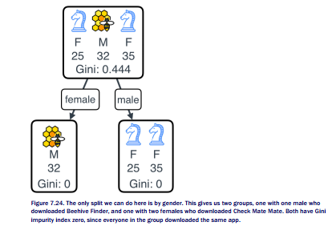

Now we finally have our decision tree! It’s illustrated in Figure 7.25.

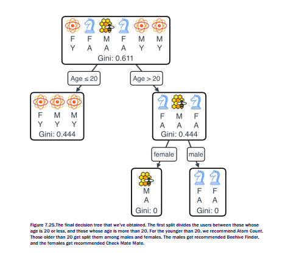

## 7.5 Beyond questions like yes/no

We learned a way to split data based on a feature that only has two classes. Namely, features
that split the users into two groups such as female/male, or young/adult. What if we had a
feature that split the users into three or more classes? For example, what if our users had a
pet, which could be a dog, a cat or a bird, and our table had information on these? Or even
worse, what if the age feature actually had numbers, such as 15, 20, 32, instead of just two
categories such as young/adult? It turns out that these two cases are not much more
complicated than the original one. We’ll study them separately.

## 7.5.1 Features with more categories, such as Dog/Cat/Bird

The idea to tackle features with more than two classes, is break down the information into a
series of binary (yes/no) questions. In this way, a feature such as gender, which only has two
classes (female and male), can be broken down using the question “Is the user female?”. In
this way, the females receive a ‘yes’, and the males a ‘no’. The same result can be obtained
with the question “Is the user male?”, and the opposite answer. Therefore, with one yes/no
question, we can split this feature using one binary question.
When the feature has more classes, such as Dog/Cat/Bird, we simply use more binary
(yes/no) questions. In this case, we would ask the following:

- Does the user own a dog?

- Does the user own a cat?

- Does the user own a bird?

You can see that no matter how many classes there are, we can split it into a number of
binary questions.

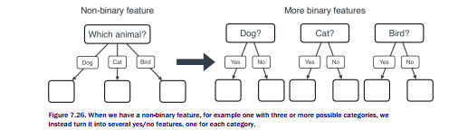

Now, what happens with the table of data? Simply, the one column with three classes turns
into three columns, one for each of the classes. The technical term for this process is one-hot
encoding. One-hot encoding simply removes the column of the table that has three or more
categories, and adds as many rows as categories, with each row filled with 0s and 1s. The
term one-hot encoding comes from the fact that among the resulting new columns, only one
of them has a 1 per row, and the others have a zero. Here’s an example.

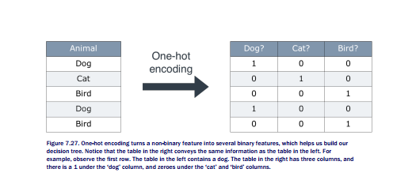

## 7.5.2 Continuous features, such as a number

So far, we have only seen categorical features, namely, those that have a certain fixed
number of classes, such as female/male, young/adult, or dog/cat/bird. But some features are
numerical, such as age, size, length, price, and they can’t be put into buckets. Even if we were
able to put it into buckets, say, one bucket for each age, we may still want to benefit from the
numerical nature of this feature. For example, if someone is 15 years old, and they
downloaded a certain app, we would imagine that a 14 year old is likely to also download that
app. If we had a bucket for 15 year olds, and a different bucket for 14 year olds, we would
lose this information. So how do we deal with these? Simple, we still want to ask yes/no
questions, we just have to ask a bunch more.
In order to see this, let’s go back to the original dataset, where age was given as a
number, and not as a category young/adult (Table 7.6).

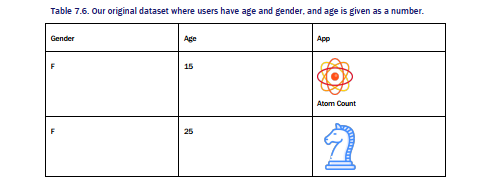

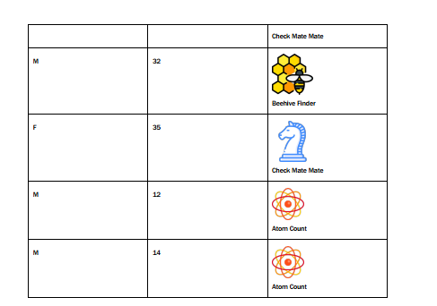

When the age column was given as two categories, ‘young’ and ‘adult’, it was easy to split,
since we only had one question to ask, namely “Is the user young or old?”. But now, we have
many questions, such as:

- Is the user younger than 16?

- Is the user older than 24?

- Is the user younger than 27.5?

It seems that we have an infinite number of questions. However, notice that many of them
give use the same answer. For example, if we ask “Is the user younger than 20?”, our
answers for the 6 users in the dataset would be no, yes, yes, yes, no, no. If we ask “Is the
user younger than 21?”, the answers are exactly the same. Both questions would split our
users into two sets, one of ages 12, 14, 15, and the other one of ages 25, 32, 35. As a matter
of fact, the only thing that matters is where we decide to cut the ages into two groups. Our
ages are, in order, 12, 14, 15, 25, 32, 35. We can add the cutoff anywhere in between
consecutive pairs of numbers, and no matter what number we pick as a cutoff, we’d get the
same result. The number we pick can be completely arbitrary.

So here are the 7 possible questions, with arbitrary cutoffs, as illustrated in Table 7.7.

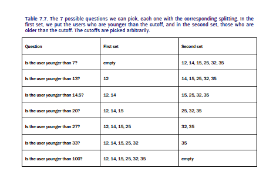

Notice that the first and last questions don’t add much to our data, since they don’t split the
users into two non-empty groups. We’ll forget about these, and we end up with 5 splittings, as
illustrated in Figure 7.28.

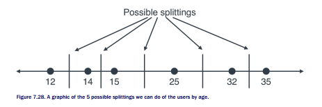

Now all we have to do is check the accuracy (or Gini impurity) of each of the splittings. For
example, if we split in between 25 and 32 (say, if we make the cut at 30 years old) we get the
following:

- **Younger than 20:** {12, 14, 15, 25}

- **Older than 20:** {32, 35}

Notice that this split gives us two leaves, as illustrated in Figure 7.29.

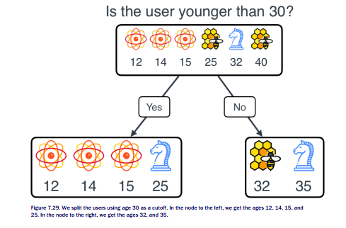

## COMPUTING THE ACCURACY OF THIS SPLIT

As seen previously, the idea of measuring the accuracy is to use this sole question to build a
classifier, namely, to recommend apps to users based on their age respective to 30. The most
popular app for the group of people under 30 is Atom Count, so we’ll recommend that one to
this group. Notice that we get three out of four correct. As for the people 30 or older, we can
either recommend Check Mate Mate or Instagram, since with either one we are correct one
out of two times. In total, we are correct four times out of six, so our accuracy is 4/6.

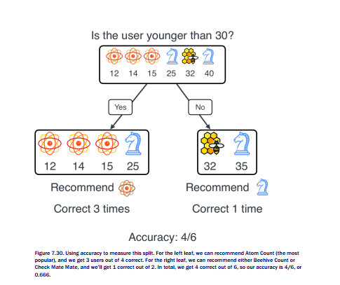


## COMPUTING THE GINI IMPURITY INDEX OF THIS SPLIT

Now we’ll compute the gain in Gini impurity index of this split. Note that the Gini impurity
index of the root is 0.611, as we’ve previously calculated.

The left leaf has three users downloading Atom Count, and one downloading Check Mate
Mate, so the Gini impurity is

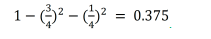

The right leaf has one user downloading Instagram, and one downloading Check Mate Mate, so
the Gini impurity is

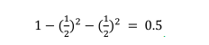

Also note that the left leaf has four users and the right leaf has two users. Since there are six
users in total, then the weights for the entropies of the left and right leaves is 4/6 and 2/6,
respectively (or ⅔ and ⅓). Thus, our weighted Gini impurity at the leaves is

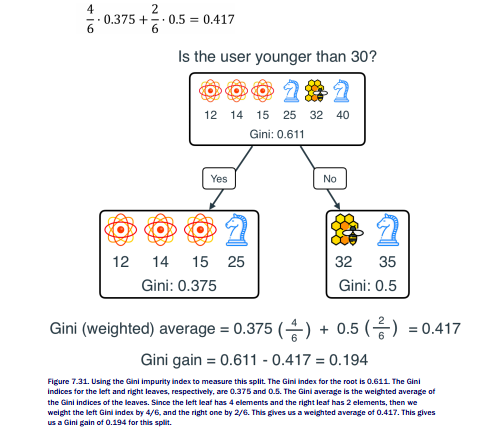


## Comparing our metrics for all the splits

Now, in order to find the best split, all we have to do is calculate the accuracy (or the Gini
gain) for all of our possible 5 splits. I encourage you to calculate them by yourself, and check
that you get the same answers I got. If you need some help, I have calculated them in the
Github repo, in the notebook corresponding to Decision Trees. The results are in Table 7.8.

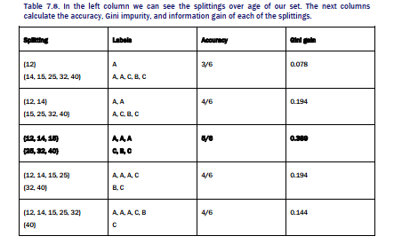

From here, we can see that the third splitting, namely the one that split the users into the sets
of ages {12, 14, 15} and {25, 32, 40}, is the best in terms of highest accuracy, lowest Gini
impurity, and highest information gain.
Great! We’ve determined that based on age, our best split is to separate them into two
groups: {12, 14, 15}, and {25, 32, 40}. We can ask the question “Is the user younger than
20?” (again, any number between 15 and 25 would work, but to have a nice split, we are
taking the midpoint). Is this the best split overall? Well, we don’t know yet. We still have to
compare it with the split according to the other feature, namely Gender. We recorded this in
Table 7.9.


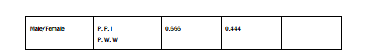

Notice that if we compare the gender split with the best age split, the best age split still wins
in terms of accuracy, Gini impurity, and entropy. Therefore, the feature we’ll pick for our first
split is age, and the threshold we pick is 20.

Our final tree looks as follows (Figure 7.32). The pseudocode for predicting a
recommendation for a user, then, is the following:

```
predict(user):
if user’s age is less than or equal to 20:
recommend Atom Count
else:
if user’s gender is female:
recommend Check Mate Mate
else:
recommend Beehive Finder
```

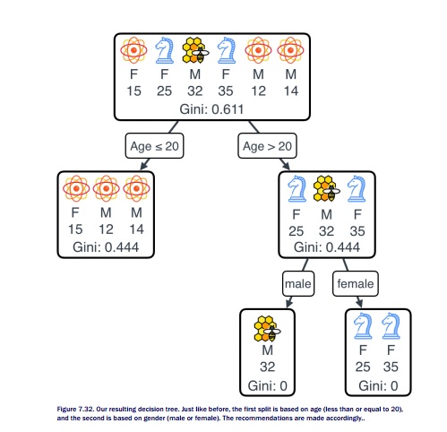

## 7.6 Coding a decision tree with sklearn

In order to code our decision trees, we’ll use a great and very well-known package called
Scikit Learn, or sklearn for short. We need to slightly massage our data in order to have it
ready for sklearn. We need to make sure that among the features, only numbers are fed. A
feature with values such as ‘male’ or ‘female’, will not be accepted. Therefore, we’ll one-hot

encode the Gender feature. We’ll store the dataset as a Pandas dataframe using the code
below, and the result is in Table 7.10.

```
import pandas as pd
app_dataset = pd.DataFrame({
'Gender_Female':[1,1,0,1,0,0],
'Gender_Male':[0,0,1,0,1,1],
'Age': [15, 25, 32, 35, 12, 14],
'App': ['Atom Count', 'Check Mate Mate', 'Beehive Finder', 'Check Mate Mate', 'Atom
Count', 'Atom Count']})
print(app_dataset)
```

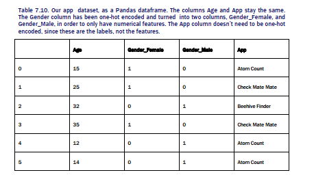

Now, we will split the features and the labels, so that our features DataFrame is formed by the
‘Age’, ‘Gender_Female’, and ‘Gender_Male’ columns, and our labels DataSeries is formed by
the column apps

```
features = app_dataset_new[['Age','Gender_Female','Gender_Male']]
labels = app_dataset_new[['App']]
```

Finally, we train our model by using the DecisionTreeClassifier() class from sklearn. The model
will be called ‘app_decision_tree’, and the command for fitting the data is simply ‘fit()’.

```
app_decision_tree = DecisionTreeClassifier()
app_decision_tree.fit(features, labels)
```

That’s all we need to fit a decision tree to our data! Let’s plot this tree (the commands for
plotting it are in the Github repo).


Let’s analyze what this plot is. In each of the nodes, we have some information, and it means
the following:

- x0: The first column in our features, namely, age.

- X1: The second column in our features, namely, Gender_Female.

- Gini: The Gini impurity index of the elements that fall in each node.

- Samples: The number of samples on each node.

- Value: This vector shows the distribution of labels in each node. For example, [3, 1, 2]
means that in this node, there are 3 users who downloaded Atom Count, one user who
downloaded Beehive Finder, and 2 who downloaded Check Mate Mate.

In this case, note that the top node gets split using the rule ‘x0 ≤ 20’, or ‘Age ≤ 20’. To the
left, we get ‘True’, which is those users whose ages are less than or equal to 20, and to the
right, we get ‘False’, which is those whose age is greater than 20. The node to the right is split

using the rule ‘X1 ≤ 0.5’, or ‘Gender_Female ≤ 0.5’. This is a bit strange, but if we remember
that this column‘Gender_Female’ assigns a 1 to females, and a 0 to males, then
‘Gender_Female ≤ 0.5’ is true when the user is male (0), and false when the user is female
(1). Thus, this node splits the males to the left, and the females to the right.
Figure 7.34 shows a comparison of the tree that sklearn obtained and the tree that we
obtained, for clarity.


Sklearn obtained the same tree that we obtained with our reasoning. This is great! Now let’s
try with a slightly larger example, let’s go back to our days of spam recommendation.

## 7.7 A slightly larger example: Spam detection again!

Let’s go back to our example from Chapter 5, where we predicted spam/ham emails from the
number of appearances of the word ‘lottery’ and ‘sale’. Can we use decision trees for spam
detection too? Of course! Let’s look at a bigger table of emails, such as shown in Table 7.11.


Let’s try to build a good decision tree here. We can use accuracy, Gini impurity, or simply plug
it in sklearn. Let’s use sklearn to see what we get.

First, let’s put our data into a Pandas DataFrame.

```
spam_dataset = pd.DataFrame({
'Lottery':[7,3,9,1,2,4,1,3,6,7,8,9],
'Sale':[1,2,3,3,6,7,9,10,5,8,4,6],
'Spam': [‘spam’,‘spam’,‘spam’,‘spam’,‘spam’,‘spam’,’ham,’ham,’ham,’ham,’ham,’ham]})
```

In order to do this graphically, let’s plot the points in a graph (this appears in the Github
repo).


Next, we split into features and labels

```
features = spam_dataset[['Lottery', 'Sale']]
labels = spam_dataset['Spam']
```

Now, let’s define our decision tree model and train it.

```
spam_decision_tree = DecisionTreeClassifier()
spam_decision_tree.fit(X,y)
```

The decision tree we get is in Figure 7.36.


It looks complicated, but let’s analyze it step by step. First, let’s look at what it really does to
predict if emails are spam or ham. This is the pseudocode for generating the predictions:

```
predict(email):
if number of appearances of ‘sale’ is less than or equal to 3.5:
classify as ham
else:
if number of appearances of ‘lottery’ is greater than 5.0:
classify as spam
else:
if number of appearances of ‘sale’ is less than or equal to 8.0:
classify as ham
else:
Classify as spam
```

But I like to see decision trees in a graphical way too. Let’s analyze this tree node by node,
and see what it is doing to the dataset. The top node splits the data based on the rule X1 ≤
3.5. This feature is the second column, namely, the appearances of the word ‘lottery’. Thus,


the dataset is broken into those emails with 3.5 or less appearances of the word ‘lottery’, and
those with more than 3.5 appearances. This is a horizontal split, as Figure 7.37 shows.


Note that all four emails below the horizontal line are ham, so these all form a leaf. This leaf is
shown in the tree, to the left of the top node. Notice that it has 4 samples, gini = 0.0 (since
they are all ham, so the data is pure), and value = [4,0], as there are four ham emails, and
zero spam.

The tree must now decide how to split the data above the line, which corresponds to the
node in the second row, to the right. Note that it has 8 samples, 2 of them ham, and 6 of
them spam. The tree choses to split using the rule e X1 ≤ 3.5, which corresponds to ‘Sale ≤
5.0’. This means, the split corresponds to a vertical line, as Figure 7.38 shows.


Note that all the four emails to the right of the line are spam, so this is a pure leaf. It
corresponds to the leaf to the right. The one in the left contains two spam and two ham
emails, so we need to split it further. This split is in Figure 7.39.


So if we plot all these lines together, our tree delineates the boundary seen in Figure 7.40.
Note that all the emails to one side of the boundary are spam, and to the other side are ham,
a perfect split!


## 7.8 Applications

Decision trees have many useful applications in real life. One very special feature of decision
trees is that aside from predicting, they give us a lot of information about our data, since they
organize it in a hierarchical structure. Many times, this is of as much or even more value as
the capacity of making predictions. In this section, I give some examples of decision trees
used in real life in the following fields:

- Health care

- Recommendation systems

7.8.1 Decision trees are widely used in health care
Decision trees are widely used in medicine, not only to make predictions, but also to identify
features that are determinant in the prediction. You can imagine that in medicine, a black box
saying “the patient is sick” or “the patient is healthy” is not good enough. However, a decision
tree comes with a great deal of information about why the prediction was made. The patient
could be sick based on their symptoms, their family medical history, their habits, and many
other factors..

<h4><span style="color:red;">7.8.2 Decision trees are useful in recommendation systems</span></h4>

In recommendation systems, decision trees are also very useful. One of the most famous
recommendation systems problems, the Netflix prize, was won with the help of decision trees.
In 2006, Netflix held a competition which involved building the best possible recommendation
system to predict user ratings of their movies. In 2009, they awarded $1,000,000 USD to the
winner, who improved the Netflix algorithm by over 10%. The way they do this was using

gradient boosted decision trees to combine over 500 different models. Other recommendation
engines, such as the video recommendation engine at YouTube, also use decision trees to
study the engagement of their users, and figure out what are the demographic features that
best determine engagement.
In Chapter 10 we will learn more about gradient boosted decision trees and random
forests, but you can see them as a collection of many decision trees, for simplicity.

## 7.9 Summary

- Decision trees are a very important algorithm in machine learning, used for
classification.

- The way decision trees work is by asking binary questions about our data, and making
the prediction based on the answers to those questions.

- The algorithm for building decision trees consists of finding the feature in our data that
best determines the label, and iterating over this step.

- There are several ways to tell if a feature determines the label best. The two that we
learn in this chapter are accuracy and Gini impurity index.

- Gini impurity index measures the purity of a set. In that way, a set in which every
element has the same label has gini impurity index 0. A set in which every element has
a different label has a Gini impurity label close to 1.

- Graphically, we can see decision trees as drawing vertical and horizontal lines (or
planes) that split our data according to the different labels.

- Applications of decision trees range very widely, from recommendation algorithms to
applications in medicine and biology.

