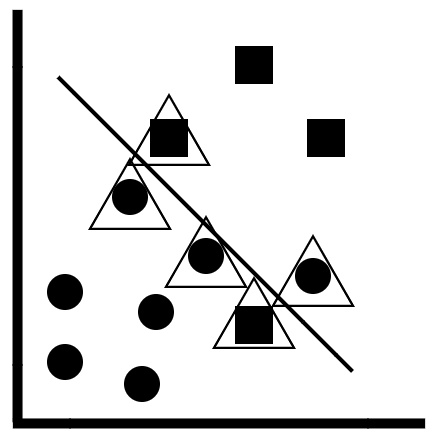
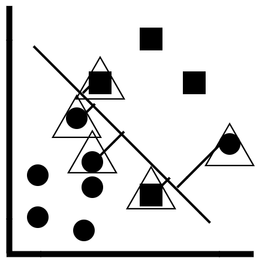

Support vector machines
-----------------------

In this lab, you will learn about popular classification machine
learning algorithms: the linear support
vector machine. linear support vector machine
uses a linear decision boundary to predict classes and categories.

#### Pre-reqs:
- Google Chrome (Recommended)

#### Lab Environment
Notebooks are ready to run. All packages have been installed. There is no requirement for any setup.

**Note:** Elev8ed Notebooks (powered by Jupyter) will be accessible at the port given to you by your instructor. Password for jupyterLab : `1234`

All Notebooks are present in `work/machine-learning` folder.

You can access jupyter lab at `<host-ip>:<port>/lab/workspaces/`

In this section, you will learn about **support vector machines
(SVMs),** or, to be more specific, **linear support vector machines**.
In order to understand support vector machines, you will need to know
what support vectors are. They are illustrated for you in the following
diagram:

The concept of support vectors

In the preceding diagram, the following applies:

-   The linear support vector machine is a form of linear classifier. A
    linear decision tree boundary is constructed, and the observations
    on one side of the boundary (the circles) belong to one class, while
    the observations on the other side of the boundary (the squares)
    belong to another class. 
-   The support vectors are the observations that have a triangle on
    them. 
-   These are the observations that are either very close to the linear
    decision boundary or have been incorrectly classified. 
-   We can define which observations we want to make support vectors by
    defining how close to the decision boundary they should be. 
-   This is controlled by the hyperparameter known as the **inverse
    regularization strength.

In order to understand how the linear support vector machines work,
consider the following diagram:

Concept of max-margins

In the preceding diagram, the following applies:

-   The line between the support vectors and the linear decision
    boundary is known as the **margin**
-   The goal of the support vector machines is to maximize this margin,
    so that a new data point will be correctly classified 
-   A low value of inverse regularization strength ensures that this
    margin is as big as possible

### Implementing the linear support vector machine algorithm in scikit-learn

In this section, you will learn how to implement the linear support
vector machines in scikit-learn.