Lab 9: Splitting data by asking questions: Decision trees
=========================================================

### In this lab

- what is a decision tree
- using decision trees for classification and regression
- building an app-recommendation system using users' information
- accuracy, Gini index, and entropy, and their role in building
    decision trees
- using Scikit-Learn to train a decision tree on a university
    admissions dataset


The code for this lab is available in this GitHub repository:
<https://github.com/fenago/machine-learning/tree/master/Lab_9_Decision_Trees>.


Beyond questions like yes/no
----------------------------


#### Splitting the data using non-binary categorical features, such as dog/cat/bird


When we want to split a dataset based on a binary feature, we simply ask
one yes-or-no question of the form, "Is the feature X?" For example,
when the feature is the platform, a question to ask is "Is the user an
iPhone user?" If we have a feature with more than two classes, we just
ask several questions. For example, if the input is an animal that could
be a dog, a cat, or a bird, then we ask the following questions:


- Is the animal a dog?
- Is the animal a cat?
- Is the animal a bird?


No matter how many classes a feature has, we can split it into several
binary questions (figure 9.18).


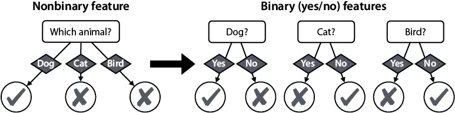


Each of the questions splits the data in a different way. To figure out
which of the three questions gives us the best split, we use the same
methods as in the section "First step to build the model": accuracy,
Gini index, or entropy. This process of turning a nonbinary categorical
feature into several binary features is called *one-hot encoding*. In
the section "Turning categorical data into numerical data" in lab
13, we see it used in a real dataset.


#### Splitting the data using continuous features, such as age


Recall
that before we simplified our dataset, the "age" feature contained
numbers. Let's get back to our original table and build a decision tree
there (table 9.3).


The idea is to turn the Age column into several questions of the form,
"Is the user younger than X?" or "Is the user older than X?" It seems
like we have infinitely many questions to ask, because there are
infinitely many numbers, but notice that many of these questions split
the data in the same way. For example, asking, "Is the user younger than
20?" and "Is the user younger than 21," gives us the same split. In
fact, only seven splits are possible, as illustrated in figure 9.19.


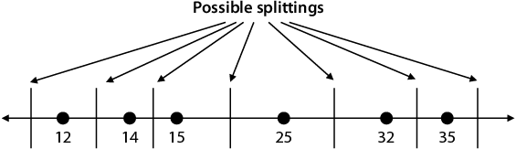


As a convention, we'll pick the midpoints between consecutive ages to be
the age for splitting. For the endpoints, we can pick any random value
that is out of the interval. Thus, we have seven possible questions that
split the data into two sets, as shown in table 9.4. In this table, we
have also calculated the accuracy, the Gini impurity index, and the
entropy of each of the splits.


Notice that the fourth question ("Is the user younger than 20?") gives
the highest accuracy, the lowest weighted Gini index, and the lowest
weighted entropy and, therefore, is the best split that can be made
using the "age" feature.


Carry out the calculations in the table, and verify that you get the
same answers. The entire calculation of these Gini indices is in the
following notebook:
<https://github.com/fenago/machine-learning/blob/master/Lab_9_Decision_Trees/Gini_entropy_calculations.ipynb>.


For clarity, let's carry out the calculations of accuracy, weighted Gini
impurity index, and weighted entropy for the third question. Notice that
this question splits the data into the following two sets:


- **Set 1** (younger than 14.5)
    -   Ages: 12, 14
    -   Labels: {A, A}
- **Set 2** (14.5 and older):
    -   Ages: 15, 25, 32, 25
    -   Labels: {A, C, B, C}


#### Accuracy calculation


The
most
common label in set 1 is "A" and in set 2 is "C," so these are the
predictions we'll make for each of the corresponding leaves. In set 1,
every element is predicted correctly, and in set 2, only two elements
are predicted correctly. Therefore, this decision stump is correct in
four out of the six data points, for an accuracy of 4/6 = 0.667.


For the next two calculations, notice the following:


- Set 1 is pure (all its labels are the same), so its Gini impurity
    index and entropy are both 0.
- In set 2, the proportions of elements with labels "A," "B," and "C"
    are 1/4, 1/4, and 2/4 =1/2, respectively.


#### Weighted Gini impurity index calculation


The
Gini
impurity index of the set {A, A} is 0.


The Gini impurity index of the set {A, C, B, C} is
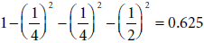


The weighted average of the two Gini impurity indices is
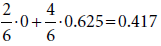


#### Accuracy calculation


The
entropy
of the set {A, A} is 0.


The entropy of the set {A, C, B, C} is
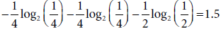


The weighted average of the two entropies is
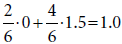


A numerical feature becomes a series of yes-or-no questions, which can
be measured and compared with the other yes-or-no questions coming from
other features, to pick the best one for that decision node.


**Note**

This app-recommendation model is very small, so we could do it all by
hand. However, to see it in code, please check this notebook:
<https://github.com/fenago/machine-learning/blob/master/Lab_9_Decision_Trees/App_recommendations.ipynb>.
The notebook uses the Scikit-Learn package, which we introduce in more
detail in the section "Using Scikit-Learn to build a decision tree."


#### Using Scikit-Learn to build a decision tree
In this section, we learn how to use a popular machine learning package
called Scikit-Learn (abbreviated sklearn) to build a decision tree. The
code for this section follows:


- **Notebook**: Graphical\_example.ipynb
    -   <https://github.com/fenago/machine-learning/blob/master/Lab_9_Decision_Trees/Graphical_example.ipynb>


We begin by loading the dataset as a Pandas DataFrame called `dataset`
(introduced in lab 8), with the following lines of code:


```
import pandas as pd
dataset = pd.DataFrame({
    'x_0':[7,3,2,1,2,4,1,8,6,7,8,9],
    'x_1':[1,2,3,5,6,7,9,10,5,8,4,6],
    'y': [0,0,0,0,0,0,1,1,1,1,1,1]})
```


Now we separate the features from the labels as shown here:


```
features = dataset[['x_0', 'x_1']]
labels = dataset['y']
```


To build the decision tree, we create a `DecisionTreeClassifier`
object
and use the `fit`
function,
as follows:


```
decision_tree = DecisionTreeClassifier()
decision_tree.fit(features, labels)
```

We obtained the plot of the tree, shown in figure 9.23, using the
`display_tree` function in the utils.py file.


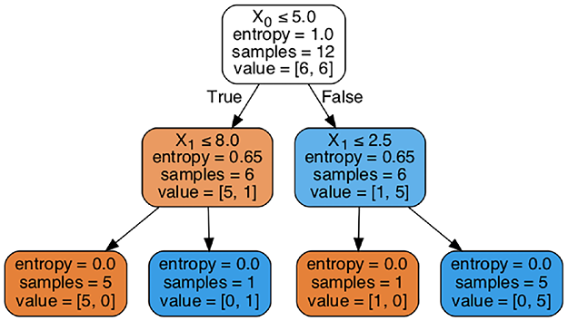


Notice that the tree in figure 9.23 corresponds precisely to the boundary in figure 9.22. The root node corresponds to the first vertical line at x0 = 5, with the points at each side of the line corresponding to the two branches. The two horizontal lines at x1 = 8.0 and x1 = 2.5 on the left and right halves of the plot correspond to the two branches. Furthermore, at each node we have the following information:


- **Gini**: the Gini impurity index of the labels at that node
- **Samples**: the number of data points (samples) corresponding to
    that node
- **Value**: the number of data points of each of the two labels at
    that node


As you can see, this tree has been trained using the Gini index, which
is the default in Scikit-Learn. To train it using entropy, we can
specify it when building the `DecisionTree`
object,
as follows:


```
decision_tree = DecisionTreeClassifier(criterion='entropy')
```


We can specify more hyperparameters when training the tree, which we see
in the next section with a much bigger example.


Real-life application: Modeling student admissions with Scikit-Learn
--------------------------------------------------------------------


In this section, we use decision trees to build a model that predicts
admission to graduate schools. The dataset can be found in Kaggle (see
appendix C for the link). As in the section "The graphical boundary of
decision trees," we'll use Scikit-Learn to train the decision tree and
Pandas to handle the dataset. The code for this section follows:


- **Notebook**: University\_admissions.ipynb
    -   <https://github.com/fenago/machine-learning/blob/master/Lab_9_Decision_Trees/University_Admissions.ipynb>
- **Dataset**: Admission\_Predict.csv


The dataset has the following features:


- **GRE score**: a number out of 340
- **TOEFL score**: a number out of 120
- **University rating**: a number from 1 to 5
- **Statement of purpose strength (SOP)**: a number from 1 to
    5
- **Undergraduate grade point average (CGPA)**: a number from 1 to
    10
- **Letter of recommendation strength (LOR)**: a number from 1 to
    5
- **Research experience**: Boolean variable (0 or 1)


The labels on the dataset are the chance of admission, which is a number
between 0 and 1. To have binary labels, we'll consider every student
with a chance of 0.75 or higher as "admitted," and any other student as
"not admitted."


The code for loading the dataset into a Pandas DataFrame and performing
this preprocessing step is shown next:


```
import pandas as pd
data = pd.read_csv('Admission_Predict.csv', index_col=0)
data['Admitted'] = data['Chance of Admit'] >= 0.75
data = data.drop(['Chance of Admit'], axis=1)
```


The first few rows of the resulting dataset are shown in table 9.5.


  
As we saw in the section "The graphical boundary of decision trees,"
Scikit-Learn requires that we enter the features and the labels
separately. We'll build a Pandas DataFrame called `features```
containing all the columns except the Admitted column, and a Pandas
Series called `labels``` containing only the Admitted column. The code
follows:


```
features = data.drop(['Admitted'], axis=1)
labels = data['Admitted']
```


Now we create a `DecisionTreeClassifier` object (which we call `dt`) and
use the `fit`
method.
We'll train it using the Gini index, as shown next, so there is no need
to specify the `criterion`
hyperparameter,
but go ahead and train it with entropy and compare the results with
those that we get here:


```
from sklearn.tree import DecisionTreeClassifier
dt = DecisionTreeClassifier()
dt.fit(features, labels)
```


To make predictions, we can use the `predict`
function.
For example, here is how we make predictions for the first five
students:


```
dt.predict(features[0:5])
Output: array([ True, True, False, True, False])
```


However, the decision tree we just trained massively overfits. One way
to see this is by using the `score`
function
and realizing that it scores 100% in the training set. In this lab,
we won't test the model, but will try building a testing set and
verifying that this model overfits. Another way to see the overfitting
is to plot the tree and notice that its depth is 10 (see the notebook).
In the next section, we learn about some hyperparameters that help us
prevent overfitting.


#### Setting hyperparameters in Scikit-Learn


To prevent overfitting, we can use some of the hyperparameters that we
learned in the section "Last step: When to stop building the tree and
other hyperparameters," such as the following:


- `max_depth`: the maximum allowed depth.
- `max_features```: the maximum number of features considered at each
    split (useful for when there are too many features, and the training
    process takes too long).
- `min_impurity_decrease```: the decrease in impurity must be higher
    than this threshold to split a node.


- `min_impurity_split```: when the impurity at a node is lower than
    this threshold, the node becomes a leaf.
- `min_samples_leaf```: the minimum number of samples required for a
    leaf node. If a split leaves a leaf with less than this number of
    samples, the split is not performed.
- `min_samples_split```: the minimum number of samples required to
    split a node.


Play around with these parameters to find a good model. We'll use the
following:


- `max_depth = 3`
- `min_samples_leaf = 10`
- `min_samples_split = 10`


```
dt_smaller = DecisionTreeClassifier(max_depth=3, min_samples_leaf=10, min_samples_split=10)
dt_smaller.fit(features, labels)
```


The resulting tree is illustrated in figure 9.24. Note that in this
tree, all the edges to the right correspond to "False" and to the left
to "True."


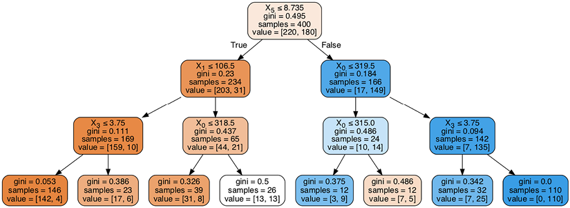


The
prediction given at each of the leaves is the label corresponding to the
majority of the nodes in that leaf. In the notebook, each node has a
color assigned to it, ranging from orange to blue. The orange nodes are
those with more points with label 0, and the blue nodes are those with
label 1. Notice that the white leaf, in which there are the same number
of points with labels 0 and 1. For this leaf, any prediction has the
same performance. In this case, Scikit-Learn defaults to the first class
in the list, which in this case is false.


To make a prediction, we use the `predict` function. For example, let's
predict the admission for a student with the following numbers:


- GRE score: 320
- TOEFL score: 110
- University rating: 3
- SOP: 4.0
- LOR: 3.5
- CGPA: 8.9
- Research: 0 (no research)


```
dt_smaller.predict([[320, 110, 3, 4.0, 3.5, 8.9, 0]])
Output: array([ True])
```


The tree predicts that the student will be admitted.


From this tree, we can infer the following things about our dataset:


- The most important feature is the sixth column (*X*~5~),
    corresponding to the CGPA, or the grades. The cutoff grade is 8.735
    out of 10. In fact, most of the predictions to the right of the root
    node are "admit" and to the left are "not admit," which implies that
    CGPA is a very strong feature.
- After this feature, the two most important ones are GRE score
    (*X*~0~) and TOEFL score (*X*~1~), both standardized tests. In fact,
    among the students who got good grades, most of them are likely to
    be admitted, unless they did poorly on the GRE, as accounted for by
    the sixth leaf from the left in the tree in figure 9.24.
- Aside from grades and standardized tests, the only other feature
    appearing in the tree is SOP, or the strength of the statement of
    purpose. This is located down in the tree, and it didn't change the
    predictions much.


Recall, however, that the construction of the tree is greedy in nature,
namely, at each point it selects the top feature. This doesn't guarantee
that the choice of features is the best, however. For example, there
could be a combination of features that is very strong, yet none of them
is strong individually, and the tree may not be able to pick this up.
Thus, even though we got some information about the dataset, we should
not yet throw away the features that are not present in the tree. A good
feature selection algorithm, such as L1 regularization, would come in
handy when selecting features in this dataset.


Decision trees for regression
------------------------------

In most of this lab, we've used decision trees for classification, but
as was mentioned earlier, decision trees are good regression models as
well. In this section, we see how to build a decision tree regression
model. The code for this section follows:


- **Notebook**: Regression\_decision\_tree.ipynb
    -   <https://github.com/fenago/machine-learning/blob/master/Lab_9_Decision_Trees/Regression_decision_tree.ipynb>


Consider the following problem: we have an app, and we want to predict
the level of engagement of the users in terms of how many days per week
they used it. The only feature we have is the user's age. The dataset is
shown in table 9.6, and its plot is in figure 9.25.


From this dataset, it seems that we have three clusters of users. The
young users (ages 10, 20, 30) use the app a lot, the middle-aged users
(ages 40, 50, 60) don't use it very much, and the older users (ages 70,
80) use it sometimes. Thus, a prediction like this one would make sense:


- If the user is 34 years old or younger, the engagement is 6 days
    per week.
- If the user is between 35 and 64, the engagement is 1 day per
    week.
- If the user is 65 or older, the engagement is 3.5 days per
    week.


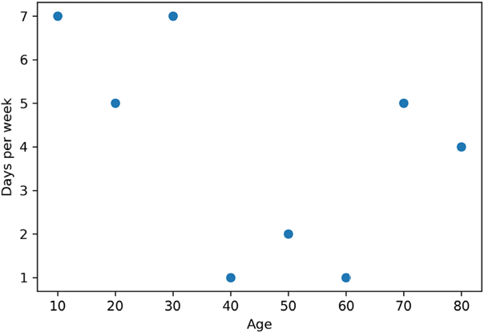


The predictions of a regression decision tree look similar to this,
because the decision tree splits our users into groups and predicts a
fixed value for each of the groups. The way to split the users is by
using the features, exactly like we did for classification problems.


Lucky for us, the algorithm used for training a regression decision tree
is very similar to the one we used for training a classification
decision tree. The only difference is that for classification trees, we
used accuracy, Gini index, or entropy, and for regression trees, we use
the mean square
error
(MSE). The mean square error may sound familiar---we used it to train
linear regression models in the section "How do we measure our results?
The error function" in lab 3.


Before we get into the algorithm, let's think about it conceptually.
Imagine that you have to fit a line as close as possible to the dataset
in figure 9.25. But there is a catch---the line must be horizontal.
Where should we fit this horizontal line? It makes sense to fit it in
the "middle" of the dataset---in other words, at a height equal to the
average of the labels, which is 4. That is a very simple classification
model, which assigns to every point the same prediction of 4.


Now, let's go a bit further. If we had to use two horizontal segments,
how should we fit them as close as possible to the data? We might have
several guesses, with one being to put a high bar for the points to the
left of 35 and a low bar to the right of 35. That represents a decision
stump that asks the question, "Are you younger than 35?" and assigns
predictions based on how the user answered that question.


What if we could split each of these two horizontal segments into two
more---where should we locate them? We can continue following this
process until we have broken down the users


into several groups in which their labels are very similar. We then
predict the average label for all the users in that group.


The process we just followed is the process of training a regression
decision tree. Now let's get more formal. Recall that when a feature is
numerical, we consider all the possible ways to split it. Thus, the
possible ways to split the age feature are using, for example, the
following cutoffs: 15, 25, 35, 45, 55, 65, and 75. Each of these cutoffs
gives us two smaller datasets, which we call the left dataset and the
right dataset. Now we carry out the following steps:


1. For each of the smaller datasets, we predict the average value of
    the labels.
2. We calculate the mean square error of the prediction.
3. We select the cutoff that gives us the smallest square
    error.


For example, if our cutoff is 65, then the two datasets are the
following:


- **Left dataset**: users younger than 65. The labels are {7, 5, 7,
    1, 2, 1}.
- **Right dataset**: users 65 or older. The labels are {5,4}.


For each dataset, we predict the average of the labels, which is 3.833
for the left one and 4.5 for the right one. Thus, the prediction for the
first six users is 3.833, and for the last two is 4.5. Now, we calculate
the MSE as follows:


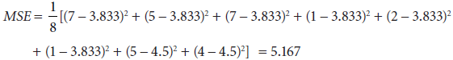


In table 9.7, we can see the values obtained for each of the possible
cutoffs. The full calculations are at the end of the notebook for this
section.


The best cutoff is at 35 years old, because it gave us the prediction
with the least mean square error. Thus, we've built the first decision
node in our regression decision tree. The next steps are to continue
splitting the left and right datasets recursively in the same fashion.
Instead of doing it by hand, we'll use Scikit-Learn as before.


First, we define our features and labels. We can use arrays for this, as
shown next:


```
features = [[10],[20],[30],[40],[50],[60],[70],[80]]
labels = [7,5,7,1,2,1,5,4]
```


Now, we build a regression decision tree of maximum depth 2 using the
`DecisionTreeRegressor`
object
as follows:


```
from sklearn.tree import DecisionTreeRegressor
dt_regressor = DecisionTreeRegressor(max_depth=2)
dt_regressor.fit(features, labels)
```


The resulting decision tree is shown in figure 9.26. The first cutoff is
at 35, as we had already figured out. The next two cutoffs are at 15 and
65. At the right of figure 9.26, we can also see the predictions for
each of these four resulting subsets of the data.


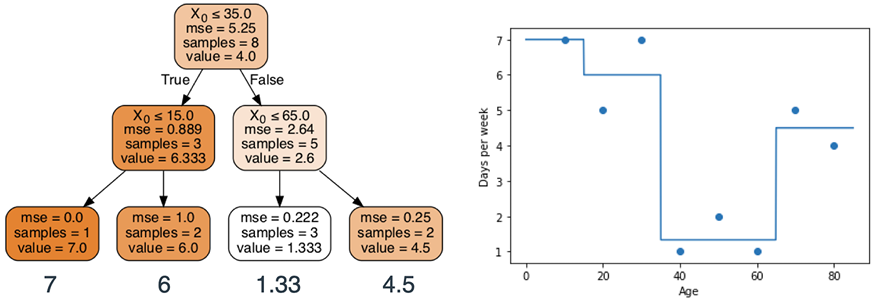


In lab 12, we will learn more about gradient-boosted decision trees
and random forests. For now, the best way to imagine them is as a
collection of many decision trees working together to make the best
predictions.


Exercises
---------


#### Exercise 9.1


In the following spam-detection decision tree model, determine whether
an email from your mom with the subject line, "Please go to the store,
there's a sale," will be classified as spam.


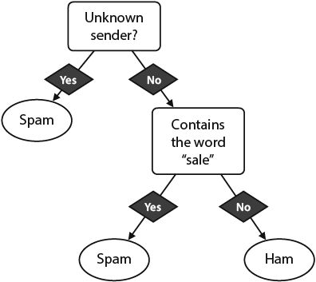


#### Exercise 9.2


Our goal is to build a decision tree model to determine whether credit
card transactions are fraudulent. We use the dataset of credit card
transactions below, with the following features:


- **Value**: value of the transaction.
- **Approved vendor**: the credit card company has a list of approved
    vendors. This variable indicates whether the vendor is in this
    list.


Build the first node of the decision tree with the following
specifications:


1. Using the Gini impurity index
2. Using entropy


#### Exercise 9.3


A dataset of patients who have tested positive or negative for COVID-19
follows. Their symptoms are cough (C), fever (F), difficulty breathing
(B), and tiredness (T).


Using accuracy, build a decision tree of height 1 (a decision stump)
that classifies this data. What is the accuracy of this classifier on
the dataset?
