## Combining models to maximize results. Ensemble learning


**This lab covers**

- What is ensemble learning.

- Joining several weak classifiers to form a strong classifier.

- Bagging: A method to randomly join several classifiers.

- Boosting: A method to join several classifiers in a smarter way.

- AdaBoost: A very successful example of boosting methods.

After learning many interesting and very useful machine learning classifiers, a good question
to ask is “Is there a way to combine them?”. Thankfully the answer is yes! In this lab we
learn several ways to build stronger classifiers by combining weaker ones. The methods we
learn in this lab are bagging and boosting. In a nutshell, bagging consists on constructing
a few classifiers in a random way and putting them together. Boosting, on the other hand,
consists of building these models in a smarter way, by picking each model strategically to
focus on the previous models’ mistakes. One of the most popular examples of boosting is the
AdaBoost algorithm (Adaptive Boosting), which we study at the end of the lab.

#### Pre-reqs:
- Google Chrome (Recommended)

#### Lab Environment
Notebooks are ready to run. All packages have been installed. There is no requirement for any setup.

**Note:** Elev8ed Notebooks (powered by Jupyter) will be accessible at the port given to you by your instructor. Password for jupyterLab : `1234`

All Notebooks are present in `work/machine-learning` folder.

You can access jupyter lab at `<host-ip>:<port>/lab/workspaces/lab9_ensemble_learning`

<h4><span style="color:red;">10.1 With a little help from our friends</span></h4>

Here is the scenario. You have to take an exam that consists of 100 true/false questions on
many different topics, such as math, geography, science, history, music, and so on. Luckily,
you are allowed to call your five friends, Alice, Bob, Carlos, Dana, and Emily to help you. What

are some techniques that you can use to get their help? Let me show you two techniques that
I can think of.

**Technique 1:** You send the exam to each of the five friends, and ask them to fill it in.
Then you get the responses, and for each question, you make them vote. For example, if for
question 1, three of your friends answered “True” and two answered “False”, you answer that
question as “True”. We may still get some wrong, but if our friends are of the same level of
knowledge and intelligence as us, we can imagine that the five of them together are likely to
do better than only one of them.

**Technique 2:** We give the exam to Alice, and ask her to answer the questions that she is
the most sure about. She answers a few of them. We assume that those answers are good,
since we focused on Alice’s strengths. Then we pass the remaining questions to Bob, and
follow the same procedure with Carlos and Dana. For our last friend, Emily, we just ask her to
answer all the remaining ones. This is a good technique as well, especially if our friends are
experts in different disciplines.

These are two examples of combining our friends to form a super-friend, who will likely do
well in tests. The equivalent scenario in machine learning is when we have several classifiers
that classify our data well, but not great, and we’d like to combine them into a super-classifier
that classifies our data very well. This discipline is called ensemble learning.

We call the set of classifiers weak learners, and the super-classifier they form when
combined a strong learner.

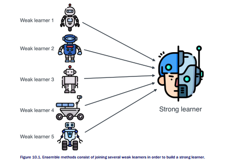

In this lab we learn two ensemble learning techniques called bagging and boosting, which
very much resemble the two previous techniques, respectively. In a nutshell, this is what
bagging and boosting do:

**Bagging:** We train a bunch of different classifiers on different random subsets of our data.
We join them into a big classifier, which makes predictions by voting. In other words, the
resulting classifier predicts what the majority of the other classifiers predict.

A canonical example of a bagging model is random forests. Simply put, you pick a random
subset of your data and build a decision tree that fits that subset. Then you do the same thing
with another random subset of data. You continue in this fashion, building a set of decision
trees. Then you build a classifier joining all these decision trees by making them vote. Since
the trees were built on random subsets of you data, we call this a random forest.

Why the name ‘bagging’? Well, there is no bag involved; bagging is short for Bootstrap
AGGregatING.

**Boosting:** Boosting is very similar to bagging, except the classifiers are not picked at
random. Details vary between algorithms, but in a nutshell, each classifier is picked in a way
that focuses on the weaknesses of the previous classifiers. Each classifier is not necessarily

strong, but the union of them is. One way to do this is to modify our data by giving more
weight to the misclassified points and less to the correctly classified ones, and fit the next
classifier to this modified data.

The canonical example of boosting that we learn in this lab is AdaBoost (ADAptive
BOOSTing). I encourage you to further your studies with other algorithms such as gradient
boosted trees, and XGBoost (eXtreme Gradient Boosting).
Most ensemble methods in this lab use decision trees as the weak learners. Many
ensemble methods started in order to prevent overfitting in decision trees, and for this reason
decision trees tend to be more popular for this kind of approaches. However, as you read this
lab, I encourage you to look at how the strong learners would look if the weak learners
were other types of classifiers, such as perceptrons, SVMs, and so on.

## 10.2 Why an ensemble of learners? Why not just one really good learner?

When I suggested combining several different weak learners to form a strong learner, a
question may have popped into our minds. We’ve spent an entire course learning how to build
strong learners, why all of a sudden do we want to combine them? For example, if we are
going to combine a few simple decision trees, why not build one very robust one? Let me
illustrate why with a small example.

Let’s go back to our spam example. The
dataset consists of spam and ham emails, and the features were the number of times the
words ‘lottery’ and ‘sale’ appeared on the email (Table 10.1).


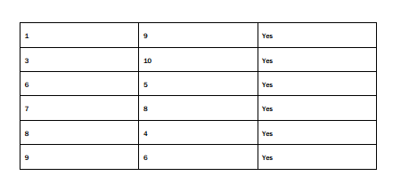

This table is plotted in Figure 10.2., where the triangles represent spam emails, and the
squares represent ham emails.


For this dataset, we trained a decision tree which created a broken linear boundary, as
illustrated in Figure 10.3.

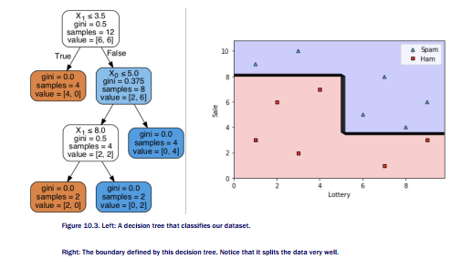


So far, so good. That tree does a great job splitting our data. But what happens if we add the
following two more points?

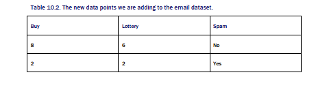


Now let’s try to fit a decision tree to this data. We can use sklearn,
with the following command in sklearn:

```
spam_decision_tree = DecisionTreeClassifier()
spam_decision_tree.fit(new_X,new_y)
```

The decision tree and the boundary region can be seen in Figure 10.5.

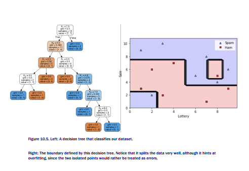

There seems to be some overfitting going on. Those two new points that we added should be
considered noise, but instead the tree went out of its way to classify them correctly. As we
saw before, decision trees are very prone to overfitting. Could it be that random forests give
us a nicer boundary? We’ll see in the next section!

### 10.3 Bagging - Joining some classifiers together to build a stronger classifier


### 10.3.1 Building random forests by joining several trees
Let’s try to fit three trees to the data in Figure 10.4. In order to make things computationally
easier, we’ll split the data into three random (almost) equal subsets, and we’ll fit a simple
(depth one) tree to each dataset.

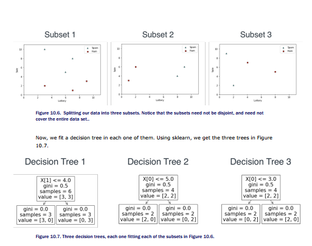

But most importantly, the trees define the boundaries in the top of Figure 10.8. And now, we
join these three classifiers into one random forest classifier by making them vote. This simply
means that when a new email comes in, we check the predictions of the three decision trees.
Whichever prediction got two or more votes, whether it’s spam or ham, is the prediction that
the random forest makes. The boundary of the random forest is illustrated at the bottom of
Figure 10.8.

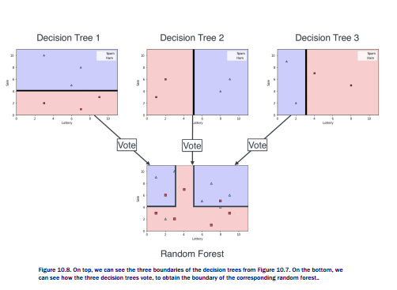

Notice that the random forest is a good classifier, as it classifies most of the points correctly,
but it allows a few mistakes in order to not overfit the data.

### 10.3.2 Coding a random forest in sklearn

Now you may be thinking “that way you partitioned the data was a bit convenient, what if you
don’t get such nice subsets?” You are right, let’s allow sklearn to build a random forest, and
see how it compares. We will build one with five decision trees, or ‘estimators’. The command
is the following:

```
from sklearn.ensemble import RandomForestClassifier
random_forest_model = RandomForestClassifier(random_state=0, n_estimators=5)
random_forest_model.fit(new_X,new_y)
random_forest_model.score(new_X,new_y)
```

When we plot the boundary defined by this random forests, we get Figure 10.9.

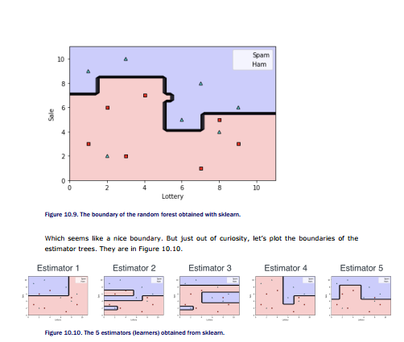

Yikes! These are quite complex models, as a matter of fact, some seem to overfit, like
Estimator 2. In the repo I have printed out all the decision trees, and you can see that
estimators 2 and 3 have depth 6. But somehow, when we overimpose them together, we get a
clean boundary. The beauty of machine learning.

## 10.4 Boosting - Joining some classifiers together in a smarter way to get a stronger classifier


AdaBoost (Adaptive Boosting), developed by Freund and Shapire in 1997, is a very
powerful boosting algorithm that has produced great results. In AdaBoost, all the weak
learners are the simplest possible learner one can have: a decision tree of depth one, or a
stump. In our example, a stump is represented by either a vertical or a horizontal line that
splits our data. It is the classifier that picks only one of the features, and classifies the data
based on if that feature is smaller or larger than some threshold.
I will show you AdaBoost in a small example. We’ll try to classify the data in Figure 10.11.

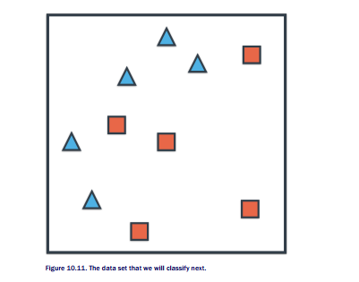

First, we’ll do it conceptually, and next I will add some numbers.

## 10.4.1 A big picture of AdaBoost

First let’s try to fit a decision tree of depth one. That is simply a vertical or horizontal line.
There are a few that work, so let’s pick the vertical line in the left of Figure 10.12, which
correctly classifies the two triangles in the left, and all the squares. That classifier is weak
learner 1.


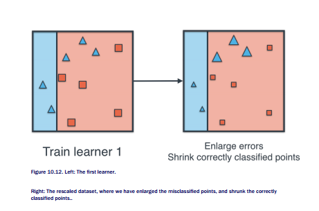

Now, we simply continue this process. On the rescaled data, we train a second learner. This
second learner will be different, because this one tries harder to classify the bigger points
(those with larger weight), and doesn’t worry so much about the small ones (those with
smaller weight). After training this learner, we again enlarge the data accordingly. We repeat
this process a third time, and then we decide to stop (we could keep going if we wanted to).
The process is illustrated in Figure 10.13.

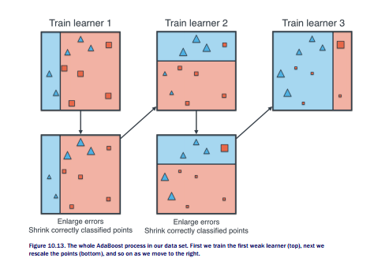

Now, as a final step, we combine the three learners into one by voting, as illustrated by Figure
10.14.

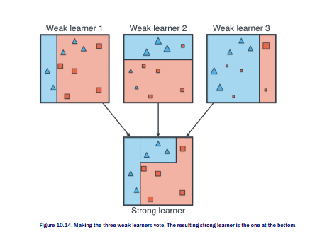

Ok, that’s the big picture explanation of AdaBoost. Let’s throw some math at it now.

## 10.4.2 A detailed (mathematical) picture of AdaBoost

In the previous section I showed you two steps of the algorithm, namely training new learners
and rescaling the data. Rescaling data is done in two steps:

1. Picking a number that is larger than 1.
2. Multiplying all the errors by this number.

## THE DIFFERENCE BETWEEN PROBABILITY AND THE ODDS RATIO

In order to come up with the rescaling factor, first let’s digress a bit into the difference
between probability and odds. Let’s say we have a box with three balls, two red and one blue,
and we draw one random ball from the box. The probabilities of obtaining a ball of each color
are the following:

- P(red ball) = ⅔.

- P(blue ball) = ⅓.


However, one would like to say something along the lines of “It’s twice as likely to draw a red
ball than to not draw a red ball”. For this, we use odds. We say that the odds of drawing a red
ball are 2, and the odds of drawing a blue ball are ½. If the formula we used for probability
was

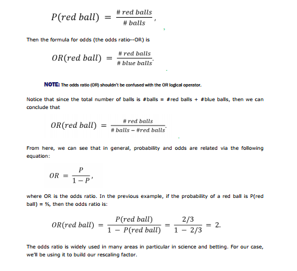

## CALCULATING THE RESCALING FACTOR

After we train a learner, this learner may make some mistakes. We need to blow up these
mistakes, namely, multiply them by a number that is larger than one, so that the next
classifier focuses more on them, and less on the points that are well classified. For reasons
that we’ll see later, we want this factor to be large if our learner is good, and low if our learner
is not that good.
Many metrics would work as a rescaling factor, but the one we pick is very related to the
odds ratio. In fact, the rescaling factor is the odds that the learner classifies a point correctly.
Sounds like a lot of work, but it’s not so bad. Let’s do it in the example. We begin by
assigning to every point a weight of 1. Now, let’s look at the accuracy of learner 1. It’s correct
for 7 points, and wrong for 3 points, so its accuracy is 0.7. But let’s actually consider a
different number. Let’s look at the number of correctly classified points divided by the number
of incorrectly classified points. In this case, it is 7/3 = 2.33. That’s our rescaling factor. Notice
that the better the model, the higher the rescaling factor. Therefore, the following formula
works.

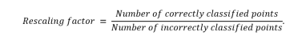

As a matter of fact, we can do better. Since we’ll change the weights of the points during the
process, the better way to formulate the rescaling factor is the following.

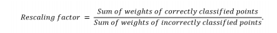

Now we look at the three misclassified points in the model, and we multiply their weight by
the rescaling factor 7/3. Our weights are now 7/3, 7/3, 7/3, 1, 1, 1, 1, 1, 1, 1. In order for
them to ensure they still add to 10, let’s divide them all by their sum, which is 14. Our new
weights are ⅙, ⅙, ⅙, 1/14, 1/14, 1/14, 1/14, 1/14, 1/14, 1/14. This rescaling process is
illustrated in Figure 10.15.

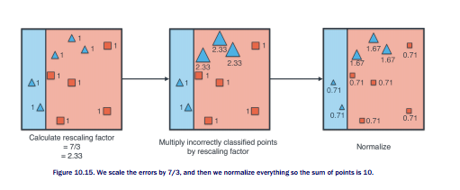

Notice that if we fit a new classifier on this dataset, it will try to classify those three big
triangles correctly, since they carry more weight. The best classifier is on the left of Figure
10.16. In the same figure, we have repeated the calculation of the rescaling factor and the
normalization.


And as a final step, the best learner for the normalized dataset is simply the vertical line in
Figure 10.17. For this one we will calculate the rescaling factor (you’ll see why in a bit), but
we’ll stop training more learners right here.

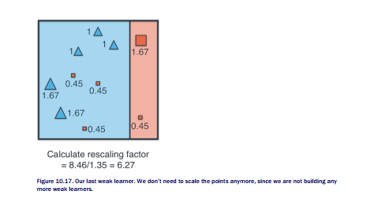


## JOINING THE LEARNERS - THE LOGIT


In machine learning, the equivalent for Truthful Teresa is a model with high accuracy,
which correctly predicts points most of the time. The equivalent for Lying Lenny is a model
with very low accuracy, and the equivalent to Unpredictable Umbert is a model with accuracy

around 50%. Notice that between a model with accuracy around 50% and a model with
terrible accuracy, one would actually prefer the one with terrible accuracy (if we are predicting
only two classes). Why is this? Because a model that predicts the incorrect class most of the
time can be turned into a model that predicts the correct class most of the time, by simply
flipping the answer (the equivalent to listening to Lying Lenny and doing the exact opposite).
On the other hand, a model that predicts the correct class around 50% of the time, is about as
accurate as tossing a fair coin; it gives us no information.

Therefore, we need to find a metric which is high (positive) for high accuracy models, high
(negative) for low accuracy models, and around zero for models with 50% accuracy. Here are
some examples of what we need:

```
Truth 99% of the time: Very high score.
Truth 70% of the time: Some positive score.
Truth 50% of the time: Score of 0.
Truth 30% of the time: Negative score.
Truth 1% of the time: Very low negative score.
```

Maybe odds can help us, let’s calculate the odds for each one of these cases.

```
Truth 99% of the time: 99/1 = 99.
Truth 70% of the time: 70/30 = 2.33 (remind you of something?).
Truth 50% of the time: 50/50 = 1
Truth 30% of the time: 30/70 = 0.43.
Truth 1% of the time: 1/99 = 0.01.
```

We need a function that assigns negative scores to the very small numbers, that also assigns
0 to the value 1, and that also assigns positive scores to high numbers? What would this
function be? If you said logarithm, that’s correct! In Table 10.3 I have calculated the logarithm
of each of the values.

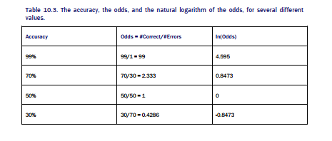

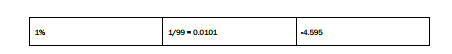

The logarithm of the odds, which is commonly known as logit (short for “logistic unit”), is the
weight that we assign to each model in the voting. In Figure 10.18 we can see a plot of this.

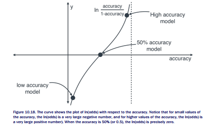

Now we are ready to make the learners vote. Based on the odds, let’s calculate the logarithm
of the odds of each of the three learners.

- Learner 1:
    * Odds: 7/3 = 2.33
    * log(odds) = 0.846

- Learner 2:

    * Odds: 7.84/2.13 = 3.68
    * log(odds) = 1.303

- Learner 3:

    * Odds = 8.46/1.35 = 6.27
    * log(odds) = 1.836

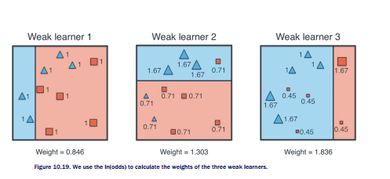

The way they vote is illustrated on Figure 10.20. Basically it weights each learner by its
weight, and for each point, we add the weight if the learner classified the point as positive,
and subtract the weight if it classified it as negative. If the resulting sum is positive, we
classify the point positive, and if it is negative, we classify it as negative.

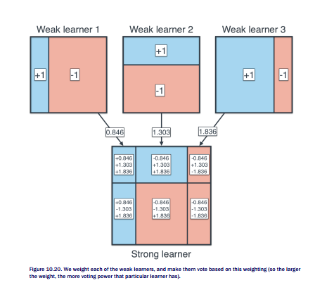


## 10.4.3 Coding AdaBoost in Sklearn

Let’s use our original dataset, and train an AdaBoost classifier. We specify the number of
learners as 6 using the parameter n_learners. The model we plot is in Figure 10.21.

```
from sklearn.ensemble import AdaBoostClassifier
adaboost_model = AdaBoostClassifier(random_state=0, n_estimators=6)
adaboost_model.fit(new_X, new_y)
```

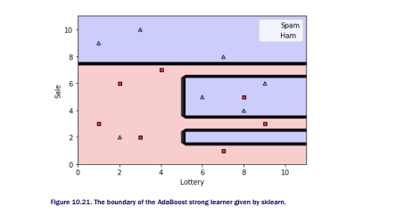

We can go a bit farther and actually explore the six learners we’ve used (Figure 10.22), using
the following commands. Furthermore, the command estimator_weights will help us look at
the weights of all the learners.

```
estimators = adaboost_model.estimators_
for estimator in estimators:
plot_model(new_X, new_y, estimator)
plt.show()
```

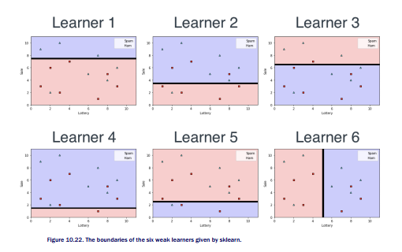


Notice that when the weak learners in Figure 10.22 vote, we get the strong learner in Figure
10.21.

<h4><span style="color:red;">10.5 Applications of ensemble methods</span></h4>


Ensemble methods are some of the most useful machine learning techniques used nowadays
as they exhibit great levels of performance with relatively low cost. One of the places where
ensemble methods are used the most is in machine learning challenges such as the Netflix
challenge. The Netflix challenge was a competition that Netflix organized, where they
anonymized some data and made it public. The competitors’ goal was to build a better
recommendation system than Netflix itself; the best system would win one million dollars. The
winning team used a very strong combination of weak learners in an ensemble to win.

## 10.6 Summary

- Ensemble methods are ways we use to combine weak learners into a strong one. There
are two major types of ensemble methods: Bagging and boosting.

- Bagging, or bootstrap aggregating, consists of building successive learners on random

subsets of our data, and then building a strong classifier based on a majority vote.
- Boosting consists of building a sequence of learners, where each learner focuses on the
weaknesses of the previous one, and then building a strong classifier based on a
weighted majority vote of the learners.

- Applications of ensemble methods range very widely, from recommendation algorithms
to applications in medicine and biology.


### Exercises


#### Exercise 1

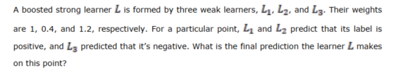

#### Exercise 2

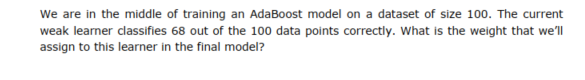