Solutions to the exercises
==========================

For the questions in this lab, your answers don't need to match
mine. If you have different ideas for models used in these applications,
they might be great! I encourage you to look them up in the literature,
and if they don't exist, try to implement them.

#### Exercise 2.1

For each of the following scenarios, state if it is an example of
supervised or unsupervised learning. Explain your answers. In cases of
ambiguity, pick one and explain why you picked it.

1. A recommendation system on a social network that recommends
    potential friends to a user
2. A system in a news site that divides the news into topics
3. The Google autocomplete feature for sentences
4. A recommendation system on an online retailer that recommends to
    users what to buy based on their past purchasing history
5. A system in a credit card company that captures fraudulent transactions

#### Solution

Depending on how you interpreted the problem and the dataset, each of
these can be considered an example of supervised or unsupervised
learning. It is completely OK (and encouraged!) to have different
answers, as long as the reasoning behind them is correct.

1. This is an example of both supervised and unsupervised learning.
    Supervised learning: for a particular user, we can build a
    classification model where the label of every other user is positive
    if they are a potential friend and negative if they are not a
    potential friend.
2. This is also an example of both supervised and unsupervised
    learning. Supervised learning: a classification model where the
    label of each news article is the topic, for example, politics,
    sports, or science. Unsupervised learning: we can cluster the
    articles and then manually check if the topics in each cluster are
    similar. If this is the case, then we can manually label each
    cluster by the most common topic. There are some more advanced
    unsupervised learning techniques such as latent Dirichlet
    allocation, which you can learn in this video:
    <https://www.youtube.com/watch?v=T05t-SqKArY>.
3. This one is more of a supervised learning task. We can build a
    classification model in which the features are the last few words
    the user has typed, and the label is the next word they'll type. In
    that way, the prediction of the model is the word we'll suggest to
    the user.
4. This is similar to a), and it can be considered a supervised or an
    unsupervised learning problem. Supervised learning: for a particular
    user, we can build a classification model for all the products,
    where for each product, we predict whether the user will buy it. We
    can also build a regression model in which we predict how much money
    the user will spend on that particular product. Unsupervised
    learning: we can cluster the users. If a user has bought a product,
    we can recommend that same product to other users in the cluster. We
    can also cluster the products, and if a user has bought a product,
    we recommend products in the same cluster.
5. This one is more of a supervised learning task. We can build a
    classification model that predicts whether a certain transaction is
    fraudulent or not, based on the characteristics of that transaction.
    It can also be seen as an unsupervised learning task in which we
    cluster the transactions, and those left as outliers have a higher
    chance of being fraudulent.

#### Exercise 2.2

For each of the following applications of machine learning, would you
use regression or classification to solve it? Explain your answers. In
cases of ambiguity, pick one and explain why you picked it.

1. An online store predicting how much money a user will spend on
    their site
2. A voice assistant decoding voice and turning it into text
3. Selling or buying stock from a particular company
4. YouTube recommending a video to a user

#### Solution

1. Regression, because we are trying to predict the amount of money
    that the user spends, and this is a numerical feature.
2. Classification, because we are trying to predict whether the
    sentence the user has spoken is directed to Alexa, and this is a
    categorical feature.
3. This could be regression or classification. If we are trying to
    predict the expected gain or the expected risk to help us in our
    decision, it is regression. If we are trying to predict whether we
    should buy the stock, it is classification.
4. This can again be regression or classification. If we are trying to
    predict how much time the user will spend watching the video in
    order to recommend it, it is regression. If we are trying to predict
    whether the user will watch a video, it is classification.

#### Exercise 2.3

Your task is to build a self-driving car. Give at least three examples
of machine learning problems that you would have to solve to build it.
In each example, explain whether you are using supervised/unsupervised
learning, and if supervised, whether you are using regression or
classification. If you are using other types of machine learning,
explain which ones and why.

#### Solution

- A classification model, which, based on the image, determines
    whether there are pedestrians, stop signs, lanes, other cars, and so
    on. This is a large area of machine learning called computer vision,
    which I highly encourage you to explore further!
- A similar classification model as the previous one, which
    determines what objects are around the car based on the signals from
    all the different sensors in the car (lidar, etc).
- A machine learning model that finds the closest path to our desired
    destination. This is not precisely supervised or unsupervised
    learning. There are some more classical artificial intelligence
    algorithms such as A\* (A-star) search that can be used here.

Lab 3: Drawing a line close to our points: Linear regression
----------------------------------------------------------------

#### Exercise 3.1

A website has trained a linear regression model to predict the amount of
minutes that a user will spend on the site. The formula they have
obtained is

*t̂* = 0.8*d* + 0.5*m* + 0.5*y* + 0.2*a* + 1.5

where *t̂* is the predicted time in minutes, and *d*, *m*, *y*, and *a*
are indicator variables (namely, they take only the values 0 or 1)
defined as follows:

- *d* is a variable that indicates if the user is on desktop.
- *m* is a variable that indicates if the user is on mobile
    device.
- *y* is a variable that indicates if the user is young (under 21
    years old).
- *a* is a variable that indicates if the user is an adult (21 years
    old or older).

Example: If a user is 30 years old and on desktop, then *d* = 1, *m* =
0, *y* = 0, and *a* = 1.

If a 45-year-old user looks at the website from their phone, what is the
expected time they will spend on the site?

#### Solution

In this case, the values of the variables are the following:

- *d* = 0 because the user is not on desktop.
- *m* = 1 because the user is on mobile.
- *y* = 0 because the user is not under 21.
- *a* = 1 because the user is over 21.

When we plug them into the formula, we get

*t̂* = 0.8 · 0 + 0.5 · 1 + 0.5 · 0 + 0.2 · 1 + 1.5 = 2.2.

This means the model predicts that this user will spend 2.2 minutes on
the website.

#### Exercise 3.2

Imagine that we trained a linear regression model in a medical dataset.
The model predicts the expected lifetime of a patient. To each of the
features in our dataset, the model would assign a weight.

a\) For the following quantities, state if you believe the weight
attached to this quantity is a positive number, a negative number, or
zero. Note: if you believe that the weight is a very small number,
whether positive or negative, you can say zero.

1. Number of hours of exercise the patient gets per week
2. Number of cigarettes the patient smokes per week
3. Number of family members with heart problems
4. Number of siblings of the patient
5. Whether or not the patient has been hospitalized

b\) The model also has a bias. Do you think the bias is positive,
negative, or zero?

#### Solution

a\) We'll make some generalizations based on general medical knowledge.
For a particular patient, the following are not necessarily true, but
we'll make the assumption that they are true for the general population:

1. A patient who exercises a lot is expected to live longer than a
    similar patient who doesn't. Thus, this weight should be a positive
    number.
2. A patient who smokes many cigarettes a week is expected to live
    shorter than a similar patient who doesn't. Thus, this weight should
    be a negative number.
3. A patient who has many family members with heart problems has a
    higher likelihood of having heart problems, and thus they are
    expected to live shorter than a similar patient that doesn't have
    them. Thus, this weight should be a negative number.
4. The number of siblings tends to be independent of the expected
    lifetime, so we expect this weight to be a very small number, or
    zero.
5. A patient who has been hospitalized in the past is likely to have
    had previous health problems. Thus, their expected lifetime is
    shorter than a similar patient that hasn't been hospitalized before.
    Therefore, this weight should be a negative number. Of course, the
    hospitalization could be for a reason that doesn't affect expected
    lifetime (such as a broken leg), but on average, we can say that if
    a patient has been to the hospital in the past, they have a higher
    probability to have health problems.

b\) The bias is the prediction for a patient for which every feature is
zero (i.e., a patient who doesn't smoke, doesn't exercise, has zero
family members with heart condition, zero siblings, and has never been
hospitalized). Because this patient is expected to live a positive
number of years, the bias of this model must be a positive number.

#### Exercise 3.3

The following is a dataset of houses with sizes (in square feet) and
prices (in dollars).

Suppose we have trained the model where the prediction for the price of
the house based on size is the following:

1. Calculate the predictions that this model makes on the
    dataset.
2. Calculate the mean absolute error of this model.
3. Calculate the root mean square error of this model.

#### Solution

#### Exercise 3.4

Our goal is to move the line with equation *ŷ* = 2*x* + 3 closer to the
point (*x*, *y*) = (5, 15) using the tricks we've learned in this
lab. For the following two problems, use the learning rate *η* =
0.01.

1. Apply the absolute trick to modify the line above to be closer to
    the point.
2. Apply the square trick to modify the line above to be closer to the
    point.

#### Solution

The prediction that this model makes at the point is *ŷ* = 2 · 5 + 3 =
13.

1. Because the prediction is 13, which is smaller than the label 15,
    the point is underneath the line.
    
    In this model, the slope is *m* = 2 and the *y*-intercept is *b*
    = 3. The absolute trick involves adding *xη* = 5 · 0.01 = 0.05 to
    the slope, and *η* = 0.01 to the *y*-intercept, thus obtaining the
    model with equation
    

    
    *ŷ* = 2.05*x* + 3.01.
    
2. The square trick involves adding (*y* -- *ŷ*)*xη* = (15 -- 13) · 5
    · 0.01 = 0.1 to the slope, and (*y* -- *ŷ*)*η* = (15 -- 13) · 0.01 =
    0.02 to the *y*-intercept, thus obtaining the model with
    equation
    
    *ŷ* = 2.1*x* + 3.02.
    

Lab 4: Optimizing the training process: Underfitting, overfitting, testing, and regularization
-----------------------------------------------------------------------------------------------------------------------------------------------------------------------------------------------

#### Exercise 4.1

We have trained four models in the same dataset with different
hyperparameters. In the following table we have recorded the training
and testing errors for each of the models.

1. Which model would you select for this dataset?
2. Which model looks like it's underfitting the data?
3. Which model looks like it's overfitting the data?

#### Solution

1. The best model is the one with the smallest testing error, which is
    model 3.
2. Model 4 looks like it is underfitting because it has large training
    and testing errors.
3. Models 1 and 2 look like they are overfitting, because they have
    small training errors but large testing errors.

#### Exercise 4.2

We are given the following dataset:

We train the polynomial regression model that predicts the value of *y*
as *ŷ*, where

*ŷ* = 2*x*^2^ *--* 5*x* + 4*.*

If the regularization parameter is λ = 0.1 and the error function we've
used to train this dataset is the mean absolute
value
(MAE), determine the following:

1. The lasso regression error of our model (using the L1-norm)
2. The ridge regression error of our model (using the L2-norm)

#### Solution

First we need to find the predictions to calculate the mean absolute
error of the model. In the following table, we can find the prediction
calculated by the formula *ŷ* = 2*x*^2^ *--* 5*x* + 4, and the absolute
value of the difference between the prediction and the label \|*y* --
*ŷ*\|.

Thus, the mean absolute error is the average of the numbers in the
fourth row, namely

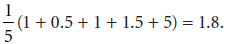

1. First we need to find the L1-norm of the polynomial. This is the
    sum of the absolute values of the nonconstant coefficients, namely,
    \|2\| + \|--5\| = 7. To find the L1-regularization cost of the
    model, we add the mean absolute error and the L1-norm times the
    regularization parameter, to obtain 1.8 + 0.1 · 7 = 2.5.
2. In a similar way, we find the L1-norm of the polynomial by adding
    the squares of nonconstant coefficients to get 2^2^ + (--5)^2^ = 29.
    As before, the L2-regularization cost of the model is 1.8 + 0.1 · 29
    = 4.7.

Lab 5: Using lines to split our points: The perceptron algorithm
-----------------------------------------------------------------------------------------------------------------------------------------------------------------

#### Exercise 5.1

The following is a dataset of patients who have tested positive or
negative for COVID-19. Their symptoms are cough (C), fever (F),
difficulty breathing (B), and tiredness (T).

Build a perceptron model that classifies this dataset.

##### hint

You can use the perceptron algorithm, but you may be able to eyeball a
good perceptron model that works.

#### Solution

If we count how many symptoms each patient has, we notice that the sick
patients show three or more symptoms, whereas the healthy patients show
two or fewer symptoms. Thus, the following model works to predict the
diagnosis *D*:

*D̂* = *step*(*C* + *F* + *B* + *T* -- 2.5)

#### Exercise 5.2

Consider the perceptron model that assigns to the point (*x*~1~, *x*~2~)
the prediction *ŷ* = *step*(2*x*~1~ + 3*x*~2~ -- 4). This model has as a
boundary line with equation 2*x*~1~ + 3*x*~2~ -- 4 = 0. We have the
point *p* = (1, 1) with label 0.

1. Verify that the point *p* is misclassified by the model.
2. Calculate the perceptron error that the model produces at the point
    *p*.
3. Use the perceptron trick to obtain a new model that still
    misclassifies *p* but that produces a smaller error. You can use *η*
    = 0.01 as the learning rate.
4. Find the prediction given by the new model at the point *p*, and
    verify that the perceptron error obtained is smaller than the
    original.

#### Solution

1. The prediction for the point *p* is
    
    *ŷ* = *step*(2*x*~1~ + 3*x*~2~ -- 4) = *step*(2 · 1 + 3 · 1 -- 4) =
    *step*(1) = 1.
    

    
    Because the label of the point is 0, the point is misclassified.
    
2. The perceptron error is the absolute value of the score. The score
    is 2*x*~1~ + 3*x*~2~ -- 4 = 2 · 1 + 3 · 1 -- 4 = 1, so the
    perceptron error is 1.
3. The weights of the model are 2, 3, and --4, and the coordinates of
    the point are (1, 1). The perceptron trick does the
    following:
    -   Replaces 2 with 2 -- 0.01 · 1 = 1.99
    -   Replaces 3 with 3 -- 0.01 · 1 = 2.99
    -   Replaces --4 with --1 -- 0.01 · 1 = --4.01

    
    Thus, the new model is the one that makes the prediction *ŷ* =
    *step*(1.99*x*~1~ + 2.99*x*~2~ -- 4.01).
    
4. Note that at our point, the new prediction is *ŷ* =
    *step*(1.99*x*~1~ + 2.99*x*~2~ -- 4.01) = *step*(0.97) = 0, which
    means the model still misclassifies the point. However, the new
    perceptron error is \|1.99 · 1 + 2.99 · 1 -- 4.01\| = 0.97, which is
    smaller than 1, the previous error.

#### Exercise 5.3

Perceptrons are particularly useful for building logical gates such as
AND and OR.

#### {#idTextAnchor429a}Solution

For simplicity, we plot the data points in the figure that follows.

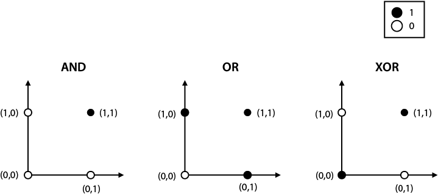

Note that a perceptron classifier is precisely a line that would split
the black and white dots in the above plots.

For the AND and OR datasets, we can easily split the black and white
points with a line, as seen next.

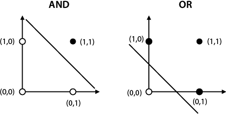

1. Many equations work for the line separating the AND dataset. We'll
    pick the line with equation *x*~1~ + *x*~2~ -- 1.5. Thus, the
    perceptron that classifies this dataset makes the prediction *ŷ* =
    *step*(*x*~1~ + *x*~2~ -- 1.5).
2. Similarly, many equations work for the OR dataset, and we pick the
    line with equation *x*~1~ + *x*~2~ -- 0.5. The equation for the
    prediction is *ŷ* = *step*(*x*~1~ + *x*~2~ -- 0.5).
3. Notice that the dataset for XOR is impossible to separate using a
    single line. Thus, there is no perceptron model that perfectly fits
    the XOR dataset. However, a combination of perceptrons can separate
    this dataset. These are also called multilayer perceptrons, or
    neural networks, and we'll see them in lab 10. If you're
    curious, take a look at exercise 10.2.

Lab 6: A continuous approach to splitting points: Logistic classifiers
-----------------------------------------------------------------------------------------------------------------------------------------------------------------------

#### Exercise 6.1

A dentist has trained a logistic classifier on a dataset of patients to
predict if they have a decayed tooth. The model has determined that the
probability that a patient has a decayed tooth is

*σ*(*d* + 0.5*c* -- 0.8),

where

- *d* is a variable that indicates whether the patient has had
    another decayed tooth in the past, and
- *c* is a variable that indicates whether the patient eats
    candy.

For example, if a patient eats candy, then *c* = 1, and if they don't,
then *c* = 0. What is the probability that a patient that eats candy and
was treated for a decayed tooth last year has a decayed tooth today?

#### Solution

If the patient eats candy, then *c* = 1. If the patient was treated for
tooth decay last year, then *d* = 1. Thus, according to the model, the
probability that the patient has a decayed tooth is

*σ*(1 + 0.5 · 1 -- 0.8) = *σ*(0.7) = 0.668.

#### Exercise 6.2

Consider the logistic classifier that assigns to the point (*x*~1~,
*x*~2~) the prediction *ŷ* = *σ*(2*x*~1~ + 3*x*~2~ -- 4), and the point
*p* = (1, 1) with label 0.

1. Calculate the prediction *ŷ* that the model gives to the point
    *p*.
2. Calculate the log loss that the model produces at the point
    *p*.
3. Use the logistic trick to obtain a new model that produces a
    smaller log loss. You can use *η* = 0.1 as the learning rate.
4. Find the prediction given by the new model at the point *p*, and
    verify that the log loss obtained is smaller than the
    original.

#### Solution

1. The prediction is *ŷ* = *σ*(2 · 1 + 3 · 1 -- 4) = *σ*(1) =
    0.731
2. The log loss is
    
    *log loss* = --*y* *ln* (*ŷ*) -- (1 -- *y*) *ln* (1 -- *ŷ*)
    

    
                 = --0 *ln* (0.731) -- (1 -- 0) *ln* (1 -- 0.731)
    

    
                 = 1.313.
    
3. Recall that the perceptron trick for the logistic regression model
    with prediction *ŷ* = *σ*(*w*~1~*x*~1~ + *w*~1~*x*~1~ + *b*) gives
    us the following new weights:
    -   *w*~1~*\'* = *w*~1~ + *η*(*y* -- *ŷ*) *x*~1~ for *i* = 1,2
    -   *b\'* = *b* + *η*(*y* -- *ŷ*) for *i* = 1,2

    
    These are the values to plug into the previous formulas:
    

    -   *y* = 0
    -   *ŷ* = 0.731
    -   *w*~1~ = 2
    -   *w*~2~ = 3
    -   *b* = --4
    -   *η* = 0.1
    -   *x*~1~ = 1
    -   *x*~2~ = 1

    
    We obtain the following new weights for our classifier:
    

    -   *w*~1~\' = 2 + 0.1 · (0 -- 0.731) · 1 = 1.9269
    -   *w*~2~\' = 3 + 0.1 · (0 -- 0.731) · 1 = 2.9269
    -   *b* = --4 + 0.1 · (0 -- 0.731) = --4.0731

    
    Thus, our new classifier is the one that makes the prediction *ŷ* =
    *σ*(1.9269*x*~1~ + 2.9269*x*~2~ -- 4.0731).
    

    
    The prediction at the point *p* is *ŷ* =*σ*(1.9269 · 1 + 2.9269 · 1
    -- 4.0731) = 0.686. Notice that because the label is 0, the
    prediction has improved from the original 0.731, to the actual
    0.686.
    
4. The log loss for this prediction is --*y* *ln*(*ŷ*) -- (1 -- *y*)
    *ln*(1 -- *ŷ*) = --0 *ln*(0.686) -- (1 -- 0) *ln*(1 -- 0.686) =
    1.158. Note that this is smaller than the original log loss of
    1.313.

#### Exercise 6.3

Using the first model in exercise 6.2, construct a point for which the
prediction is 0.8.

##### hint

First find the score that will give a prediction of 0.8, and recall that
the prediction is *ŷ* = *σ*(score).

#### Solution

First, we need to find a score such that *σ*(score) = 0.8. This is
equivalent to

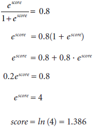

Recall that for the point (*x*~1~, *x*~2~), the score is 2*x*~1~ +
3*x*~2~ -- 4. Many points (*x*~1~, *x*~2~) satisfy that the score is
1.386, but in particular, let's pick one in which *x*~2~ = 0 for
convenience. We need to solve the equation 2*x*~1~ + 3 · 0 -- 4 = 1.386,
which has as a solution, *x*~1~ = 2.693. Thus, a point that gives a
prediction of 0.8 is the point (2.693, 0).

Lab 7: How do you measure classification models? Accuracy and its friends
--------------------------------------------------------------------------------------------------------------------------------------------------------------------------

#### Exercise 7.1

A video site has established that a particular user likes animal videos
and absolutely nothing else. In the next figure, we can see the
recommendations that this user got when logging in to the site.

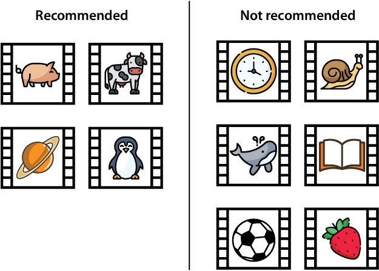

If this is all the data we have on the model, answer the following
questions:

1. What is the accuracy of the model?
2. What is the recall of the model?
3. What is the precision of the model?
4. What is the *F*~1~-score of the model?
5. Would you say that this is a good recommendation model?

#### Solution

First, let's write the confusion matrix. In this case, we label the
videos that are about animals as *positive*, and the videos that are
recommended as *predicted positive*.

- There are four recommended videos. Out of them, three are about
    animals, which means they are good recommendations. The other one is
    not about animals, so it is a false positive.
- There are six videos that are not recommended. Out of them, two are
    about animals, which should have been recommended. Thus, they are
    false negatives. The other four are not about animals, so it was
    correct not to recommend them.

Thus, the confusion matrix is the following:

Now we can calculate the metrics.

1. This is a subjective answer. A medical model with these metrics may
    not be good enough. However, if a recommendation model has decent
    accuracy, precision, and recall, it is considered a good model,
    because making a couple of mistakes in a recommendation model is not
    as crucial.

#### Exercise 7.2

Find the sensitivity and specificity of the medical model with the
following confusion matrix:

#### Solution

The sensitivity is the number of correctly predicted sick people divided
by the total number of sick people. This is 120/142= 0.845.

The specificity is the number of correctly predicted healthy people
divided by the total number of healthy people. This is 795/858= 0.927.

#### Exercise 7.3

For the following models, determine which error is worse, a false
positive or a false negative. Based on that, determine which of the two
metrics, precision or recall, we should emphasize when evaluating each
of the models.

1. A movie recommendation system that predicts whether a user will
    watch a movie.
2. An image-detection model used in self-driving cars that detects
    whether an image contains a pedestrian.
3. A voice assistant at home that predicts whether the user gave it an
    order.

#### Solution

##### note

In all of the following models, a false negative and a false positive
are bad, and we want to avoid both of them. However, we show an argument
for which one of the two is worse. These are all conceptual questions,
so if you have a different idea, as long as you can argue it well, it is
valid! These are the kind of discussions that arise in a team of data
scientists, and it is important to have healthy opinions and arguments
supporting each point of view.

1. In this model, we label the movies that the user wants to watch as
    positives. A false positive occurs any time we recommend a movie
    that the user doesn't want to watch. A false negative occurs any
    time there is a movie that the user wants to watch, but we don't
    recommend it. Which is worse, a false negative or a false positive?
    Because the homepage shows many recommendations and the user ignores
    most of them, this model has many false negatives that don't affect
    the user experience much. However, if there is a great movie that
    the user would like to watch, it is crucial to recommend it to them.
    Therefore, in this model, a false negative is worse than a false
    positive, so we should evaluate this model using
    **recall**.
2. In this model, we label the existence of a pedestrian as a
    positive. A false positive occurs when there is no pedestrian, but
    the car thinks there is a pedestrian. A false negative occurs when
    the car doesn't detect a pedestrian that is in front of the car. In
    the case of a false negative, the car may hit a pedestrian. In the
    case of a false positive, the car may brake unnecessarily, which may
    or may not lead to an accident. Although both are serious, it is
    much worse to hit a pedestrian. Therefore, in this model, a false
    negative is worse than a false positive, so we should evaluate this
    model using **recall**.
3. In this model, we label a voice command as a positive. A false
    positive occurs when the user is not talking to the voice assistant,
    but the voice assistant responds. A false negative occurs when the
    user is talking to the voice assistant, but the voice assistant
    doesn't respond. As a personal choice, I prefer to have to repeat to
    my voice assistant than to have her speak to me out of the blue.
    Thus, in this model, a false positive is worse than a false
    negative, so we should evaluate this model using
    **precision**.

#### Exercise 7.4

We are given the following models:

1. A self-driving car model for detecting a pedestrian based on the
    image from the car's camera
2. A medical model for diagnosing a deadly illness based on the
    patient's symptoms
3. A recommendation system for movies based on the user's previous
    movies watched
4. A voice assistant that determines whether the user needs assistance
    given the voice command
5. A spam-detection model that determines whether an email is spam
    based on the words in the email

We are given the task of evaluating these models using *F*~β~-scores.
However, we haven't been given the values of *β* to use. What value of
*β* would you use to evaluate each of the models?

#### Solution

Remember that for models in which precision is more important than
recall, we use an *F*~β~-score with a small value of *β*. In contrast,
for models in which recall is more important than precision, we use an
*F*~β~-score with a large value of *β*.

##### note

If you have different scores than this solution, that is completely OK,
as long as you have an argument for which is more important between
precision and recall, and for the value of *β* that you choose.

- For the self-driving car and the medical models, recall is
    tremendously important because we want very few false negatives.
    Thus, I would use a large value of *β*, such as 4.
- For the spam-detection model, precision is important, because we
    want very few false positives. Thus, I would use a small value of
    *β*, such as 0.25.
- For the recommendation system, recall is more important (see
    exercise 7.3), although precision also matters. Thus, I would use a
    large value of *β*, such as 2.
- For the voice assistant, precision is more important, although
    recall also matters (see exercise 7.3). Thus, I would use a small
    value for *β*, such as 0.5.

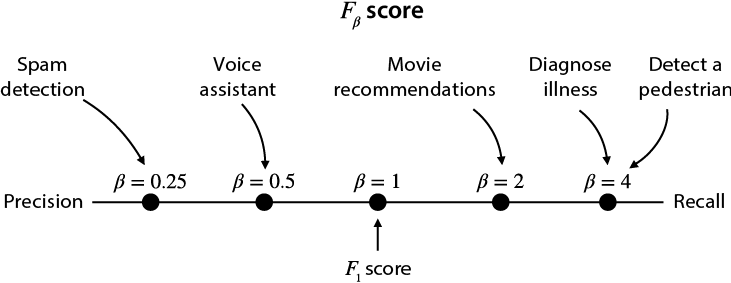

Lab 8: Using probability to its maximum: The naive Bayes model
---------------------------------------------------------------------------------------------------------------------------------------------------------------

#### Exercise 8.1

For each pair of events A and B, determine whether they are independent
or dependent. For (a) to (d), provide mathematical justification. For
(e) and (f) provide verbal justification.

Throwing three fair coins:

1. A: First one falls on heads. B: Third one falls on tails.
2. A: First one falls on heads. B: There is an odd number of heads
    among the three throws.
    
    Rolling two dice:
    
3. A: First one shows a 1. B: Second one shows a 2.
4. A: First one shows a 3. B: Second one shows a higher value than the
    first one.
    
    For the following, provide a verbal justification. Assume that for
    this problem, we live in a place with seasons.
    
5. A: It's raining outside. B: It's Monday.
6. A: It's raining outside. B: It's June.

#### Solution

Some of the following can be deduced by intuition. However, sometimes
intuition fails when determining whether two events are independent. For
this reason, unless the events are obviously independent, we'll stick to
checking whether two events A and B are independent if *P*(*A* ∩ *B*) =
*P*(*A*) *P*(*B*).

1. Because A and B correspond to tossing different coins, they are
    independent events.
2. 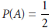
     because flipping a fair coin results in two equally
    likely scenarios. For the calculation of *P*(*B*), we'll use "h" for
    heads and "t" for tails. This way, the event "hth" corresponds to
    the first and third coin toss landing on heads and the second one
    landing on tails. Thus, if we throw three coins, the eight equally
    likely possibilities are {hhh, hht, hth, htt, thh, tht, tth, ttt}.
    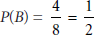
     because among the eight equally likely possibilities
    (hhh, hht, hth, htt, thh, tht, tth, ttt), only four of them have an
    odd number of heads, namely, {hhh, htt, tht, tth}.
    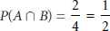
     because among the eight possibilities, only two satisfy
    that the first one falls on heads, and there are an odd number of
    heads, namely, {hhh, htt}.
    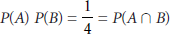
     , so the events A and B are independent.
3. Because A and B correspond to tossing different dice, they are
    independent events.
4. 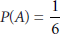
     , because it corresponds to tossing a die and obtaining
    a particular value.
    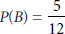
     for the following reason. Notice that the 36 equally
    likely possibilities for the scores of the two dice are {11, 12, 13,
    ..., 56, 66}. In six of these, the two dice show the same value. The
    remaining 30 correspond to 15 in which the first value is higher,
    and 15 in which the second value is higher, by symmetry. Therefore,
    there are 15 scenarios in which the second die shows a higher value
    than the third one, so
    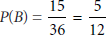
     .
    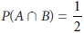
     for the following reason. If the first die falls on 3,
    we have a total of six equally likely scenarios, namely, {31, 32,
    33, 34, 35, 36}. Out of these six, the second number is higher for
    three of them. Thus,
    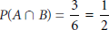
     . Because *P*(*A*) *P*(*B*) ≠ *P*(*A* ∩ *B*), the
    events A and B are dependent.
5. For this problem, we'll make the assumption that A and B are
    independent, namely, that weather is not dependent on the day of the
    week. This is a fair assumption, given our knowledge of weather, but
    if we wanted to be surer, we could look at weather datasets and
    verify this by calculating the corresponding probabilities.
6. Because we've assumed that we live in a place with seasons, June is
    summer in the northern hemisphere and winter in the southern
    hemisphere. Depending on where we live, it may rain more in the
    winter or in the summer. Thus, we can assume that events A and B are
    dependent.

#### Exercise 8.2

There is an office where we have to go regularly for some paperwork.
This office has two clerks, Aisha and Beto. We know that Aisha works
there three days a week, and Beto works the other two However, the
schedules change every week, so we never know which three days Aisha is
there, and which two days Beto is there.

1. If we show up on a random day to the office, what is the
    probability that Aisha is the clerk?
    
    We look from outside and notice that the clerk is wearing a red
    sweater, although we can't tell who the clerk is. We've been going
    to that office a lot, so we know that Beto tends to wear red more
    often than Aisha. In fact, Aisha wears red one day out of three
    (one-third of the time), and Beto wears red one day out of two (half
    of the time).
    
2. What is the probability that Aisha is the clerk, knowing that the
    clerk is wearing red today?

#### Solution

Let's use the following notation for events:

- A: the event that the clerk is Aisha
- B: The event that the clerk is Beto
- R: The event that the clerk is wearing red

1. Because Aisha works at the office three days and Beto works two
    days, the probability that Aisha is the clerk is
    
     , or 60%. In addition, the probability that Beto is the
    clerk is
    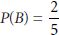
     , or 40%.
2. Intuitively, because Beto wears red more often than Aisha, we
    imagine that the probability that the clerk is Aisha is lower than
    in part a). Let's check whether the math agrees with us. We know the
    clerk is wearing red, so we need to find the probability that the
    clerk is Aisha *knowing that* the clerk is wearing red. This is
    *P*(*A*\|*R*).

The probability that Aisha wears red is

 , so
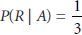
 . The probability that Beto wears red is

 , so
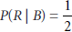
 .

We can use Bayes theorem to obtain

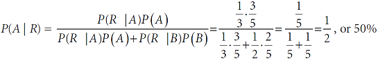

A similar calculation shows that the probability that Beto is the clerk
is
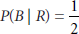
 , or 50%.

In effect, the probability that Aisha is the clerk is smaller than the
one obtained in part a), so our intuition was right.

#### Exercise 8.3

The following is a dataset of patients who have tested positive or
negative for COVID-19. Their symptoms are cough (C), fever (F),
difficulty breathing (B), and tiredness (T).

The goal of this exercise is to build a naive Bayes model that predicts
the diagnosis from the symptoms. Use the naive Bayes algorithm to find
the following probabilities:

##### note

For the following questions, the symptoms that are not mentioned are
completely unknown to us. For example, if we know that the patient has a
cough, but nothing is said about their fever, it does not mean the
patient doesn't have a fever.

1. The probability that a patient is sick given that the patient has a
    cough
2. The probability that a patient is sick given that the patient is
    not tired
3. The probability that a patient is sick given that the patient has a
    cough and a fever
4. The probability that a patient is sick given that the patient has a
    cough and a fever, but no difficulty breathing

#### Solution

For this problem, we have the following events:

- C: the event that the patient has a cough
- F: the event that the patient has a fever
- B: the event that the patient has difficulty breathing
- T: the event that the patient is tired
- S: the event that the patient has been diagnosed as sick
- H: the event that the patient has been diagnosed as healthy

Furthermore, *A*^c^ denotes the complement (opposite) of the event *A*.
Thus, for example, *T*^c^ represents the event that the patient is not
tired.

First, let's calculate *P*(*S*) and *P*(*H*). Note that because the
dataset contains four healthy and four sick patients, both of these
(prior) probabilities are

, or 50%.

1. Because four patients have a cough and three of them are sick,
    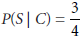
     , or 75%.
    
    Equivalently, we can use Bayes' theorem in the following way: first,
    we calculate
    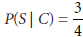
     by noticing that there are four sick patients, and
    three of them have a cough. We also notice that
    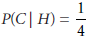
     , because there are four healthy patients, and only one
    of them has a cough.
    

    
    Now we can use the formula
    

    
    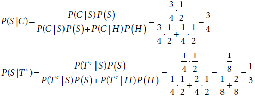
    
    
2. Because four patients have a cough and three of them are sick,
    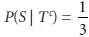
     , or 33.3%.
    
    We can also use Bayes' theorem as before. Notice that
    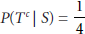
     because only one out of the four sick patients is not
    tired. Also,
    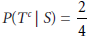
     , because two out of the four healthy patients are not
    tired.
    

    
    By Bayes' theorem,
    

    
    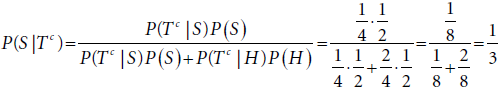
    
    
3. *C* ∩ *F* represents the event that the patient has a cough and a
    fever, so we need to calculate *P*(*S*\|*C* ∩ *F*).
    
    Recall from part a) that
    
     and
    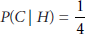
     .
    

    
    Now we need to calculate *P*(*F*\|*S*) and *P*(*F*\|*H*). Note that
    because there are four sick patients and three of them have a fever,
    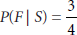
     . Similarly, two out of the four healthy patients have
    a fever, so
    
     .
    

    
    We are ready to use the naive Bayes algorithm to estimate the
    probability that the patient is sick given that they have a cough
    and fever. Using the formula in the section "What about two words?
    The naive Bayes algorithm" in lab 8, we get
    

    
    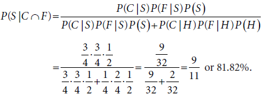
    
    
4. For this exercise we need to find *P*(*S*\|*C* ∩ *F* ∩
    *B*^c^)
    
    Note that because there are four sick patients and only one of them
    has no difficulty breathing,
    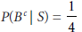
     . Similarly, there are four healthy patients and three
    of them have no difficulty breathing, so
    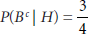
     .
    

    
    As before, we can use the naive Bayes algorithm.
    

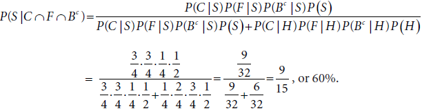

Lab 9: Splitting data by asking questions: Decision trees
----------------------------------------------------------------------------------------------------------------------------------------------------------

#### Exercise 9.1

In the following spam-detection decision tree model, determine whether
an email from your mom with the subject line "Please go to the store,
there's a sale," will be classified as spam.

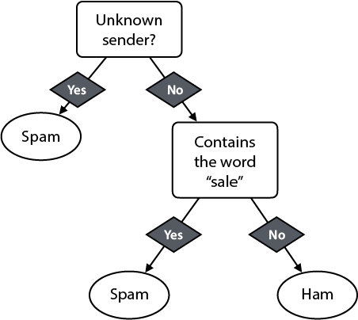

#### Solution

First we check whether the sender is unknown. Because the sender is our
mom, the sender is not unknown. Thus, we take the branch on the right.
We must check whether the email contains the word "sale." The email
contains the word "sale," so the classifier (incorrectly) classifies it
as spam.

#### Exercise 9.2

Our goal is to build a decision tree model to determine whether credit
card transactions are fraudulent. We use the dataset of credit card
transactions below, with the following features:

- **Value**: value of the transaction.
- **Approved vendor**: the credit card company has a list of approved
    vendors. This variable indicates whether the vendor is in this
    list.

Build the first node of the decision tree under the following
specifications:

1. Using the Gini impurity index
2. Using entropy

#### Solution

In both cases, the best split is obtained using the Approved vendor
feature, as in the next image.

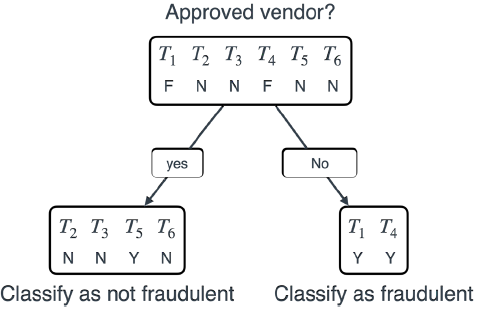

Let's call the transactions *T*~1~, *T*~2~, *T*~3~, *T*~4~, *T*~5~, and
*T*~6~.

First, let's look at all the following splits we can make. The split
using Approved vendor is easy, because this is a categorical variable
with two categories. The Value column is more complicated---we can use
it to split the data in two possible ways. One is when the cutoff is
some value between \$100 and \$5,000, and the other one when it is some
value between \$5,000 and \$10,000. To summarize, these are all the
possible splits:

- **Value 1**: where the cutoff value is between \$100 and \$5,000.
    The two classes here are {*T*~1~, *T*~2~, *T*~6~} and {*T*~3~,
    *T*~4~, *T*~5~}.
- **Value 2**: where the cutoff value is some value between \$5,000
    and \$10,000. The two classes here are {*T*~1~, *T*~2~, *T*~5~,
    *T*~6~} and {*T*~3~, *T*~4~}.
- **Approved vendor**: the two classes are "approved" and "not
    approved," or equivalently, {*T*~2~, *T*~3~, *T*~5~, *T*~6~} and
    {*T*~1~, *T*~4~}.

1. Let's calculate the Gini impurity index for each one of the
    following four splits:
    
    **Value 1**: cutoff value between \$100 and \$5,000
    

    
    Note that for the first class {*T*~1~, *T*~2~, *T*~6~}, the labels
    in the Fraudulent column are {"yes", "no", "no"}. The Gini impurity
    index of this split is
    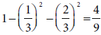
    .
    

    
    Note that for the second class {*T*~3~, *T*~4~, *T*~5~}, the labels
    in the Fraudulent column are {"no", "yes", "yes"}. The Gini impurity
    index of this split is
    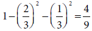
    .
    

    
    Thus, the weighted Gini impurity index for this split is
    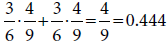
    .
    

    
    **Value 2**: cutoff value between \$5,000 and \$10,000
    

    
    For the first class {*T*~1~, *T*~2~, *T*~5~, *T*~6~}, the labels in
    the Fraudulent column are {"yes", "no", "yes", "no"}. The Gini
    impurity index of this split is
    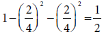
    .
    

    
    Note that for the second class {*T*~3~, *T*~4~}, the labels in the
    Fraudulent column are {"no", "yes"}. The Gini impurity index of this
    split is
    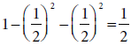
    .
    

    
    Thus, the weighted Gini impurity index for this split is
    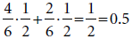
    *.*
    

    
    Approved vendor:
    

    
    For the first class {*T*~2~, *T*~3~, *T*~5~, *T*~6~}, the labels in
    the Fraudulent column are {"no", "no", "yes," "no"}. The Gini
    impurity index of this split is
    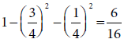
    .
    

    
    For the second class {*T*~1~, *T*~4~}, the labels in the Fraudulent
    column are {"yes", "yes"}. The Gini impurity index of this split is
    1 -- 1^2^ = 0.
    

    
    Thus, the weighted Gini impurity index for this split is
    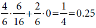
    .
    

    
    Notice that out of these three values, the lowest is 0.25,
    corresponding to the Approved vendor column. This implies that the
    best way to split this data is using the Approved vendor feature.
    
2. For this part, we've done most of the heavy lifting already. We'll
    follow the same procedure as in part a), except calculating the
    entropy at each stage instead of the Gini impurity index.
    
    **Value 1**: cutoff value between \$100 and \$5,000
    

    
    The entropy of the set {"yes", "no", "no"} is
    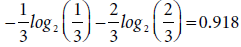
    .
    

    
    The entropy of the set {"no", "yes", "yes"} is also
    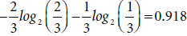
    .
    

    
    Thus, the weighted entropy for this split is
    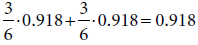
    .
    

    
    **Value 2**: cutoff value between \$5,000 and \$10,000
    

    
    The entropy of the set {"yes", "no", "yes", "no"} is
    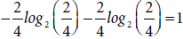
    .
    

    
    The entropy of the set {"no", "yes"} is
    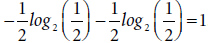
    .
    

    
    Thus, the weighted entropy for this split is
    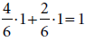
    .
    

    
    Approved vendor:
    

    
    The entropy of the set {"no", "no", "yes", "no"} is
    
    .
    

    
    The entropy of the set {"yes", "yes"} is
    
    .
    

    
    Thus, the weighted entropy for this split is
    
    .
    

    
    Notice that among these three, the smallest entropy is 0.541,
    corresponding to the Approved vendor column. Thus, the best way to
    split this data is, again, using the Approved vendor feature.
    

#### Exercise 9.3

A dataset of patients who have tested positive or negative for COVID-19
follows. Their symptoms are cough (C), fever (F), difficulty breathing
(B), and tiredness (T).

Using accuracy, build a decision tree of height 1 (a decision stump)
that classifies this data. What is the accuracy of this classifier on
the dataset?

#### Solution

Let's call the patients *P*~1~ up to *P*~8~. The sick patients will be
denoted by "s," and the healthy ones by "h."

First notice that the first split can be any of the four features C, F,
B, and T. Let's first calculate the accuracy of the classifier obtained
by splitting the data on feature C, namely, the classifier we build
based on the question, "Does the patient have a cough?"

Splitting based on the C feature:

- Patients with a cough: {*P*~2~, *P*~3~, *P*~4~, *P*~5~}. Their
    labels are {*s*, *s*, *s*, *h*}.
- Patients without a cough: {*P*~1~, *P*~6~, *P*~7~, *P*~8~} . Their
    labels are {*s*, *h*, *h*, *h*}.

Looking at this, we can see that the most accurate classifier (only
based on the C feature) is the one that classifies every person with a
cough as sick and every person without a cough as healthy. This
classifier correctly classifies six out of the eight patients (three
sick and three healthy), so its accuracy is 6/8, or 75%.

Now, let's follow the same procedure with the other three features.

Splitting based on the F feature:

- Patients with a fever: {*P*~1~, *P*~2~, *P*~4~, *P*~6~, *P*~7~}.
    Their labels are {*s*, *s*, *s*, *h*, *h*}.
- Patients without a fever: {*P*~3~, *P*~5~, *P*~8~}. Their labels
    are {*s*, *h*, *h*}.

Looking at this, we can see that the most accurate classifier (only
based on the F feature) is the one that classifies every patient with a
fever as sick and every patient without a fever as healthy. This
classifier correctly classifies five out of the eight patients (three
sick and two healthy), so its accuracy is 5/8, or 62.5%.

Splitting based on the B feature:

- Patients showing difficulty breathing: {*P*~1~, *P*~3~, *P*~4~,
    *P*~5~}. Their labels are {*s*, *s*, *s*, *h*}.
- Patients not showing difficulty breathing: {*P*~2~, *P*~6~, *P*~7~,
    *P*~8~}. Their labels are {*s*, *h*, *h*, *h*}.

Looking at this, we can see that the most accurate classifier (based
only on the B feature) is the one that classifies every patient showing
difficulty breathing as sick and every patient not showing difficulty
breathing as healthy. This classifier correctly classifies six out of
the eight patients (three sick and three healthy), so its accuracy is
6/8, or 75%.

Splitting based on the T feature:

- Patients that are tired: {*P*~1~, *P*~2~, *P*~3~, *P*~5~, *P*~8~}.
    Their labels are {*s*, *s*, *s*, *h*, *h*}.
- Patients that are not tired: {*P*~4~, *P*~5~, *P*~7~}. Their labels
    are {*s*, *h*, *h*}.

Looking at this, we can see that the most accurate classifier (based
only on the F feature) is the one that classifies every tired patient as
sick and every patient that is not tired as healthy. This classifier
correctly classifies five out of the eight patients (three sick and two
healthy), so its accuracy is 5/8, or 62.5%.

Note that the two features that give us the best accuracy are C (cough)
and B (difficulty breathing). The decision tree will pick one of these
at random. Let's pick the first one, C. After we split the data using
the C feature, we obtain the following two datasets:

- Patients with a cough: {*P*~2~, *P*~3~, *P*~4~, *P*~5~}. Their
    labels are {*s*, *s*, *s*, *h*}.
- Patients without a cough: {*P*~1~, *P*~6~, *P*~7~, *P*~8~}. Their
    labels are {*s*, *h*, *h*, *h*}.

This gives us our tree of depth 1 that classifies the data with a 75%
accuracy. The tree is depicted in the next figure.

Lab 10: Combining building blocks to gain more power: Neural networks
----------------------------------------------------------------------------------------------------------------------------------------------------------------------

#### Exercise 10.1

The following image shows a neural network in which all the activations
are sigmoid functions.

What would this neural network predict for the input (1,1)?

#### Solution

Let's call the outputs of the middle nodes *η*~1~ and *η*~2~. These are
calculated as follows:

*h*~1~ = *σ*(1 · *x*~1~ -- 2 · *x*~2~ -- 1)

*h*~2~ =*σ*(--1 · *x*~1~ + 3 · *x*~2~ -- 1)

Plugging in *x*~1~ = 1 and *x*~2~ = 1, we get the following:

*h*~1~ = *σ*(--2) = 0.119

*h*~2~ = *σ*(1) = 0.731

The final layer is

*ŷ* = *σ*(--1 · *h*~1~ + 2 · *h*~2~ + 1).

Replacing the values previously obtained for *h*~1~ and *h*~2~, we get

*ŷ* = *σ*(--0.119 + 2 · 0.731 + 1) = *σ*(2.343) = 0.912.

Thus, the output of the neural network is 0.912.

#### Exercise 10.2

As we learned in exercise 5.3, it is impossible to build a perceptron
that mimics the XOR gate. In other words, it is impossible to fit the
following dataset with a perceptron and obtain 100% accuracy:

This is because the dataset is not linearly separable. Using a neural
network of depth 2, build a perceptron that mimics the XOR gate shown
previously. As the activation functions, use the step function instead
of the sigmoid function to get discrete outputs.

##### hint

This will be hard to do using a training method; instead, try eyeballing
the weights. Try (or search online how) to build an XOR gate using AND,
OR, and NOT gates, and use the results of exercise 5.3 to help you.

#### Solution

Note that the following combination of AND, OR, and NOT
gates
forms an XOR gate (where the NAND gate is the combination of an AND gate
and a NOT gate).

The following truth table illustrates it.

As we did in exercise 5.3, here are perceptrons that mimic the OR,
NAND,
and AND gates. The NAND gate is obtained by negating all the weights in
the AND gate.

Joining these together, we get the neural network shown in the next
figure.

I encourage you to verify that this network does indeed mimic the XOR
logic gate. This is done by inputting the four vectors (0,0), (0,1),
(1,0), (1,1) through the network and verifying that the outputs are 0,
1, 1, 0.

#### Exercise 10.3

At the end of the section "A graphical representation of neural
networks," we saw that the neural network in figure 10.13 with the
activation function doesn't fit the dataset in table 10.1, because the
point (1,1) is misclassified.

1. Verify that this is the case.
2. Change the weights so that the neural network classifies every
    point correctly.

#### Solution

1. For the point (*x*~a~, *x*~b~) = (1, 1), the predictions are the
    following:
    
    *C* = *σ*(6 · 1 + 10 · 1 -- 15) = *σ*(1) = 0.731
    

    
    *F* = *σ*(10 · 1 + 6 · 1 -- 15) = *σ*(1) = 0.731
    

    
    *ŷ* = *σ*(1 · 0.731 + 1 · 0.731 -- 1.5) = *σ*(--0.39) = 0.404
    

    
    Because the prediction is closer to 0 than to 1, the point is
    misclassified.
    
2. Reducing the bias in the final node to anything less than 2 · 0.731
    = 1.461 will do. For example, if this bias was 1.4, the prediction
    at the point (1,1) would be higher than 0.5. As an exercise, I
    encourage you to verify that this new neural network correctly
    predicts the labels for the remaining points.

Lab 11: Finding boundaries with style: Support vector machines and the kernel method
------------------------------------------------------------------------------------

#### Exercise 11.1

(This exercise completes the calculation needed in the section "Distance
error function.")

Show that the distance between the lines with equations *w*~1~*x*~1~ +
*w*~2~*x*~2~ + *b* = 1 and *w*~1~*x*~1~ + *w*~2~*x*~2~ + *b* = --1 is
precisely

.

#### Solution

First, let us call the lines as follows:

- *L*~1~ is the line with equation *w*~1~*x*~1~ + *w*~2~*x*~2~ + *b*
    = 1.
- *L*~2~ is the line with equation *w*~1~*x*~1~ + *w*~2~*x*~2~ + *b*
    = --1.

Note that we can rewrite the equation *w*~1~*x*~1~ + *w*~2~*x*~2~ + *b*
= 0 as

 with slope

. Any perpendicular to this line has slope

. In particular, the line with equation

 is perpendicular to both *L*~1~ and *L*~2~. We'll call this
line *L*~3~.

Next, we solve for the points of intersection of *L*~3~ with each of the
lines *L*~1~ and *L*~2~. The point of intersection of *L*~1~ and *L*~3~
is the solution to the following equations:

We can plug the second equation into the first one, to obtain

,

and subsequently solve for *x*~1~ to obtain

.

Therefore, because every point in *L*~2~ has the form

 the point of intersection of *L*~1~ and *L*~3~ is the point
with coordinates

.

A similar calculation will show that the point of intersection of *L*~2~
and *L*~3~ is the point with coordinates

.

To find the distance between these two points, we can use the
Pythagorean theorem. This distance is

as desired.

#### Exercise 11.2

As we learned in exercise 5.3, it is impossible to build a perceptron
model that mimics the XOR gate. In other words, it is impossible to fit
the following dataset (with 100% accuracy) with a perceptron model:

This is because the dataset is not linearly separable. An SVM has the
same problem, because an SVM is also a linear model. However, we can use
a kernel to help us out. What kernel should we use to turn this dataset
into a linearly separable one? What would the resulting SVM look like?

##### hint

Look at example 2 in the section "Using polynomial equations to your
benefit," which solves a very similar problem.

#### Solution

Considering the polynomial kernel of degree two, we get the following
dataset:

Several classifiers work on this modified dataset. For example, the one
with equation *ŷ* = *step*(*x*~1~+ *x*~2~ -- 2*x*~1~*x*~2~ -- 0.5)
classifies the data correctly.

Lab 12: Combining models to maximize results: Ensemble learning
-------------------------------------------------------------------

#### Exercise 12.1

A boosted strong learner *L* is formed by three weak learners, *L*~1~,
*L*~2~, and *L*~3~. Their weights are 1, 0.4, and 1.2, respectively. For
a particular point, *L*~1~ and *L*~2~ predict that its label is
positive, and *L*~3~ predicts that it's negative. What is the final
prediction the learner *L* makes on this point?

#### Solution

Because *L*~1~ and *L*~2~ predicted that the label is positive and
*L*~3~ predicted that it is negative, the sum of votes is

1 + 0.4 -- 1.2 = 0.2.

This result is positive, which means that the strong learner predicts
that the label of this point is positive.

#### Exercise 12.2

We are in the middle of training an AdaBoost model on a dataset of size
100. The current weak learner classifies 68 out of the 100 data points
correctly. What is the weight that we'll assign to this learner in the
final model?

#### Solution

This weight is the log odds, or the natural logarithm of the odds. The
odds are 68/32, because the classifier classifies 68 points correctly
and misclassifies the remaining 32. Therefore, the weight assigned to
this weak learner is

Lab 13: Putting it all in practice: A real-life example of data engineering and machine learning
-------------------------------------------------------------------------------------

#### Exercise 13.1

The repository contains a file called test.csv. This is a file with more
passengers on the *Titanic*, except it doesn't have the Survived column.

1. Preprocess the data in this file as we did in this lab.
2. Use any of the models to predict labels in this dataset. According
    to your model, how many passengers survived?
3. Comparing the performance of all the models in this lab, how
    many passengers from the test set would you think actually
    survived?

#### Solution

The solution is at the end of the following notebook:
<https://github.com/fenago/machine-learning/tree/master/Lab_13_End_to_end_example>.
